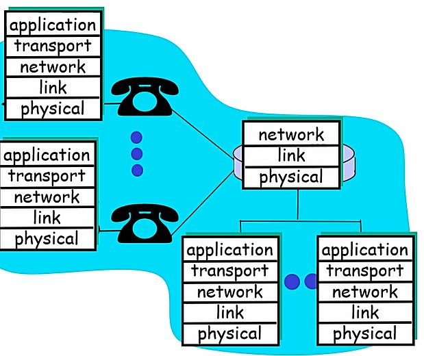
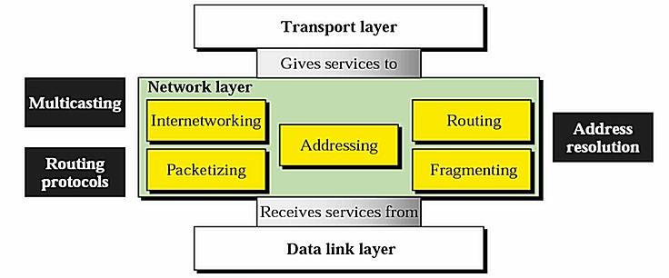
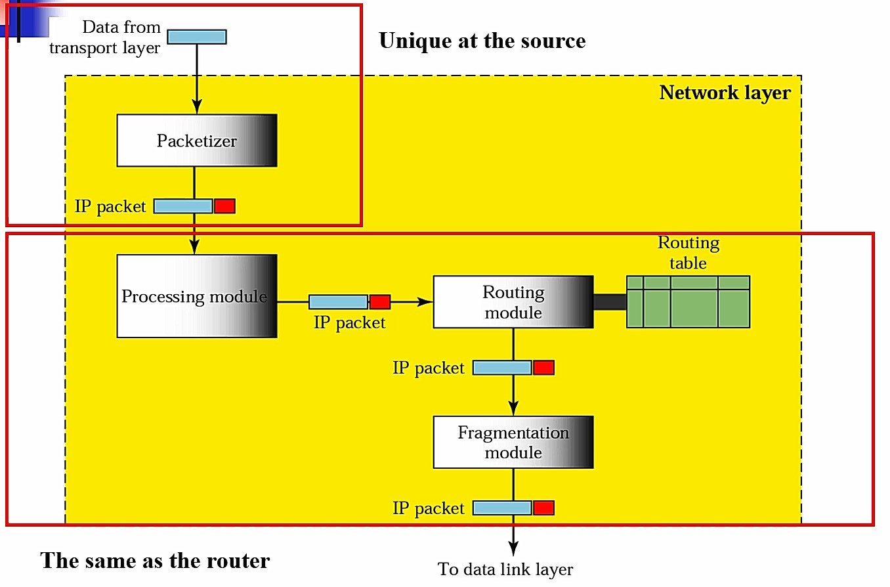
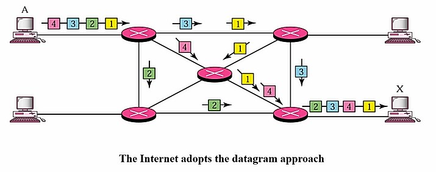
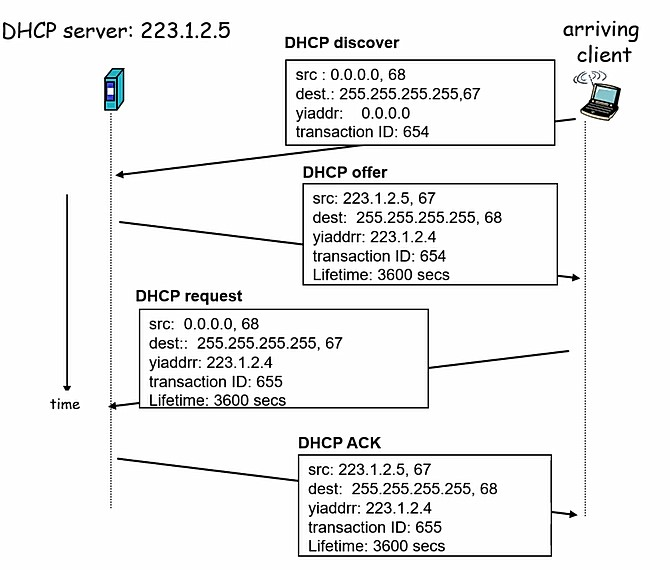
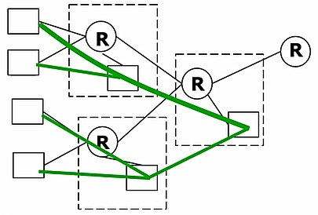

# 📙 Today I Learned  
## 규칙  
* 기억에 남는 내용 기록 후 [정적 웹페이지](https://lee20h.github.io/TIL/)에 정리
* 쓸데없는 Commit 지양
* markdown으로 작성
* 문제 풀고 [Problem Solving](https://github.com/lee20h/TIL/tree/master/Problem%20Solving) 폴더에 모으기

---  

# 2020년

| [5월](./month/5월) | [6월](./month/6월) | [7월](./month/7월) | [8월](./month/8월) |
|----|-----|-----|---|

--- 

- 1日  

# SQLD 문제 풀이

- 데이터베이스 모델링

| 절차 | 설명 |
|---|---|
| 절차 | 설명 |
| 개념적 데이터 모델링 | 전사적인 데이터 모델로 기업 전체 데이터베이스 구조를 모델링한다. 높은 추상화 제공 |
| 논리적 데이터 모델링 | 재사용성이 높은 데이터 모델로 시스템을 구축하기 위한 데이터베이스 모델이다. 키, 속성, 관계 등을 표현 |
| 물리적 데이터 모델링 | 물리적 저장장치를 고려하여 저장장치에 맞게 데이터베이스를 구축한다. 데이터베이스 성능, 가용성, 보안 등을 고려 |  

- 반정규화

데이터베이스 성능을 향상시키기 위해서 데이터 중복, 통합, 분리, 집계 등을 수행하는 모델링 기법이다. 반정규화 기법은 테이블 병합, 분할, 추가 기법이다. 업무처리를 위한 기능칼럼 추가는 반정규화가 아니다. 

- 상호연관 서브쿼리

메인쿼리 값을 서브쿼리가 사용하고 서브쿼리의 값을 받아서 메인쿼리의 값을 받아서 메인쿼리가 계산되는 쿼리이다.  

- 정규형

1차 정규형 : 모든 속성은 반드시 하나의 값, 속성 값의 중복 제거  
2차 정규형 : 식별자에 종속되지 않는 속성의 중복 제거  
3차 정규형 : 2차 정규형을 만족하며, 식별자 외 일반 칼럼간의 종속 존재 제거  

- 유일 인덱스 스캔 (Unique Index Scan)

기본키 또는 유니크 인덱스로 엑세스 가능  

인덱스 : 원하는 데이터를 빠르게 찾기 위해 탐색키를 갖는 테이블로, 원하는 데이터를 쉽게 찾을 수 있게 돕는 책의 색인과 비슷한 개념  

인덱스 특징 : 테이블 기반으로 선택적으로 생성할 수 있는 구조.  
테이블에 인덱스를 생성하지 않아도 되고 여러 개 생성 가능.  
Insert, Update, Delete 등 DML 작업은 테이블과 인덱스를 함께 변경하므로 느려 질 수 있음  

- 속성

엔터티는 2개 이상의 속성으로 구성.  
속성은 엔터티를 설명하고 인스턴스의 구성요소.  
하나의 속성은 하나의 값을 갖음.  
속성의 특성 : 기본 속성, 설계 속성, 파생 속성  

- 순번을 구하는 그룹함수

RANK 함수 : ORDER BY를 포함한 쿼리문에서 특정 항목에 대한 순위를 구하는 함수이다. 이 때 특정범위 (PARTITION BY) 내에서 순위를 구할수도 있고 전체 데이터에 대한 순위를 구할 수도 있다.  
동일한 값에 대해서는 동일한 순서를 부여하게 된다.  

DENSE_RANK 함수 : 동일한 순위를 하나의 건수로 취급한다.  

ROW_NUMBER 함수 : ROW_NUMBER 함수는 동일한 값이라도 고유한 순위를 부여한다.  

동일한 값의 순위를 정해야 할 때 오라클의 경우 ROWID가 적은 행이 먼저 나온다.  

만약 동일 값에 대한 순서까지 관리하고 싶으면 ROW_NUMBER() OVER (ORDER BY SAL DESC, ENAME)을 같이 ORDER BY 절을 이용해 추가적인 정렬기준은 정의해야한다.

---

- 2日  

# SQLD 정리

## SQL 기본

- DDL : Table － Partition : range, List, Hash Partition

- DML : insert, update, delete, select

- DCL : grant, revoke

- TCL : commit, rollback

## Join

- 순수관계

	1. SELECT
	2. PROJECT
	3. (Natural) JOIN
	4. Divide

- 일반 집합연산

	1. union
	2. intersect
	3. minus, except
	4. product

- FROM절 Join

	1. Inner Joint Select
	2. Natural Join
	3. Outer Join
	4. Cross Join
	5. USING
	6. ON 조건절

## 데이터 모델링

- 3층 스키마 

	1. 외부 스키마 : 사용자 관점, View 단계
	2. 개념 스키마 : 데이터 통합 및 조직 전체의 DB 구조
	3. 내부 스키마 : 물리적 저장

- 데이터 모델링

	- 3가지 요소 : Thing, Attribute, Relationship

	- 절차 
		1. 개념적 : 높은 추상화, 포괄적, EA 수립
		2. 논리적 : 재사용성, 정규화
		3. 물리적 : 성능, 저장 등 물리적 특성

- 관계형 DB

	- Entity
		- 조건 : 업무에서 관리
		- 종류 : 유무(유형, 개념, 사건) , 발생 시점  (기본, 중심, 행위)

	- 정규화 : 완전 함수 종속성, 부분 함수, 이행 함수, 후보키가 기본키에 종속

	- Attribute : 하나의 속성 = 하나의 값, 기본-설계-파생 속성, 종류(단일 값, 복합, 다중 속성)

	- 관계 : 종류(존재관계, 행위관계), 관계 차수, Check, 식별과 비식별 관계

	- 반정규화 : 대상(범위, 용량, 통계, 조인 수), 다른 방법 유도(클러스터링, 뷰, 인덱스 조정), 반정규화 적용(테이블, 속성, 관계 반정규화)

	- 식별자 : 대표성(주, 보조), 생성여부(내부, 보조), 속성 수(단일, 복합), 대체여부(본질, 인조)

## Optimizer

- SQL Operation

	1. AND-EQUAL : INDEX에 의해서 반환된 ROWID를 병합해서 공통값으로 변환
	2. CONCATNATION : 반환되는 ROW를 합산(UNION, UNION ALL)
	3. Connect by : 계층형 Query
	4. Count : Count(*) 집계 함수 사용
	5. Filter : Where절의 조건절을 사용하지 못함
	6. For update : Row Level Lock이 발생하는 연산
	7. Hash Join : 해시 조인
	8. Hash anti Join : 한쪽 Row를 추출할 때 다른 쪽 Row와 매칭되지 않은 것을 추출 (Not in, Not Exist, minus)
	9. Hash Semi Join : Exists절을 사용하느 세미 조인(hash_sj or merge_sj 힌트 사용)
	10. Index Range Scan : `<`, `>` between, like 사용
	11. Index unique Scan
	12. Inlist iterator : inlist에 있는 인수만큼을 반복
	13. itersection : 여러 쿼리의 반환 결과값을 병합해서 공통 부분만 추출
	14. Nested Loop : 중첩 루프를 사용해서 조인
	15. Merge Join : Sort와 Merge 단계로 조인
	16. Merge Semi Join
	17. minus : 차집합

- Sub Query

	- Scalar : 한 행을 리턴하는 서브쿼리로 Select 절에 존재
	- Inline View : FROM절에 서브 쿼리 사용
	- 연관 Subquery : 메인쿼리 조건절이 서브쿼리에 사용, 메인쿼리의 칼럼이 서브쿼리에서 사용
	- Filter형 Subquery : 확인자, 메인쿼리에 주입을 받아 확인자, 조인으로 풀리지 않음
	- Early Filter형 Subquery : 서브쿼리가 메인쿼리로 푸쉬되면서 먼저 실행 (push_subq 힌트)
	- Access형 Subquery : 메인쿼리에 값을 제공하는 제공자( 단일 값 서브쿼리), 서브쿼리가 먼저 실행됨, join으로 풀림
	- 멀티값 서브쿼리 : 여러 개의 행을 되돌림(IN, ANY, ALL EXISTS 사용)


- Optimizer Join

	- Nested Loop : 중첩 for문, 소량의데이터. Random Access가 최소화. 힌트 ordered use_nl

	- Sort Merge : Sort 단계와 병합 단계, 병렬로 실행. 힌트 use_merge

	- Hash Join : 등가조인에 사용, 작은 테이블이 드라이빙 테이블이 되어야함. CPU 과다사용, Random Access 최소화. 힌트 use_hash

---

- 3日  

KMP 문제 풀이 [Censoring](http::/noj.am/10747)  

```cpp
#include <bits/stdc++.h>
using namespace std;

const int MAX = 1e6;

int fail[MAX];
int match[MAX];

/*
	match = 문자열 s1의 인덱스일 때 문자열 s2와 일치하는 길 이로, 벡터에 s1 글자에 담은다.
	제거할 문자열 찾은 경우 벡터에서 그 만큼의 길이를 제거 후 제거한 문자열의 첫 문자가 들어오기 전의 상태로 돌아간다.
	따라서 match에 벡터의 사이즈값으로 해당 값을 받아온다. 
*/
int main() {
	ios::sync_with_stdio(0);
	cin.tie(0);
	
	string s1, s2;
	cin >> s1 >> s2;
	
	for (int i=1,j=0; i<s2.length(); i++) {
		while(j>0 && s2[i] != s2[j])
			j = fail[j-1];
		if(s2[i] == s2[j])
			fail[i] = ++j;
	}
	
	vector<char> v;
	
	for (int i=0,j=0; i<s1.length(); i++) {
		v.push_back(s1[i]);
		while(j>0 && s1[i] != s2[j])
			j = fail[j-1];
		if(s1[i] == s2[j]) {
			if(j == s2.length()-1) {
				for(int i=0; i<s2.length(); i++)
					v.pop_back();
				j = match[v.size()];
			}
			else
				j++;
		}
		match[v.size()] = j;
	}
	for (auto ans : v)
		cout << ans;
}
```

위의 주석과 같지만 더 설명을 붙여본다. kmp 실패함수를 통해서 해당 긴 문자열에서 짧은 문자열을 찾기를 반복한다. 이 때 벡터에 계속 해당 값들을 집어 넣으며 찾게 되면 찾은 문자열만큼 빼준다. 이후 인덱스를 다시 잡아주기 위해서 match 배열로 잡아주면 된다.

---

- 5日  

4일은 SQLD 시험 준비로 잠시 쉬어갔다.  

오늘은 시험 이후에 네이버에서 예전에 진행했었던 `D2 대학생 밋업: 백엔드 개발`에 대해 쓴 글에 대해 읽어봤다. 백엔드를 지망하는 학생이지만, 일의 범위나 다양한 시각을 생각하지 못해봤던 나에게 도움이 된 글이였다.  

[네이버 D2](https://d2.naver.com/news/3435170)에서 상세하게 읽어볼 수 있으며, 그 중 궁금했었던 부분이나, 도움이 된 부분을 기록하려고 한다.  

## 일의 범위

웹앱 개발, 데이터 분석 엔지니어링, 분산파일 시스템 혹은 DBMS 개발자들도 백엔드 개발자라고 불린다. 프론트엔드 개발자에 비해 그 영역이 모호하다고 볼 수 있다. 서버, DB, 프론트엔드 까지 풀스택으로 개발하는 백엔드 개발자도 심심치않게 볼 수 있다. 폭 넓은 기술을 접하기 때문에 여러 시스템 엔지니어나, 프론트엔드 개발자들과 소통을 많이하게 된다. 따라서 여러가지 분야에 대해서 공부하기 쉽고 그 중 하나를 전문으로 하는 전문가로 성장할 수 있다.  

## 전망

새로운 도구와 프레임워크의 등장은 개발자의 수요나 가치를 하락시키는 존재이지 않을까라는 염려가 있다. 이러한 염려는 기우에 불과하다. 왜냐하면 새로운 시스템에 대한 수요와 유지 보수할 기존의 시스템도 늘어나기 때문이다. 이러한 시스템들을 관리하기 위해서는 개발자들의 투자와 수요는 줄어들 수 없다. 이러한 이유로 인해 새로운 도구와 프레임워크들의 등장은 새로운 기회가 될 수 있으므로 잘 캐치할 수 있도록 하자.  

하지만 개발 분야만 본다면 분야가 계속 발전하게 되면서 자신이 전문으로 하고자하는 분야를 계속 담당할 수 없게 될 수 있다. 왜냐하면 시대가 변하면서 주로 사용하는 기술들이 변하기 때문이다. 그런 시대 속에서 빠르게 적응하면서 준비를 하기 위해서는 자신이 전문으로 하고자하는 분야 외에도 다른 분야에 대한 역량을 충분히 키워두는 것이 도움이 될 수 있다.  

이러한 흐름에는 백엔드 개발은 무난한 선택이라고 볼 수 있다. 여러가지 분야를 백엔드라고 말할 수 있다는 이전의 말과 같이 여러 분야와 조화되어서 변해가는 시대 흐름에 자신이 선택할 수 있는 폭을 넓힐 수 있기 때문이다.  

## 필요한 지식

- 웹 생태계의 스펙
	- HTML, HTTP(1.1 , HTTP/2)
- 기본 SDK, 라이브러리/프레임워크 이해와 활용
- 클라이언트를 위한 API 설계
- 서버/컴퍼넌트/객체 간의 역할 분담/의존성/통신 방법 설계
- 저장소 활용
	- DBMS 설계
	- Cache 적용
		- Global/Local cache 적용범위, 라이프 싸이클, 솔루션 선택
	- 파일 저장 정책/솔루션 선택 활용
- 검색엔진 연동 방식 결정
- 빌드 도구
	- Maven/Gradle
- 배포 전략
- 성능 테스트/프로파일링/튜닝
	- JVM 레벨의 튜닝 (GC 옵션 등)
		- 웹 서버(Nginx,Tomcat)등의 설정/튜닝
	- OS 설정의 주요 값 확인
- 인접 기술에 대한 이해
	- DBMS, Front End 등
- 서버 개발자에만 해당하지는 않는 항목
	- 테스트 코드 작성/리팩토링 기법
	- 버전 관리 전략
		- branch 정책 등
		
해당 부분은 사이트의 글을 그대로 인용해왔다. 이 부분은 JVM과 Linux를 바탕으로 한 환경에서 필자가 웹 서버 개발에 있어서 필요한 부분이라고 적은 부분이다.  

이러한 지식들을 한 사람이 모두 가지고 있어야하는 게아닌 팀의 개발자들의 지식을 합쳐서 구현 방식과 정책이 결정된다.  

이 때 팀 구성원이 할 수 있는 기술을 선택하되, 내부의 소수만 사용하는 관리 도구는 팀원 모두가 처음 쓰는 기술을 적용할 수 있지만, 큰 서비스에는 작은 서비스에서 먼저 시도 후 적용하는 것이 일반적이다.  

## 데이터베이스

백엔드 개발자에겐 RDB가 여전히 가장 우선시 되어지는 데이터베이스이다. 해당 데이터베이스를 다루는 능력이 핵심 역량으로 꼽힌다. 예시를 통해서 보면 개발하는 도중에도 쿼리의 호출 횟수나 실행 계획이 비효율적이지 않은지 확인하는 습관, 운영 중에도 느린 쿼리를 모니터링하고 DBA와 협업하여 성능 개선하는 습관, ORM같은 추상화된 프레임워크를 써서 SQL을 작성하지 않은 경우에도 이러한 습관은 필요하다.  

대용량 서비스에서의 과거와 현재의 차이를 보면, 과거에는 서버 간의 네트워크 호출 비용을 줄이기 위해 한번에 많은 테이블을 조인하는 긴 SQL을 통해서 DB 쿼리를 짰다. 하지만 요즘은 복잡한 JOIN은 피하고 단순한 SQL을 통해서 DB 쿼리를 짜는 추세이다. 왜냐하면 데이터를 다른 저장소에 캐시하거나 분산해서 저장하기 쉽기 때문이다. 대용량 저장하는 UGC 서비스에서는 RDB 테이블 사이의 JOIN을 최대한 제약하고 어플리케이션 레벨에서 여러 저장소의 연관된 데이터를 조합한다.  

DB안에서 실행되는 Stored prodecure은 급하게 개발된 서비스에서 많이 사용되었다. 네트워크 호출비용이 없고 DB안에 저장되므로 배포 절차가 단순했기 때문이다. 하지만, 길게 작성되게 되면 작성자도 수정하기 힘들어지고, 버전관리가 어려워진다. 추가적으로 데이터의 연산에 DB서버의 CPU 자원을 소모하게 되어 병목이 일어날 수 있어 가급적 사용을 하지 않는다.  

분산 DB를 사용하기도 어렵다. DB 서버 1대는 성능 향상을 위해 Local cache, Gloal cache를 동원하기도 한다. RDB는 사용량이 늘어나면 분산하는 비용도 상당하기 때문에 성장 가능성이 있는 큰 서비스의 경우에는 RDB의 자원을 아끼는 방법도 생각해야한다.  

해당 게시물에는 이 외에도 많은 내용이 있으나 당장 내가 받아들이기가 어려운 내용들도 상당히 많다. 따라서 지금은 이렇게까지 읽어보고 정리했으므로 다음에 조금 더 지식이 쌓인 뒤 읽어보며 회고해보도록 한다.  

마지막으로는 개발자의 수준에 대해 정리한 부분을 강조하고 싶다. 개발도구를 잘 활용하는 능력은 실력이라고도 할 수 있고, 이러한 도구를 토대로 새로운 도구에 적용하여 적응하는 능력도 실력이라고 볼 수 있다. 따라서 필자가 얘기하는 레벨2. 즉, 개발도구의 공식 레퍼런스를 보고 사용법을 스스로 익힐 수 있고 자신이 경험한 사용법을 문서화해서 팀 내에 설명하고 알려 줄 수 있는 수준이 되어야 한다는 것을 느낀다.  

어떤 개발툴이나 언어를 뛰어넘어 서비스에 필요한 부분에 대해 러닝커브를 크게 올릴 수 있는 개발자가 될 필요가 있다는 것을 느낄 수 있는 글이였다. 다음엔 밑의 내용에 대해 이해하는 시간을 가져볼려고 한다.  

---

- 6日  

DP 문제 풀이 [문제](http://noj.am/11052)  

DP 문제를 풀어보고 이해하는 시간을 가졌다.  

```cpp
#include <bits/stdc++.h>
using namespace std;

const int MAX = 1000+1;

int p[MAX];
int dp[MAX];

int main() {
	ios::sync_with_stdio(0);
	cin.tie(0);
	int n;
	cin >> n;
	for (int i=1; i<=n; i++) {
		cin >> p[i];
	}
	
	for (int i=1; i<=n; i++) {
		for (int j=1; j<=i; j++) {
			dp[i] = max(dp[i],dp[i-j]+p[j]);
		}
	}
	cout << dp[n];
}
```

해당 문제에서 요구하는 것은 n개의 카드를 살 때 최대의 값을 찾는 것이다. 이때 n개 만큼 숫자가 주어지게 된다. i번째 숫자는 i개의 카드가 든 카드팩을 의미하므로 마지막 n번째 숫자는 n개의 카드가 든 카드팩을 의미한다. 따라서 각각의 갯수를 생각하면서 코딩을 해야한다.  

문제를 제대로 읽지 않고 풀이를 생각한게 가장 큰 오점이였다. 인덱스만큼의 카드가 들어있는 줄 모르고 각각을 1개라고 생각하면서 풀었다가 다시 문제를 읽게 되었다.  

처음의 포문은 먼저 카드팩의 숫자를 의미한다. 따라서 i개의 카드를 골랐다는 것을 뜻한다. 또한 안쪽 포문은 해당 i개의 숫자만큼 카드를 골랐을 때 최대의 값을 구하기 위한 반복문으로 현재 뽑은 카드의 숫자가 i이므로 i보다 크지 않은 만큼의 반복을 해야한다.  

이러한 로직으로 이루어져있으며, 안쪽 포문에서 최댓값을 구할 때 dp[i-1]이 아닌 dp[i-j]를 해줘야 카드팩에 들어있는 카드 숫자만큼 빼줄 수 있어서 제대로 n개의 카드를 골랐을 때의 최댓값을 구할 수 있다.

---

- 7日  

# 컴퓨터 네트워크 road map

## 인터넷이란 무엇인가?  

Computing devices : hosts, end-system(PC, Workstation, server). 네트워크 앱이 실행된다.  

Communication links
- fiber, copper, radio, satellite
- transmission rate = **bandwidth**

Routers: foward packets(chunks of data)  
	
  

구조를 설명하는 그림으로, 라우터들과 서버, 워크스테이션과 모바일로 구성되어있다. 네트워크 시점으론 라우터들과 호스트들로 볼 수 있다. ISP는 KT와 같은 회사를 의미한다.  

IDC(Internet Data Center)는 그림의 regional ISP와 같이 서버를 라우터에 붙여서 설치하기도 하는데 병목현상을 줄이고 데이터들을 전송하기 수월하게 한다. 즉, 대용량 서비스에 유리하다.  

Network protocol : 인터넷의 입장에서 모든 통신활동이 프로토콜에 의해 제어된다.  

protocol이란 패킷의 포맷, 순서가 정의되어 있는 것으로 네트워크에서 레이어마다의 규칙이라고 생각하면 좋다. 사람과의 대화처럼 컴퓨터의 대화에서도 필요한 것이 프로토콜이다.   

## 네트워크 구조

Edge router : end-system에 접속하게 해주는 edge router의 역할은 사용자마다 허용된 트래픽만큼 제한(regulation) 해준다. 그리고 서로 다른 ISP에서 허용 트래픽 이상을 통신할려하면 요금이 더 부과될 수 있으므로 우회하는 방향으로 라우팅을 하기도 한다.  

Core router : Edge router에서 제한을 해줬으므로 Core router의 역할은 전송 속도를 빠르게 해주는 부분이다.  

Access networks : end-system이 Edge router에 접근하기 위해 필요한 망으로, 구리선, 전화선, 무선 등이 있다. 전체 네트워크 사이즈의 80% 이상을 차지한다. 따라서 Backbone은 20% 정도 차지한다고 보면 된다.  

## Network edge

end systems(hosts)
- 웹 이메일와 같이 응용프로그램 구동

client/server model
- 클라이언트가 요청시 서버가 그 요청의 서비스를 제공
- 웹 클라이언트/서버, 이메일 클라이언트/서버
- 비용 생길 수 있음

peer-peer model (p2p)
- 서버없이 단말끼리 통신
- 서버 역할과 클라이언트 역할 동시에 수행
- 비용 절감. 서비스 안정성 문제

## Network Core

신뢰할 수 있는 라우터끼리 연결되어 통신하므로 제한(regulation)문제는 없다. 하지만 라우터들을 거쳐서 통신할 때 문제를 이야기한다.  

**circuit switching**  
- 먼저 연결하고 데이터를 보냄
- 지연이 없고 자원을 예약하여 퀄리티가 좋음
- 음성 전화

**packet-switching**
- 연결없이 패킷단위로 보냄
- 라우터에 버퍼 꽉 찼을시 패킷 버려짐(packet loss)
- out of order 문제
- 인터넷 데이터

virtual circuit switching: 두 가지 방법을 보완한 방법  

## Access network(망)

end-system이 Edge router에 접속하기 위한 망

- ADSL : 전화선을 이용한 방법. 중계기가 300m 미만

- Cable modems : HFC(hybrid fiber coax) 동축 케이블을 사용하되 광 케이블로 끌고가서 연결. 공유하므로 같이 사용하면 속도 저하

  

- LAN : local area network로 대부분 ethernet을 사용한다. 

- Wireless LANs

## Physical Media

`TP(Twisted Pair) < Coaxial < Fiber < Radio(terrestrial microwave, LAN, wide-area, satellite)`

## Protocol Layer

네트워크가 복잡하기 때문에 레이어를 이룬다. 각 레이어들은 자기들만 집중하면 되기 때문에 간단해진다.  

복잡한 시스템을 위해서 레퍼런스 모델로 레이어를 나눈다. 이때 인터넷 계층은 5계층으로 나뉜다.  

|인터넷 5계층|
|---|
| application |
|transport|
|network|
|link|
|physical|  

계층별 예시

**application**
- FTP, SMTP, STTP

**transport**
- TCP, UDP

**network**
- IP, routing protocols

link
- ppp, Ethernet

physical
- bit on the wire

 

end-system은 5계층, router는 3계층을 구현한다. end-system에서는 각 프로토콜에 있는 것은 상대방 peer에 대해서 1:1 통신되는 방식으로 디자인 되어있다.  

## history

- 1967 : ARPAnet
- 1972 : ARPAnet 퍼블리싱
- 1973 : Ethernet 제안
- 1979 : ARPAnet 200개의 노드 갖음
- 1983 : TCP/IP, DNS
- Early 1990's : ARPAnet 국방부 -> 민간
- 1994 : www 표준

---

# Network Layer

  

# Host-to-Host Delivery : Internetworking, Addressing and Routing

## Internetworks

  

네트워크간의 연결을 맡아주는 부분이 internetwork라고 한다.  

  

위의 그림이 네트워크 레이어에서의 ip 패킷 흐름도라고 볼 수 있다. 라우터 측면에서의 흐름도 비슷하며, 초기엔 유닉스 머신으로, 라우터를 사용했다는 것만 기억해두자.  

목적지 도달시에 헤더를 보고 오류 판단한다. 쪼개진 경우 모으는 Reassemble한 뒤 올려보낸다. 쪼개져 있지 않는다면 바로 올려보내는 모습을 볼 수 있다.  

네트워크 계층에서의 Switching은 Packet switching을 사용하고 있고 Datagram approach를 사용한다.  

  

# Addressing

IP주소는 32bit 주소로 전세계에서 공통적으로 사용한다.  
IP주소를 십진수나 이진수 표기법으로 변환하는 것은 많이 해보았으니 넘긴다.  

Classful addressing : A,B,C,D,E 5개의 클래스로 나눈다.  

다음주에 계속

---

# 소프트웨어공학

# 1장 시스템 공학과 소프트웨어 공학

들어가기에 앞서 현재는 변화의 시대에 있어서, 우리에게 많은 변화를 요구한다. 변화를 하지 않는 것은 발전을 포기하는 것과 같다고 볼 수 있다. 따라서 변화 없이 더 좋은 제품을 만들 수 있는 기술과 경쟁력이 향상되지 않는다.  

발전을 위한 변화는 바른 원리에 의한 것이여야한다. 성공적인 소프트웨어 개발을 위한 방법론에 속하는 바른 원리를 알아본다.  

## 과학과 공학

- 자연과학 : 자연의 법칙 탐구
- 공학 : 자연과학이 발견한 자연의 법칙을 응용하여 인류의 편익을 위해 무엇인가를 생산하는 전문분야
- 과학기술 : 공학과 자연과학을 지칭
- 공학과 자연과학은 서로 보완하며, 상호 의존적인 관계로 발전
- 자연과학이 근본적인 지식의 탐구에 관련되어 있다면, 공학은 실제 문제의 해결과 '더 나은 삶의 추구'를 위한 과학지식의 응용과 관련되어 있다.
- 공학은 당면한 문제를 해결하기 위하여 자연과학의 지식을 필요로 하며 이는 다시 자연과학의 분야에 영향을 미쳐 공학과 자연과학은 서로 보완하며 발전해왔다.  

## 시스템 공학

- 시스템은 어떤 목적과 기능을 수행하기 위하여 유기적인 관계를 맺으며 함께 작용하는 요소들의 집합
- 시스템은 여러 요소들로 이루어진 특정한 집합
- 각 요소는 다른 요소들과 관계를 가지고 시스템의 공동목표를 위하여 함께 작용
- 시스템의 예 : 사람, 컴퓨터 시스템, 자동차 운전 시스템
- 시스템 공학은 시스템의 개발과 운용, 유지보수를 합리적으로 행하기 위한 사고방법, 절차, 조직 및 기법 등을 총칭
- 시스템 공학의 기술적 측면과 관리적 측면
	- 기술적 측면 : 시스템을 구성하는 물적 요소의 적합성과 이의 효과적인 조합에 의한 효율의 극대화를 추구
	- 관리적 측면 : 시스템 개발에 관련된 업무가 제대로 이루어지도록 인원, 설비, 자재 등에 대한 계획과 통제를 행하는 관리기술

### 컴퓨터 시스템과 소프트웨어 시스템

- 시스템 개발은 인간의 욕구와 사회적 필요성에 의해 시작
- 평가기준은 시스템의 목적에 따라 다름
- 가치 평가기준 : 성능, 시간, 비용, 신뢰성, 보전성, 안전성 등
- 평가요소들은 시스템의 기술적 측면과 관리적 측면
- 컴퓨터 시스템 공학은 기능을 HW, SW 등의 시스템의 구성요소에 할당
- 시스템 개발 첫 단계는 사용자가 요구하는 목표와 시스템의 제약조건으로부터 시스템을 정의

## 건축공학의 예

- 큰 건물을 지을 때 진행되는 과정과 공법을 통해서 다른 공학들의 적용되는 기본 원리를 발견

1. 설계 회사에서 설계, 도면 완성
2. 시공회사 선정
3. 설계 도면대로 건축
4. 감리회사가 감리
5. 사용자들이 입주 후 사용 및 유지보수

예를 들어 설계사가 큰 병원을 설계할 때 필요한 부분을 봐보자. 건물의 용도에 대한 특성을 파악하고 나타날 문제점을 해결해야한다. 이를 위해 설계팀들이 만들어지고 다양한 사용자들의 니즈를 찾고 규명하는 것을 시스템 공학에서는 **시스템 분석** 또는 **요구사항 분석**이라고 한다.  

### 공정 과정

요구사항 분석 단계
- 설계팀 구성, 사용자 니즈 수집 훟 통합
- 요구사항 분석은 설계 이전에 수행되어야 할 중요한 과정

설계 단계
- 사용자의 니즈를 만족할 수 있도록 건물의 윤곽을 그리는 과정
- 설계사가 요구사항을 통합하여 설계 도면 완성

구현 단계
- 시공회사는 설계 도면을 가지고 건물 건축

감리 단계
- 시공 후 감리회사는 설계 도면대로 건축되었는지 확인
- 체계적이며 분할된 공정과정을 통해 안전과 품질 보증
- 건물에 이상 발견시 책임의 소재 규명, 품질의 관리

운용과 유지보수 단계
- 감리 후 사용자들이 입주

이전 시대에서는 예술적인 면, 형식적인 면을 강조해서 미켈란젤로의 설계와 시공이 가능하였지만, 건물의 기능과 생산성이 강조되면서 설계와 시공이 분리되면서 위와 같은 과정이 굳혀졌다.  

### 건축 공학 생명주기 모델

`건축물 사용자 요구사항 분석 -> 건축물 설계 -> 시공 -> 감리 -> 유지보수`  

생명주기 모델은 간단, 명료하여 프로젝트 진행시 수행되어야할 활동들과 그 활동들의 순서를 정하고 관리, 통제하기 쉽게 한다. 해당 흐름을 프로세스라고 할 수 있다.  

프로세스는 입력물을 받아 임무를 수행하고 결과물을 만들어내는 활동이다. 프로세스는 연결되어있으며 한 프로세스의 결과물은 연결된 다음 프로세스의 입력물이 된다. 프로젝트가 어떤 단계를 거쳐 진행되고 각 단계의 작업, 산출물은 무엇인지 명확히 하는 것 프로젝트에 참여한 여러 사람들이 의사 소통을 원활하게 할 수 있는 기준이 된다. 이러한 기본개념은 다른 공학에도 그대로 적용된다.  


## Everything is created twice

월트 디즈니의 말을 통해서 공학을 보자  

첫번째는 마음속에서 창조하는 것이고, 두번째는 실제적으로 만드는 것이다.  

따라서 첫번째 창조는 *분석*이라고 하며, 두 번째 창조는 *개발*이라 부른다. 이때 분석에는 계획 단계가 포함이 되고 개발에는 설계와 구현, 시험을 포함한다.  

첫번째 창조의 결과는 유저의 관점에서 시스템의 모습을 논리적으로 나타낸 논리적 모델이어야 하며, 응용분야의 용어로 기술되어야 한다.  

두번째 창조는 엔지니어의 관점에서 소프트웨어의 모습을 물리적으로 나타낸 물리적 모델이며, 소프트웨어 용어로 기술될 수 있다.

결론적으로 첫번째 창조는 무엇을 만들 것인가 규명하는 단계이고, 두번재 창조는 해당 목표를 어떻게 이루어 나갈지 찾는 실천 과정이다.  

첫번째 창조를 하는 사람을 시스템 분석가, 두번째 창조를 하는 사람을 개발자라고 부른다. 

## 요약

모든 것은 두번 창조된다는 것을 모르는 경우 많은 부작용이 발생한다. 엔지니어가 사용자의 관점과 엔지니어의 관점을 구별하지 못하는 경우며, 목표와 수단을 구별하지 못하는 경우다.  

따라서 엔지니어의 시작은 사용자의 관점과 엔지니어의 관점을 구별하는 것이다.  

이번 장에서 건축공학을 중심으로 일반적인 공학의 진행과정을 보았는데 이때 공학의 기본 원리가 적용되어 요구사항 분석, 설계, 구현, 시험 및 유지보수 과정을 거쳐야한다. 이것은 소프트웨어 개발에도 적용되므로 이를 통해서 기술의 향상과 높은 품질의 제품을 생산해야한다.

---

# 2장 소프트웨어 개발의 일반적 공정 과정

## 소프트웨어 개발 과정

`계획 -> 요구사항 분석 -> 설계 -> 구현 -> 시험 및 유지 보수` 과정(생명주기)을 거쳐야한다. 이때 각 과정에서는 검증이 이뤄져야하고 전체적인 소프트웨어 위험 분석이 시행되어야한다.

소프트웨어는 여러 구성요소가 유기적으로 상호작용하는 시스템으로, 일반적으로는 HW 및 다른 요소들과 결합한다.  

시스템 전체에 대한 기능과 니즈의 정의가 선결된 후 그 기능의 일부를 소프트웨어 시스템이 담당한다.  

만약 시스템을 구매할 고객이 이미 정해져있는 경우 고객이 비용을 담당하는 주문생산 제품을 개발하게 된다. 이때는 고객과의 계약으로 개발이 시작되고, 유저가 고객으로 한정되어 있다.  

고객이 주문하면 개발하는 것보다 이미 상업화된 제품을 구입하는 경향이 늘고 있다. 해당 제품이 주문생산 제품보다 시간과 비용을 줄일 수 있어서 선호된다. 만약 상업화된 제품이 고객의 니즈를 충족시키지 못한 경우 수정사항을 요구하는 쪽으로 넘어가게 된다.  

소프트웨어 품질을 보증하기위해서는 소프트웨어의 공정 과정을 분석, 설계, 구현할 때 유지보수 과정에 적용될 수 있는 기법과 도구들이 확립되어야한다. 또한 각 공정과정의 임무, 입력물, 산출물, 사용도구가 각각 잘 정리되어야한다.  

## 프로젝트 계획

프로젝트 계획은 소프트웨어 프로젝트의 핵심 활동이며 소프트웨어 프로젝트 관리에서 가장 중요하게 여겨지는 과정이다.  

계획은 본질적으로 미래의 변화를 준비하는 과정으로, 목표를 세우고 이를 달성하기 위해 체계적인 진행 상황 관리를 할 수 있도록 세부 행동 방안을 마련하는 것이며 프로젝트 실행과 통제의 지침이 된다. 이 단계에서 결과물은 계획서 문서들이 될 수 있다.

## 요구사항 분석

소프트웨어 개발 생명주기에서 계획단계 다음으로 이루어지며, 고객의 요구를 만족시키는 소프트웨어를 개발하기 위해 고객의 요구사항을 알아내는 것은 시스템을 개발하는 관리자와 실무자에게 중요한 단계다.  

요구사항 오류를 줄이기 위해서 프로젝트 초기인 요구사항 분석단계에서부터 다양한 이해관계자를 프로그램에 참여시키는 것은 중요하다. 이해관계자의 활발한 참여는 잘못된 요구사항을 찾고 중요 요구사항을 누락시키지 않도록 할때 도움이 된다.  

요구사항은 프로젝트 범위 관리에 기초 자료를 제공한다. 프로젝트가 수행되는 모든 과정에 영향을 미칠 수 있다. 따라서 요구사항을 규명, 명세화, 효율적으로 관리하는 문제는 소프트웨어 개발자에게 중요한 부분이다.    

소프트웨어 프로젝트 실패 원인이 요구사항 분석이 잘못된 경우가 많다. 따라서 여러가지를 자문하여 답을 고려하여 분석해야한다.

### 요구사항의 규명

사용자의 관점에서 시스템의 요구사항을 모으는 것이 요구사항의 규명이라고 할 수 있다. 기능, 성능, 인터페이스에 대한 요구사항들이 있고 이러한 요구사항 분석은 업무 분석으로 불린다.  

요구사항 분석은 고객의 니즈가 나오게 된 원인, 배경, 환경 등에 대한 분석을 포함한다. 또한, 시스템에 대한 필요가 나오게 된 고객의 내부 환경과 외적 요인을 파악해야한다.  

내적 요인 : 인력 규모 축소, 기술력 향상, 생산 증대, 서비스 향상  
외적 요인 : 경쟁, 법규나 제도의 변화, 시장 여건의 변화  

요구사항 분석 단계의 **주요 초점**은 어떻게(how to)가 아니라 무엇
(what)이다.  

### 타당성 조사

주어진 시간과 예산안에서 시스템을 개발 해야하고, 가능한 빠른 시간 내에 타당성을 평가하는 것이 요구된다. 따라서 타당성 조사는 프로젝트 계획 단계에서 이뤄지는 것이 바람직하며 분석단계에서도 이뤄지는 것이 일반적이다. 그리고 타당성 조사는 경제적 타당성, 기술적 타당성, 법적 타당성, 대체 방안 등에 집중되어 이뤄져있다.  

시스템에 개발 요구되는 시간, 비용, 인력 등의 자원은 시스템의 타당성에 직접적인 영향을 미친다. 그러므로 자원의 투자와 그 이익을 조사하고 위험에 대한 분석을 수행해야한다.  

일반적으로 시스템 개발은 비용을 줄이고 생산성과 서비스를 향상 시키기 위해 행해진다.  

### 비용과 일정에 대한 제약 설정

요구사항을 분석하는 분석가는 응용 분야에 대한 해박한 지식이 요구된다. 왜냐하면 개발 비용, 개발 일정, 시스템 성능에 대해 정확한 예측을 해야하기 떄문이다.  

프로젝트 관리가 매우 중요하며 관리활동은 요구되는 자원과 성취해야할 임무, 소요 기간, 추적해야 할 이정표 등을 포함한다. SW 프로젝트 관리는 다른 공학에 비해 취약한 형편이다. 따라서 관리가 효율적으로 이루어질려면 각 기능과 소요 비용과 개발 기간의 예측, 제약 조건 및 위험에 대한 평가 등이 분석 단계나 계획 단계에서 이루어져야 한다.  

### 요구사항 정의 문서화

유저의 요구사항과 시스템의 기능이 문서화되어야 한다. 이때의 산출물이 **요구사항 명세서**가 된다. 기능 명세서, 목표 문서, 기능 요구서라고도 불리는 이 명세서는 분석가가 만드는 경우가 대부분이나, 고객과 함께 만드는 경우도 있다.  

요구사항 명세서는 고객과 개발 회사의 계약서로도 쓰일 수 있고, 명세서를 통해서 추후에 발생하는 문제와 변화에 대한 책임이 명확히 규명될 수 있어야 한다. 이를 위해서 요구사항 명세서에 시스템에 연관된 당사자들이 동의하여 서명하고 그 다음 단계로 넘어가는 것이 바람직하다. 따라서 요구사항 명세서는 프로젝트와 관계된 모든 사람이 읽고 이해하기 쉽도록 쓰여져야 한다.  

### 소프트웨어 개발 실정

제안서에 의해 계약이 이뤄지고 난 후 그대로 개발에 들어가는 경우가 많다. 즉, 구체적인 목표의 확립없이 구현을 시작한다. 설계와 프로그래밍 과정에서 새로운 요구사항이 나타나면 그때서 요구사항의 수정이 이뤄진다.  

이러한 개발 방법으로 제대로 된 좋은 품질의 제품이 생산될 것인가 라는 의문이 생긴다. 이는 나중에 시스템이 완성 된 후 시험할 수 있는 근거를 잃을 수 있다. 왜냐 어떤 부분이 잘못되었는지 가릴 기준이 없기 때문이다.  

**요구사항 명세서**는 품질을 측정하는 기초가 되는 동시에 소프트웨어공학이 추구하는 고품질 소프트웨어를 만든다는 단일 목표에 접근할 수 있게 한다.

소프트웨어 시스템 개발이 실패로 끝나는 경우 실패의 이유를 조사하면 업무 분석이 잘못되었다는 이유이다. 따라서 구체적인 목표의 확립없이 개발에 들어갔다는 것을 의미한다. 목표가 구체적으로 명시되어 있지 않다면 프로젝트를 성공적으로 이끌기 어렵다는 것을 보여준다.  

사용자의 관점과 엔지니어의 관점이 섞여있으면 프로젝트의 관리도 어렵고 좋은 품질의 제품도 만들 수 없다. 그러므로 사용자와 개발자 관점의 분리는 어느 공학에서든 요구되는 원칙이다.  

결론은 분석과 설계에 충분한 노력을 들여야 한다.  

## 설계

설계란 분석과정에서 모아진 요구사항을 설계도면에 옮기는 것이다. 분석과정을 개념적단계라 할때 설계 과정은 물리적 실현의 첫단계이다. 또한, 설계는 품질에 직접적인 영향을 미치며, 설계가 제대로 되지 않으면 안정감이 없는 시스템이 만들어진다. 안정감이 없는 시스템은 유지보수가 어렵고 조금만 변화가 가해진다면 견디지 못한다.

시스템을 만들며 중요하게 구분되어야 하는 것이 무엇(what)과 떻게(how to)이다. 시스템 설계는 서브시스템들로 이뤄진 시스템 구조를 결정하고, 서브시스템들을 HW 및 SW 등의 구성요소들에게 할당한다.

소프트웨어 시스템 설계 단계의 결과물은 설계 문서를 뜻한다.

### 설계 원칙

시스템을 구성요소로 분할한다. 시스템의 구성요소들 사이에 주고 받는 정보의 소통이 최소화되고 각 구성요소의 도긻성이 유지될 수 있도록 시스템을 분할해야한다.  

이후 요구되는 성능과 자원에 대한 예측을 할 수 있어야 한다. 설계에서는 어떻게(how to) 그 문제를 해결할 것인가를 결정한다. 여기서 what과 how to를 나눠 보자.  
무엇(what) : 사용자나 시스템의 기능, 사용자의 관점  
어떻게(how to) : 기능의 수행 방법, 엔지니어의 관점  

비용, 소요 시간, 용량, 그리고 신뢰성 등에 대한 연구를 통해서 현실과 예산에 맞는 최적의 설계 방법을 선택해야한다. 이 방법을 trade-off란 단어로 표현한다.  

소프트웨어 개발도 요구사항 명세서와 설계 문서가 나온 다음 프로그래밍에 들어가는 것이 원칙이다.

## 구현

설계 단계에서 나온 설계 문서를 시스템 설계 모습으로 변환시키는 것이다. 이러한 과정을 통해서 시스템의 기능이 수행 가능한 모습으로 나타난다. 이 과정은 건축의 시공 단계에 해당되며, 설계가 세부적인 방법으로 수행된다. 그 결과물로 소프트웨어 제품이 나올 수 있다. 즉, 구현은 프로그래밍 또는 코딩이라고 부른다.  

구현 과정이 설계 이전 과정보다 비용이 더 많이 든다. 시스템 개발 과정 중 프로그래밍에 드는 비용은 평균 20%, 40~50%의 비용이 요구사항 분석과 설계에 들어간다. 이 비율은 요구사항 분석과 설계가 가지는 중요성을 보여준다.  

소프트웨어 시스템 구현시 부딪히는 어려움은 대부분 분석과 설계의 잘못에 의한 것이다. 설계가 제대로 이뤄지면 시스템 구현은 상대적으로 단순하고 기계적인 과정인 것을 알 수 있다.  

## 시험

어느 제품이든 품질에 대한 중요성은 강조해야한다. 우수한 품질의 제품을 얻기 위해서는 제품이 개발되는 공정 과정마다 품질 보증을 위한 절차를 따라야 한다. 공식적인 검토회 등을 통해 필터링 작업이 필요하다.  

시스템 시험은 품질보증 활동의 중요한 일부분이며 그 임무는 사용자 요구사항, 설계, 구현의 전 과정에 대한 최종 점검을 포함한다. 시험은 제품의 오류를 발견하고 수정하는 과정이며, 시스템 개발 전체 과정에 대하여 체계적으로 점검할 수 있는 일련의 활동들의 집합이다. 시험을 하지 않았을 때 나타나는 문제점과 과다한 비용을 생각하여 보면, 시험 하는 데 드는 비용의 정당성을 찾을 수 있다.  

### 소프트웨어 시스템 시험

사용자 요구사항, 설계, 코딩의 전 과정에 대한 점검이며, 소프트웨어 개발 비용 중 40% 이상을 차지하는 경우가 흔하다. 체계적인 소프트웨어 시스템 테스트를 하기 위해서는 테스트 계획이 만들어져야한다. 이 테스트 계획은 최소한의 시간과 비용을 투자해서 최대한의 확률로 오류를 찾아낼 수 있도록 만들어져야 한다.   

### 소프트웨어 테스트 유형

프로그램의 기본 단위인 모듈에 대한 테스트를 시험하는 **단위 시험(unit test)**가 있으며, 모듈들을 통합하여 프로그램에 대한 **통합 시험(integration test)**을 한다. 그 이후 소프트웨어와 다른 시스템 요소(HW, 다른 SW) 등 모든 요소들이 조화를 이루어 시스템 기능을 만족하는지 확인하는 **시스템 시험(system test)**을 한다. 마지막으로, 고객이 참여하여 요구사항 만족 여부를 검증하는 **인수시험(acceptance test)**이 있다.  

### 소프트웨어 테스트 프로세스

체계적인 소프트웨어 테스트를 하기 위해서는 어떻게 테스트를 수행할지 계획을 세워서 **시험 계획(test plan) 단계**, 시험에 사용되는 데이터를 준비하는 **테스트 설계(test design) 단계**, 소프트웨어 입력하여 결과를 얻어내는 **테스트 실행(test execution) 단계**, 테스트에서 얻어낸 결과를 분석하고 기록하는 **평가(test result analysis and evaluation) 단계**. 총 4개의 프로세스를 거쳐야한다.  

### Yourdon이 주장하는 생존을 위한 6가지 기술

- 객체지향 개발 방법 (Object-Oriented Methods)
- CASE 도구 활용 (CASE Tools)
- 소프트웨어 품질 보증 (Software Quality Assurance)
- 구조적 방법 (Structured Methods)
- 소프트웨어 개발 및 품질의 계량화  (Software Metrics)
- 리엔지니어링 (Re-Engineering)

## 유지보수

제품의 유지보스는 사용 중 발생하는 여러 변경 사항에 대해 적응하는 활동이며 변화에 대비하는 과정이다. 소프트웨 유지보수는 4가지로 그 활동이 요약이 된다.  

- 잘못된 것을 수정하는 유지보수
- 시스템을 새 환경에 적응시키는 유지보수
- 새로운 기능을 추가하는 유지보수
- 미래의 시스템 관리를 위한 유지보수

소프트웨어 시스템의 유지보수를 위해 시스템 변경에 의한 재 요구분석, 재 설계, 재 구현, 재 시험이 필요하게 되고, 관련된 문서의 수정까지도 수반하기 때문에 체계적인 관리 기능이 필요하다.  

### 소프트웨어 유지보수

소프트웨어 시스템은 개발할 때부터 유지보수에 대비하여 만들어져야 한다. 왜냐 잘 설계된 시스템도 유지보수에 드는 비용이 실제 개발 비용보다 많이 드는 경우가 대부분이다.  

유지보수 비용은 개발 당시에는 빙산처럼 노출된 작은 부분만 보인다. 실제 유지보수를 하게 되면 수면 아래의 거대한 부분이 드러난다. 계속 이용하고 발전되어야 하는 소프트웨어 시스템이 빈약하게 설계되고 문서화되어 잇지 않을 대 이를 유지보수해야 하는 엔지니어들과 사용하는 고객들이 겪는 불편함이 크다.  

따라서 탄탄한 계획과 절차에 의한 시스템 제작이 중요하다. 소프트웨어가 건축이나 다른 공학에 비해 유연성을 가지고있지만 그 유연성이 남용된다면 유지보수가 불가능한 상황까지 갈 수 있다.  

### 건축 공학과 소프트웨어 공학 비교

| 건축 공학 | 소프트웨어 공학 |
|---|---|
| 계획 | 계획 |
| 건물 사용자 요구사항 분석 | 소프트웨어 사용자 요구사항 분석 |
| 건물 설계 |  소프트웨어 설계 |
| 시공 | 프로그래밍(코딩) |
| 감리 | 테스팅 |
| 건물 유지보수 | 소프트웨어 유지보수 |

건축 공학과 소프트웨어 공학 공정 과정 비교를 하면 위의 표와 같다. 즉, 위의 표가 소프트웨어의 생애주기(life cycle)이라고 할 수 있다.  

### 소프트웨어 품질과 우리의 미래

소프트웨어 시스템들은 미래의 우리 사회를 지탱하는 중요한 기간 시스템들이 될 것이다. 이러한 기간 소프트웨어 시스템 개발도 탄탄한 계획과 절차에 의하여 구축하여야 한다. 처음부터 올바르게 만들지 않고는 품질 개선 노력과 품질 보증 활동이 성공적으로 이뤄질 수 없고 고품질의 제품과 서비스로 고객의 욕구를 만족시킬 수 없다.  

각 기업에서 소프트웨어 시스템의 품질 보증을 위한 공정 과정과 품질 관리 체계를 확립해야 한다. 품질은 개발팀의 목적과 고객의 기대 및 요구와 직결되어 있다. 모든 엔지니어들과 관리자들이 소프트웨어 개발에 요구되는 체계적인 공정 과정에 대한 중요성을 인식하고, 품질 방침을 이해하여 이를 실천해 나가야 한다. 또한 정부나 기업에서도 제도적으로 그 공정을 과정을 지원해줘야한다.  

## 요약

엔지니어링의 기본 원칙은 개발 과정이 수행되는 임무에 의해 분리되어야 한다.

소프트웨어 개발의 경우 `요구사항 분석 -> 설계 -> 프로그래밍 -> 시험 및 유지보수`로 이어지는 생명주기에 대하여 조사했다.  

요구사항 분석과정에서 사용자에게 제공해야할 기능을 정의했다. 설계 단계부터는 요구사항에서 저으이된 기능을 어떻게 개발할 것인가에 초점을 둔다.  

소프트웨어 시스템 개발도 개발 단계를 분리하여 높은 품질의 소프트웨어 개발을 할 수 있게 된다. 소프트웨어 공학은 개발 계획과 진행에 있어 단계별로 수행되어야 하는 임무를 규정한다.  

시스템 개발은 프로젝트 중간 단계에서 나타나는 산출물을 요구하며, 중간 목표를 설정하고 각 과정을 수행해 나갈 때 최종 목표인 고품질의 소프트웨어가 만들어진다. 각 중간 목표에 대한 철저한 검증을 통해 잘못된 것을 여과하는 작업이 수행되어야 한다.  

---

# 3장 소프트웨어 개발에 대한 오해와 실체

## 소프트웨어 공학 정의

소프트웨어 공학은 실제 효과적으로 작동할 수 있는 우수한 소프트웨어를 최적의 비용으로 얻기 위하여 사용하는 견고한 엔지니어링 원칙이다. 경영학, 경제학, 전산학 및 시스템 공학적인 문제 해결 원리에 기초한다. 허용되는 예산과 시간 범위 안에서 효과적으로 소프트웨어 제품을 개발하고 유지, 보수하는 활동과 관련된 기술적, 관리적 원리를 가지고 있다. 또, 소프트웨어 공학은 소프트웨어 시스템의 개발, 운용, 관리에 적용되는 체계적인 접근 방법이다.  

소프트웨어 공학의 주요 목표는 소프트웨어 제품의 품질을 향상시키고 생산성 및 사용자 만족도를 증진시키는데 있다.  

## 소프트웨어와 관련된 질문들

1. 소프트웨어 시스템을 개발하는데 드는 비용 중 프로그래밍에 드는 비용은 어느 정도인가? ans. 20%  
-> 소프트웨어 시스템은 물리적보다 논리적인 요소들로 구성되어 있어서 건축은 약 80~90% 시공에 소요되지만, 소프트웨어는 20%정도 소요되고, 약 40~50%의 개발 비용이 프로그래밍 이전 단계에 소요된다. 따라서 수치화 하면 테스팅 40%, 프로그래밍 20%, 요구사항 분석과 디자인 40%으로 나뉜다.

2. 중간 사이즈의 소프트웨어 시스템을 개발할 때 한 프로그래머가 일년에 만드는 실행코드는 평균 몇줄이나 될까? ans. 5,000줄 이하  
-> 평균 하루에 10줄 정도 프로그램 작성, 일년으로 계산하면 3,000 ~ 4,000 줄 정도 실행코드를 만든다. 실제로 프로그래머가 짤 수 있는 프로그램의 양은 시스템의 크기, 응용 분야의 난이도에 따라 큰 차이를 보인다.  
통신 시스템의 일부인 교환기 소프트웨어나 운영체제 소프트웨어는 사무 처리용 소프트웨어보다 줄당 4배 이상의 비용이 소요된다. 왜냐하면 품질을 보증하기 위한 노력과 관계가 있다.

3. 사용자에게 배달되는 소프트웨어 시스템의 실행코드 1000줄당 예상되는 오류의 갯수는? ans. 4개 미만  
-> 개발하는 과정에서 발견되는 오류는 1000줄 마다 실행코드에 약 50 ~ 60개 정도 있고, 제품이 완료되어 배달된 후 발견되는 오류는 평균 4개 이하이다. 오류의 종류에 따라 커다란 문제점을 내포할 수 있다.  
소프트웨어의 많은 오류가 출고 이후에 발견되며, 출고 이전에 효과적으로 결함을 찾아내어 여과시키는 것은 소프트웨어의 품질보증을 위하여 필수적이다.  
따라서 소프트웨어의 품질은 생산성보다도 더 핵심적인 현안으로 떠오른다.

4. 사용자가 발견하는 소프트웨어 시스템의 오류는 어떤 것에 기인하는 경우가 많은가? ans. 제안서와 사용자 요구사항에 대한 잘못된 이해  
-> 소프트웨어 시스템 개발에 있어 가장 어려운 문제는 사용자가 무엇을 원하는지 정확히 정의 내리는 일이다. 성공의 열쇠는 무엇을 만들 것이고, 사용자에게 어떤 기능과 편리함을 제공할 수 있는가를 빠르고 효과적으로 파악하는 데 달려있다.  
목표가 정확히 분석되어 있지 않은 상황에서 개발에 들어간다면 시스템이 제대로 만들어 질 확률이 떨어진다. 프로그래밍을 서둘러 시작할수록 더 오랜 시간이 걸려 늦게 끝난다고 볼 수 있다.특히 개발 도중 새로운 요구사항이 계속적으로 추가된다면 체계적인 설계를 하지 못해 품질에 심각한 영향을 미친다. 따라서 개발 이전 목표를 구체적으로 확립하는 것이 성공의 열쇠라고 할 수 있다.

5. 소프트웨어 시스템을 유지, 보수하는데 드는 비용이 개발비용의 몇 배정도 될까? ans. 2배  
-> 소프트웨어 개발 비용보다 유지보수 관리비용이 더 많이 들어가지만, 개발 중에는 유지보수 비용이 과소평가 되기 쉽다. 이 비용은 얼마나 체계적으로 만들어졌느냐에 따라 반비례한다. 개발비용이 총 비용의 약 33%를 차지한다면 유지보수 비용은 약 67%를 차지한다.

### 소프트웨어 현실  

소프트웨어는 눈에 보이지 않는다 해서 하드웨어 또는 시스템의 부속으로 딸려가는 부분으로 인식되어 있는 경우가 많다. 소프트웨어 시스템에 들어가는 비용은 제품의 가격에도 포함되지 않은 경우가 많다. 따라서 높은 품질의 소프트웨어 개발을 지원 제도와 인식의 변화가 필요하다.  

### 품질의 중요성

품질 보증에 대한 계획적이고 체계적인 접근 방법의 적용은 필수적이다. 품질은 시스템을 개발하는 조직의 목적과, 시스템을 사용할 고객의 기대 및 요구와 깊은 관계가 있다.  

조직의 어느 일부에 의해 향상될 수 없으며, 관리자의 품질에 대한 목표와 의지가 있을 때 가능하다. 관리자와 개발자 모두가 품질에 대한 원칙을 이해하고 실행할 때 품질을 향상시켜 나갈 수 있다. 즉, 만드는 사람의 관점만 가지고는 품질이 향상될 수 없고, 사용자의 관점이 제품에 반영될 떄 품질 향상이 가능하다.

## 소프트웨어의 위기

소프트웨어는 결정적인 전환점이나 발전 없이 느리고 점진적인 변화만 있어 왔다. 또한 개발 역사 동안 생산성이나 개발 방법에서 전환점이 없다. 따라서 현재의 엔지니어들이 아직도 30년 전과 비슷한 방법으로 소프트웨어 시스템을 개발하고 있는 경우가 흔하다.  

소프트웨어의 위기는 이러한 30년간 전환전이 없었다는 것에 기인한다. 소프트웨어 개발 기술의 낙후함과 전문 인력 부족현상이 소프트웨어 위기 현상을 야기시켰다.  

### 소프트웨어 위기의 원인

1. 소프트웨어 생산성이 사용자들의 서비스에 대한 요구를 따라가지 못한다.  

	- 고객의 기대치 상승했으나, 생산성 증대하지 못했다.
	- 소프트웨어 프로젝트는 제안서에 의해 시작되었으나, 사용자의 요구사항에 대한 정확한 내용을 파악하기 어려운게 대부분이며, 확실한 요구사항과 목표를 세우기 어렵다.
	- 사용자와 개발자간의 의견교환 미흡하다.

2. 소프트웨어 품질이 향상되지 못하고 유지보수가 힘들다.

	- 사용자가 볼 수 있는 작동하는 시스템은 공정 후반부에 가서야 얻을 수 있다.
	- 주요한 결점들이 후반부에 발견되어 시스템 전체에 큰 문제를 일으키는 경우가 많다.
	- 소프트웨어 프로젝트는 공기 내에 끝내기 어려운 경우가 많다.
	- 유지보수 많은 노력과 비용 소요
	- 새로운 프로젝트 추진 어려움
	- 시스템 개발에 있어 소프트웨어 비용이 하드웨어 비용을 능가한다.
	- 소프트웨어 품질 관리는 하드웨어의 비해 힘들다.

3. 관리자나 엔지니어들이 새로운 기법들에 대하여 잘 모르며 과거의 경험에 의존하여 코딩에 접근한 경우가 많다.  

4. 새로운 기술에 대한 훈련이 없다.  

5. 기업에서 관리자와 개발자들에 대한 교육과 훈련을 지속적 제공해야한다.  

6. 소프트웨어 체계적인 접근 방법이 많지 않아 소프트웨어 품질 향상의 장애 요인이다.  

7. 객체지향 소프트웨어 개발 방법론이 소프트웨어 품질 향상 방법 중 하나이다.  

8. 프로젝트 개발 일정과 소요비용 예측이 매우 부정확하다.  

	- 다른 공학에 비해 과거의 경험과 자료가 적다.
	- 일정과 비용 예측을 하는 중견관리자들의 경험이 부족하다.

## 소프트웨어 위기의 해결책

1. 소프트웨어 시스템 개발은 일반적으로 인식되는 것보다 매우 어려운 일이다. 그 원인과 문제점에 대한 정확한 인식이 필요하다.

2. 체게적인 소프트웨어 개발 방법의 필요성이나 중요성을 인식이 필요하다.

3. 소프트웨어 개발은 기술적인 문제 뿐 아니라 관리적인 측면에서 조직적으로 문제를 극복하려는 노력을 요구한다.

4. 참여한 모든 사람들이 문제점에 대한 정확한 인식과 목표를 가지고 그것을 해결하기 위한 방법과 과정을 공유해야한다.

## 소프트웨어에 대한 오해

소프트웨어와 관계가 있는 관리자, 고객, 엔지니어들이 가지고 있는 오해 분석  

관점을 가볍게 읽어본다.  

관리자의 오해 : 소프트웨어 개발에 관한 좋은 책들이 있고 책안에 개발 표준과 단계가 제시되어 우리에게 필요한 부분을 제공한다. 개발자들에게 필요한 최신 기계나 CASE 도구를 도입하였으니 좋은 제품을 빠른 시일 내에 개발이 가능할 것이다. 엔지니어들이 요구분석을 하고 있으면 생산적이지 못한 일을 하고 있는 줄 안다.  

고객의 오해 : 목표에 대한 개략적인 기술만 하면 충분하며, 세부적인것은 나중에 채워 넣으면 된다. 사용자의 요구사항은 계속 변하며 소프트웨어는 유연하여 쉽게 변경을 수용할 수 있다.  

엔지니어의 오해 : 일단 프로그램이 만들어지고 작동되면 우리의 임무는 끝난다. 시스템을 작동시켜 보기 전까지는 품질을 평가할 방법이 없다. 프로젝트의 결과는 작동하는 프로그램뿐이다.

## 요약

소프트웨어 공학이란 체계적인 공법을 적용하여, 최적의 비용으로 고품질의 소프트웨어 시스템을 개발하는 것이며, 단일 목표는 높은 품질의 제품을 만드는 것이다. 그 목표에 있어 많은 어려움이 있으며, 관리자, 고객 그리고 엔지니어들의 오해가 있다.  

소프트웨어 개발은 기술적인 측면 뿐아니라 관리적인 측면에서 조직적으로 문제 극복 후 품질을 향상시키려는 노력을 요구한다. 따라서 참여한 모든 사람들이 무네점에 대한 정확한 인식과 목표를 가질 때 좋은 품질의 제품이 만들어지고 프로젝트는 성공적으로 완수할 수 있다.  

---

- 8日  

DP와 문자열 문제 해결

[퇴사](http://noj.am/14501)  
```cpp
#include <bits/stdc++.h>
using namespace std;

int main() {
	int n, ans = 0;
	cin >> n;
	vector<pair<int,int>> v(n+1);
	vector<int> dp(n+1);
	for (int i=1; i<=n; i++) {
		cin >> v[i].first >> v[i].second;
		dp[i] = v[i].second;
	}
	
	for (int i=2; i<=n; i++) {
		for (int j=1; j<i; j++) {
			if(i-j >= v[j].first)
				dp[i] = max(v[i].second + dp[j], dp[i]);
		}
	}
	
	for (int i=1; i<=n; i++) {
		if(i + v[i].first > n + 1)
			continue;
		ans = max(ans, dp[i]);
	}
	cout << ans;
}
```
해당 문제는 주어진 날짜만큼 일이 주어지고 일에 해당되는 봉급을 최대한 많이 받을 수 있는 값을 구하는 문제이다. 처음에는 이중 포문을 통해서 브루트포스로 구해볼려고 했지만 마지막 예시에서 오답이 나와 어려움을 겪었다. 다시 생각해보니 dp[i]라는 것을 i번쨰 날짜에 가장 높은 봉급으로 설정한 뒤 각각의 값을 더해 max 값을 구했다.  

[버그잡이 꿍](http://noj.am/6613)  
```cpp
#include <bits/stdc++.h>
using namespace std;

const int MAX = 1e6*2;
int fail[MAX];
int idx[MAX];

int main() {
	ios::sync_with_stdio(0);
	cin.tie(0);
	int n;
	string bug;
	while(cin >> n >> bug) {
		memset(fail, 0, sizeof(fail));
		
		for(int i=1,j=0; i<bug.length(); i++) {
			while(j>0 && bug[i] != bug[j])
				j = fail[j-1];
			if(bug[i] == bug[j])
				fail[i] = ++j;
		}
		cin.ignore();
		for (int t=0; t<n; t++) {
			string str;
			getline(cin,str);
			
			char ans[MAX];
			int k = 0;
			
			for(int i=0,j=0; i<str.length(); i++) {
				idx[k] = j;
				ans[k++] = str[i];
				while(j>0 && str[i] != bug[j])
					j = fail[j-1];
				if(str[i] == bug[j]) {
					if(j == bug.length()-1) {
						k -= bug.length();
						j = idx[k];
					}
					else
						j++;
				}
			}
			ans[k] = '\0';
			cout << ans << '\n';
		}
	}
}
```
이 문제는 문장이 n만큼 주어지며, 버그 문장이 주어진다. 해당 버그 문장이 있는 부분을 제거하고 원 문장을 출력하는 문제이다. 처음부터 kmp 실패함수를 버그 문장에 적용하여 실패함수를 구하였다. 이후에 주어진 문장에서 kmp 알고리즘을 이용해서 겹치는 부분을 찾았다. 이때 벡터를 이용해서 해당 인덱스를 구한 뒤 벡터에서 pop_back() 연산을 통해 벡터에 해당 원 문장을 구하도록 하였다. 이러한 방법은 결국 시간초과라는 결과를 냈다.  

이후에 다시 생각해보니 벡터의 pop_back() 연산을 이용하게 되면 거기서 시간이 크게 소요될 것 같아 char형 배열과 인덱스 배열을 하나 선언하여 인덱스를 유지하며, char형 배열에 원 문장을 추가해갔다. 이후 해당 버그 문장을 발견하게 되면 그 만큼의 인덱스를 줄이고 덮어씌어가는 형식으로 진행했다. 마지막으로 끝난 경우 마지막 인덱스에 널문자를 삽입해 뒤에 어떠한 문자가 있든지 무시하도록 설계했다.  

그러자 원하는 만큼 시간을 줄일 수 있었다. 또한 getline 함수를 사용하면서 버퍼가 비워지지않아 fflush() 함수를 사용해보았지만 원하는 기능을 하지 못했다. 따라서 이 부분을 찾아보게 되어 cin.ignore()라는 함수를 통해서 버퍼를 비우고 문제의 필요한 값을 입력 받을 수 있었다.  

---

- 9日  

# OpenSource Software Development 

# 1장 History of Open Source SW  

1970년대 이전, 에덴동산과 같이 SW가 자유로웠다. 이때 하드웨어만을 제작, 판매가 이뤄졌다. 그리고 소프트웨어는 공개되어 있어서 누구나 자유롭게 공유, 수정, 배포가 가능했다. 이때의 유닉스가 등장했다.  

1980년대 상업용 컴퓨터의 시장 확대와 개인용 컴퓨터의 확산이 이뤄졌다. 이 시절에는 과학에서 산업화로 넘어가기 시작했다. 그 화두에는 빌 게이츠의 편지가 있다. 빌 게이츠의 편지로 지적재산권에 대해 언급되기 시작했다.  

이후 이전의 시스템의 이식성이 낮아, 유닉스로 다 넘어가기 시작했다. 이때부터 유닉스의 상용화가 시작되었다. 상용 SW은 소스코드 비공개이며, 동작을 분석하는 리버스 엔지니어링도 금지되었다.  

이러한 흐름에도 여전히 자신을 과학자라고 생각하는 해커들은 상용화에 반대를 하였다. 폐쇄성은 과학의 발전을 막고, 발전 속도를 더디게 할 것이라고 주장했다.  

## GNU

해당 주장을 하는 사람 중 유명한 사람이 바로 Richard Matthew Stallman이다. Stallman은 GNU라는 집단을 만들어 자유롭게 SW를 공유하는 해커 공동체를 복구하자는 선언문을 게시했다. 선언문에서는 프로그래밍을 완전히 과학의 영역으로 본다.  

GNU에서 Free Software의 기반인 새로운 OS Kernel을 만들고자 했으나, 결과는 실패했다. 이외에는 GCC, GDB, Emacs, Sendmail 등 소프트웨어를 새로 제작했다. GNU를 운영할 재단을 설립하기도 했는데 해당 재단을 FSF(Free Software Foundation)라고 명명했다.  

GNU가 정의하는 자유 소프트웨어란  
- 프로그램을 어떠한 목적을 위해서도 실행할 수 있는 자유
- 프로그램의 작동 원리를 연구하고 이를 자신의 필요에 맞게 변경시킬 수 있는 자유
- 이웃을 돕기 위해서 프로그램을 복제하고 배포할 수 있는 자유
- 프로그램을 향상시키고 이를 공동체 전체의 이익을 위해서 다시 환원시킬 수 있는 자유

## 리눅스의 등장

Linus Tovalds가 홀로 개발하던 OS를 GNU 메일링 리스트에 올려서 다른 개발자들과 완성해갔다. 이후 GNU에서 자유 소프트웨어를 위한 OS 커널을 개발에 어려움을 겪어, 리눅스를 GNU 시스템과 결합시켰다. 따라서 리눅스를 Linux Kernel + GNU SWs로 배포하게 되었다.  

지금까지의 흐름을 살펴보면 소프트웨어를 자유롭게 공유하면서 개발하던 초기에서 소프트웨어가 상업화가 되기 시작했다. 이러한 변화때문에 소프트웨어 업계가 자유 소프트웨어와 상업화 소프트웨어로 분열이 일어났다.  

## 오픈소스의 등장

1998년에 여러 자유 소프트웨어 공동체들의 리더들이 모여서 자유 소프트웨어 재단의 anti-business 적인 면을 개선하자는 주제로 의견을 나눴다.  

그 결과로 오픈 소스라는 새로운 용어가 탄생하게 되었다. 오픈 소스는 자유 소프트웨어보다 상업적인 제약을 완화시키며, 개발 과정에 다수의 개발자가 참여하도록 유도한다.  

자유 소프트웨어와의 차이점을 보면 기업이 받아들이기 어려운 Free라는 단어를 제거하고 결과물의 활용에 주목하는 자유 소프트웨어와 다르게 결과물의 용도보다 개발 과정에 많은 사람이 참여하는 것에 주목했다.  

## 오픈소스 소프트웨어 탄생 의미

과학계와 산업계가 자유롭게 교류할 수 있는 가교 역할을 수행하며, 기존 자유 소프트웨어의 정신을 이어받으면서 상용 소프트웨어가 비상용 소프트웨어와 상호작용 할 수 있게 하였다.  

---

# Distributed Computing 1장 Cloud Computing-Intro  

## 컴퓨팅 시스템의 변천

메인프레임 시대 -> 클라이언트/서버 시대 -> 웹 컴퓨팅 시대 -> 클라우드 컴퓨팅 시대  

## 데이터센터의 진화와 중요 이슈

초기에는 Traditional DataCenter는 애플리케이션 마다 각각 서버를 하나씩 두고 그 위에 시스템 관리 소프트웨어를 둬서 구동하였다. 이때는 서버 효율이 비효율적이었다.

이후 Virtualized DataCenter는 고도화 사업을 통해 다수의 서버에 가상화를 통해서 한 서버당 여러 애플리케이션을 두고 그 위에 가상화 시스템 관리 소프트웨어를 둬서 구동한다. 이전보다는 효율을 증대시켜서 TCO(Total Cost of Ownership)를 줄일 수 있었다.  

최근에는 Cloud DataCenter로, 분산된 서버에 가상화를 한 뒤 클라우드 시스템 관리 소프트웨어에서 각각의 애플리케이션을 구동하는 방식으로 이루어져있다.  

## 클라우드 컴퓨팅이란?

여러 곳에서 클라우드 컴퓨팅을 정의한다. 그 중 NIST 기관에서 정의하는 클라우드 컴퓨팅에 대해서 알아보자.  

인터넷이 아니더라도 네트워크를 통해서 원할 때 원하는 만큼네트워크, 서버, 저장공간, 애플리케이션 등 여러 공유된 상태로 제공될 수 있다. 또한, 서비스를 제공을 위한 준비를 빠르게 하며 서비스 반납도 빠르게 한다. 이러한 작업을 높은 레벨의 가용성으로 제공되어야한다.  

클라우드 컴퓨팅의 대한 유저의 관점
- 작업의 과정이 어떻게 되는지 몰라도 된다.
- 제공자가 무엇을 하는지 몰라도 된다.
- 물리적인 인프라를 소유할 필요 없다.

## Utility Computing

쉽게 이해하자면 원할때 원하는 만큼 서비스를 제공받고 반납하는 모델이다. 즉, Demand-on이라는 단어를 통해서 의미를 생각해 볼 수 있다.

## Service Oriented Architecture (SOA)

클라우드 컴퓨팅이 있기 전에 이미 있던 개념으로, OOP. 객체지향 프로그래밍과 같이 객체간의 요청에 맞춰서 제공하듯이, 서비스 제공자와 소비자 사이의 요청에 맞춰서 서비스 형태로 제공하는 것이다. 해당 개념은 웹 서비스의 모델이기도 하다.  

## Quality of Service (QOA)

클라우드 컴퓨팅은 물리 자원이 아닌 가상 자원을 타인들과 공유해서 사용한다. 따라서 다른 사람들이 많이 사용하게 되면 나에게 할당되는 자원은 떨어질 수 밖에 없다. 이때 유저들은 제공자가 어떻게 제공하는지 관심이 없지만, 서비스의 품질에만 관심이 있다.  

인터넷 기반으로 된 서비스의 경우 특정 유저를 위한 높은 품질의 서비스를 제공할 수 없다. Best Effort라는 용어를 통해서 특정 유저들을 위해 높은 품질의 서비스를 제공하지는 못하지만 최선을 다하겠다는 용어이다. 왜냐하면 인터넷은 패킷 전달만 고려하고 만들어졌기 때문이다. 따라서 서비스의 품질에 대한 고려가 제외가 된 채로 설계되었기 때문이다. 이런 분야에서 쓰이는 용어가 QOA이다.

## Service Level Agreement (SLA)

Quality of Service가 구체화된 것이 클라우드 컴퓨팅의 Service Level Agreement라고 생각하면 좋다. 즉, 유저가 원하는 품질의 서비스를 제공자와 계약을 하는 것이다. 클라우드는 SLA를 먼저 동의를 하고 사용하게 된다.  

서비스의 레벨을 정확히 명시하고 계약을 하기 때문에 서비스의 품질이 부족하다면 그만큼의 패널티를 보상 해줘야한다. 그리고 그 서비스를 어떻게 관리할 것인지 명시되어 있는 것이 SLA다.

---

# Docker Compose

Docker Compose란 다중 컨테이너 도커 애플리케이션을 정의하고 실행하기 위한 도구이다.  

간단한 예시 프로그램을 만들어서 이해를 해보자.  

## 예시 프로그램

express를 통해서 간단하게 페이지를 구현해본다. 다음의 소스로 구현하였다.  

`package.json`
```json
{
  "name": "docker-compose-app",
  "version": "1.0.0",
  "description": "",
  "main": "server.js",
  "scripts": {
    "start": "node server.js"
  },
  "dependencies": {
    "express": "4.17.1",
    "redis": "3.0.2"
  },
  "author": "",
  "license": "ISC"
}

```
`server.js`
```js
const express = require("express");
const redis = require("redis");

//레디스 클라이언트 생성

const client = redis.createClient({
    host: "redis-server",
    port: 6379
});

const app = express();

//숫자는 0 부터 시작하여 증가
client.set("number", 0);

app.get('/', (req, res) => {
    client.get("number", (err, number) => {
        // 현재 숫자 증가
        client.set("number", parseInt(number) + 1);
        res.send(`숫자가 1씩 증가합니다. 숫자: ${number}`);
    })
})

app.listen(8080);
console.log('Server is Running');
```

지금까지 만들어온 Dockerfile과 같이 만들면 된다.  
`dockerfile`
```dockerfile
FROM node:10

WORKDIR /usr/src/app

COPY ./ ./

RUN npm install

CMD ["node", "server.js"]
```

여기까지는 이전에 했던 부분과 비슷하다. 해당 소스를 도커를 통해 실행을 하게 되면 다음과 같다.  

두 개의 컨테이너로 나눠져, 레디스가 들어있는 컨테이너와 node 앱과 레디스 클라이언트가 들어있는 컨테이너가 존재하게 된다.  

두 개의 컨테이너를 따로따로 실행하게 되면 컨테이너 사이에 아무런 설정 없이 접근이 불가능하다. 따라서 node.js 앱이 레디스 서버에 접근을 할 수 없게 되어 에러가 일어나게 된다.  

## docker compose 파일 구조와 작성

여기서 컨테이너 사이에 통신을 하게 해주기 위해서 Docker Compose를 이용하게 된다.  

해당 프로젝트에 `docker-compose.yml` 파일이 추가된다.  

먼저 docker-compose 파일 구조를 보게 되면 docker-compose 속에 다중의 컨테이너들을 넣어주게 된다. 여기서는 컨테이너들을 services라고 명한다. 해당 컨테이너에서 해줘야하는 역할들을 적어줘서 묶어서 실행하게 된다.  

- version : docker compose 버전
- services : 이곳에 실행하려는 컨테이너들을 정의
	- redis-server : 컨테이너 이름
		- image : 컨테이너에서 사용하는 이미지
	- node-app : 컨테이너 이름
		- build : 현 디렉토리에 있는 Dockerfile
		- ports : 포트 맵핑 로컬 포트 : 컨테이너 포트

```yml
version: "3"
services: 
    redis-server:
        image: "redis"
    node-app:
        build: .
        ports:
            - "5000:8080"
```

이후에 도커를 실행할 때의 명령어는 `docker-compose up`으로 사용하면 된다. 이때 유의해야할 점은 프로젝트 디렉토리에 위치한 상태에서 명령어를 사용해야한다.  

## docker compose 명령어 옵션

docker compose 명령어에서 --build 옵션을 줄 수 있다. 해당 옵션이 있고 없고의 차이를 보자.  

먼저 docker-compose up의 경우에는 이미지가 없을 때 이미지를 빌드하고 컨테이너를 실행시키는 반면에, docker-compose up --build는 이미지가 있든 없든 이미지를 빌드하고 컨테이너를 실행한다.  

따라서 이미지가 수정이 된 경우에는 --build 옵션을 명시해서 이미지를 새로 빌드해야 해당 수정사항이 반영된다는 것을 알 수 있다.  

추가적으로 여러 개의 터미널로 실행하지 않고 하나의 터미널로 docker compose로 컨테이너를 실행하고자 한다면 다음과 같은 옵션을 사용하면 된다.  

`docker compose -d up` -d 옵션은 detached 모드로써 앱을 백그라운드에 실행한다. 따라서 앱에서 나오는 output을 출력하지 않고 백그라운드에서 계속 실행하게 된다.  

이후에 docker compose를 중지 시키고 싶다면 `docker-compose down` 명령어를 통해서 작동된 앱을 중지 시킬 수 있다.  

---

- 10日  

오늘은 프로그래머스에서 주최하는 코딩 챌린지를 시작하는 첫 달이다. 그래서 시작 전에 조금 문제들을 풀며 보냈다. 대부분 쉬운 문제 위주로 워밍업을 했다. 그에 반해 코딩 챌린지의 문제는 생각보다 쉬운 편에 속하였다.  

하지만 문제를 풀어감에 있어서 집중력도 떨어지고 실수가 잦아서 길어진 탓에 제대로 못 풀었다. 대부분 구현을 하면 되는 문제로, 갈피는 금방 잡혔다. 2번 문제에서 초기화 과정에서 실수가 있어서 체크하지 못하고 1시간정도 허비되었다. 이후 3번 문제에서는 집중력도 떨어진 상태에서 시간 초과를 해결하지 못하였다. dp를 사용하여 시간을 대폭 줄일 수 있다는데 dp로 생각을 이끌어가지 못했다.  

그러므로 자연스레 4번은 제대로 읽지도 못하고 끝나게되었다. 4848명중 477등으로 끝났는데 허수를 포함하면 좋은 성적은 아니란 것을 알 수 있었다. 앞으로 문자열만 공부하는 것이 아닌 dp에 더 중점을 두고 ps를 공부할 것이다.  

1번 기억x, 2번 달팽이 채우기, 3번 dp를 이용한 풍선 터뜨리기, 4번 2차원 배열 두 개 사이의 조건 맞춰서 조합

---

- 11日  

# Travis CI

CI란? 지속적 통합(Continuous Integration, CI)은 지속적으로 퀄리티 컨트롤을 적용하는 프로세스를 실행하는 것이다. - 작은 단위의 작업, 빈번한 적용. 지속적인 통합은 모든 개발을 완료한 뒤에 퀄리티 컨트롤을 적용하는 고전적인 방법을 대체하는 방법으로서 소프트웨어의 질적 향상과 소프트웨어를 배포하는데 걸리는 시간을 줄이는데 초점이 맞추어져 있다. 대표적인 CI 툴에는 젠킨스(Jenkins)가 있다. (출처: 위키백과)  

즉, 팀 내에서 작업한 결과물들을 정기적으로 통합하는 것이라고 볼 수 있다. 개발자들이 각각 작업한 결과물들을 따로 합치게되면 버그가 생길 수 있으므로 주기적으로 통합하면서 컴파일, 테스트, 빌드 등을 하여 검증해준다.

그 중 Travis CI는 Github에서 진행되는 오픈소스 프로젝트를 위한 지속적인 통합 서비스로, Github repository에 있는 프로젝트를 특정 이벤트에 따라 자동으로 테스트, 빌드하거나 배포 할 수 있다.  

## 흐름

로컬 Git -> Github -> Travis CI -> AWS  

1. 로컬 Git에 있는 소스를 Github 저장소에 Push
2. Github master 저장소에 소스가 Push되면 Travis CI에게 소스가 Push가 되었다고 알림
3. Travis CI는 업데이트된 소스를 Github에서 가져옴
4. 가져온 소스 테스트 코드 실행
5. 테스트 코드 실행 후 테스트 성공시 호스팅한다.

## Github과 연결 순서

1. [Travis CI 사이트](http://travis-ci.org) 이동
2. github 연결하여 sign up
3. 해당 레포지토리 활성화
4. 이후 push시 자동으로 연동

## 설정

Docker의 경우에는 `docker-compose.yml`에 했던거와 같이 Travis CI는 `.travis.yml`파일에 설정을 할 수 있다.  

1. 도커환경에서 해당 앱을 실행하고 있으니 Travis CI에서도 도커환경 구성한다.

2. 구성된 도커 환경에서 `Dockerfile.dev`를 이용해서 도커 이미지 생성

3. Test 수행할 방법을 설정

4. 호스팅을 어떻게 할 것인지 설정

`.travis.yml`
```yml
sudo: required

language: generic

services:
	- docker

before_install:
	- echo "start Creating an Image with dockerfile"
	- docker build -t lee20h/docker-react-app -f Dockerfile.dev .

script:
	- docker run -e CI=true lee20h/docker-react-app npm run test -- --coverage

after_success:
	- echo "Test Success"
```

- sudo : 관리자 권한 갖기
- language : 언어(플랫폼) 선택
- services : 환경 구성
- before_install : 스크립트 실행 할 수 있는 환경 구성
- script : 실행할 스크립트(테스트 실행)
- after_success : 테스트 성공 후 할일

해당 파일을 작성하면서 문제가 있었다. 그것은 바로 VSCode를 이용하면서 yml파일을 작성하였는데 자동으로 들여쓰기 해주는 부분이였다.  

예를 들어 `services:`를 친뒤 개행하고 `- docker`같은 속성들을 넣어줄 때 자동으로 탭으로 들여쓰기를 해주는데 이 부분이 github에서는 문제로 작용이 되었다. push는 되지만 travis가 감지를 못하는 문제가 있었다.  

따라서 .travis.yml 작성 시에는 꼭 들여쓰기를 유의해야한다.  
 
---

- 12日  

오늘은 카카오 공채 코딩테스트를 보았다. 총 7문제로, 5시간동안 치뤄졌는데, 서버 채점과 제출이 오류가 있어서 30분정도 마감 기한이 늘어났다.  

진짜 아직도 너무 부족하다는 것을 절실하게 느낀 코테였다. 처음에는 길게 느낀 5시간이였지만 시간이 너무 부족했다.  

1번 문제 : 구현  
2번 문제 : bitset  
3번 문제 : 문자열  
4번 문제 : 그래프  
5번 문제 : 슬라이딩윈도우?  
6번 문제 : 같은 그림 맞추기 퍼즐 구현  
7번 문제 : ?  

제대로 풀지도 못했고, 대부분이 효율성 테스트에서 막혀서 처음 본 코테지만, 너무 아쉬움이 많이 남는 코딩테스트였다. 이번을 계기로 진짜 열심히 준비를 해야겠다.  

최근에 가장 많이 문자열을 공부했는데, 이번에 효율성 테스트를 제대로 못 넘겨서 너무 아쉬웠다.  

가볍게 설명하면, 처음엔 naive하게 해서 350ms 정도 걸리게 해서 누가봐도 시간제한에 걸리게 짰다. 이후에 kmp 알고리즘을 통해서 구현했는데 35ms만큼 줄였지만 효율성 테스트는 여전히 통과하지 못했다.  

효율성 테스트에 묶여서 너무 아쉬웠다. 생각대로 제대로 구현했지만 정확도 테스트에 비해 효율성 테스트가 너무 어려웠기 때문인거 같다. 다시 힘내서 겨울 인턴 코테를 준비해볼려고한다.  

---

- 13日  

카카오 코테에서 막혔던 경험을 계속 곱씹어서 PS를 계속 공부해야할 필요가 있다고 느껴서 해시 문제중 하나를 가져왔다.  

전화번호 목록
```cpp
#include <string>
#include <vector>
#include <algorithm>
using namespace std;

int fail[21];

bool cmp(string a, string b) {
    return a.length() < b.length();
}

bool solution(vector<string> phone_book) {
    bool answer = true;
    sort(phone_book.begin(), phone_book.end());
    
    for (int t=0; t<phone_book.size(); t++) {
        string str = phone_book[t];
        for (int i=1,j=0; i<str.length(); i++) {
            while(j > 0 && str[i] != str[j])
                j = fail[j-1];
            if(str[i]==str[j])
                fail[i] = ++j;
        }
            for (int p=t+1; p<phone_book.size(); p++) {
                for (int i=0,j=0; i<str.length(); i++) {
                    while(j > 0 && phone_book[p][i] != str[j])
                            j = fail[j-1];
                    if(phone_book[p][i] == str[j]) {
                        if(j == str.length()-1) {
                            answer = false;
                            return answer;
                        }
                        else
                            j++;
                    }
                }
            }
    }
    return answer;
}
```

접두사가 겹치는 것이 있나 체크하는 문제로, naive하게 접근하면 느릴거 같아 KMP를 이용했다. KMP 부분을 접두사에 해당하는 길이만큼만 돌려서 체크하고 넘어가는 식으로 구현했다.  

코딩테스트도 이와 같았다면 좋았겠지만 아쉬움만 남았다. 이후에는 Travis를 조금 더 살펴본 뒤, Spring 프레임워크에 대해 조금씩 공부를 시작할려고 한다.  

---

- 14日  

# Travis AWS 연동

AWS의 elastic bean stalk를 이용하여 배포할려 한다.  

## AWS 환경 생성 후 설정

`.travis.yml`  

- provider : 외부 서비스 표시 (s3, elasticbeanstalk, firebase 등)
- region : 현재 사용하고 있는 AWS의 서비스가 위치하고 있는 물리적 장소 (DockerReactApp-env.eba-b5gvhnvz.**ap-northeast-2**.elasticbeanstalk.com)
- app : 생성된 애플리케이션의 이름
- env : DockerReactApp-env
- bucket_name : 해당 elasticbeanstalk을 위한 s3 버켓 이름 (elasticbeanstalk-ap-northeast-2-089802069060)  

여기서 s3는 Travis CI에서 가지고 있는 파일을 압축해서 S3로 보내는데 이때 필요한 것이 bucket_name이다.  

- bucket_path : 애플리케이션의 이름과 동일

on
- branch : 어떤 브랜치에 push할 때 AWS에 배포할 지

## AWS 인증 설정

AWS에서 제공해주는 Secret Key를 Travis yml 파일에다가 적어주면 된다.  

API 키 받는 순서

1. IAM USER 생성 (IAM(Identity and Access Management) : AWS 리소스에 대한 엑세스를 안전하게 제어할 수 있는 웹 서비스로, IAM을 사용하여 리소스를 사용하도록 인증 및 권한 부여 대상을 제어)  

이때 Root 사용자가 IAM 사용자에게 권한을 부여해서 사용하면 된다. Root 사용자는 가급적 사용하지 않은 것이 보안에 좋다.  

2. API키를 Travis yml 파일에 적어주기 : 노출을 피하는 것이 좋다. 따라서 Travis 웹사이트 해당 저장소 대쉬보드에서 Environment Variables에 저장해서 사용하는 것이 좋다.  

사용시에는 `access_key_id: $AWS_ACCESS_KEY`  
`secret_access_key: $AWS_SECRET_ACCESS_KEY`와 같이 명시해주면 된다.

---

# 유닉스 디렉토리와 파일

## 디렉토리

리눅스의 디렉토리는 계층구조로, 루트로부터 시작하여 트리 형태의 계층구조를 이룬다.  

### root

- 디렉토리 계층 구조의 뿌리
	- 모든 정보는 root로부터 단일한 트리 구조로 구성됨

- Windows
	- 각각의 저장 장치 파티션마다 드라이브 문자 지정
	- 각 드라이브마다 루트가 존재하고 디렉토리 구조가 존재

- root를 관리하는 파일 시스템 : 루트 파일 시스템
	- /dev/vda1라는 저장 장치에 루트 파일 시스템 내부 저장 정보 저장

- 리눅스에 새로운 저장 장치 추가된다면?
	- 루트 파일 시스템 하의 어떤 디렉토리에 해당 장치를 마운트
	- ex) /home/user/new_ssd 라는 디렉토리 만들고, 새 장치 mount 수행시 해당 디렉토리 밑에 저장되는 정보는 루트 파일 시스템이 아닌 새로운 장치에 저장

### 홈 디렉토리

각 사용자마다 별도의 홈 디렉토리가 존재하고 사용자가 로그인하면 홈 디렉토리에서 작업을 시작한다.  

절대 경로 명 : 루트 디렉토리로부터 시작하여 경로 이름을 정확하게 적는 것

상대 경로 명 : 현재 작업 디렉토리부터 시작해서 경로 이름을 적는 것  
- `~` : 홈 디렉토리  
- `.` : 현재 디렉토리  
- `..` : 부모 디렉토리

### 그외 디렉토리

- /bin  
	- Binaries : System-wide (global) 하게 사용되는 기본적인 명령어에 대한 실행 파일들
- /sbin  
	- System binaries : 시스템 관리를 위한 명령어의 실행 파일 들
- /usr  
	- 각 사용자들이 설치한 프로그램들의 실행파일과 라이브러리, 소스, 매뉴얼 등
	- /usr/local : 새로운 프로그램들이 설치됨
- /etc
	- Configurations : 각종 환경 설정 파일들 (네트워크, 서비스, 사용자, 암호 등)
- /var
	- Variable data : 시스템 동작 중에 계속해서 변화하는 파일들 (log, webdata, lock)  

### 디렉토리 명령어

- `pwd` : 현재 작업 디렉토리의 절대 경로명 출력
- `cd [디렉토리]` : 현재 작업 디렉토리를 지정된 디렉티리로 이동한다. 디렉토리 미 지정시 홈 디렉토리로 이동
- `which 명령어` : 명령어의 경로 출력
- `whereis 명령어` : 명령어의 경로 출력, 메뉴얼 경로 출력
- `ls(dir) [-aslFR] 디렉토리* 파일*` : 지정된 디렉토리의 내용을 리스트 한다. 디렉토리 미 지정시 현재 디렉토리 내용을 리스트 한다. 또한 파일을 지정하면 해당 파일만을 리스트한다. 옵션 중 `-s`는 size 옵션으로, 디렉토리 내에 있는 모든 파일의 크기를 KB크기로 출력해준다. `-R`은 Recursive 옵션으로 모든 하위 디렉토리 내용을 리스트해준다.
- `mkdir [-p] 디렉토리` : 디렉토리를 새로 만든다. `-p` 옵션은 중간 디렉토리가 없는 경우 자동으로 생성해주는 옵션이다.  
- `rmdir 디렉토리` : 디렉토리를 삭제한다. 이 때는 빈 디렉토리만 삭제할 수 있다.  

## 파일

유닉스의 파일
- 연속된 바이트 형태로 저장된 데이터

### 파일의 종류

- 일반 파일
	- 데이터를 가지고 있으면서 디스크에 저장
	- text file, binary file

- 디렉토리
	- 파일들을 계층적으로 조직화하는데 사용되는 일종의 특수 파일
	- 디렉토리 내에 파일이나 서브디렉토리들이 존재

- 장치파일
	- 물리적인 장치에 대한 내부적인 표현
	- 키보드(stdin), 모니터(stdout), 프린터 등도 파일처럼 사용
	- dev 디렉토리에 여러 장치들을 저장한다.

- 심볼릭 링크 파일
	- 어떤 파일을 가르키는 또 하나의 경로명을 저장하는 파일
	- 윈도우즈의 바로가기 파일과 유사하다고 생각하면 이해에 도움 됨

리눅스에서 지원하는 파일 종류  

| 파일 종류 | 표시 | 설명 |
|---|---|---|
| 일반 파일 | - | 데이터를 갖고 있는 텍스트 파일 또는 이진 파일 |
| 디렉토리 파일 | d | 디렉토리 내의 파일들의 이름들과 파일 정보를 관리하는 파일 | 
| 문자 장치 파일 | c | 문자 단위로 데이터를 전송하는 장치를 나타내는 파일 |
| 블록 장치 파일 | b | 블록 단위로 데이터를 전송하는 장치를 나타내는 파일 |
| FIFO 파일 | p | 프로세스 간 통신에 사용되는 이름 있는 파이프 |
| 소켓 | s | 네트워크를 통한 프로세스 간 통신에 사용되는 파일 |
| 심볼릭 링크 | l | 다른 파일을 가리키는 포인터와 같은 역할을 하는 파일 | 

### 파일 명령어

`file [옵션] 파일` : 파일의 종류를 볼 수 있다.  

### 파일의 상태

- 파일 상태
	- 파일에 대한 모든 정보
	- 블록 수, 파일 타입, 접근권한
	- 링크 수, 파일 소유자의 사용자 ID
	- 그룹 ID, 파일 크기, 최종 수정 기간 등
	- 이러한 정보들을 전부 메타데이터(metadata)라고 함

ex) `ls -l newfile`  
| -rw-rw-r--  | 1 | root | root | 14 | Sep 14 13:39 | new file  |
|---|---|---|---|---|---|---|
| 접근권한 | 링크수 | 소유자ID | 소유그룹ID | 파일크기 | 최종 수정 시간 | 파일 이름 |

### stat 명령어

`stat [옵션] 파일` : 파일의 자세한 상태 정보(metadata)를 출력한다.  

- Blocks : 실제 저장 장치 내에서 차지하는 블록 개수
- IO Block : 1개 블록의 크기(바이트). 이 단위로 장치 입출력이 수행됨
- I-node : Index node. 운영체제에서 해당 파일을 관리하기 위해 부여한 번호
- Links : 해당 I-node와 연결된 파일의 개수  

### 파일 내용 출력

`cat [-n] 파일` : 파일들의 내용을 그대로 화면에 출력한다. 파일을 지정하지 않으면 표준입력 내용을 그대로 화면에 출력한다. `-n` 옵션은 출력의 라인마다 숫자를 매겨준다.  

`more 파일` : 파일들의 내용을 페이지 단위로 화면에 출력한다.  

`head [-n] 파일` : 파일들의 앞 10개 라인을 화면에 출력한다. 파일을 지정하지 않으면 표준입력 내용을 대상으로 한다.  

`tail [-n] 파일` : 파일들의 뒷 10개 라인을 화면에 출력한다. 파일을 지정하지 않으면 표준입력 내용을 대상으로 한다. `-f` 옵션을 가지고 있는데 파일의 변화가 있을 때 계속 지켜보고자 할 때 사용한다. 예를 들어 log를 확인할 때 사용하면 좋다.  

`wc [-lwc] 파일` : 파일에 저장된 line, word, char의 개수를 세서 출력한다.  파일을 지정하지 않으면 표준입력 내용을 대상으로 한다.  

ex) `wc cs1.txt` : 38 318 2088 cs1.txt line, word, char 순서로 나오게 되며, 옵션을 통해서 원하는 개수를 얻을 수 있다.  

### 파일 명령어

`cp [-i] 파일1 파일2` : 파일1을 파일2에 복사한다. `-i` 옵션은 대화형 옵션으로, 복사 대상 파일와 같은 이름을 가진 파일이 존재한다면 덮어씌울 것인가 물어보는 옵션이다. `-r` 옵션은 `cp [-r] 디렉토리1 디렉토리2` 디렉토리1 전체(하위 디렉토리 포함)를 디렉토리2로 복사한다는 옵션이다.  

`mv [-i] 파일1 파일2` : 파일1의 이름을 파일2로 변경한다. `-i` 옵션은 위의 cp와 같다. 여러 파일을 지정하려면 `mv 파일1 파일2 .. 파일n 디렉토리`와 같이 사용하면 된다.  

`rm [-ri] 파일*` : 파일을 삭제한다. `-i`는 대화형 옵션이며, `-r` 옵션은 디렉토리 지정시 하위 디렉토리나 파일들을 다 삭제하는 명령어다.  

### Link

링크 : 기존 파일에 대한 또 하나의 새로운 이름  

`ln [-s] 파일1 파일2` : 파일1에 대한 새로운 이름(링크)로 파일2를 만들어 준다. `-s` 옵션은 심볼릭 링크를 뜻한다. 파일2 부분에 디렉토리를 넣어서 사용할 수도 있다.  

심볼릭 링크  

- 다른 파일을 가리키는 별도의 파일
- 실제 파일의 경로명을 저장하고 있는 일종의 특수 파일
- 이 경로명이 다른 파일에 대한 간접 포인터 역할
- Windows의 바로가기 파일과 유사

---

# OSS

# 2장 Open Source SW: Why and What

## OSS를 사용하는 이유

다양한 영역에서 수많은 Open Source SW가 사용된다. 싸다는 이유가 아니라 OSS의 품질이 좋은 이유로 많은 개발자들에게 추천이 된다.  

2015년에는 소스코드에 접근을 할 수 있으며, TCO(Total Cost of Ownership) 즉. 초기 투자비용과 유지비가 낮아서 경쟁력이 있다고 얘기했다. 이후 2016년부터는 Open Source SW의 퀄리티가 높아졌다고 얘기하며, TCO는 언급되지도 않았다.  

Open Source에 사용되는 예시 순위는 Cloud Computing, Big Data, Operating System에서 시간에 흐름에 따라 Operating System, Database, Development Tools/SW Development Lifecycle로 순위가 바뀌어간다.  

오픈소스를 사용하는 기업의 예시를 들어보자. 넷플릭스의 모든 소프트웨어, 즉. 기능들을 전부 Github에 올려서 개발, 유지하고 있다. Choas Monkey도 서비스의 신뢰성을 검사하기 위해서 무차별적, 인위적으로 서비스 컴포넌트(VM, container)들을 다운시키는 도구다. 해당 도구를 Open Source로 오픈하여 다른 기업에서도 사용하면서 기업특색에 맞게 수정된 코드를 커밋하여 서로 발전에 기여한다.  

넷플릭스가 OSS를 활용하는 이유를 정리해보면

- Paying Back
- External community contributions
- Improved code and documentation quality
- Durability
- Develop the AWS eco-system : AWS 클라우드에 모든 서비스를 이전하기 까지 시행착오와 해결방안을 공유

우리나라 기업들도 넷플릭스와 같이 오픈소스를 많이 활용하는 예시가 많다. 바로 네이버와 카카오이다. 네이버와 카카오는 API를 공개하여 각 사에서 데이터를 수집하고 다른 방향에서 수익을 창출하는 방식을 취한다.  

오픈소스 생태계의 발전과 좋은 소프트웨어로 발전하기 위함이다. 또한, 유지보수에 드는 노력을 줄일 수 있기 때문이다.  

### 요약

- 기업
	- Freedom from vendor lock-in
		- 특정 기업의 서비스나 솔루션에 자사 서비스가 의존성을 갖지 않음
	- Quality of Solutions
		- 전세계 개발자들이 함께 만들고, 유지하는 고품질의 SW를 즉각 도입
		- OSS 커뮤니티에서 활동하는 검증된 인력 고용
	- Ability to customize and fix
		- 니즈에 따라 수정 가능
	- Low TCO
		- 초기 개발, 유지보수 비용이 적음

따라서 성공적인 비즈니스 & SW 개발 모델로 검증됨.  

- 개발자
	- 배움
		- 실무에서 사용되는 코드를 보고 배움
		- 어떤 개발자도 누구에게나 배울 점 존재
	- 협력
		- 어떤 개발자와도 협력
	- 홍보
		- 나의 역량 인증해주는 Society
		- 다양한 홍보 기능

변화의 속도가 빠른 IT 기술 업계에서는 모든 사람들이 모든 것을 공부해서 개발하는 것은 불가능해졌다. 따라서 에릭 레이몬드가 주장한 2가지 개발 모델인 성당과 시장 관점에서 보게되면 성당에서 시장으로 옮겨가고 있다.  

- 성당 모델 : 출시 때만 소스 코드 공개 후 제한된 개발자들만 소스 코드 접근
- 시장 모델 : 소스 코드가 인터넷으로 일반에 공개된 상태에서 개발 (Linux)  

따라서 현재는 개발 과정의 공개에 초점을 맞춰가고 있다.  

## 오픈 소스의 정의

- OSI(Open Source Initiative)
	- 1998년 2월, 브루스 페렌스와 에릭 레이먼드 서릷
	- Opern Source Definition 발표

- 역할 : 라이선스에 대한 OSI 인증
	- 해당 라이선스가 Open Source Definitiond을 따르고 있는지 인증

### OSD 규칙

1. 자유 재배포 : 해당 SW를 여러 SW와 함께 모아 판매하거나 무상 배포 가능, 비용 요구 불가

2. 소스 코드 : SW에는 이용하기 용이한 소스 코드 포함, 배포 허용, 무료 다운로드 형태로 제공 가능

3. 2차 저작물 : 개작, 2차 저작물의 창작 허용. 그 결과물이 기존과 동일한 라이선스 사용 배포 허용

4. 원저작자의 소스 코드 보전 : 빌드 시 적용되는 패치 파일과 소스 코드 함께 배포 허용. 원 저작자의 소스 코드 수정 제한 가능

5. 개인 및 집단에 대한 차별 금지

6. 사용 분야에 대한 차별 금지

7. 이용허락(라이선스)의 배포 : 배포가 이뤄지면, 자동으로 SW에 부속된 권리가 재배포받은 모든 사람에게 적용

8. 제품을 특정한 이용허락(라이선스) 금지 : 특정 배포판에 소속된 경우에만 허용하거나, SW의 일부분을 분리해서 사용하는 것을 제한하는 행위 금지

9. 다른 소프트웨어를 제한하는 이용허락(라이선스) 금지 : 해당 SW와 함께 배포하는 다른 SW에 대한 제한 포함해서는 안됨 (각각 SW는 서로 다른 라이선스를 가질 수 있음을 보장)

10. 이용허락(라이선스)의 기술 중립 의무 : 라이선스는 개별 기술이나 인터페이스 형태를 단정해서는 안됨 (동의 여부를 팝업창을 띄워 명시적으로 승낙을 받는 행위 금지) 
 
### 상용 소프트웨어와 오픈소스의 비교  

| 구분 | 상용 SW | 오픈 소스 |
|---|---|---|
| 비용분석 | 초기 도입비용, 유지보수비용 및 시스템 개선비용 높음 | 초기 도입비용 낮음, 유지보수 비용 및 기능 추가 비용이 낮음 |
| 제약사항 | 라이선스 계약으로 인한 제약사항 (사용료 지급) | 사용상의 제약사항 없음 (무료) |
| 배포형태 | 라이선스 계약으로 인한 바이너리 제공, 소스코드는 기업비밀로 유지 | 소스코드 공개, 라이선스 조건하에 자유롭게 배포, 수정 |
| 성능분석 | 비교적 큰 시스템 환경에서의 높은 성능 나타냄 | 다양한 환경에서 최적화된 설정으로 높은 성능지를 나타냄(intel, ppc, s390 등) |
| 기술성 | 문제점 발생시 폐쇄적인 운영으로 취약점 보유 | 소스코드의 공개로 빠른 문제점 해결, 유지보수 및 업그레이드 용이, 독점피해 방지 |
| 확장성 | 시스템 환경에 따라 호환성은 보장, 높은 적용비용을 지불, 제한된 시스템 운영환경에서 용이 | 소프트웨어간 적용비용, 기능 추가비용 낮음 |
| 공급원 | 최초도입 개발업체 또는 벤더에게 공급, 개발업체 문제시 도입 고객에게도 심각한 영향 미침 | 동일 솔루션에 대한 다수의 업체로부터 지원 및 공급이 가능, 사용자의 선택권이 넓음 |

### 상용 소프트웨어를 선택해야할 경우

- 상용의 사용 방법이 훨씬 쉬운 경우
- 상용이 사실상의 표준인 경우
- 상용의 지원이 우수하거나 기능이 더 풍부한 경우
- 하드웨어 호환성이 우수한 경우
- 보증/책임보상이 중요한 경우
- SaaS(Software as a Service) 기반 서비스가 필요할 경우

## OSS의 오해

4가지의 오해

1. OSS의 보안성

2. OSS의 주 목적

3. 지역적 제약

4. 고급 개발자만 기여 가능

### OSS의 보안성

비트코인은 오픈소스지만 보안성에 결함이 없으며, 카카오뱅크는 리눅스를 채택해서 사용할 정도로 오픈소스인 리눅스가 그만큼 안정적이다는 것이다.  

따라서 OSS가 높은 보안성을 획득할 수 있는 이유는 많은 사람들이 검증에 참여하고 다양한 분야의 개발자들이 취약점을 분석해주기 때문이다.  

하지만 상용 소프트웨어보다 보안성이 높다고 할 수 는 없지만 어떤 소프트웨어를 쓰든 보안성 문제는 항상 고려해야하는 문제이므로 소프트웨어의 종류에 따라 일어나는 문제라고 생각하면 안된다.  

### OSS의 주 목적

참여자들의 주 목적을 조사해보면 지적 호기심과 스킬 향상을 목적으로 두고 참여하는 사람들이 대부분이다. 따라서 커뮤니티에 참여하기 위해서 OSS에 참여하는 인원은 주 목적이라고 할 수 없다.  

### 지역적 제약

미국과 같은 영어권 국가들에만 국한되지 않고, 국제적으로 많은 개발자들이 참여하는게 현재 현실이다. 진입장벽이 생각하는 만큼 높지 않다는 것을 참여해보면 알 수 있다.  

### 고급 개발자의 국한

구글의 Code-In 프로그램에서 중고등학생들이 1주일 가량 실제 OSS 프로젝트에 참여하였다. 코드에 직접 관여할 수도 있지만, 디자인과 문서화 같은 것에 기여할 수도 있다. 따라서 고급 개발자들에 국한해서 OSS에 참여할 수 있다는 것은 오해다.  

---

- 15日  

# 4장 소프트웨어 개발 방법론

## 패러다임

패러다임이란 바라보는 눈, 관점, 시각, 기본틀이라고 할 수 있다. 바라보는 방식은 사고와 행동의 원천이다. 따라서 패러다임의 전환은 긍정적인 방향이나 부정적인 결과같은 엄청난 변화를 가져올 수 있다. 예를들어 천동설에서 지동설로, 화폐에서 신용카드를 사용하는 시대로 바뀌며 많은 변화를 동반했다.  

기술력의 성장은 바른 원리에 따른 패러다임의 전환으로만 가능하다. 기술력 향상을 위해 요구되는 바른 원리를 배우고 실천하는 일은 매우 중요한 일이다.  

## 소프트웨어 개발 방법론  

초창기의 소프트웨어 개발은 기존 시스템 공학의 방법론을 도입하였다. 이를 통해서 개발 단계에 대한 명확성을 얻었고 소프트웨어 프로젝트 관리를 용이하게 했다.  

이때의 소프트웨어 라이프 사이클은 여러 단계로 분리되어 있다. 단계들 사이는 서로 중복되기도 하고 정보를 제공하기도 한다. 소프트웨어 개발은 개발 방법, 개발 환경, 개발 관리 등에 따라 다양한 모습을 나타낸다.  

소프트웨어 개발 방법 : 
- 소프트웨어를 어떻게 만들 것인가를 결정하는 기술적인 요소 제시
- 프로젝트에 대한 계획과 추정, 요구사항 분석, 코딩 등 개발 프로젝트 진행 단계에서 요구되는 기법과 수행되어야 할 과제  포함

소프트웨어 개발 환경 : 
- 개발 방법론을 지원해 주기 위해 필요한 CASE(Computer Aided Software Engineering), DBMS 등을 포함
- CASE, DBMS 등은 개발 환경을 개선하여 주지만 결코 논리적인 것을 결정하는 사람을 대치할 수는 없다.

소프트웨어 개발 관리 :
- 개발 방법과 환경을 묶어 시스템을 효율적으로 적시에 개발 할 수 있도록 공정 과정과 절차를 제시
- 소프트웨어 시스템은 눈에 보이지 않기 때문에 그 진행 과정과 결과의 확인이 쉽지 않다.
- 소프트웨어 시스템 개발 관리자들이 개발 진행에 대한 평가를 하기 힘들다.
- 이럴수록 체계적인 공정 과정과 절차가 요구되며 이를 위해 프로젝트는 잘 정의되어 있는 몇 가지 단계로 나누어져 있어야 한다.
- 관리는 개발에 필요한 공정 단계, 각 단계별로 요구되는 입력과 결과물(문서, 보고서, 회의 결과), 품질 보증을 위한 품질 검증과 제어 장치 등에 대한 정의와 이의 실천 의미

소프트웨 개발 방법론은 이들 개발 방법과 개발 환경, 개발 관리 등을 포함하여 이루어져 있으며 이를 **소프트웨어 공학 패러다임** 이라고 한다.

방법론 중 많이 사용되고 있는 4가지 패러다임들은 이러하다.
1. 폭포수 모델(Waterfall Model)
2. 원형(Prototyping) 패러다임
3. 나선형(Sprial Model) 모델
4. 4세대 기법(4th Generation Techniques)

패러다임의 선정은 프로젝트의 성격, 소요되는 기간, 방법과 도구 등에 의해 정해지게 된다. 

관점(view)이란 물체를 바라보는 눈을 의미하고, 바라보는 관점에 따라서 큰 물체가 검거나 하얗게 보일 수 있다. 즉, 기존의 관점에서 보지 못한 새로운 면을 볼 수 있다. 관점을 새롭게 하면 문제를 해결을 위한 새로운 방법을 발견할 수 있기 때문에 관점을 다양한 방법을 해야 창의적 프로젝트를 완수할 수 있다.  

## 폭포수 모델

고전적 라이프 사이클 패러다임으로, 다른 공학에서도 많이 사용하는 전형적인 기법이며 가장 오래되고 널리 사용되는 패러다임이다. 요구사항 분석 -> 설계 -> 구현(프로그래밍) -> 시험 및 유지보수의 순서로 개발이 이어진다.  

소프트웨어 개발을 단계적으로 정의한 체계적이며 순차적인 접근 방법을 사용하고 있다. 개념 정립에서 구현까지 하향식 접근 방법을 사용하여 높은 추상화 단계에서 낮은 추상화 단계로 옮겨가는 모델로, 각 단계가 끝날 때마다 과정의 끝을 알리고 다음 단계로 진행된다.  

### 실제 적용

실제로 소프트웨어 시스템을 개발하다 보면 개발 단계의 겹쳐지는 부분이 나타난다. 각 단계의 진행 과정에서 문제가 발생되어 그 이전 단계로 피드백되는 경우가 나타난다. 앞의 폭포수 모델에 피드백이 요구되어 순환되는 모습을 나타내고 있다. 각 개발 단계는 약간의 피드백이 이루어진 후 문서나 결과물이 동결되고, 그 다음 단계로 넘어가는 것이 일반적이다.  

### 단계

1. 계획 : 프로젝트의 목표를 세우고 세부 행동 방안 마련
2. 요구사항 분석 :
	- 사용자 요구사항을 정의하기 위하여 시스템의 요구사항 수집
	- 시스템의 목표를 정하는 과정으로 그 결과물은 요구사항 명세서
3. 설계 :
	- 설계는 요구사항 분석과정에서 모아진 요구사항을 설계도면에 옮기는 것
	- 설계 과정은 물리적 실현의 첫 단계
	- 설계 단계의 결과물은 설계 문서
4. 구현 :
	- 시스템의 기능이 수행 가능한 모습으로 나타남
	- 구현은 프로그래밍 또는 코딩이라고 부름
	- 프로그래밍의 결과는 컴퓨터 프로그램
5. 시험 :
	- 품질보증 활동의 중요한 일부분
	- 사용자 요구사항, 설계, 구현의 전 과정에 대한 최종 점검을 포함
	- 시험은 제품의 오류를 발견하고 수정하는 과정
	- 최소한의 시간과 비용을 투자해서 최대한의 확률로 오류를 찾아낼 수 있도록 이루어져야 한다.
6. 유지보수 :
	- 여러 변경 사항에 대해 적응하는 활동이며 변화에 대비하는 과정
	- 수정 유지보수, 적응 유지보수, 기능추가 유지보수, 관리 유지보수

### 장단점

장점으로는 프로젝트 진행과정을 세분화하여 관리 용이하다.  

단점으로는 대부분 순환이 발생하기 때문에 순차적인 흐름을 따라가는데 어려움이 있다. 또한 고객이 원하는 요구사항을 초기에 구체적으로 기술하기 어렵다. 작동하는 시스템이 프로젝트 후반부에 가서야 얻어짐으로써 중요한 문제점이 뒤에 발견된다는 단점을 가지고 있다.  

이후 패러다임들은 폭포수 모델의 변형으로, 단계를 통합하거나 또는 새로운 단계를 추가하여 단계의 순환적 적용을 포함함으로써 폭포수 모델의 문제점을 극복하려 하고 있다.

## 원형 패러다임

시스템 개발시 고객이 목표를 정의하였으나 요구되는 속성을 어떻게 만족시킬 수 있을지 모르는 경우가 자주 있다. 사용자 자신이 원하는 것이 무엇인지 구체적으로 모르거나 그들의 요구가 어떻게 변경될지 잘 알지 못하는 때도 있다. 또한 엔지니어들이 고객의 요구를 불완전하게 이해하고 있는 경우도 흔히 있을 수 있다. 이런 경우를 대비해 간단한 시제품을 만들어 보여주는 것이 원형 패러다임이다. 따라서 원형 패러다임은 폭포수 모델의 단점을 보완하기 위해 점진적으로 시스템을 개발하여 나가는 접근 방법이다.  

### 활용

사용자로부터 피드백을 시스템 개발 초기에 얻어 낼 수 있고 시제품을 통해서 이전에 밝혀지지 않은 사용자의 요구사항을 구체적으로 규명할 수 있다. 특히 프로젝트 초기에 요구사항이 확실치 않거나 모든 요구사항을 미리 뽑아낼 수 없는 불안정한 상황일 때 프로젝트를 쉽게 제어 관리할 수 있다.  

필요한 요구사항을 얻고 시스템에 반영시킬수록 더 안정되고 좋은 품질의 시스템을 생산할 수 있다.

사용자의 필요와 요구사항을 빠른 속도로 알아내고 시스템에 대한 이해와 품질 향상을 위해 사용되고 있다. 시제품은 사용자와 시스템간의 인터페이스에 초점을 맞추어 개발한다. 이후에 피드백을 얻어낸 후 시제품을 버리기도 하고 원하는 시스템의 기능 중 중요한 부분만 구현하여 피드백을 얻은 후 계속 발전시켜 완제품을 만들어 낼 수도 있다.  

### 시제품 장점

시스템의 기능이 사용자에게 보여짐으로써 개발자와 사용자의 오해가 규명된다. 또한 생각지 못했던 기능과 서비스가 발견되고, 사용하기 어렵거나 혼돈을 일으키는 기능들이 규명되어 명료화 된다.  

분석가나 개발자는 불완전하거나 일치하지 않는 요구사항을 시제품을 통해 발견하고 완전하지 못하지만 작동하는 시스템을 만들어 가능성과 유용성을 관리자에게 보여주며 고품질 시스템의 요구사항을 명세화할 수 있는 기초 제공해준다.

### 진행과정

요구사항 분석 -> 시제품 설계 -> 시제품 개발 -> 고객의 시제품 평가 -> 시제품 정제 -> 완제품 생산  

고객 및 사용자와의 대화를 통하여 전반적인 기능을 파악하고, 간단히 설계로 시제품을 만들어 사용자에게 보여준다. 사용자는 시제품을 보고 만들어질 완제품의 모습을 파악하며, 시제품을 평가하여 시제품을 향상시키거나 완제품을 만드는데에 반영시킬 수 있다.  

### 단계

1. 요구사항 분석 단계 : 폭포수 모델 요구사항 분석단계와 유사하며, 고객으로부터 받은 일부의 요구 사항만 정의하고, 완전치 않은 요구사항에 대하여 윤곽을 잡는다. 추가적인 정의가  필요한 부분은 시제품이 개발된 후 계속 정제해 나간다.

2. 시제품 설계 단계 : 원형에 대한 설계로, 사용자들이 볼 수 있는 면에 초점을 맞춘다. 시제품 개발의 목표가 확립되고 시제품에 포함될 시스템의 기능들이 골라진다. 시제품에 포함될 것과 배제될 것을 제대로 규명하는 것이 중요하다.  

3. 시제품 개발 단계 : 일반적으로 성능, 다른 시스템과의 인터페이스 등에 대한 것은 판단하기 어려워 중요하게 다루어지지 않는다. 오류를 관리하고 다루는 면은 무시되거나 기초 수준 정도로 구현해서 시제품의 신뢰도와 프로그램 품질 수준은 떨어진다. 해당 단계의 목표는 `어떻게 하면 시제품을 빨리 만들 수 있겠는가`이다.  

4. 고객의 시제품 평가 단계 : 원형 패러다임의 가장 중요한 단계로, 시제품은 고객에 의해 평가되고, 개발될 소프트웨어의 요구사항을 구체적으로 정제하기 위해 사용한다. 이를 통해 요구사항의 오류를 발견하고 규명할 수 있게 되며, 추가되어야하는 요구사항을 찾아 낼 수 있다.  

5. 시제품 정제 단계 : 사용자가 원하는 것을 만족시키기 위해 시제품에 대한 조율이 필요하다. 시제품이 어떻게 고쳐져야 하는지 결정하고 다음 단계의 시제품이 빠르게 만들어 질 수 있도록 한다. 이 시제품은 다시 고객에게 평가되는 순환을 하게 되며 고객이 요구사항에 대하여 만족할 때까지 계속 반복된다.  

6. 완제품 생산 단계 : 해당 단계의 목표는 원하는 시스템을 개발하는 것으로, 만약 원형을 버리고 새 시스템을 개발해야 한다면, 이 단계는 완전한 폭포수 모델의 생명 주기를 따르거나 4세대 기법(4GT)의 사용이 가능하다.  

### 시제품의 다른 용도

시제품은 실제 제품이 만들어져 사용자에게 배달되기 전, 사용자를 교육 훈련시키는데 사용된다. 이는 원형 개발의 중요한 장점 중에 하나로 시스템이 개발되어 사용자가 실제로 사용하기까지의 시간을 줄여 줄 수 있다. 시제품은 시스템 테스트를 하며 연속적으로 사용될 수 있다. 이는 시스템과 최종단계의 제품에 같은 테스트가 적용될 수 있음을 의미한다.  

만약 이 두 시스템이 같은 결과를 보여준다면 최종단계의 제품이 제대로 만들어 졌거나 테스트 케이스가 잘못되어 오류를 발견하지 못하는 경우다. 또 결과가 다르게 나온다면 최종 시스템에 결함이 있음을 의미한다. 시제품은 테스트 케이스의 검증을 미리하여 시스템 테스트에 들어가는 노력을 줄여줄 수 있다.  

### 한계점

만들어질 완제품의 대한 오해가 생길 수 있으며, 시제품에서 완제품으로 옮겨가는 데 많은 변화가 예상된다. 시스템의 극한 상황 등에 대한 성능 평가가 어렵다. 또 다른 시스템들과의 교류 및 통합 등에 대한 결과가 쉽게 얻어지지 않는다.  

이러한 문제점들에도 불구하고 원형 패러다임은 쉽고 빠르게 시제품을 만들 수 있는 도구들의 개발에 힘입어 많은 응용 분야에서 효과적으로 활용되고 있다.  

## 나선형 패러다임

폭포수 모델과 원형 패러다임의 장점에 새로운 요소인 위험 분석을 추가하여 만든 패러다임이다. 이러한 접근 방법을 선택할 것인가의 문제는 위험의 수위에 달려있다.  

시스템을 개발하면서 생기는 위험을 관리하고 최소화하려는 것이 이 패러다임의 주 목적으로, 나선을 돌면서 점진적으로 완벽한 시스템 개발을 한다. 각 나선은 4단계로 나뉘어져 있다.  

- 계획 및 정의(planning and definition) 단계
- 위험 분석(risk analysis) 단계
- 개발(engineering) 단계
- 고객 평가(customer evaluation) 단계

요구사항 분석과 계획 수립 -> 초기 위험 분석 -> 첫 시제품 -> 고객 평가 -> 고객의 평가 반영 -> 다음 단계 위험 분석 -> 계속 추진할 것인지 결정 -> 다음 시제품 -> 고객 평가 -> 고객 평가 반영 -> 위험 분석 -> 시제품

이러한 방식으로 해당 4단계들을 돌면서 진행이 된다.  

### 각 단계

1. 계획 및 정의 단계 : 요구사항을 모으고 프로젝트 계획 술비을 한다. 나선형 싸이클의 시작은 성능, 기능을 비롯한 시스템의 목표를 규명하는 것에서 시작한다. 시스템의 목표와 제약조건에 대한 차선책이 평가, 고려될 수 있다. 이러한 평가과정은 프로젝트 위험의 원인을 규명하는 데 효과적으로 사용된다.

2. 위험 분석 단계 : 초기 요구사항에 근거하여 위험이 규명된다. 정보를 찾아내는 활동을 통하여 불확실성과 위험을 줄여나갈 수 있다. 프로젝트를 계속 할지, 중단 할지 결정하는 작업이 이뤄진다.  

3. 개발 단계 : 위험에 대한 평가 이후에 개발 모델을 결정한다. 시제품을 개발하거나 최종 제품을 만드는 과정이다.  

4. 고객 평가 단계 : 앞의 결과를 사용자가 평가하는 과정으로, 고객에 의해 시스템에 대한 평가가 이뤄지고, 고객은 시스템의 수정을 요구하기도 한다. 엔지니어링의 결과는 시뮬레이션 모델, 시제품, 또는 실제 시스템일 수 있다. 고객의 평가에 따라서 다음 결과물을 기획하게 된다.  

### 장점과 한계점

나선형 모델은 비용이 많이 들고 시간이 오래 걸리는 큰 시스템을 구축해 나가는 데 가장 현실적인 접근 방법으로 성과를 보면서 조금씩 투자하여 위험 부담을 줄일 수 있는 이상적 방법이 나선형 모델이다.  

모델 자체가 앞의 두 모델보다 더 복잡하여 프로젝트 관리 자체를 어렵게 만들 가능성이 많고, 많은 고객을 상대로 하는 상업용 제품에 적용하기 힘들다. 또한, 상대적으로 새로운 접근 방법이며 많이 사용되지 않아 충분한 검증을 거치지 못했다는 한계점을 가지고 있다.  

객체지향 소프트웨어 개발 방법론은 원형 패러다임과 나선형 패러다임 등 점진적인 시스템 개발을 가능케하는 우수한 기법이다.  

## 4세대 기법  

CASE를 비롯한 자동화 도구들을 이용하여 요구사항 명세서로부터 실행코드를 자동으로 생성할 수 있게 해주는 방법이다. 이 도구들은 사람이 사용하는 고급 언어 수준에서 요구사항이 명시되면 실행됟ㄹ 수 있는 제품으로의 전환을 가능하게 한다. 그러나 현재 4GT 도구들은 고급언어를 실행코드로 바꾸어 줄 만큼 정교하지 못한다. 이러한 고급 언어의 모호성을 해결하기 위해 형식 규격 언어로 표현하려는 노력이 진행되고 있다  

형식 규격 언어를 사용하면 명세서를 해석하고 이해하는 데 정확성을 기할 수 있으며 개발과정의 자동화를 이룰 수 있다는 큰 장점이다. 예시로 EER 모델로 만들어진 명세서에서 데이터베이스의 코드가 생성된다.  

### 한계점

아직 성능면에서 뛰어나지 모사형 불필요한 많은 양의 코드를 생성하고 유지보수에 어려운 점이 남아있다. 현재 4세대 기법은 많이 활용되고 있지 못한 상황이다. 많은 CASE 도구들이 코드생성을 지원해 주고 있으므로 생산성에 대한 요구와 소프트웨어 위기를 해결하기 위해 앞으로 여러 응용 분야에 폭넓게 사용될 것이다.  

## 소프트웨어 제작 방법의 공통점

- 시스템의 정의 단계
- 시스템의 개발 단계
- 시스템의 유지보수 단계

소프트웨어 개발에서는 어느 패러다임을 선택하든 이러한 세가지는 중요한 의미를 갖는다.  

### 시스템의 정의 과정

요구사항 분석 과정에 해당한다. 사용자의 관점에서 시스템이 제공해야하는 기능, 데이터, 인터페이스 정의한다. 사용자에게 무엇을 제공하는지에 초점을 맞춘다.  

시스템 정의 과정은 사용자 관점, 시스템의 논리적 관점을 둔다.  

### 시스템의 개발 과정

시스템이 제공해야 하는 무엇을 어떻게 만족시킬 수 있을 것인가 규명하는 과정이다. 개발 과정은 엔지니어의 관점, 시스템의 물리적 관점을 둔다.  

시스템 개발 과정은 설계, 구현, 시험의 과정으로, 개발자는 요구사항을 만족시키기 위해 소프트웨어를 어떻게 설계할지, 어떤 프로그래밍 언어를 사용하는 것이 좋을지, 시험은 어떻게 할지 등에 관심을 가진다.  

### 시스템 유지보수 과정

시스템이 개발된 후 오류의 수정, 환경 변화, 기능 향상 요구 등과 연관되어 발생하는 변화에 초점을 둔다. 수정적 유지보수, 적응적 유지보수, 완벽적 유지보수, 예방적 유지보수 측면이 있고 시스템 변경의 경우에 따라 재 요구사항 분석, 재 설계, 재 프로그래밍, 재 시험의 과정이 필요하게 되고 이에 따라 관련된 문서의 갱신을 수반한다.  

### 소프트웨어 개발의 무질서 극복

무질서는 사용자 관점과 엔지니어 관점을 구별하지 못하는 데에서 출발한다. 무질서는 소프트웨어의 품질과 유지보수, 문서 관리에 치명적인 영향을 준다.  

엔지니어의 관점보다 사용자의 관점에 우선 순위를 둬야 한다. 시스템 개발 초기 정의 과정에서 충분한 분석이 이루어지고, 구체적인 목표가 확립되고, 사용자의 동의를 끌어내어 사용자들이 원하는 좋은 제품을 만들 수 있는 기반을 마련해야 한다.  

구체적인 목표의 확립은 기술력과 품질의 향상은 물론 사용자 만족도를 증진시킬 수 있는 첫번째 조건이다.

## 요약

소프트웨어 시스템 개발 패러다임 : 높은 품질의 소프트웨어 시스템을 체계적으로 만들기 위해 필요한 개발 방법, 개발 환경 및 관리에 대한 틀을 설정한다.  

폭포수 모델, 원형 패러다임, 나선형 패러다임, 4세대 기법 등을 장단점을 조사해보고 비교해보았다.  

소프트웨어 시스템 제작 과정은 시스템의 정의, 개발, 유지보수 단계로 요약되어 설명된다. 요구사항 분석은 정의 단계에 해당되며, 개발 과정은 정의 단계에서 발견된 기능을 어떻게 만들지 결정한다. 유지보수 단계는 시스템이 만들어 진 후 오류의 수정, 환경 변화, 기능 향상 등과 관계되어 생기는 변화에 적응하는 과정이다.  

---

# 신속한 소프트웨어 개발을 위한 방법론(애자일, XP, 컴포넌트)

## 애자일(Agile) 방법론

기존 방법론은 프로젝트의 본질적인 목표보다 계획 수립, 문서화, 품질 관리 등 주요 작업을 성취하기 위하여 부수적으로 또는 추가로 수행되는 작업을 위해 오버헤드 비용을 과다하게 요구하는 것이 일반적이다.  

이러한 무거운 소프트웨어 개발 방법론에 만족하지 못한 개발자들이 좋은 것을 빠르고 낭비 없이 만들기 위해 1990년대 민첩성과 실용성을 앞세운 가벼운 경량급 개발 방법론인 애자일 기법을 제안했다.  

애자일 방법론은 이러한 문서 중심의 전통적 개발 방법을 탈피하여 필요한 요구를 그때 그때 더하고 수정하는 코드 중심의 점진적 개발 방법이다.  

애자일 개발 방법론은 단순성, 의사소통, 피드백, 용기 등의 원칙에 기반해서 "고객에게 최고의 가치를 빨리 전달"하도록 하는 경량 방법론이다. 애자일은 협업과 변화에 대한 빠른 대응에 가치를 두고, 쪼개진 수행 과정을 통해 소규모 목표를 달성해나간다. 변화에 신속히 대처하기 위해 애자일 소프트웨어 개발의 엔진 역할을 하는 것이 이터레이션(iteration)이다.

### 애자일 소프트웨어 개발 선언문

- 프로세스와 도구보다 개인과 그들의 협업에 더 가치를 둔다.
- 포괄적인 문서화보다 제대로 작동하는 소프트웨어에 더 가치를 둔다.
- 계약 협상보다 고객과의 협력에 더 가치를 둔다.
- 계획에 따르기 보다는 변화에 대응하는 것에 더 가치를 둔다.

### 기술적 부채(Technical Debt)

기술적 부채란 기존의 결함들로 인해 새로운 기능을 개발하거나 확장하는데 어려움이 발생하는 것이다. 과거에 내린 결정의 결과가 미래에 부정적인 영향을 미치는 것을 얘기한다.  

기술적 부채는 개발을 진행해 나가며 당장 눈 앞에 보이는 단기간의 이익을 추구하며, 생산성과 일정이라는 미명 아래 급한 불만 꺼나가는 잘못된 의사결정 관행 때문에 생긴 문제이다.  

소프트웨어의 경우 눈에 보이지 않은 무형의 결과물이라 기술적 부채가 스며 들어갈 곳이 많다. 처음부터 올바르게 만들 수 있는 탁월한 기술력과 도덕 정신이 뒷받침되어야 한다.

## 리팩토링 (Refactoring)

리팩토링이란 소프트웨어를 보다 쉽게 이해할 수 있고 적은 비용으로 수정할 수 있도록 기존 코드의 설계를 개선하는 기술이다. 겉으로 보이는 동작이나 외부 행위를 바꾸지 않고 소프트웨어 내부 구조를 바꾸며 점진적으로 설계를 향상시키는 기법이다.  

리팩토링은 잘못된 설계에서 나타나는 기술적 부채를 감소시킬 수 있다. 기술적 부채는 다른 부채와 마찬가지로 쌓아둘수록 추후에 해결하기가 어려워지고 수리 비용이 높아진다.  

리팩토리 수행하는 과정은 먼저 코드의 어느 부분에 리팩토링을 적용할지 정해야한다. 이후에는 코드의 특정 부분에서 '나쁜 냄새'를  포착해야한다. 이 부분은 프로그래머의 직감에 의존하는 부분이다. 숙련되지 않았거나 시스템에 대해 충분한 이해도를 갖지 않은 개발자에게 있어 큰 부담으로 작용하는 부분이라고 할 수 있다.  

나쁜냄새의 예시로 3가지를 들어본다. 

1. 중복된 코드 : 코드의 여러 부분에서 동일한 코드가 중복된다. Extract Method, Extarct Class, Pul Up Method, Form Template Method로 리팩토링이 가능하다.

2. 긴 메소드 : 메소드의 코드 길이가 길다. Extract Method, Replace Temp with Query, Replace Method with Method Object, Decompose Conditional로 리팩토링이 가능하다.

3. 거대한 클래스 : 클래스 하나에 너무 많은 기능이 포함되어, 지나치게 많은 변수가 존재한다. Extract Class, Extract Subclass, Extract Interface, Replace Data Value with Object로 리팩토링이 가능하다.  

### 예시

리팩토리 적용한 예시를 보면

```java
void printOwing(double amount) {
	printBanner();

	//상세 정보 표시
	System.out.println("name:" + _name);
	System.out.println("amount:" + _amount);
}
```
리팩토리 적용
```java
void printOwing(double amount) {
	printBanner();
	printDetails(amount);
}

void printDetails(double amount) {
	System.out.println("name:" + _name);
	System.out.println("amount:" + _amount);
}
```

### 리팩토링의 효과 

리팩토링이 적절히 이뤄지면 코드를 더 쉽게 이해할 수 있어 다른 프로그래머가 코드를 변경하려고 할 때 이해 수준을 향상 시킨다. 리팩토링은 프로그램 구조를 명확히 해 주어 버그를 찾는데도 도움을 주며, 빨리 프로그램을 개발할 수 있돋록 지원한다.  

애자일 방법론에서는 리팩토링을 위해 별도의 절차나 시간을 할애할 필요는 없으며, 코드 구현 작업의 일부분으로 취급한다. 버그를 수정하거나 새로운 기능을 추가할 때 기존의 코드에 대한 높은 이해도를 바탕으로 더 빠른 작업 속도를 얻을 수 있는 방법으로 리팩토링을 제안하고 있다.  

만약 두 명이 한 조가 되어 짝으로 프로그래밍을 하는 경우 개발자들이 서로 코드 검토를 하며, 검토시는 원작자 입장에서 객관적인 평가를 해주고 유용한 아이디어를 제안할 가능성이 높아 리팩토링할 기회가 높아진다.

---

- 16日 

# Network Layer

  

# Host-to-Host Delivery : Internetworking, Addressing and Routing

## Internetworks

  

네트워크간의 연결을 맡아주는 부분이 internetwork라고 한다.  

  

위의 그림이 네트워크 레이어에서의 ip 패킷 흐름도라고 볼 수 있다. 라우터 측면에서의 흐름도 비슷하며, 초기엔 유닉스 머신으로, 라우터를 사용했다는 것만 기억해두자.  

목적지 도달시에 헤더를 보고 오류 판단한다. 쪼개진 경우 모으는 Reassemble한 뒤 올려보낸다. 쪼개져 있지 않는다면 바로 올려보내는 모습을 볼 수 있다.  

네트워크 계층에서의 Switching은 Packet switching을 사용하고 있고 Datagram approach를 사용한다.  

  

## Addressing

IP주소는 32bit 주소로 전세계에서 공통적으로 사용한다.  
IP주소를 십진수나 이진수 표기법으로 변환하는 것은 많이 해보았으니 넘긴다.  

Classful addressing : A,B,C,D,E 5개의 클래스로 나눈다.  
클래스를 나누는 기준은 Binary notation인 경우 상위비트로 나누게 된다.  

| A | B | C | D | E |
|---|---|---|---|---|
| 0 | 10 | 110 | 1110 | 1111 | 

이러한 식으로 비트 중 1이 언제 나오냐에 따라 나뉘게 된다. 따라서 클래스마다 이진수를 십진수로 바꾸게되면 십진수의 범위를 알 수 있게 된다.  

| A | B | C | D | E |
|---|---|---|---|---|
| 0 ~ 127 | 128 ~ 191 | 192 ~ 223 | 224 ~ 239 | 240 ~ 255 | 

4 byte ip 주소는 NetworkID 와 HostID 두 개로 나뉜다.  

  

A클래스는 네트워크 ID가 7비트이므로 network block는 2^7. 즉 128 블록을 가질 수 있으며, 0.0.0.0 ~ 127.255.255.255까지 사용이 가능하다. 네트워크 ID가 첫 바이트로, `네트워크ID.0.0.0`를 **Network Address**라고 한다. 호스트 ID는 나머지 비트인 24비트를 사용할 수 있으므로, 2^24개 사용이 가능하다. 추가적으로 A클래스는 대부분 낭비되고 있다.  

B클래스는 네트워크 ID가 14비트이므로 network blcok는 2^14. 즉 16384 블록을 가질 수 있으며, 128.0.0.0 ~ 191.255.255.255까지 사용이 가능하다. 호스트 ID는 나머지 비트인 16비트를 사용할 수 있으므로, 2^16개 만큼 사용이 가능하다. B클래스 또한 낭비되고 있다.  

C클래스의 숫자는 많은 기관에 비해 숫자가 부족하다. 네트워크 ID가 21비트 2^21 = 2097152 블록만큼 사용이 가능하다. 호스트 ID는 8비트로 2^8개 사용이 가능하다. 192.0.0.0 ~ 223.255.255.255까지 사용이 가능하다.  

클래스로 주소를 나눈 이유는 네트워크 주소를 한 기관마다 하나를 할당해서 사용하려는 생각이였다. 하지만 IP주소가 부족해지고 있다는 것을 금방 알아차리게 되었다.  

네트워크 주소와 네트워크 ID는 다르다. 네트워크 주소는 네트워크 ID와 호스트 ID를 갖되, 호스트 ID가 0인 주소이다.  

### IP Level

IP 주소는 2 레벨의 계층 구조를 가지고 있다. network id와 host id 두 개의 계층을 가지고 있다. 먼저 network id를 찾고 host를 찾는 구조를 가지고 있기 때문이다.  

### Subnetwork

주어진 네트워크를 서브네트워크로 나눠서 관리하게 되면 편할 수 있다. 예를 들어서 `141.14.0.0`의 네트워크 주소를 가진 네트워크에서 서브네트워크를 나누게 된다면, `141.14.0.0`, `141.14.64.0`, `141.14.128.0`, `141.14.192.0`와 같이 4등분하여 관리하게 된다면 더욱 수월해질 것이다. IP주소가 충분하다면 가능하다.  

서브넷마스크를 이용해서 IP주소와 비트 &연산을 하게되면 네트워크 주소를 얻어 낼 수 있다. 디폴트마스크는 클래스마다 다르게 주어지는데 기본적으로는 A클래스는 `255.0.0.0` B클래스는 `255.255.0.0` C클래스는 `255.255.255.0` 이런식으로 주어지게 된다.  

망관리자가 디폴트마스크를 조금 바꿔서 사용할 수도 있다. 서브넷마스크를 조금 더 편하게 사용할려고 `/`을 이용해서 표현할 수도 있다. 바로 비트만큼 써주는 것인데 `/8`, `/16`, `/24`와 같이 사용하면 된다. 예를 들어 Default Mask가 255.255.0.0라고 했을 때 Subnet Mask를 지정해주면 255.255.224.0으로 사용할 수 있다.  

### DHCP(Dynamic Host Configuration Protocol)

A, B, C 중 일정영역을 Private networks라고 한다. `10.0.0.0 ~ 10.255.255.255`, `172.16.0.0 ~ 172.31.255.255`, `192.168.0.0 ~ 192.168.255.255` 이러한 private ip address는 내부에서만 패킷 통신이 가능하지만, 외부 통신이 불가능하다. 이러한 내부망을 구성하기 위해서 private 주소를 할당해주는 프로토콜이 DHCP이다. 물론 public한 주소를 할당해주기도 하지만 그 부분은 고정 IP를 직접 할당해줘야한다. private 주소에서 인터넷을 접속하기 위해서는 **NAT**이 필요하다.  

DHCP 클라이언트와 서버간의 흐름  
DHCP 클라이언트가 네트워크에 `DHCP discover`를 보내고 DHCP 서버가 받아서 `DHCP offer`를 클라이언트에 보낸다. 이후 클라이언트가 `DHCP request`를 보낸뒤 서버가 마지막으로 `DHCP ACK`를 보내면서 마무리된다.  

다음 그림으로 쉽게 이해해보자.  
  

### NAT(Network Address Translation)

유무선 공유기에는 DHCP 서버와 NAT가 들어있다. DHCP 서버가 IP를 동적으로 할당해주고 NAT가 외부로 향하는 패킷을 고정 IP의 포트번호를 각각 할당해서 테이블에 기록한 뒤 패킷을 전송해준다.

로컬에서는 로컬 주소를 가지고 있는 기기가 외부로 패킷을 보내게되면 Router가 부여받은 IP주소에 포트번호를 할당해줘서 NAT Translation table에 WAN과 LAN에서 들어오는 주소들을 기록해놓고 매핑하여 외부와 내부에 각각에 패킷을 전송해주는 역할이다.  

포트번호는 16비트를 사용해서 상당히 많은 로컬주소를 연결해주고 있다. 하지만 이러한 NAT로 ip주소 부족을 다 채울수는 없으므로 IPv6를 이용해야한다.  

## Routing

### Routing Techniques

라우팅 속도를 늘리기 위해 라우팅 테이블을 줄이고 검색 속도를 늘리기 위한 노력이 많이 있었다.

Static vs Dynamic 알고리즘은 장단점이 명확하다. Dynamic은 매번 라우팅을 바꿔서 찾아주는 것이고, Static은 고정된 라우팅으로만 이뤄지는 것이다. Dynamic의 경우에는 트래픽 양이 많아지면 속도가 오히려 느려질 수 있으므로, 트래픽 양이 적을 때 효과적이다. 따라서 두 개의 알고리즘은 장단점이 명확하다.  

## IP Datagram Format

IP 32bit에 들어있는 정보  
|  |  |  |  |
|:-:|:-:|:-:|:-:|
| ver | head(length) | type of service | length(전체 datagram 길이) |
| 16-bit identifier || flag | flagment offset |
| time to live(ttl) | upper layer | Internet Checksum ||
| 32 bit source IP address |||
| 32 bit destination IP address |||
| Options (if any) ||| 
| data (variable length, typically a TCP or UDP segment) |||

TCP의 오버헤드는 20 bytes of TCP + 20 bytes of IP = 40bytes + app layer overhead

---

# 클라우드 컴퓨팅

## 클라우드 컴퓨팅의 속성

### Scalability & Elasticity

- Scalability : 서비스의 규모에 맞춰 시스템 네트워크나, 프로세스가 규모에 맞게 조정이 될 수 있는 특성  

- Elasticity : 수요에 맞춘 Scalability를 달성하는 시간  

두 가지 특성을 달성하기 위해서 필요한 성격

- Dynamic Provisioning : 요약하면 동적으로 서비스 동작 중에 자원을 준비하거나 업그레이드하는 것으로 이것을 만족해야 Scalability가 Elasticity하게 만족하는 것을 가능케한다.  

따라서 클라우딩 시스템을 이용해야 서비스 수요 곡선에 맞춰서 공급 곡선도 어느 정도의 여유를 가지고 따라가면서 부족하지도 낭비하지도 않은 곡선을 그릴 수 있게 된다.

- Multi-tenant Design : 정해진 인프라를 Utilization을 높여서 필요할 때 나눠서 사용하는 디자인이다. 이때 virtually partition을 통해서 같은 인프라지만 고립시켜서 서로 독립적으로 사용하게 한다.

### Availability & Reliability

- Availability : 서비스가 정상적으로 운영하는 정도. 예시로 Five Nines라는 말로 표현한다. 이 말은 99.999%의 Availability를 가진다고 한다.  

- Reliability : 서비스에게 기대하는 품질로, 기능이 원하는 품질로 작동하는 상태를 표현하는 단어이다. Availability를 얘기할 때 Reliability를 포함하고 있다.  

이러한 특성을 만족하기 위해 Fault Tolerance라는 개념이 달성되어야 한다.

- Fault Tolerance : 여러가지 결함을 견뎌내는 특성으로 대부분 **이중화**(duplication)을 통해서 해결할려고 한다. 같은 서비스를 구동하는 예비 서버를 사용해서 결함이 일어났을 때 서비스를 계속 이용할 수 있도록 하는 Availability와 Reliability를 보장해주는 방법이다.  
	기본 특성
	- No single point of failure : SPOF란 시스템의 구성요소 중 핵심 부분 하나를 의미한다. 예를 들어 여러 서버를 구동하나, 하나의 DB를 이용하는 경우 DB가 문제가 생긴 경우 서비스에 영향을 미친다는 것이다. 또 다른 예시를 보면 Load Balancer가 요청을 받고 서버의 상태를 보고 서버에 분산해준다. 이때 Load Balancer에 문제가 생긴다면 다른 서버들이 괜찮더라도 서비스에 영향을 미친다. 이러한 서버들은 duplication이 어렵다는 문제가 있다.
	- Fault detection and isolation(FDI) : 에러 발견을 빠르게 파악하는 구조와 내부적인 기능을 만드는 것(Fault detection)과 에러가 발생하더라도 다른 구조로 전파되지 않도록 하는 것(Fault Isolation). 따라서 문제가 생겨서 잘못된 요청을 받을 시 에러처리를 하지 않았다면 문제가 퍼져나갈 수 있다.
	- Fault Containment : Fault가 난 서비스가 스스로 Fault를 점검하여 문제가 있을 시 다른 서비스로 API 요청 등을 보내지 않는 서비스를 뜻한다.  

이중화(duplication)을 생각할 때는 무조건 모든 계층을 생각하여서 이중화해야 한다. 전력 공급원(물리적 서버)부터 서비스까지 모두 분리하여 복제해서 사용해야 Availability를 올릴 수 있다. 이때 클라우드 시스템을 사용하게되면 비용 효율적으로 달성할 수 있다.  

### Manageability & Interoperability

- Manageability : 서비스를 관리하기 쉬운 정도로 클라우드에서 DB 서버를 사용하게 된다면 Managed DB를 쓰게 된다. 하드웨어를 다 고른 뒤 DBMS와 업데이트, 백업 기간을 정하게 되면 DB 서버를 만들 수 있게 된다. 이후에 하드웨어 업그레이드도 편하게 사용할 수 있다.  

- Interoperability : 상호 호환성으로, 다른 클라우드 시스템이나 머신이랑 동작할 수 있는 형태를 일반적인 인터페이스로 상호 작용할 수 있는 특성이다. AWS의 경우 API로써 다른 시스템과 상호 작용하기 편하게 되어있다.  

두 가지 특성을 결합이 되면 Automation을 가능하게 한다. 클라우드에서 컨트롤이 가능한 것은 모두 자동화가 가능하다. 이것이 바로 Control Automation이다. 따라서 클라우드를 이용하면 소프트웨어를 가지고 모든 것을 컨트롤할 수 있는 시스템을 구성할 수 있다.  

### Performance & Optimization

- Performance : 물리 머신속 자원이 집중이 되는 경우 다른 서비스들은 성능이 떨어질 수 있다. 이러한 현상을 `Noise Neighborhood Side effect`라고 한다. 또한, IO 장치에서 문제가 있다. CPU나 메모리의 경우는 빠른 가상화가 가능하지만 Storage와 Network 장비 경우 속도가 느려 Performance 문제로 남아있다.

이러한 Performance guarantees 문제를 해결하기 위해서 병렬화(Parallel computing)를 이용해서 해결하려고 한다.  

### Accessibility & Portability

- Accessibility : 서비스에 대해 접근이 쉬운 정도로, http를 통해서 해결이 됐다. 클라우드에서는 모든 서비스의 엔드포인트를 일반적인 http나 https로 사용하므로, 인터넷이 가능한 곳에는 어디서든 접근이 가능하다.

- Portability : 이동성을 뜻하는데 웹 서비스를 사용하므로, 특정한 기기에 종속적이지 않으며, 어떠한 장비든지 웹 서비스에 접근만 가능하다면 사용이 가능하다.

## 클라우드 컴퓨팅의 이득

### 기업에서의 이득

- 초기 투자자본의 감소
- 유지보수 비용의 감소

앞의 두 가지는 클라우드의 초창기 이득이였지만, 이후에는 다음과 같은 이득에 집중했다.
- **기업의 특성에 집중**
- 자원(인적, 자본) 유용성 증가

### 개인의 이득

- 개인의 자원 절약
- 여러 장비에서 접근 가능

---

# 클라우드 서비스 모델과 배포 모델

## 서비스 모델

- Infrastructure as a Service (Iaas)
- Platform as a Service (Paas)
- Software as a Service (Saas)

| Enterprise IT |
|---|
| Applications |
| Security |
| Database |
| Operating System |
| Virtualization |
| Servers |
| Storage |
| Networking |
| Data Center |

이러한 모양이 기존의 회사에서 사용하는 소프트웨어 스택이라고 생각하면 된다. 이를 토대로 서비스 모델들의 각각을 알아볼 수 있다.  

### Infrastructure as a Service (Iaas)

위의 소프트웨어 스택에서 CPU, 메모리, 네트워크, Storage 장치를 Virtualization해서 Resource Management Interface와 System Management Interface를 만들어 클라우드에서 제공하는 방식이다. 일반적으로는 OS까지 설치해서 제공한다.  


### Platform as a Service (Paas)

Applications를 제외하고 전부 클라우드에서 제공하는 방식이다. Platform 또한 다양한 형태로 제공될 수 있다. DB나 웹 서버가 소비자가 원하는 플랫폼이 아닐 수 있기 때문이다.
프로그래밍 IDE에 경우에는 보는 관점에 따라 Paas, Saas 라 할 수 있다. 따라서 관점에 얽매이지말고 서비스의 형태를 잘 찾는 것이 중요하다.  

### Software as a Service (Saas)

클라우드에서 소프트웨어 스택을 모두 구현해서 유지보수까지 신경쓰지 않아도 되는 방식이다.  

최근에는 물리서버 하나만 제공해주는 형식의 서비스도 이루어진다. 이것을 bare rental이라고 한다. 이외에도 엄청 다양한 서비스를 제공한다. AI as a Service, Block Chain as a Servcie 등 많이 이루어져서 구분이 모호해졌다.  

## 배포 모델

- Public Cloud
- Private Cloud
- Commuunity Cloud
- Hybrid Cloud
- Multi Cloud

### Public Cloud

공용 클라우드로, 누구든지 자원을 공유하면서 사용할 수 있고 그에 해당하는 돈만 지불하면 된다.  
같은 종류의 인프라를 사용하고, 공통적인 정책, 여러 사람들이 공유할 수록 가격이 싸진다. 또한, 각 사용자 별로 자원의 사용량이 정해져있어서 서로 독립적인 특징을 가지고 있다. 

### Private Cloud

사용하는 사람들이 특정되는 클라우드로, 일반적으로 기업 내에 개발에 사용되는 클라우드다. 따라서 불특정 다수가 사용하는게 아니라 자원들을 공유해서 사용하게 된다.  
다른 종류의 인프라를 사용할 수 있고, 각각의 부서에 맞춰 정책을 골라서 시행할 수 있다. 자원을 분리해 줄 수 있으며, 모든 권한을 줄 수 있다.  

### Community Cloud

두 개 이상의 Private Cloud를 교류 가능하게하는 클라우드의 형태이다.

### Hybrid Cloud

두 개의 Cloud가 긴밀하게 협조하는 클라우드 형태이다. 하나의 서비스를 서로 다른 클라우드에서 제공하는 기능을 사용하기 위해서 쓰는 클라우드이다.

### Multi Cloud

하이브리드 클라우드와 매우 흡사하나, 차이점을 보면 멀티 클라우드는 여러 벤더를 걸쳐서 이용하지만, 하이브리드 클라우드는 여러 배포 유형 사이에 통합이나 오케스트레이션(클라우드 마다 자원의 수요가 높은 클라우드의 공급을 높이는 것)이 이루어지는 경우를 하이브리드 클라우드라고 한다.  

---

- 17日  

카카오 1차 코딩테스트에 떨어지고 다음을 위해서 계속 알고리즘을 공부해야겠다. 너무 부족한 것을 느껴 앞으로는 다른 공부보다 PS에 집중을 쏟아야겠다.  

베스트앨범
```cpp
#include <string>
#include <vector>
#include <map>
#include <algorithm>
using namespace std;

vector<int> solution(vector<string> genres, vector<int> plays) {
    vector<int> answer;
    map<string, int> m;
    map<int, string> rev;
    int len = genres.size();
    
    for (int i=0; i<len; i++) {
        m[genres[i]] += plays[i];
    }
    int a = 0;
    string s;
    for (auto it = m.begin(); it != m.end(); it++) {
        rev[-(it->second)] = it->first;
    }
    
    for (auto it = rev.begin(); it != rev.end(); it++) {
        vector<pair<int,int>> v;
        for (int i=0; i<genres.size(); i++) {
            if(genres[i] == it->second) {
                v.push_back({-(plays[i]),i});
            }
        }
        sort(v.begin(),v.end());
        if(v.size() == 1)
            answer.push_back(v[0].second);
        else {
            answer.push_back(v[0].second);
            answer.push_back(v[1].second);
        }
    }
    
    return answer;
}
```
map 컨테이너에 장르를 넣은 뒤 가장 많이 플레이 된 장르를 구하고 오름차순을 통해서 그 장르의 1-2번째 곡을 구한다.  

셔틀버스
```cpp
#include <string>
#include <vector>
#include <algorithm>
using namespace std;

int convert(string hour, string min) {
    int h = stoi(hour) * 60;
    int m = stoi(min);
    return h + m;
}

string solution(int n, int t, int m, vector<string> timetable) {
    string answer = "";
    vector<int> crew;
    for (int i=0; i<timetable.size(); i++) {
        string str = timetable[i];
        string hour = str.substr(0,2);
        string min = str.substr(3,2);
        crew.push_back(convert(hour,min));
    }
    sort(crew.begin(),crew.end());
    
    int start = 540;
    int ans, idx = 0;
    
    for (int i=0; i<n; i++) {
        int size = m;
        for (int j=idx; j<crew.size(); j++) {
            if(crew[j] <= start)
                idx++, size--;
            if(size == 0)
                break;
        }
        
        if(i == n-1) {
            if(size == 0) {
                ans = crew[idx-1]-1;
            }
            else {
                ans = start;
            }
        }
        start += t;
        if(start >= 24 * 60)
                break;
    }
    
    int hour = ans/60;
    int min = ans%60;
    if(hour < 10)
        answer = "0" + to_string(hour);
    else
        answer = to_string(hour);
    answer += ":";
    if(min < 10)
        answer += "0" + to_string(min);
    else
        answer += to_string(min);
    
    
    return answer;
}
```
카카오 크루들이 타는 셔틀버스 시간에 맞춰서 콘이 언제 탈것인가 찾는 문제로, 구현을 어렵지 않았지만 시간을 조정하기가 쉽지 않았다. 먼저, 크루들의 셔틀 타는 시간을 전부 정렬한 뒤 셔틀에 최대 인원에 맞춰서 태운다. 이후 마지막 셔틀에서 인원이 다 찼다면 마지막 크루를 빼고 콘을 태운 뒤 마지막 크루 멤버보다 1분 더 일찍 태웠다고 한다. 인원이 안 찼다면 해당 시간에 콘을 태운다. 09:00부터 시작하며 23:59까지만 셔틀이 다니므로, 넘는 시간은 제외하고 해당 시간을 구하면 된다.  

키패드 누르기
```cpp
#include <string>
#include <vector>

using namespace std;

string solution(vector<int> numbers, string hand) {
    string answer = "";
    int left = 10, right = 12;
    for (int i=0; i<numbers.size(); i++) {
    	if(numbers[i] == 1 || numbers[i] == 4 || numbers[i] == 7) {
    		answer += 'L';
    		left = numbers[i];
		}
		else if(numbers[i] == 3 || numbers[i] == 6 || numbers[i] == 9) {
			answer += 'R';
			right = numbers[i];
		}
		else {
            if(numbers[i] == 0)
                numbers[i] = 11;
            int tempRight = abs(right - numbers[i]);
            int tempLeft = abs(left - numbers[i]);
            int distRight = (tempRight/3) + (tempRight%3);
            int distLeft = (tempLeft/3) + (tempLeft%3);
            
			if(distLeft > distRight) {
				answer += 'R';
				right = numbers[i];
			}
			else if (distLeft < distRight) {
				answer += 'L';
				left = numbers[i];
			}
			else {
				if(hand == "right") {
					answer += 'R';
					right = numbers[i];
				}
				else {
					answer += 'L';
					left = numbers[i];
				}
			}
		}
	}
    return answer;
}
```

이 문제 또한 어렵지 않고 금방 해결할 수 있는 문제나, 계속 잘못된 방향으로 나아가는 생각을 멈추지 못했다. 처음에 생각난 방식대로 나아갔으면 빨리 해결했을텐데 아쉬움이 남는다. 보여주는 지문을 그대로 구현하면 된다. 해당 거리를 구하는 수식만 잘 생각했으면 됐다.  

---

- 18日  

수식 최대화
```cpp
#include <string>
#include <cstring>
#include <vector>
#include <algorithm>
using namespace std;

bool check[101]; 

long long solution(string expression) {
    long long answer = 0;
    char op[3]={'+','-','*'};
    sort(op,op+3);
    long long now=0;
    vector<long long> nums;
    vector<char> ops;
    for(int i=0;i<expression.length();i++){ 
        if(isdigit(expression[i])){
            now*=10;
            now+=expression[i]-'0';
        }else {
            nums.push_back(now);
            now = 0;
            ops.push_back(expression[i]);
        }
    }
    nums.push_back(now);
    
    vector<long long> newnums(nums.size());
    do{
        memset(check, false, sizeof(check));
        newnums = nums;
        for(int i=0;i<3;i++){ 
            for(int j=0;j<ops.size();j++){
                if (ops[j]==op[i]){
                    int k,t;
                    for(k=j;k>=0;k--){
                        if (!check[k]) break;
                    }
                    for(t=j+1;t<nums.size();t++){
                        if (!check[t]) break;
                    }
                    check[t]=true;
                    switch(op[i]){
                        case '*' : newnums[k]*=newnums[t];
                            break;
                        case '+' : newnums[k]+=newnums[t];
                            break;
                        case '-' : newnums[k]-=newnums[t];
                            break;
                    }
                }
            }
        }
        newnums[0]= abs(newnums[0]); 
        if (newnums[0] > answer) answer = newnums[0];
    } while(next_permutation(op,op+3));
    return answer;
}
```

이 문제를 풀면서 이상한 습관이 든 것을 알았다. 바로, 시간을 최대한 효율적으로 쓸려고 완전 탐색같은 것을 시도할려고 하지 않는다는 것이다. 시간이 오래걸릴 것 같으면 시도를 아예 안하다보니 방향이 다른 쪽으로 잡히는 경우가 많다. 이 문제서도 또한 그렇다.  

연산자의 우선순위가 바뀌었을 때 해당 연산의 절댓값의 최대를 구하는 문제이다. 이 문제에서 핵심은 next_permutation으로 가능한 순열만큼 완전 탐색하는 것이다. 문자열에서 연산자와 피연산자를 분리한 뒤 연산을 진행한다. 이 때 왜 연산자에서 sort를 돌리는지 모르겠다. 해당 부분은 다른 블로그 포스팅에서 받았지만 아직도 제대로 이해하지 못했다는 것이 문제다.  

이후엔 연산자를 기준으로 앞 뒤의 피연산자들로 연산을 진행하고 절댓값중 최대를 구하는 것을 모든 순열에서 진행한다.  

보석 쇼핑
```cpp
#include <string>
#include <vector>
#include <set>
#include <map>
using namespace std;

vector<int> solution(vector<string> gems) {
    vector<int> answer;
    int left = 0, right = 0;
    set<string> s;
    map<string, int> m;
    for (int i=0; i<gems.size(); i++) {
        s.insert(gems[i]);
    }
    answer.push_back(0);
    answer.push_back(gems.size()-1);
    m[gems[0]]++;
    while(left<=right) {
        if(m.size() == s.size()) {
        	if(answer[1] - answer[0] > right - left) {
        		answer[1] = right;
        		answer[0] = left;
			}
            m[gems[left]]--;
            if(m[gems[left]] == 0)
                m.erase(gems[left]);
            left++;
		}
        else {
            if(right + 1 >= gems.size()) break;
            else{
                m[gems[++right]]++;
            }
        }
    }
    answer[0]++;
    answer[1]++;
    return answer;
}
```
보석종류를 모두 담는데 가장 작은 범위를 구하는 문제로, 바로 투 포인터를 떠올렸다. 그리고 set을 통해서 보석 종류 갯수를 구한 뒤 map을 통해 갯수를 셌다. 결국 구하는 것은 가장 작은 범위이므로, 처음에 answer 벡터에 가장 큰 범위를 넣고 투 포인터로 반복문을 돌렸다. map과 set의 사이즈가 같아지면 범위 안에 보석 종류가 다 있는 것이므로, 거기서 가장 작은 크기를 구하기 위해 left 값을 늘려가면서 범위를 구했다. 만약 left가 넘어가게 되면 종류가 사라지므로, erase를 통해서 없애줬다.  

사이즈가 다른 경우에는 right를 증가시키면서 map의 해당 value도 증가시켜줬다. 하지만 right가 범위를 넘는 경우가 있으므로 예외처리가 필수적이다.  

경주로 건설
```cpp
#include <string>
#include <vector>
#include <queue>
using namespace std;

int dx[4] = {0, 1, 0, -1};
int dy[4] = {1, 0, -1, 0};

int solution(vector<vector<int>> board) {
    int answer = 1e9;
    queue<pair<pair<int,int>, pair<int,int>>> q;
    q.push({{0,0},{0,-1}});
    board[0][0] = 1;
    int n = board.size()-1;
    while(!q.empty()) {
        int y = q.front().first.first;
        int x = q.front().first.second;
        int cost = q.front().second.first;
        int dir = q.front().second.second;
        q.pop();
        if(n == y && n == x) {
            if(answer > cost)
                answer = cost;
        	continue;
        }
        for (int i=0; i<4; i++) {
            int px = dx[i] + x;
            int py = dy[i] + y;
            
            if(px < 0 || py < 0 || px == board.size() || py == board.size() || board[py][px] == 1)
                continue;
                
            int pcost = 0;
			if(dir == -1 || dir == i) 
				pcost = cost + 100;
			else
				pcost = cost + 600;
			
			if(board[py][px] == 0 || board[py][px] >= pcost) {
				board[py][px] = pcost;
				q.push({{py,px},{pcost,i}});
			}
        }
    }
    
    return answer;
}
```
문제를 보자마자 bfs로 해결해야한다고 바로 떠올랐고, 여러 번 시도했지만 실패의 원인을 찾지 못해서 생각보다 오래걸렸다. 바로 그 이유는 cost를 제대로 못 세줬던 것이다. 그것이 실패의 원인이되어 계속 발목을 잡혔다.  

그리고 새롭게 생각한 것이 x와 y를 움직일 때 사용한 인덱스를 queue에 넣어서 그것을 이용하여 직진인지 코너인지 구별했다. 이후 visited와 같은 bool 배열이 아닌 해당 값에 cost들의 합을 집어넣어 다른 길로 가지 않게끔 하였다. 그리고 해당 값보다 작다면 지나갈 수 있게하여 최솟값을 구했다.  

---

- 19日  

동굴 탐험
```cpp
#include <bits/stdc++.h>
using namespace std;

const int MAX = 2e5;

bool check[MAX];
int before[MAX];
int hang[MAX];
vector<int> v[MAX];

void visit(int n) {
	if(check[n])
		return;
	if(!check[before[n]]) {
		hang[before[n]] = n;
		return;
	}
	check[n] = true;
	sol(hang[n]);
	for(int i : v[n])
		sol(i);
}

bool solution(int n, vector<vector<int>> path, vector<vector<int>> order) {
	for(auto &it: path) {
		v[it[0]].push_back(it[1]);
		v[it[1]].push_back(it[0]);
	}
	for(auto &it: order)
		before[it[1]] = it[0];
	if(before[0])
		return false;
		
	check[0] = true;
	for(int i: v[0])
		dfs(i);
	for(int i=0; i<n; i++) {
		if(!check[i])
			return false;
	}
	return true;
}
```
문제는 방을 들어갈 때 선행 순서가 있을 수 있으며, 그 순서에 의하여 전체 노드를 돌 수 있나 체크하는 문제이다. dfs와 bfs 둘 다 구현이 가능하나, dfs가 직관적이였다. 먼저 dfs를 다 돌면서 선행 조건이 있는데 해당 선행 조건을 들리지 않았다면 hang 배열에 달아놓고 리턴하여 다른 노드를 찾아간다. 이후 만약 자기를 선행 조건으로 삼는 방이 있다면 그 곳을 바로 들려준다. 이후엔 해당 노드에서 갈 수 있는 길을 모두 가준다.  

이러한 방법으로 구현했다. 다른 블로그의 포스팅을 참고하게 되었는데, 이때 이전 값을 어떤 식으로 구해 놓을지 생각을 하지 못했다. O(n)의 시간복잡도로 충분히 빠르고 이해가 쉬운 직관적인 풀이를 통해서 도움을 받았다. 배열을 통해서 이전의 조건을 기입하고, 이후의 가야하는 것을 인덱스를 통해서 만든다는 것을 생각하지 못해서 아쉽다.  

---

- 20日  

코드포스를 처음으로 등록하여 풀어보았다. 영어 문제라서 해석이 오래걸려서 많은 문제를 풀지 못해서 아쉬움이 남는다. 다음에도 도전해봐야겠다.  

Codeforces Round #671 (Div. 2)

A. Digit Game
```cpp
#include <bits/stdc++.h>
using namespace std;

int main() {
	ios::sync_with_stdio(0);
	cin.tie(0);
	int t;
	cin >> t;
	while(t--) {
		int d;
		string n;
		cin >> d >> n;
		int bOdd = 0, bEven = 0, rOdd = 0, rEven = 0;
		int e = 0;
		for (int i=0; i<d; i++) {
			if(i&1) {
				if((n[i] - '0') & 1)
					bOdd++;
				else
					bEven++;
			}
			else {
				if((n[i] - '0') & 1)
					rOdd++;
				else
					rEven++;
			}
		}
		if(d & 1) {
			if(rOdd > 0)
				cout << 1 << '\n';
			else
				cout << 2 << '\n';
		}
		else {
			if(bEven > 0)
				cout << 2 << '\n';
			else
				cout << 1 << '\n';
		}
	}
}
```

문제를 처음에 이해 못했으나, 돌아가면서 짝수번째 숫자 혹은 홀수번째 숫자에 마킹하는 게임으로, 마지막에 남은 숫자가 짝수냐 홀수냐로 경기의 승패가 갈리는 게임이다. 사용 안하는 변수도 있지만 구현하면서 적어논 그대로 사용했다.  

D1. Sage's Birthday (easy version)
```cpp
#include <bits/stdc++.h>
using namespace std;

const int MAX = 1e5;
long long v[MAX], temp[MAX];

int main() {
	int n;
	cin >> n;
	for (int i=0; i<n; i++) {
		cin >> v[i];
	}
	sort(v,v+n);
	
	int ans = 0;
	
	if(n&1) {
		ans = n/2;
		int idx = n-1;
		for (int i=n-1; i>=0; i-=2)
			temp[i] = v[idx--];
		idx = 0;
		for (int i=1; i<n; i+=2)
			temp[i] = v[idx++];
	}
	else {
		ans = n/2-1;
		int idx = n-3;
		temp[0] = v[n-2];
		temp[n-1] = v[n-1];
		for (int i=n-2; i>1; i-=2)
			temp[i] = v[idx--];
		idx = 0;
		for (int i=1; i<n-2; i+=2)
			temp[i] = v[idx++];
	}
	cout << ans << '\n';
	for (int i=0; i<n; i++)
		cout << temp[i] << ' ';
}
```

영어에도 당황했지만 오타를 내서 풀지못하고 멈춰있던 문제이다. 이 문제 또한 어렵지 않게 풀 수 있으나, 오타를 찾지 못해 시간을 상당히 뺏겼다.  

다음 contest부터는 천천히 문제를 읽어보고 시작할려고 한다.  

---

- 21日  

# Network Layer Protocols: ARP, IPv4, ICMPv4, IPv6 and ICMPv6  

Network layer 프로토콜 : IGMP, ICMP, IP, ARP, RARP  

## ARP  

ARP(Address Resolution Protocol) : IP 주소를 브로드캐스트를 통해서 요청하고 해당 IP주소 가진 시스템이 물리주소를 유니캐스트로 응답을 한다.  

## IP

### Datagram

IP 패킷을 Datagram이라고 부르며, 구조는 이전에 본 부분과 같다.  

|  |  |  |  |
|:-:|:-:|:-:|:-:|
| ver | head(length) | type of service | length(전체 datagram 길이) |
| 16-bit identifier || flag | flagment offset |
| time to live(ttl) | Protocol | Internet Checksum ||
| 32 bit source IP address |||
| 32 bit destination IP address |||
| Options (if any) ||| 
| data (variable length, typically a TCP or UDP segment) |||

여기서 16-bit identifier 와 flags, Fragmentation(13bit)이 Framentation와 관련된 필드이다. Protocol 부분은 Datagram을 받을 프로토콜을 기입한다. Datagram의 전체 길이가 16bit이므로, 2^16바이트를 차지하고 Header의 길이는 20 ~ 60 바이트까지 차지할 수 있다. 20바이트는 옵션이 없는 경우 각 필드들의 row가 5개이기 때문이다.  

따라서, datagram의 헤더를 추가한 전체 사이즈가 total length이다. 또한, 헤더의 프로토콜 값을 따라서 목적지가 여러 프로토콜(ICMP, IGMP, TCP, UDP, OSPF)로 나뉜다.  

### Checksum 계산

  

CRC가 막강한 에러체크를 할 수 있지만 어떤 프로토콜이 들어올지 모르기 때문에 유지한다. 덧셈 이후 1의 보수를 취해서 해당 값을 Checksum에 기입한다.

### Fragmentation

통신 간에 라우터를 거치게 되는데 라우터마다 최대 패킷 사이즈가 다르면 패킷을 전송할 수 없기 때문에 해당 패킷을 쪼개는 것을 Fragmentation이라고 한다.  

MTU(Maximum length of data to be encapsulated in a frame) : IP 패킷의 최대 크기 (ex) 이더넷 프레임의 최대 사이즈)  

예시를 들어서 보자. 4000 byte datagram, MTU = 1400 bytes  

| | length = 4000 | ID = x | flag 3bit | offset = 0 13bit | ~ |  
이러한 datagram이 있을 때 fragmentation을 통해서 쪼갠다.  

| | length = 1400 | ID = x | fragflag = 1 3bit | offset = 0 13bit | ~ |  
| | length = 1400 | ID = x | fragflag = 1 3bit | offset = 175 13bit | ~ |  
| | length = 1200 | ID = x | fragflag = 0 3bit | offset = 350 13bit | ~ |  

fragflag로 fragmentation이 일어났는지 확인할 수 있다.  offset*8 = byte offset 크기를 8의 배수로 쪼개서 offset을 지정해줘서 13비트 안에 사용할 수 있게한다.  

이러하게 나뉘어진 datagram이 각자 라우팅되어서 목적지로 가게 된다. 목적지에서 reassemble을 통해 다시 조합되어 원본과 같은 datagram을 전송할 수 있다.  

## ICMP

ICMP란, IP계층에서 에러 발견이나 에러 수정 메커니즘이 부족하기 때문에 생긴 프로토콜이다. 하지만 기능이 매우 제한적이다.  

ICMP는 항상 original source에게 에러를 알려주는 역할을 한다.  

### Error-reporting messages of ICMP

- Destination unreachable : 패킷이 목적지에 도착하지 못한다면 ICMP가 라우터나 호스트가 전달할 수 없다는 내용을 패킷을 보낸 soruce에게 메세지로 보낸다.

- Source quench : 라우터버퍼가 가득차서 보낼 수 없을 때 source에게 메세지를 보내는 경우다. IP는 흐름제어와 혼잡제어를 할 수 없으므로 에러 메시지를 보낸다.  

- Time exceeded : TTL을 통해서 패킷이 만료된 경우 source에게 보내는 메세지다.  

- Parameter problem : 패킷을 받았으나 특정 필드 값이 애매하거나 잃어버린 경우 source에게 알려준다.

- Redirection : 호스트가 정적 라우팅을 사용할 때 default 라우터에게 패킷을 보낸다. 이때 default 라우터를 잘못 지정되었을 때 해당 라우터가 알맞은 라우터를 아는 경우 호스트에게 알맞은 라우터를 알려준다.  

오늘날에는 해킹의 위험으로 거의 서비스 하지 않고 무시하는 경우가 많다. 추가적으로 IP는 흐름제어와 혼잡제어를 못하며, TCP에서 제공하는 것을 알아두면 좋다.  

ICMP에 query를 보내서 답을 하는 Echo나 Time-stamp를 사용할 수 있으나 이 기능 또한 해킹의 위험으로 서비스 하지 않는다.  

## IPv6

### IPv6(IPng)

IPv4는 32bit이지만, IPv6는 128bit를 가진다. IPv4보다 전체적으로 개선되었으며, QOS가 좋아졌다. 인터넷 데이터를 넘어 전화선도 지원한다.  

128 bits 5 16 bytes 5 32 hex digits -> hexadecimal colon notation

`FDEC:BA98:7654:3210:000F:BBFF:0000:FFFF` 로 표기한다. 축약을 하여 표기하면 0을 표기하지 않고 하기도 한다.  

`FDEC:BA98:0074:3210:000F:BBFF:0000:FFFF` => `FDEC:BA98:74:3210:F:BBFF:0:FFFF`  

더 나아가 `FDEC:0:0:0:0:BBFF:0:FFFF` => `FDEC::BBFF:0:FFFF` 로 고치기도 한다.  

### Format  
||||||
|---|---|---|---|---|
| ver | PRI | Flow label | | |
| Payload length | | Next header | Hop limit |
| Source address | | | |
| Destination address | | | |
| Payload extension headers + Data packet from the upper layer | | | |

version, Priority, Flow label (Flow(Session)마다 Quality)

### Comparsion IPv4

IPv4에는 IGMP, ICMP, ARP, RARP가 있었지만 IPv6에서는 ICMPv6만 사용한다.  

### IPv4 -> IPv6 Strategies

두 버전의 호환성 문제가 있다. 문제를 해결하기 위한 전략을 살펴보자.  

- Dual stack : IPv4 시스템과 IPv6 시스템 스택을 두 개를 동시에 유지하여 버전에 맞게 스택을 매핑하여 패킷을 전송하며 사용한다. 문제는 v4 -> v4와 v6 -> v6로 패킷 전송은 가능하지만 v4 -> v6로 패킷 전송이 불가능하다.

- Tunneling : IPv6 호스트 사이에 v4와 v6 둘 다 가능한 라우터를 둬서 IPv4는 평소와 같이 전송을 한다. v6는 라우터가 자신을 source로 하고 상대 라우터를 destination으로 해서 v4 패킷으로 만들어서 전달한 뒤 destination 라우터가 v4패킷을 v6패킷으로 바꿔서 전달한다. Dual stack과 같이 버전사이의 전송은 안되나, 라우터를 그대로 사용할 수 있어서 경제적으로 이점은 있다.

- Header translation : 모든 라우터들은 v6로 설치되며, v4 패킷이 오면 v6로 헤더를 변환하여서 전송한다. 헤더 변환이 가능하므로 버전 사이의 전송이 가능하다. 하지만 flow label problem이 있다. 따라서 일부 패킷만 변환이 가능하고 일반적으로 전부 변환이 가능하지 않다.

결과적으로 IPv6로 전환할려면 라우터를 다 바꿔야한다. 하지만 일시에 라우터를 바꾸는 것은 현실적으로 불가능하다. 따라서 점진적으로 변경해야하므로 기간이 꽤나 걸릴 것으로 예상된다.  

---

# 신속한 소프트웨어 개발을 위한 방법론(애자일, XP, 컴포넌트)

## 애자일(Agile) 방법론

기존 방법론은 프로젝트의 본질적인 목표보다 계획 수립, 문서화, 품질 관리 등 주요 작업을 성취하기 위하여 부수적으로 또는 추가로 수행되는 작업을 위해 오버헤드 비용을 과다하게 요구하는 것이 일반적이다.  

이러한 무거운 소프트웨어 개발 방법론에 만족하지 못한 개발자들이 좋은 것을 빠르고 낭비 없이 만들기 위해 1990년대 민첩성과 실용성을 앞세운 가벼운 경량급 개발 방법론인 애자일 기법을 제안했다.  

애자일 방법론은 이러한 문서 중심의 전통적 개발 방법을 탈피하여 필요한 요구를 그때 그때 더하고 수정하는 코드 중심의 점진적 개발 방법이다.  

애자일 개발 방법론은 단순성, 의사소통, 피드백, 용기 등의 원칙에 기반해서 "고객에게 최고의 가치를 빨리 전달"하도록 하는 경량 방법론이다. 애자일은 협업과 변화에 대한 빠른 대응에 가치를 두고, 쪼개진 수행 과정을 통해 소규모 목표를 달성해나간다. 변화에 신속히 대처하기 위해 애자일 소프트웨어 개발의 엔진 역할을 하는 것이 이터레이션(iteration)이다.  

### 애자일 기법의 장점

- 공동의 목표를 확립하고 상호 협력하며, 개인의 성숙도와 높은 능력을 바탕으로 상호 존중하고 문제를 해결하는 능력 없이 애자일 기법을 도입하면 프로젝트가 실패할 가능성이 높다.
- 소프트웨어 개발 프로젝트의 낮은 성공률 때문에 보다 빠른 프로토타입의 중요성이 점점 높아지며, 릴리즈 주기도 점점 짧아져 애자일 개발 방법론의 프로세스와 가치에 부합된다.  
- 애자일 개발 프로세스는 작고 쉽게 도입할 수 있으며 들어가는 비용과 위험도도 상대적으로 낮다. 
- 프로세스 중심이 아닌 사람 중이며, 사람들 사이의 참여와 소통에 관한 문제

### 애자일 도입의 어려움

- 낯선 프로세스에 의해 성공 사례가 많지 않다.
- 프로젝트 팀원에게 요구되는 역량이 필요하다. 반복을 여러 번 수행하는 점진적인 개발. 개발 프로세스에 적응하기 이전에 소프트웨어공학, 객체지향 기술에 대한 이해
- 고객의 참여를 이끌기가 어렵다. 고객의 역할이 기존의 소프트웨어 개발 방법에 비해 많은 비중을 차지한다.

### 애자일 소프트웨어 개발 선언문

- 프로세스와 도구보다 개인과 그들의 협업에 더 가치를 둔다.
- 포괄적인 문서화보다 제대로 작동하는 소프트웨어에 더 가치를 둔다.
- 계약 협상보다 고객과의 협력에 더 가치를 둔다.
- 계획에 따르기 보다는 변화에 대응하는 것에 더 가치를 둔다.

### 기술적 부채(Technical Debt)

기술적 부채란 기존의 결함들로 인해 새로운 기능을 개발하거나 확장하는데 어려움이 발생하는 것이다. 과거에 내린 결정의 결과가 미래에 부정적인 영향을 미치는 것을 얘기한다.  

기술적 부채는 개발을 진행해 나가며 당장 눈 앞에 보이는 단기간의 이익을 추구하며, 생산성과 일정이라는 미명 아래 급한 불만 꺼나가는 잘못된 의사결정 관행 때문에 생긴 문제이다.  

소프트웨어의 경우 눈에 보이지 않은 무형의 결과물이라 기술적 부채가 스며 들어갈 곳이 많다. 처음부터 올바르게 만들 수 있는 탁월한 기술력과 도덕 정신이 뒷받침되어야 한다.

## 리팩토링 (Refactoring)

리팩토링이란 소프트웨어를 보다 쉽게 이해할 수 있고 적은 비용으로 수정할 수 있도록 기존 코드의 설계를 개선하는 기술이다. 겉으로 보이는 동작이나 외부 행위를 바꾸지 않고 소프트웨어 내부 구조를 바꾸며 점진적으로 설계를 향상시키는 기법이다.  

리팩토링은 잘못된 설계에서 나타나는 기술적 부채를 감소시킬 수 있다. 기술적 부채는 다른 부채와 마찬가지로 쌓아둘수록 추후에 해결하기가 어려워지고 수리 비용이 높아진다.  

리팩토리 수행하는 과정은 먼저 코드의 어느 부분에 리팩토링을 적용할지 정해야한다. 이후에는 코드의 특정 부분에서 '나쁜 냄새'를  포착해야한다. 이 부분은 프로그래머의 직감에 의존하는 부분이다. 숙련되지 않았거나 시스템에 대해 충분한 이해도를 갖지 않은 개발자에게 있어 큰 부담으로 작용하는 부분이라고 할 수 있다.  

나쁜냄새의 예시로 3가지를 들어본다. 

1. 중복된 코드 : 코드의 여러 부분에서 동일한 코드가 중복된다. Extract Method, Extarct Class, Pul Up Method, Form Template Method로 리팩토링이 가능하다.

2. 긴 메소드 : 메소드의 코드 길이가 길다. Extract Method, Replace Temp with Query, Replace Method with Method Object, Decompose Conditional로 리팩토링이 가능하다.

3. 거대한 클래스 : 클래스 하나에 너무 많은 기능이 포함되어, 지나치게 많은 변수가 존재한다. Extract Class, Extract Subclass, Extract Interface, Replace Data Value with Object로 리팩토링이 가능하다.  

### 예시

리팩토리 적용한 예시를 보면

```java
void printOwing(double amount) {
	printBanner();

	//상세 정보 표시
	System.out.println("name:" + _name);
	System.out.println("amount:" + _amount);
}
```
리팩토리 적용
```java
void printOwing(double amount) {
	printBanner();
	printDetails(amount);
}

void printDetails(double amount) {
	System.out.println("name:" + _name);
	System.out.println("amount:" + _amount);
}
```

### 리팩토링의 효과 

리팩토링이 적절히 이뤄지면 코드를 더 쉽게 이해할 수 있어 다른 프로그래머가 코드를 변경하려고 할 때 이해 수준을 향상 시킨다. 리팩토링은 프로그램 구조를 명확히 해 주어 버그를 찾는데도 도움을 주며, 빨리 프로그램을 개발할 수 있돋록 지원한다.  

애자일 방법론에서는 리팩토링을 위해 별도의 절차나 시간을 할애할 필요는 없으며, 코드 구현 작업의 일부분으로 취급한다. 버그를 수정하거나 새로운 기능을 추가할 때 기존의 코드에 대한 높은 이해도를 바탕으로 더 빠른 작업 속도를 얻을 수 있는 방법으로 리팩토링을 제안하고 있다.  

만약 두 명이 한 조가 되어 짝으로 프로그래밍을 하는 경우 개발자들이 서로 코드 검토를 하며, 검토시는 원작자 입장에서 객관적인 평가를 해주고 유용한 아이디어를 제안할 가능성이 높아 리팩토링할 기회가 높아진다.  

### 객체지향 기법의 적용

객체지향 개발 방법은 점진적인 개발이 용이하도록 지원해주는 대표적인 소프트웨어 개발 기술이다. 시스템을 수평적인 모습으로 설계 가능하게 하여 재사용성을 확장시킨다.  

객체지향 시스템에 기능이 추가되는 경우 기존의 메소드나 코드에 영향을 최소화하면서 새로운 메소드나 코드를 추가 할 수 있다.  

애자일 방법론에서 필수적으로 요구되는 적응성과 재사용성을 극대화할 수 있는 방법은 객체지향 기술로 설계/구현되는 시스템을 만드는 것이다.

## 익스트림 프로그래밍(XP)

XP는 애자일 소프트웨어 개발 방법론 중 가장 많이 알려진 방법으로, 기존의 방법론과 비교하면 매우 가벼운 기법이며 실용성을 강조한 방법이다.  

XP의 목표는 고객에게 최고의 가치를 가장 빨리를 주는 것이다. 또한 **의사소통(communication)**, **단순함(simplicity)**, **피드백(feedback)**, **용기(courage)**, **존중(respect)** 5가지 가치에 기초를 한다.  

XP는 개발 속도를 높이는 가속 기술로, 중심에는 단순한 디자인 정신, 테스트 우선 프로그래밍, 리팩토링이 있다.  

### 사용자 스토리

사용자 스토리는 고객이 원하는 기능을 짧게 표현해 놓은 것으로 해당 기능에 대해 간략하게 설명하거나 기능을 대표하는 키워드를 포함하는 짧은 문장이 포함되어있다. 사용자의 요구사항은 언제든지 변할 수 있으며, 사용자 조차도 자신의 요구사항을 정확히 알지 못하는 경우가 대부분이라는 것을 가정해야 한다.  

개발 초기에 요구사항을 구체적으로 정의하는 단계를 거치지 않고 사용자와 개발자가 지속적으로 대화하며 사용자가 원하는 요구사항을 이끌어 내는 방식을 사용한다.  

### 좋은 사용자 스토리

- 독립적 (Independent) : 사용자 고유 비밀번호 필요, 비밀번호 찾는 기능
- 협상 가능 (Negotiable) : 비밀번호 잊어먹으면 찾을 수 있는 기능
- 사용자와 고객에게 가치有 (Valuable)
- 추정 가능 (Estimable)
- 작다 (Small)
- 테스트 가능 (Testable)

### 유스케이스와의 차이점

사용자 스토리와 유스케이스는 다루는 범위가 다르다. 즉 사용자 스토리는 프로젝트에 실행될 작업을 작게 나누어 비교적 짧은 단위 시간에 완료될 수 있는 작업의 범위를 다룬다. 유스케이스는 시스템과 행위자의 상호작용을 상세하게 기술한 것이다.

### XP의 테스트

XP 프로세스에서 이루어지는 테스트의 특징

1. 테스트와 관련된 활동은 프로젝트의 시작에서부터 요구사항 분석 단계까지 지속된다.

2. 테스트를 작성하는 작업은 요구사항을 밝히는 고객과 함께 협동하여 수행한다.

3. 테스터와 개발자는 적대적 관계가 아닌 협력 관계를 유지해야한다.

4. 프로그램을 작게 나누어 테스트를 자주 수행한다.

요구사항을 포함하여 고객이 작성한 테스트 케이스 예시


- 사용자가 선택한 카테고리가 하위 카테고리를 갖는 경우 하위 카테고리의 목록을 보여준다.
- 최하위 카테고리를 선택한 경우 카테고리에 속한 상품 목록을 보여준다.
- 임의의 시점에서 조회중인 카테고리의 상위 카테고리 목록을 조회할 수 있어야한다.

테스트 케이스 작성 시점

1. 고객과 개발자가 스토리에 대해 토론하는 과정에서 도출된 세부 사항을 기록하기 위해
2. 스토리의 구현을 시작하기 전 개발자가 스토리를 명확하게 이해하고자 할 때
3. 프로그래밍 중 또는 그 이후라도 스토리에 필요한 새로운 테스트를 발견할 때

### 사용자 스토리를 작업으로 분해

- 사용자 스토리를 개발 작업으로 분해 후 구현에 필요한 노력과 자원을 추정
- 스토리 카드는 작업들로 분해되고 각 작업은 구현의 기본 단위
- 개발자가 스토리를 구현하는 과정에서 해야 할 임무를 명확히 하기 위해 필요
- 스토리를 작업으로 분류하는 또 다른 목적은 스토리를 구현하는데 필요한 일정 계획을 세우기 위함
- 개발자가 해야 할 일의 목록을 구체적으로 작성하고 나면 개발자는 각각의 작업에 소요되는 시간을 더 정확하게 추정할 수 있게 됨
- 작업에 소요되는 시간의 합계는 스토리를 구현하는데 소요되는 시간

결론적으로는 서로 협력해서 요구사항을 잘 끌어내야한다.  

### 사용자 스토리와 테스트 케이스

스토리

- 회원은 카테고리 선택하여 카테고리에 속한 상품의 목록 조회

테스트

- 사용자가 선택한 카테고리가 하위 카테고리를 갖는 경우 하위 카테고리의 목록을 보여줌
- 최하위 카테고리 선택시 카테고리에 속한 상품 목록 보여줌
- 임의의 시점에서 조회중인 카테고리의 상위 카테고리 목록을 조회
- 하위 카테고리가 존재하지 않는 최하위 카테고리를 선택하였으나 카테고리에 속한 상품이 존재하지 않는 경우 상품이 없음을 사용자에게 알림

스토리를 구체적으로 변환하여 테스트 케이스로 만든다.  

**요구되는 작업**을 정리하면 개발자는 스토리와 테스트 케이스를 만족시키는 기능을 구현하기 위해 필요한 작업을 정리해서 작성해야한다. 따라서 개발자를 위한 내용이므로, 고객에게 익숙하지 않은 개발자의 언어로 사용해도 무방하다.  

### XP 개발 프로세스

XP는 애자일 기법의 기본적 원리를 따르지만 다른 애자일 기법보다 테스트를 중요시해서 기능 구현 전에 테스크 케이스를 개발하는 것을 요구한다. XP 개발 프로세스를 통해서 고객의 참여를 극대화하고 작업의 시간을 줄이고 효율적으로 사용하도록 지원한다.  

1. 사용자 스토리
2. 릴리즈 계획 수립
3. 이터레이션
4. 인수테스트
5. 작은 릴리즈

사용자 스토리로부터 요구사항을 받아 릴리즈 계획을 수립한다. 계획대로 이터레이션을 하며, 새로운 사용자 스토리가 생기면 릴리즈 계획을 새로 수립한다. 이후에는 제품의 최신 버전으로 인수 테스트를 진행하며, 다음의 이터레이션이나 프로그램 오류가 있다면 이터레이션으로 돌아가서 반복한다. 인수테스트 이후 고객의 승인이 떨어지면 작은 릴리즈를 해준다.  

각 스토리의 테스트 케이스가 작성되면 개발자는 어떤 것을 구현할지 초점을 맞출 수 있고 사용자 스토리는 개발 작업을 분리하고 구현에 필요한 노력과 과정을 추정할 수 있다.  

릴리즈 계획 수립은 사용할 수 있는 시스템을 고객에게 제공하는 단계로, 시스템의 개발이 완료되는 시점과 완수하기 위한 일정을 계획하는 것이다.  

하나의 릴리즈를 분할한 단위가 이터레이션으로, 보통 1주에서 3주정도 기간을 두고 릴리즈를 이터레이션으로 분할하는 이유는 더 작은 시간으로 분할하여 더 정확한 일정이나 자원 예측을 가능하게 위해서다. 이터레이션에서도 사용자 스토리를 정할 수 있고 새로운 사용자 스토리를 작성할 수 있다.  

한번의 이터레이션에서 구현된 부분에 테스트를 하는 것을 인수테스트로, XP에서는 일부분만 다르게 사용됨. 사용자 스토리 작성하면서 테스트 시나리오에 따라서 고객이 직접 테스트하는 것을 권장하며, 테스트 결과에서 나온 오류 결과를 다음 이터레이션에 반영한다.  

릴리즈에 포함된 모든 이터레이션이 완료되면 최종적으로 고객의 승인을 통해서 릴리즈가 이루어진다. 한번에 릴리즈로 모든 시스템이 구현이 완료되지 않은 경우에는 다음 릴리즈 일정에 맞춰서 계속 개발을 한다. 완료된 릴리즈를 통해서 개발 팀의 속도와 일정을 잡는데 활용될 수 있다.  

## 컴포넌트 기반 (CBD) 개발 방법론

소프트웨어의 경우에는 재사용 가능한 부품을 컴포넌트라고 부른다. 컴포넌트는 특정한 기능을 수행하기 위해 독립적으로 개밣되고, 잘 정의된 인터페이스를 가지며, 다른 부품과 조립되어 응용 시스템을 구축하기 위해 사용되는 소프트웨어 부품(단위)이다.  

이러한 재사용 가능한 컴포넌트를 기반으로 소프트웨어를 개발하는 방법론이 CBD(Component-Based Development) 방법론이다.  

### 컴포넌트

컴포넌트는 하나 이상의 프로그램들을 하나의 단위로 관리하는 패키지로, 독립된 배포 단위다. 컴포넌트가 다른 프로그램 또는 다른 컴포넌트와 상호 작동할 수 있는 유일한 방법은 잘 정의된 인터페이스이다.  

세부적인 내부의 구현 사항(구현 언어, 알고리즘 등)들을 외부로부터 감추고 제공되는 인터페이스를 통해 외부와 소통할 수 있도록 만들어져 있다. 다른 컴포넌트와의 조립을 위해서는 다른 컴포넌트의 인터페이스와 연결되어 있어야한다. 또한 동적으로 바인드할 수 있도록 실해이간에 인터페이스를 통해 접근이 가능하다.  

일반적으로 잘 정의된 아키텍처 상에서 특정한 기능을 수행하며 독립적이면서 대체 가능한 시스템의 부분을 의미한다.  

### 장점

- 복잡한 소프트웨어 시스템을 보다 쉽게 관리
- 교체하기 쉽고 재사용하기 쉬워서 개발 기간과 비용 줄임
- 기존의 검증된 컴포넌트 사용하여 높은 품질 소프트웨어 개발
- CBD 방법론 적용하면 컴포넌트 단위의 재사용을 가능하게 하여 객체지향 개발 기법의 구현코드 레벨 재사용에 대한 단점 보완
- 컴포넌트 단위의 재사용이란 컴포넌트 자체가 실행 가능한 모듈이 되어 구현코드에 대한 별도의 해석이나 컴파일 과정이 필요 없다는 것을 의미
- CBD는 부품 조립식 소프트웨어 개발을 지원

### 과정

컴포넌트를 만드는 개발단계 CD (Component Development)   

이미 개발된 컴포넌트를 사용하여 새로운 소프트웨어를 만드는 컴포넌트 기반 소프트웨어 개발 단계 CBSD (Component Based Software Development)  
아키텍처의 설계가 이뤄지면 그 위에 조립하고자 하는 컴포넌트들을 획득해야 하는데, 기존에 개발된 컴포넌트를 그대로 활용할 수도 있고 기능의 추가나 변경이 필요한 경우에는 요구에 따라 커스터마이징 후 사용 가능하다.  

전통적 개발 프로세스는 이러하다.  
`요구분석 -> 설계 -> 구현 -> 단위시험 -> 통합시험 -> 인수시험`  

### CBD

CBD = CD + CBSD로 이루어져있다. CBD란 느슨한 결합도와 큰 입자의 특징을 갖는 컴포넌트를 기반으로 소프트웨어 시스템을 개발함으로써 고객의 요구변화에 신속하고 유연하게 대처하고자 하는 것을 목표로 하는 방법론이다. 또한, CBD 방법론을 기반으로 하는 소프트웨어 개발은 각 프로세스마다 특정 산출물을 가지게 되며 이 산출물들을 통해 중복투자 감소 및 유지보수성 향상을 달성한다.  

CBD의 주 이점인 재사용성에 대한 연구는 1980년대 말 객체지향방법론을 기반으로 계속 발전해 왔다.  

### 결론

CBD는 소프트웨어 개발 패러다임 진화의 최첨단에 위치하며 높은 품질의 소프트웨어를 신속하고 효과적으로 개발할 수 있는 방법이다. 결론적으로, 컴포넌트 기반 소프트웨어 개발이란 독립적인 기능을 담당하는 다양한 컴포넌트 소프트웨어의 집합으로부터, 해당 업무의 수행에 필요한 기능을 담당하는 하나 이상의 컴포넌트를 결합하여 해당 업무를 위한 소프트웨어를 개발하는 기술을 말한다.  

이러한 컴포넌트 기반 개발은 과거 구조적 방법이나 객체지향 기술이 제대로 해결하지 못한 개발 생산성, 소프트웨어 재사용성, 시스템 유지보수성을 향상시킬 수 있는 대안으로 주목을 받고 있다. 이외에도 요구사항 획득 및 다른 소프트웨어의 생산, 납기 지연, 비용 초과 등 소프트웨어 위기를 초래한 고질적인 문제들을 해결할 수 있는 방안으로 인식되고 있다.  

흐름을 기억할 필요가 있다.

---

- 22日 

# 유닉스 관리 권한 및 접근 권한

## 시스템 관리자

### 시스템 관리자의 역할

- 사용자, 그룹 등록 및 삭제
- 소프트웨어 설치, 업그레이드, 삭제
- 하드웨어 추가 설치
- 시스템 보안
- 데이터 백업

Windows의 관리자 계정 : Administrator  
Unix의 관리자 계정 : Super user  
다른 말로 Privileged user or account <-> non-privieged  

### 슈퍼유저(superuser)

- 시스템을 관리할 수 있는 사용자
- root : 슈퍼유저가 사용하는 계정
- root 로그인시, Shell의 모양이 $ -> #으로 변경

슈퍼유저 로그인 방법
- 직접 root 계정으로 로그인
- 다른 계정으로 로그인 후 su 명령 사용, exit으로 빠져나옴
- su 명령 사용시 root 패스워드 사용, sudo- s 명령 사용시 본인 패스워드 사용

### 사용자 계정 추가 명령어

사용자 계정 추가

- useradd [옵션] 사용자명
- adduser [옵션] 사용자명 - 보다 편리함

패스워드 설정

- passwd 사용자명
- 관련파일 : /etc/passwd, /etc/shadow

사용자 계정 삭제

- userdel [-r] 사용자명 : -r 옵션을 통해서 홈 디렉토리도 삭제

## 사용자와 그룹

Group  

- 여러 사용자를 하나의 그룹으로 묶어 관리
- 특히 권한 공유를 위해 주로 사용
	- ex) /var/temp 라는 디렉토리를 여러 사용자가 함께 사용해야할 경우, 각 사용자 권한을 수정하지 않고 같은 그룹에 소속 후 다음 그룹 수정 권한 부여
- 한 사용자는 최소 하나의 그룹에 속해야 하며 해당 그룹은 primary group이라 한다.
- 한 사용자는 여러 그룹에 속할 수 있음

기본 사용자 그룹

- 해당 사용자 ID로 새로운 그룹이 생성되고, 해당 그룹에 속함

사용자와 그룹은 unique Id and number로 관리
- /etc/passwd에서 확인
- 그룹 정보는 /etc/group

### 그룹 관리 명령어

그룹 추가

- groupadd [옵션] 그룹명 : 새로운 그룹 생성

그룹 삭제

- groupdel [-r] 그룹명 : 그룹 삭제, 해당 그룹이 특정 사용자의 primary group인 경우 삭제 불가

현재 소속 그룹 확인

- groups [사용자명] : 사용자의 소속 그룹 확인, 사용자명이 없을 경우 현재 로그인 사용자 정보 출력

사용자에 소속 그룹 추가

- usermod -G 그룹명 사용자명 : 사용자에 새로운 소속 그룹에 지정. `,`를 사용해 여러 그룹 지정 가능하며 공백 문자 사용 X. 만약 현재 소속된 그룹명이 포함되어 있지 않다면, 해당 그룹 제거.  
옵션  
-a : -G 옵션과 함께 사용되며, 새로운 그룹을 append 함 (-aG)  
-g 그룹명 : 해당 그룹으로 소속을 시키며 ,동시에 primary group으로 지정  
usermod는 본래 사용자의 다양한 정보(홈 디렉토리, 로그인시 사용할 shell, UID)를 수정하는 명령어이다.  

/etc/group

- 그룹에 관한 정보 및 현재 그룹의 소속 사용자 표시
- 이 파일을 직접 수정하여 그룹 정보 변경할 수 있으나, 오타 등의 위험

### 특정 계정 혹은 그룹에 관리 권한 부여

1. 사용자를 sudo 그룹에 포함
	- Sudo 그룹: 관리 권한가진 그룹
	- usermode -aG sudo user1
	- 사용자 생성시 sudo 그룹 포함 : useradd -m -G sudo user

2. /etc/sudoers 파일 수정
	- 관리 권한을 가진 유저를 관리하는 파일
	- 오타로 인해 시스템 오류가 발생할 수 있으니, 가급적 사용 X
	- 편의상 해당 파일을 직접 수정하기보다 /etc/sudoers.d/ 경로 아래에 새로운 파일을 추가하는 것이 바람직함

## 파일 권한

stat 명령

- stat [옵션] 파일 : 파일의 자세한 상태 정보 출력  
Access 필드에 권한여부가 표시됨.

### 소유자 변경

chown(change owner)  

- chown 사용자 파일
- chown [-R] 사용자 디렉토리 : 파일 혹은 디렉토리의 소유자를 지정한 사용자로 변경한다. -R 옵션을 통해서 디렉토리 아래의 모든 파일과 하위 디렉토리에 대해 소유자 변경

chgrp(change group)

- chgrp 그룹 파일
- chgrp [-R] 그룹 디렉토리 : chown와 동일하다.  

일반적으로 사용하는 방법

- chown ubuntu:ubuntu 파일이름
- chown -R ubuntu:ubuntu

### 접근권한

파일에 대한 읽기(r), 쓰기(w), 실행(x) 권한  

소유자(owner)/그룹(group)/기타(others)로 구분하여 관리  
ex: rwx r-x r-x 소유자 rwx 그룹 r-x 기타 r-x  

그룹과 기타는 쓰기 권한이 없다는 것을 알 수 있다.  

| 접근권한 | 의미 | 8진수 |
|---|---|---|
|rwxrwxrwx| 소유자, 그룹, 기타 사용자 모두 읽기 쓰기 실행 가능 | 777 |
|rwxr-xr-x| 소유자만 읽기 쓰기 실행가능, 그룹 기타사용자는 읽기 실행가능 | **755** |
|rx-rx-r--| 소유자와 그룹만 읽기 쓰기 가능, 기타 사용자는 읽기만 가능 | 664 |
|rw-r--r--| 소유자만 읽기 쓰기 가능, 그룹과 기타 사용자는 읽기만 가능 | **644** |
|rw-r-----| 소유자만 읽기 쓰기 가능, 그룹은 읽기만 가능 | 640 |
|rwx------| 소유자만 읽기 쓰기 실행가능 | 700 |  

chomod [-R] 접근권한 파일 혹은 디렉토리 : 파일 혹은 디렉토리의 접근권한을 변경한다. -R 옵션은 여타 명령과 동일  

**접근권한 표현: 8진수**  

권한이 있으면 1, 없으면 0으로, rwx 순서로 111로 매핑된다. 2진수로 값을 줘서 권한을 부여하거나 제거할 수 있다. 일반적으로 755와 644 권한을 사용한다.  

접근권한 표현: 기호  

`사용자범위 연산자 권한`  
`[u|g|o|a|] [+|-|=] [r|w|x]`  
user, group, others, all | +(권한 추가), -(권한 제거), =(권한 설정) | r(읽기), w(쓰기), x(실행)  

ex) chmod g-w cs1.txt 

---

# Open Source License

SW를 보호하는 지식재산권의 종류

- 저작권

- 특허권

- 상표권

- 영업비밀

Open Source 소프트웨어의 경우에는 저작권으로 보호를 받을 수 있다. 독점 소프트웨어의 경우에는 위의 4가지로 보호받을 수 있다. 그 중에서도 영업비밀을 통해서 강하게 보호받을 수 있다.  

## 저작권

저작권자의 권리는 크게 두 가지로 나뉘게 된다.  

- 저작인격권

- 저작재산권

두 개의 권리를 법적으로 이해를 하지 않아도 저작인격권은 양도가 불가능한 권리지만, 저작재산권은 양도가 가능한 권리이다. 저작재산권 중 복제권, 배포권, 2차적 저작물작성권 이러한 권리들만 라이선스에서 다루는 내용이다.  

## 공개SW 라이선스가 부여하는 권리

| 독점SW 사용자 | 라이센서 | 공개SW 사용자 |
|---|---|---|
| 권리 | 사용할 권리 | 사용할 권리 |
| 권한 없는 권리 | 복제할 권리 | 복제할 권리 |
| 권한 없는 권리 | 배포할 권리 | 배포할 권리 |
| 권한 없는 권리 | 수정할 권리 | 수정할 권리 |

## 권리와 의무의 전달, 감시

  
* 2017 08 기업이 알아야 하는 공개SW 라이선스 및 거버넌스의 이해 박준석  

### 감시 방법

SW는 저작권, 특허권 등이 침해당했음을 입증하기 어렵다. 디자인이나 UI 등은 쉽게 확인 가능하나, 알고리즘과 자료구조 등의 코드는 공개가 되지 않는다면 확인이 어렵다.  

상용 SW에 경우에는 OSS가 사용되었는가 확인할려면 바이너리를 공개한 뒤 OSS의 바이너리와 유사도를 검사를 해야한다. 하지만 이러한 방법도 컴파일러가 달라서 바이너리가 다르거나, 의도적으로 바이너리의 차이를 만든 경우에는 유사도를 판별하기 어렵다.  

## OSI 인증 라이선스

제일 많이 사용하는 6개 정도 언급해보면,  

- **MIT**
- **GPL v3**
- GPL v2
- **Apache 2.0**
- BSD 3
- LGPL

이러하게 있다고 보면 된다. 그 중에서도 강조한 라이선스를 위주로 기억하면 좋다.  

## OSS 라이선스의 분류

[2017 06 오픈소스 라이선스 해설 1.0.0 한글번역본](https://www.oss.kr/oss_guide/show/7eba9fa1-af46-4b72-b7b0-3f5e8ab78e26)

공통 의무 사항 5가지

- 라이선스 사본 제공
- 저작권 및 라이선스 고지
- 보증 부인 · 면책 고지
- 이름 · 상표 · 상호를 SW 홍보 목적으로 사용 금지
- 소스코드 수정 내용 표시

MIT는 반환이 불필요한 무제약, Apache는 반환이 불필요한 제약, GPL3.0은 반환의무가 있으며 특허조항이 있다. 하지만 이런 식으로 분류하는 것은 크게 의미가 없다.  

실제 라이선스의 내용을 보고 컨설팅 도움을 받는게 더 확실하고 중요하다.

## OSS 라이선스 속성

- Copyleft : 기존 라이선스를 그대로 따라야함
	- 독점적인 의미의 저작권(copyright)에 반대되는 개념
	- 저작권에 기반을 둔 사용 일부 제한이 아니라 저작권을 기반으로 한 정보의 공유를 위한 조치
	- Strong : 기존 소스코드를 이용해 만들어진 모든 파생물이 영향을 받음
	- Weak : 링크된 SW의 경우, 해당되지 않음
- Permissive : 소스코드를 공개하지 않아도 됨
- Reciprocal : 상호 간 소스코드를 공유해야 함
	- Strong : 전체 소스코드
	- Weak : 파일 혹은 모듈 단위로 적용 가능

### 공개 SW 라이선스와 소스코드 공개 범위

- Strong-Reciprocal License : 전체 프로그램의 소스코드를 공개  

- Weak-Reciprocal License : 라이선스가 적용된 파일 혹은 모듈의 소스코드를 공개  

- Permissive License : 소스코드를 공개하지 않아도 됨  

공개 대상  

대부분의 라이선스는 수취인에게만 소스코드를 공개, 제 3자에게는 공개할 의무가 없다. 추가적으로 소스코드 공개 대상에 차이가 있는 라이선스도 있으므로 유의해야한다.  

- 네트워크 서비스 사용자에게도 소스코드를 공개하도록 하는 라이선스  
- 원저작자에게 수정된 소스코드를 제공하도록 한 라이선스

## 라이선스 간의 충돌

- 라이선스 간 의무조항의 모순으로 인해 함께 사용하지 못함
- 프로젝트 내 라이선스 충돌
	- 프로젝트 전체에 적용된 라이선스
	- 구성 컴포넌트에 적용된 라이선스

라이선스의 적용 범위가 전체SW나 모듈로 확대되는 경우에 충돌이 발생한다. 대부분의 구성 라이선스 충돌은 GNU GPL2.0로 인해 발생한다. GNU GPL2.0은 전부 공개를 해야하는데 이러한 부분이 다른 라이선스과의 충돌이 발생할 수 있다.  

## 라이선스의 고지 의무

- 저작권 및 라이선스 고지
	- SPDX Identifier
		- SPDX: SW 명세정보를 표시하는 규약으로 Linux foundation의 sub project
		- 간략하게 License를 표기하는 방법 제공
	- Github License 관리
- 수정 사실 고지
- 라이선스 사본 유지 및 첨부

Dual License를 가지는 소프트웨어도 있다. 예시로는 MySQL로 Community Version와 Commercial Version 두 가지가 있다. Community version은 GNU General Public License 2.0을 가진다. 하지만 Commercial Version을 사용하게 되면 공개 의무를 벗어날 수 있다. 버전을 나누는 이유가 사람들을 유입을 유도하기 위함이다.  

---

# Using Open Source SW

ALM (Application Lifecycle Management)

## Typical ALM Workflow

1. 개발자는 Redmine에 작성되어 있는 요구사항, 업무, 이슈들을 작업 리스트에 확인

2. 개발자는 자신의 업무와 관련 있는 소스 코드를 Git + Gerrit으로부터 Fetch 받음

3. 개발자가 코딩과 Local Test를 마친 자신의 소스 코드를 리뷰 요청을 위해 Gerrit에 Push 함

4. Jenkins는 빌드, 정적분석, 단위 테스트를 위해 Gerrit에 Push된 소스 코드를 Fetch함

5. Jenkins는 확인 결과를 Gerrit에 등록

6. 리뷰어들은 개발자가 개발한 소스 코드의 리뷰를 수행

7. 리뷰어들은 검증결과를 Gerrit에 등록

8. Gerrit은 코드 리뷰 결과와 빌드 검증 결과를 바탕으로 소스를 Git에 commit

## OSS 용어

Issue tracking
- 프로젝트의 이슈를 생성, 해결하기까지의 과정을 추적하고 공유하는 시스템
- 기능의 수정, 개선, 추가 기능 등 프로젝트에 대한 논의가 이슈로 진행됨
- Issue ticketing 이라고도 하며, 이슈를 발행(ticket)한다고 표현함
- 예) Jira, Redmine, GitHub 

Bug tracking
- 버그의 보고, 수정 작업, 완료 보고 등 버그의 생성과 최종 해결까지의 과정을 추적하고 공유하는 시스템
- Issue tracking 에 통합되는 경우도 많음
- 예) Bugzilla, Redmine, Trac, Mantis

Repository
- 프로젝트의 소스 코드 보관소
- 여러 사람이 동시에 작업하므로 소스 관리 (source control) 기능이 필수적. Version, branch control 이 주된 관리 기능.

Code review
- 여러 개발자가 함께 코드를 상호 검토하여 코드의 질을 향상시키는 작업
- Gerrit과 같은 코드 리뷰 지원 도구가 유명함

Quality Assurance
- 코드 품질 관리. 일반적으로 정형화된 정적 테스트를 자동으로 수행하여 코드의 문법, 스타일, 보안 등의 오류를 탐지함
- 예) SonarQube, PMD, FindBugs, CheckStyle, SCALE

CI/CD
- CI: continuous integration (지속적 통합)
	- 소스 코드의 빌드, 품질 관리를 위한 테스트를 자동으로 수행하여, QA (Quality Assurance)가 완료된 통합본을 생성하는 프로세스
- CD: continuous delivery (지속적 배포)
	- CI 를 통과한 새로운 통합본을 자동으로 서비스 환경에 즉시 배포하는 것
- Jenkins 가 가장 유명

Contributor
- OSS 프로젝트에 기여 (contribution)한 사람
- 기능 추가, 문서 작성 등 모든 형태의 기여가 가능

Committer
- OSS 프로젝트의 코드 관리자
- 코드를 직접 수정하거나, contributor의 수정 요청 (PR)을 수락 or 거절

Fork
- 저장소를 복제하는 것. 기존 저장소에 영향을 주지 않고, 추가 수정 작업을
하기 위해 사용하는 동작.

Pull Request (PR)
- Fork 해서 수행한 변경 내용을 다시 기존 저장소에 적용하고자 요청하는 것

---

- 23日  

프로그래머스

튜플
```cpp
#include <string>
#include <set>
#include <vector>
#include <algorithm>
using namespace std;

vector<int> solution(string s) {
	vector<int> answer;
        vector<int> tmp;
        vector<pair<int, vector<int>>> vec;
        int i = 0;
        bool flag = false;
        for (int j = 0; j < s.size(); j++) {
            if (s[j] == '{') continue;
            if (s[j] == '}' || s[j] == ',') {
                if (flag) {
                    int num;
                    if (j - i == 1) num = s[i] - '0';
                    else num = stoi(s.substr(i, j - i));
                    tmp.push_back(num);
                    if (s[j] == '}') { //{} 가 끝났다면
                        vec.push_back(make_pair(tmp.size(), tmp));
                        tmp.clear();
                    }
                    flag = false;
                }
            }
            else {
                if (!flag) { i = j; flag = true; }
            }
        }
        sort(vec.begin(), vec.end());

        set<int> chk;
        for (pair<int, vector<int>> p : vec) {
            for (int num : p.second) {
                // 중복되지 않는 값만 넣어줌.
                if (chk.find(num) == chk.end()) {
                    chk.insert(num);
                    answer.push_back(num);
                }
            }
        }

        return answer;
    }
```

처음 풀이는 문자열을 각각을 정수형 벡터에 넣은 뒤 벡터의 크기를 통해 정렬을 하였다. 이후 벡터의 이전 인덱스는 현재 인덱스보다 크기가 작기 때문에 이전 인덱스에 들어있는 정수의 합과 현재 인덱스에 들어있는 정수의 합을 비교하면 그 차 만큼 answer벡터에 넣어주면 답이 나온다.  

이러한 풀이 말고 다른 사람들의 풀이를 보다가 가져온 코드이다. 해당 코드는 보기만 해도 쉽게 이해가 되어서 저런식으로 코드를 명료하게 작성할 능력이 필요하다고 생각한다. 다음에는 논리 뿐아니라 코드도 보면 누구나 이해 가능하게 짤 수 있게 노력해봐야겠다는 생각이 들었다.  

---

- 24日

처음으로 오픈소스 프로젝트에 풀 리퀘스트를 요청했으나, 오픈소스 생태계를 이해하지 못한 채로 그냥 소스를 고쳐서 풀 리퀘스트를 했다. 따라서 받아들여지지 않았다. 이후엔 확실히 커뮤니케이션을 통해서 이 이슈를 진행하겠다고 이야기 해야할 것 같다. 너무 성급했고 말을 거는 것을 두려워했던 것 같다.

---

- 25日 ~ 27日

전북 해커톤 참여

- 28日

# Unicast and Multicast Routing: Routing protocol

- Unicasting : `1:1 방식`, Class A,B,C
- Multicasting : `1:N 방식`으로, Group 형성 방법이 문제가 된다. 모든 계층에서 구현 가능하다. 여기서 설명할 내용은 Network 계층에서의 multicasting 구현 방법. 최근의 multicasting은 응용계층에서 구현한 것이다. Class D
- Broadcasting : `1:All` 방식
- Anycasting : `1:anyone of them` 방식




**Overlay network** : 응용 프로그램 입장에서 실제 물리적망(검은색) 외에 가상의 논리적 망(녹색)으로 간주 할 수 있다. 2의 지수승으로 점점 늘어날 수 있다. 새로운 인터넷 서비스를 제공할 때 마다 새로운 Overlay network 구성을 고려해 볼 수 있다.

## Unicasting

개념만 이해하면 된다. Source가 Destination으로 보내는데 라우터마다 input과 output이 하나 있는 것이다. 라우터가 수신된 패킷을 오직 하나의 포트로 보내는 방식이다.  

Protocol은 불필요해보이므로 생략함. (장비 세팅 때 필요함)  

## Multicast Routing

Router가 Multicast를 어떻게 지원하는 가에 대한 이야기를 해보자.  

- IGMP : 단말과 라우터들간의 가입 요청/해제
- Multicast tree : Source 단말에서 Destination 단말까지의 가는 루트 (트리이므로, loop가 없다)

Multicast routing은 라우터가 수신된 패킷을 트리 구성에 따라 여러개의 포트로 전달한다.  

IGMP 프로토콜은 group management protocol로 그룹에 참여, 탈퇴에 대한 프로토콜이다. 멤버의 정보는 라우터에 저장되므로 IGMP를 지원하는 라우터만이 저장가능하다. 해당 프로토콜의 정보는 소실될 수 있으므로 2번 보낸다.  

### Logical tunneling  

M-bone : Multicast Back-bone을 뜻하는 용어로, 멀티캐스트를 지원하는 라우터들은 멀티 캐스트 데이터를 받게 되면 Logical tunnel을 형성하여 멀티캐스트를 지원하는 라우터끼리만 통신하는 것이다. 멀티캐스트 데이터를 멀티캐스트 지원하지 않는 라우터에게 보내게 되면 라우터들을 기준으로 좌우로 통신이 가능하다. IPv6에서 얘기한 Logical Tunneling와 유사하다고 생각하면 된다.  

기존 인터넷망에서도 멀티캐스트 지원 라우터를 몇 개 추가하는 것으로 멀티캐스트 서비스를 제공한다. 멀티캐스트 지원 라우터를 늘려감에 따라 멀티캐스트 서비스가 확대 된다.  

현재는 잘 사용하지 않고, 서버를 연결하여 어플리케이션 단에서 제공한다. 왜냐하면 경제적인 이유도 있으며, 에러가 발생했던 과거에 의해서 사용을 꺼려한다.  

---

# Transport Layer

**process-to-process** 한 컴퓨터의 프로세스와 다른 컴퓨터의 프로세스의 통신을 생각하면 좋다.  

Transport layer duties

- Packetizing
- Connection control
- Addressing
- Providing reilability

# Process-to-Process Delivery: UDP and TCP

- Node-to-node : Data link layer  
- Host-to-host : Network layer  
- Process-to-process : Transport layer

transport 계층은 16비트를 사용하므로 2^16개의 포트가 있다. 클라이언트는 16비트 중 아무 번호를 부여한다. 그 이후 데이터에 번호와 함께 서버의 기능에 바인딩된 포트로 보낸다.  

IP 주소 vs port 번호 : IP 주소는 호스트 네트워크 계층에서의 주소, port 번호는 트랜스포트 계층에서의 주소를 결정한다. 주어진 컴퓨터 내에서 여러 프로세스 중 특정 프로세스를 지정할 수 있는 번호이다.  
IP header에는 IP주소가 있으며, Transport-layer header에는 포트 번호가 들어있다.  

포트 번호의 경우에는 0 ~ 65535가 있으며, 0 ~ 1023의 포트 번호는 IANA에 의해서 정해진 포트번호가 있다. 1024 ~ 49151에는 국제적 공인은 아니지만 등록해서 사용할 수 있는 포트 범위이다. 서버들이 사용할 수 있다고 생각하면 된다. 나머지 49152 ~ 65535 부분은 클라이언트들이 사용한다고 생각하면 된다.  

## Socket

Socket이란 Berkeley socket implementation (1983) => Socket library  

넓은 의미로는 5개의 주소가 Socket 주소가 된다. (Source ip Source port, Destination IP, Destination port, protocol) 이 중 하나라도 다르면 서로 다른 Socket 주소이다.  

좁은 의미로는 ip 주소와 port 번호를 합쳐서 socket이라고도 하지만 거의 넓은 의미로 쓰인다.  

## Multiplexing and demultiplexing  

`Processes -> MUX -> IP -> IP -> DEMUX -> Processes`

## Connectionless vs Connection oriented service

UDP vs TCP로도 볼 수 있다.  

Connectionless는 다른 프로세스로 데이터를 보낼 때 연결을 하지 않고 데이터를 전송하는 것이다. 패킷이 소실될 수 있고, 순서가 뒤바뀔 수 있으며, 지연될 수 있는 문제가 있다. 이후에 도착지에서 acknowledgement를 보내주지 않는다. 대표적으로 UDP가 있다. 사용하는 이유는 프로토콜 오버헤드가 없으며, 마음대로 제어가 가능하다.  

Connection oriented service의 대표적인 것은 TCP가 있다. TCP는 3-way-handshake 방식을 가지고 있다. 연결을 할 때 연결 요청과 ack를 주고 받는 방식이다. 이것은 연결을 해제할 때도 똑같이 적용이 된다.  
TCP계층에서 Error Control을 담당한다. 단말은 5계층, 라우터는 3계층이 구현되어 있다. 인터넷 프로토콜은 라우터에 오류 제어 기능이 없으므로, 오류 제어는 **망이 아닌 단말들이 제어**한다. 이유는 인터넷이 핵 공격에 견디게 만들기 위해 망의 기능을 최소로 단순화시켰다. 따라서 오류제어, 혼잡제어 등과 같은 제어는 호스트 쪽에서 이뤄지도록 하였다.  

## UDP

UDP : Connectionless, unreliable protocol, no flow and error control  

UDP datagram format은 Header와 Data로 이루어져있다. Header의 경우 Source Port number, Detination port number, Total length, check sum 16bit씩 가지고 있다.  

UDP는 Flow and Error Control을 제공하지 않지만 UDP를 사용하는 애플리케이션에서 자체 제작하여 사용하면 된다. 멀티미디어 애플리케이션에서 많이 사용하는 방법이다. 또한 NFS (Network File System)에서도 UDP를 사용한다. NFS는 LAN으로 하드디스크들을 연결하는 것인데 사용자에게는 로컬 스토리지를 사용하듯이 사용할 수 있게 해주는 것이다. 이 NFS에서 Default가 UDP인 이유는 LAN 환경에서 패킷 오류가 거의 없고 빠르게 사용할 수 있다.  

과거엔 Multimedia 응용은 거의 UDP를 가정하고 사용했다. 인터넷이 활성화되지 않았으므로, 비디오 데이터는 양이 많아 TCP를 사용하기 쉽지 않았다. UDP가 빠르게 사용할 수 있어서 사용했지만, 최근에는 멀티미디어 응용에도 TCP를 사용한다. 그 이유는 다음과 같다.  
1. 사용자가 고품질 재생을 원한다.
2. 네트워크 대역폭과 품질이 대폭 향상 (Kbps -> Mbps)

클라이언트 버퍼링을 이용하면 패킷소실에 대한 재전송 시간이 있다. 만약 소실된 패킷이 도착하지 않으면 버퍼링을 기다리며 멈춰있다가 수신되면 재생한다.  

## TCP

TCP : Stream Delivery 모델로 기본 단위가 Byte이다. 또한, 순서가 있으며, Reliable transmission이다. 따라서 순서대로 도착하며, 소실시 재전송도 가능하다.  

Sending TCP와 Receiving TCP를 보면 Sender와 Receiver 버퍼를 유지하면서 송수신을 하고 완성되면 프로세스에게 전달한다. 추가적으로 버퍼는 원형큐를 사용한다.  

Sender 버퍼에 쌓인 바이트들을 Segment로 패키징해서 보낸다. Segment는 가변크기로, TCP 모듈에 의해서 크기가 정해져서 전송한다.  

TCP 커넥션에서 전송되는 바이트 수는 TCP에서 랜덤으로 넘버링된다. TCP segment 속에 sequence number의 값의 의미는 그 세그먼트가 포함된 바이트의 시작 위치를 의미한다.  

receiver가 segment를 받으면 acknowledgment를 모듈이 알아서 보내게 된다. acknowledgment의 숫자에 경우에는 누적이 된다.

TCP segment format은 Header와 Data로 이루어져있다. 표로 보자.  
Header  
| Source port address 16 bit | Destination port address 16 bits |
|---|---|
| Sequence number 32bits ||
| Acknowledgment number 32bits ||
| Hlen 4bit, Reserved 6bit, urg,ack,psh,rst,syn,fin | window size 16bits |
| checksum 16bits | urgent pointer 16bits |
| options and padding ||

해당 플래그들의 필드들을 알아보자.  
- URG : Urgent pointer is vaild  
- ACK : Acknowledgment is vaild
- PSH : Request for push
- RST : Reset the connection
- SYN : Synchronize sequence numbers
- FIN : Terminate the connection

예를 들어서 3-way-handshaking을 보면,  

1. Client -> Server Segment 1: SYN (seq: 1200, ack: -)
2. Server -> Client Segment 2: SYN 1 ACK (seq: 4800, ack: 1201)
3. Client -> Server Segment 3: ACK (seq: 1201, ack: 4801)

이어서 연결해제인 half close를 보면,

1. Client -> Server Segment 1: FIN (seq: 2500, ack: -)
2. Server -> Client Segment 2: ACK (seq: 7000, ack: 2501)
3. Server -> Client Segment 3: FIN (seq: 7001, ack: 2501)
4. Client -> Server Segment 4: ACK (seq: 2501, ack: 7002)

2번까지 완성되면 Client -> Server 방향 연결은 끊긴다. 이후에 3~4번이 끝나게 되면 Server -> Client 방향 연결도 끊긴다. 이것을 Half Close이라 한다.  

추가적으로 Simple telnet scenario를 보자.  

1. Host A -> Host B Seq=42, ACK=79, data='C'
2. Host B -> Host A Seq=79, ACK=43, data='C'
3. Host A -> Host B Seq=43, ACK=80

### **Flow Control**  

Sender와 Receiver의 1:1 통신 사이에 Receiver의 버퍼가 넘치지 않게 조절해주는 것이다. 대표적으로 Sliding window Protocol을 사용해서 넘치지 않게 조절해준다.  

Sender 버퍼에서의 슬라이딩 윈도우는 정해진 슬라이딩 윈도우 사이즈만큼만 보낼 수 있으며, ACK로 날라온 값만큼 Receiver가 받았다는 것을 알 수 있으므로, 슬라이딩 윈도우를 그만큼을 쉬프트시킨다. 이때 Sender 버퍼 사이즈가 12byte라면, Receiver 버퍼 사이즈도 12byte이상이 되어야한다. 그렇지 않으면 버퍼가 넘칠 수 있다.  

Receiver window도 Sender 버퍼와 같이 원형 큐로 유지하고 버퍼를 계속 채워가며, 시퀀스 넘버에 이어지지 않는 데이터의 경우 버리게 된다. 받은 만큼을 보내고 원형 큐와 같이 계속 데이터를 받아들인다.  

`Sender Window size <= Receiver Window size`  

Receiver window에 따라서 Sender window size가 바뀐다. 늘어나면 늘어나고, 줄어들면 줄어들게 되어있다. 넘치면 안되기 때문이다.  

실제 사이즈는 window size로 flow control 뿐아니라, congestion control도 하기 때문에 sender의 실제 window size는 receiver window size보다 작다.  

### **Error control**  

데이터 손실을 탐지하고 재전송하는 부분을 뜻한다.  

케이스를 보면
- 전송시 데이터 소실 : checksum
- 라우터가 혼잡 발생하여 세그먼트 소실 : Sequence number
- 세그먼트 순서 뒤바뀜 : Sequence number
- 중복된 세그먼트 : Sequence number

세그먼트 소실  
1. Segment1 (seq: 1201, 200bytes)
2. Segment2 (seq: 1401, 200bytes)
3. Segment3 (seq: 1601, 200bytes) 도중에 ack: 1601날라와서 Segment3 소실

이때 time-out하면 재전송

4. Segment3 (seq: 1601, 200bytes)
5. ack: 1801  

Acknowledgment 소실  
1. seq: 1201, 200bytes
2. seq: 1401, 200bytes
3. seq: 1601, 200bytes 도중에 ack: 1601 소실
4: ack: 1801 날라가다가 소실

보낸 segment 전부 time-out되어 1번부터 다시 보낸다.  

### TCP timer

`Timers = Retransmission + Persistence + Keep-alive + Time-waited`  

`RTT(Round-trip-time) = TCP seg + ACK`

재전송 시간은 RTT의 두배 정도로 잡는다. 또, RTT는 Exponential averaging 기법을 사용하여 `RTT = a(previous RTT) + (1-a)(current RTT)`로 잡는다. 이것은 이전의 RTT를 신뢰하는 정도와 현재 신뢰하는 정도를 나눠서 사용한다. 예를 들어 a가 0.7이라면 이전의 RTT를 70%, 현재의 RTT를 30%만큼 잡는다는 말이다.  

---