# 📙 Today I Learned  
## 규칙  
* 기억에 남는 내용 기록  
* 1일 2개의 알고리즘 문제 해결  
* markdown으로 작성  
  
---  
[5월](./month/MAY)  
---  
  
## 6월  
* 1日  

컴파일러 LR Parser 구현 중 Follow와 First을 과제의 조건에 맞춰서 변경해보았다. 추가적으로 공백, tap공백, 구분자(||), 생성규칙의 ==> 까지 토큰으로 잘 나눴다.
```
input grammar
E==>E+T
E==>T
T==>T*F||F
F==>(E)
F==>id

file.open("input.txt");
if(file.is_open()) {
	while(!file.eof()) {
   		string str, temp;
   		getline(file,str);
		bool flag = false;
		for (int i=0; i<str.length(); i++) {
			if(str[i] == ' ' || str[i] == '\t' || str[i] == '\v') { // tab exception
				str = str.substr(0,i) + str.substr(i+1);
			}
		}
		for (int i=4; i<str.length(); i++) {
			if(str[i] == 'i' && str[i+1] == 'd') { // id -> i
				str = str.substr(0,i+1) + str.substr(i+2);
			}
			
			else if(str[i] == '|') { // || separator
				temp = str[0];
				temp += "==>" + str.substr(i+2);
				
				str = str.substr(0,i);
				production[cnt++] = str;
				production[cnt++] = temp;
				flag = true;
				break;
			}
		}
		if(!flag) {
			production[cnt++] = str;
		}
	}
}
file.close();
```
탭이나 공백문자가 들어오면 그 부분을 무시하고 다 붙여서 토큰으로 나누었고 구분자가 들어왔을 때는 두 개의 생성규칙처럼 저장했다. ex) T==>T*F||F   --> T==>T*F  와 T==>F로 두 개의 생성 규칙으로 저장하였다.  
그리고 다음 과정으로 넘어가기 위해 SLR Parsing을 공부하는데 생각보다 긴 시간이 걸린다. 다음에는 LR(0) 아이템을 구해서 파싱 테이블을 짜보도록 해야겠다.  

---

* 2日  

알고리즘에서 쓰이는 문자열 검색에 대해 공부했다. [참조](https://otrodevym.tistory.com/entry/%EC%95%8C%EA%B3%A0%EB%A6%AC%EC%A6%98%EB%AC%B8%EC%9E%90%EC%97%B4-%EA%B2%80%EC%83%89%EA%B3%A0%EC%A7%80%EC%8B%9D%ED%95%9C-%EA%B2%80%EC%83%89-%EB%9D%BC%EB%B9%88%EC%B9%B4%ED%94%84-KMP-%EB%B3%B4%EC%9D%B4%EC%96%B4%EB%AC%B4%EC%96%B4)  
1) Native Matching 알고리즘  
2) **Rabin-Karp** 알고리즘  
3) **KMP** 알고리즘  
4) **Boyer-Moore** 알고리즘  

먼저 `Native Matching 알고리즘`은 찾고자하는 문자열과 주어진 문자열을 하나하나 비교하면서 처음부터 끝까지 확인하는 방식이다. 최악의 경우 시간복잡도 O((n-m)m)이 걸린다. 하나하나 일일이 검사하므로 작은 문자열이라면 시도할만 하다. 하지만 대부분이 큰 문자열이 주어지므로 최대한 피하자.  

두번째론 `라빈-카프` 알고리즘이 있다. 이 알고리즘은 해시를 이용하여 해시끼리 비교하는 알고리즘이다. 먼저 찾으려는 문자열의 해시값을 구하고 주어진 문자열에서 찾으려는 문자열의 크기만큼 잡고 해시값을 구해서 비교해가며 찾으면 된다. 하지만 문자열이 매우 커질 수록 충돌이 일어날 가능성이 커진다고 한다. (약 1억자리 이상)  
그리고 반복되며 찾을 때마다 아래처럼 이용하면 된다. 시간복잡도는 평균적으로 O(n+m)이다.  
  

세번째론 `KMP` 알고리즘이 있다. 이 알고리즘은 접두사와 접미사에 대해 알아야한다. 예를 들어서 ABCAB란 문장이 있다하자.  
접두사는 A, AB, ABC, ABCB, ABCBA  
접미사는 B, BA, BAC, BACB, BACBA 이다.  
즉, 앞에서 자르기 시작한 것과 뒤에서 자르기 시작한 것의 차이이다.  
이제 pi라는 배열을 만들어 줄건데 pi란 배열은 접두사와 접미사가 같은 경우를 조건으로 두고 그 단어를 pi라는 배열에 넣는 것이다. 왜냐 불필요한 부분을 넘기고 그 전에 찾을 문자열이 포함되었는지 확인 해야하기 때문이다. 만약, 무작정 인덱스 크기를 잡고 넘기게 되면 그 넘어간 인덱스 중에 찾아야할 문자열의 일부가 있을 수 있기 때문이다. 시간복잡도는 O(n+m)이다.  
```
KMP(A[ ], P[ ]) 
{ 
	preprocessing(P); 
	i  ← 1;  ▷ 본문 문자열 포인터 
	j  ← 1;  ▷ 패턴 문자열 포인터 
	▷ n: 배열 A[ ]의 길이, m: 배열 P[ ]의 길이 
	while (i ≤ n) {                                 
		if (j = 0 or A[i] = P[j]) 
			then { i++;  j++; }           
			else  j ← π [j];
		if (j = m+1) then { 
               	A[i-m]에서 매치되었음을 알림; 
                	j ← π [j];                     
		}  
	} 
} 

preprocessing(P) 
{ 
	i  ← 1;  ▷ 본문 문자열 포인터 
	k  ← 1;  ▷ 패턴 문자열 포인터 
	while (j ≤ m) {                                 
		if (k = 0 or A[j] = P[k]) 
			then { j++;  k++; π [j] ← k; }           
			else  k ← π [k];
		if (j = m+1) then { 
               	A[i-m]에서 매치되었음을 알림; 
                	j ← π [j];                     
		}  
	} 
}
```

마지막으로, `보이어-무어` 알고리즘인데, 이 알고리즘은 이해하기 어렵다. [참조pdf](http://www.cs.jhu.edu/~langmea/resources/lecture_notes/boyer_moore.pdf) 이 곳을 통해 그림으로 이해를 돕고자 한다.
  [보이어-무어 계산](https://personal.utdallas.edu/~besp/demo/John2010/boyer-moore.htm)   
KMP 알고리즘과 비슷한 개념을 가지고 있다. 최대한 많이 건너뛰면서 비교를 하는 것이다. 하지만 다른 알고리즘과 다른 부분은 오른쪽에서 왼쪽으로 문자열을 비교한다. 물론 이동은 왼쪽에서 오른쪽으로 한다. 이 알고리즘이 대부분의 프로그램의 문자열 검색 방법으로 사용되고 있다.  
오른쪽 끝의 문자가 일치 하지 않고 주어진 문자에 찾아야하는 문자가 존재하지 않으면 패턴 길이만큼 이동한다.  
불일치가 발생하면 최대의 효율을 내는 두가지 방법 중 고른다.  
1) 나쁜 문자 이동 (Bad Character Shift)  
2) 착한 접미부 이동 (Good Suffix Shift)  
	- 나쁜 문자 이동은 (나쁜 문자란, 본문 문자 중 패턴과 일치 하지 않은 문자)
		* 패턴의 오른쪽부터 비교해서 불일치 지점 찾기.  
		* 본문의 불일치 지점 문자와 일치하는 패턴의 가장 오른쪽 지점만큼 이동 시킨다.  
	- 착한 접미부 이동은 (착한 접미부란, 본문 문자 중 패턴의 접미부와 일치하는 문자)  
		* 첫번째 경우엔 착한 접미부와 동일한 문자가 왼쪽 문자열중 존재
		* 두번째 경우엔 패턴에 착한 접미부가 없지만 접두부가 이리하는 경우 KMP와 비슷  
  
테이블도 만들어봐야 하나 이해가 상당히 부족하므로, 많은 포스팅을 참고하고 여러 강의자료로 공부가 더 필요하다는 것을 느꼈다.  

---

* 3日  

SLR Parsing Table을 만들기 위한 공부를 계속 이어갔다. 그 중 LR(0) 아이템을 만드는 부분에서 큰 오류가 발생했다. 
I0부터 만들었을 때 정확히 만들어지긴 하나, 그 이상까지 루프가 돌아 오류가 나거나 틀린 답을 뱉어나는 오류이다. 해결하기 위해 하루종일 붙잡았으나, 아직도 해결하지 못했다.  
```
for(int i=0;i<state_count;i++) {
    	characters[20] = {};
        for(int z=0;z<I[i].prod_count;z++) {
            if(!in_array(characters,mark_symbol(I[i].prod[z]))) // mark symbol이 없으면 넣어주기 
        		characters[strlen(characters)] = mark_symbol(I[i].prod[z]);
		}


        for(int j=0;j<strlen(characters);j++){
            goto_state(&I[i],&I[state_count],characters[j]); // characters가 I[i]의 mark symbol이라면 I[i]의 dot을 한칸 옮기고 I[state_count]에 저장 
            closure(&init,&I[state_count]);	//closure 계산 
            int flag=0;
            for(int k=0;k<state_count-1;k++){
                if(same_state(&I[k],&I[state_count])){ // 같은 state를 갖나 
                    cleanup_prods(&I[state_count]); // I[state_count] 초기화 
					flag = 1;
                    cout<<"I"<<i<<" on reading the symbol "<<characters[j]<<" goes to I"<<k<<".\n";
                    goto_table[i][k]=characters[j]; // goto_table에 등록 
                    break;
                }
            }
            if(!flag){ // 같은 state을 갖지 않은 경우 
                //cout<<"I"<<i<<" on reading the symbol "<<characters[j]<<" goes to I"<<state_count<<":\n";
                goto_table[i][state_count]=characters[j]; // goto 테이블 마지막에 추가 
                print_prods(&I[state_count]); // print 
                state_count++;
            }
        }
    }
```
흐름을 파악하고 계속 수정해나갔으나, 무엇이 문제인지 찾았으면 좋겠다. 😩😩  

---

* 4日  

# Main Memory
OS 수업 중 Main Memory에 대해 공부를 하였다.  
메모리에 프로세스를 할당할 때, 메모리를 관리하는 내용이라고 볼 수 있다.  
  
처음에는 메모리에 연속되게 할당을 하였으나, 여러가지 이슈가 생기면서 새로운 방법을 찾아갔다.  
Memory Management에 두 가지 Focus에 맞춰서 볼 예정이다.  
1) Utilization : 물리 메모리를 얼마나 아껴쓰는지  
	- `Fragmentation`  
		+ *External Fragmentation* : 필요한 메모리만큼 비어있는 메모리가 존재하나, 연속적이지 않은 경우  
		+ *Internal Fragmentation* : 필요한 메모리보다 더 많은 메모리를 할당하고 남은 부분을 사용하지 않은 경우  
2) Performance : 메모리 접근 속도가 얼마나 빠른지  
	- Address translation (logical to physical), swapping  
		+ `Swapping` : Memory -> Disk, Disk -> Memory로 적합한 순서로 재배열하는 기법이다.  
  


메모리 관리 기법 또한, 두 가지로 나눠서 볼 수 있다.  
1) Segmentation  
2) Paging  

*Segment*란 우리가 프로그래밍을 할 때 사용되는 여러가지 논리적 단위로, 예를 들어 `main program` `procedure` `function` `method` 등을 말할 수 있다. 교수님께서는 의미있는 조각이라고 말하셔서 꽤 직관적으로 이해가 되었다.  
Segmentation은 논리적주소로 이루어진 2개의 tuple로 구성되어 있다고 할 수 있는데 그 모양은 이렇다.  
`<segment-number,offset>` segment-number에는 adress space 즉 주소공간을 의미하고 offset은 논리적 주소로 보았을 때 위치를 말한다.  
또, Segment table을 갖는데 `base`와 `limit`을 갖게 된다 base는 물리메모리상에서 시작하는 주소고 limit은 segment의 길이라고 생각하면 된다. 예를 들어 [segment-number][2] 이러한 Segment table이 있다면 [0][0] -> limit, [0][1] -> base를 뜻한다.  
  
구체적인 Segmentation의 모양을 그림으로 나타낸 것이다.  
또 하나의 특징은 Segmentation은 프로그래머가 직접 정하므로 OS의 컨트롤 밖에 위치한다. 그래서 이러한 부분을 다 고려해서 코딩을 하는 프로그래머는 거의 없다고 하셨다.  

Focus를 맞췄던 Utilization과 Performance에 대해 이야기해보자.  
먼저 Utilization은 이전에 Contiguous보다는 좋아졌다. 왜냐 segment단위로 나누게 되어 external Fragmentation이 좋아졌기 때문이다. 하지만 Performance의 측면에서는 낮아졌다. Address translation의 측면에서는 Segmentation 하드웨어를 보면 메모리 주소에 두번 접근하기 때문이다. 이러한 Trade-off을 갖는데 어떻게 보면 Swapping에 입장에서 보면 이미 할당된 메모리를 segment단위로 나눠서 자리를 재배열해 다른 메모리가 할당하도록 자리를 내주게 되면 훨씬 속도가 빠른 경우도 있지만 그것은 특정한 경우에만 가능하다.  

그 다음으론 *Paging*이다. Paging은 모든 메모리 공간을 page 단위로 쪼갠다고 생각하면 된다. 바로 Utilization과 Performance에 대한 결과를 보고 그 이유에 대해 알아보자.  
page단위로 쪼개기 때문에 external Fragmentation은 아예 일어나지 않고 internal Fragmentation 또한 최소화 할 수 있다. 따라서 Utilization은 향상한다. 하지만 Segmentation과 같이 Performance에서는 Address translation은 떨어지고 Swapping은 좀 더 좋아 질 수 있다.  
  
Paging의 논리적인 모델을 살펴보면 이러하다. 논리 메모리에서 page table을 거쳐 물리메모리로 매칭되는 방식이다.  
  
Paging의 하드웨어를 그림으로 보여주고 있다. 이 그림과 같이 PTBR(Page-table base register)에 Page table이 존재해서 CPU가 Memory에 두 번 접근한다. 먼저 page table에 접근 후 물리 메모리에 접근을 한다. 그리고 Segment에는 limit이 존재했으나, Page에는 limit이 존재하지 않는다.  
또 Free Frames에 대해 적어보면 이 List는 OS가 가지고 운영하며, 밑에 사진과 같다.  
  
할당 해제시에는 `Free-Frame list` 아무데나 넣어준다. 왜냐하면 물리 메모리는 어느 곳에 어떻게 접근해도 성능과 특성이 같기 때문이다.  
Swapping에 대해 잠깐 얘기하면 `Page-in`, `Page-out`에 대해 얘기하면  
	+ Page in : Disk로 내려갔던 Page 하나를 물리 메모리 공간에 할당한다.  
	+ Page out : 물리 메모리 공간 확보를 위해 Page Frame하나를 Disk에 Swap한다.  
Page 하나의 사이즈는 4KB이며,  32bit OS에서 한 프로세스의 Page table의 크기는 4MB이다. Page Table을 그림으로 보았을 때 저렇게 생겼었지만 제대로 확인하게 되면 아래와 같다.  
  

오늘은 절반만 공부했으나 다음에 전부 공부해볼 생각이다.  

---

* 6日  

하루를 쉬고 다시 공부를 시작하였다. 오늘은 저번에 공부했던 OS시간에서의 Memory에 대해 더 공부하였다.  
주로 공부한 부분은 `TLB`와 `Hierarchical Page Tables`이다. 어려운 개념이면서도 중요하니 다시 기록을 해볼려고 한다.  
두 개념 다 `Paging`기법에서 문제점을 해결하기 위해 사용한다. 먼저 TLb는 Address Translation으로 인한 속도 저하 문제 즉, Performance 측면에서 해결하기 위해 사용되고, Hierarchical Page Tables는 Utilization 측면에서 Page table의 크기가 너무 커지는 문제를 해결하기 위해 사용된다.  
먼저 TLB에 대해 알아보면, Translation Look-aside Buffers의 약자로 Cache의 일종으로 생각하면 이해하기 좋다. Paging에서의 Frame number와 Page number을 쌍으로 저장하여 Cache와 같은 역할을 하는 버퍼이다. Parallel Search을 하게 되어 동시에 Page number, Frame number 쌍에 동시에 다 접근해서 원하는 Page Number을 통해 Frame Number을 접근하는데 이때, 어떤 number에 접근해도 O(1)으로 시간복잡도가 일정하다. 예전에 공부했던 Context Switch에서의 Overhead중 하나인 TLB Flush가 여기서 일어나게 되는데 프로세스 A의 Page, Frame number 쌍을 저장해놨다가 프로세스 B로 Context Switch한 경우 버퍼를 다 비우고 다시 채우게 된다. Cache 개념으로 처음에 채워지는 쌍들은 모두 Miss이기 때문에 Overhead가 따르게 된다.  이 부분을 생각해서 `Tagged TLB`개념이 나오는데 이 개념은 PID와 비슷한 ASID를 TLB에 둬서 각각의 숫자쌍이 어떤 프로세스의 것인지 표기하는 것이다. 이때는 TLB Flush을 하지 않아서 A -> B -> A로 Context Switch 되었을 때 버퍼에 A의 것이 하나라도 남아있다면 Hit을 해서 속도를 올리겠다는 개념이다. 하지만 버퍼에 공간을 하나 추가한다는 것은 돈이 많이 들어 사용하지 않는다고 하였다.  
이러한 문제를 배우고 다른 특징을 또 배웠는데 그것은 Locality 즉 지역성이다. for loop에 의해서 계속 메모리를 참조하게 되면 근처 지역에서 벗어나지 않고 비슷한 공간을 계속 참조하는 특성을 가지고 있다. 따라서 Hit확률이 거의 90%라고 할 수 있다고 한다. 이러한 특징때문에 TLB는 아직도 사용하고 있으므로 중요하다고 한다. 다음으론 그림으로 설명을 도운다.  
  
이러한 추상도를 그릴 수 있다. TLB는 MMU에 붙어있는 장치인데, 위 그림에서 TLB Hit되어 물리메모리의 접근하는 부분이 MMU의 역할이라고 볼 수 있다. 따라서 Hit가 이뤄질 경우 MMU안에서 다 해결이 된다는 말로 속도가 빠르다. 그리고 위에서 말한 것과 같이 TLB에 동시에 접근하는 것을 볼 수 있다. 중요한 것은 TLB miss와 TLB에 동시에 접근해서 TLB에 있으면 miss 부분을 버리고 TLB에 없으면 바로 miss부분에 진입해서 물리메모리에 접근한다는 것이 중요하다고 강조하셨다.  
Effective Access Time(EAT) = TLB access time + Hit case + Miss case (α = hit ratio, t = Access time for TLB, m = Access time for memory)  
= t + α * m + 2 * m * (1-α)  이때의 2는 Page table과 Memory에 접근하는 시간이다.  
contiguous했을 때 100ns로 접근한다고 했을 때 Paging에서 Hit ratio가 매우 높다면 메모리 접근을 아무리 많이해도 Overhead가 크게 차이가 나지 않아서 Paging을 비로서 사용할 수 있다. 메모리 접근을 많이 해도 상관없다는게 포인트로, 다음에 설명할 Hierarchical Page Tables와 연관이 깊다.  
여러가지 Page table의 구조가 있는데 Page 각각의 사이즈가 4KB로 Entry을 다 고려하면 4MB의 공간을 잡아 먹게 된다. 이 용량을 줄이기 위해  
- Hierarchical Paging  
- Hashed Page Tables  
- Inverted Page Tables  

이렇게 세 가지가 있으나 Hierarchical Paging을 제외하고는 단점이 존재해서 중심으로 다룰 것은 Hierarchical Paging이다.  
개념은 Page Table들을 Paging해서 차지하는 공간을 드라마틱하게 줄인다는 것이다. 바로 수업에서 이해한 그림을 보게되면  
  
과정들을 다 생략하고 이해한 그림이다. Logical Address Space에서 0x0000 0000 중 0x0000 0|000으로 나뉘어서 앞의 5개는 Page number, 뒤에 3개는 Offset을 의미한다. 0x0000 0000은 Page Table의 0번의 0으로 indexing하여 접근하게 된다. Level 1의 Page table은 4KB을 차지하고 Frame number로 5000, 5001, 5002을 가지고 있다. 이 Frame number는 물리 주소공간에서 마지막에 연속적이지 않은 Page Table을 구성할 때 사용된다. 그리고 또 4 KB이므로 level 2로 연결 될 때 인덱싱해온 주소에 맞춰서 1024을 곱해서 찾아간다. Level 2에서는 마찬가지로 주어진 Number로 물리 주소공간에 연결을 한다.  
이렇게 다 연결하고 보면 이전에는 4MB를 차지한 반면에 지금은 고작 3 + 3 + 1 page로 7page로 완성을 하였다. 드라마틱하게 공간이 줄어든 것을 볼 수 있었다.  

공부한 부분 중 핵심을 꼽은 것은 다 정리했으나, 이제 자잘한 부분은 넘어갔으니 짚고 넘어가보자.  
Page table에 Valid bit을 둬서 Frame number가 값이 어떤 것이 들어있을 때 이 값의 유효성을 체크해준다. v와 i로 valid와 invalid를 체크해주며 valid할 때만 접근을 허용한다.  

Share Pages은 프로세스끼리 같은 물리 주소공간에 접근할 수 있게 같은 frame, page number 쌍을 갖게 하는 것이다. 이 때 프로세스 별로 접근권한을 둬서 권한 밖의 행동을 하게 되면 MMU가 제지하고 종료시키도록 할 수 있다.  

아까 그냥 넘긴 Hashed와 Inverted Page Table에 대해 짧게 말해보면 Hashed는 똑같이 Hashing 기법을 통해서 접근하게 만드는 것이다. 단점으로는 원하는 테이블을 찾기 위해서 값을 계속 연결되어 찾아가야한다는 점이 있다. 이걸 개선하기 위해 page을 더 두게 되면 위에서 한 Hierarchical Paging와 같게된다. Inverted은 말 그대로 Page number -> Frame number얻어 오던 Paging에서 반대로 Frame number -> Page number을 얻게 하는 방식이다. 이 방식은 pid을 두고 찾을 수 있으나, 선형탐색을 통해서 인덱싱을 해야하므로 Overhead가 분명하게 존재한다. 따라서 이러한 방법들은 잘 사용되지 않는다.  


OS외에 공부한 부분은 PL강의에서 들은 Closure와 Coroutines이다.  
`Closure`은 Subprogram과 referencing environment 둘 다 부르는 말로 쓰인다고 하였다. 와닿지 않은 말이지만 예제를 통해서 보여주셨다. JavaScript에서의 Closure는 
```
function makeAdder(x) {
	return function (y) { return x + y ;}
}
...
var add10 = makeAdder(10);
var add5 = makeAdder(5);
document.write("add 10 to 20: " + add10(20) + "<br />");
document.write("add 5 to 20: " + add5(20) + "<br />");
```
을 통해서 `function (y) { return x + y ;}`이 Closure인 지 알게 되었다.  

`Coroutine`은 그림으로 보면 확실히 이해가 되었다. quasi-concurrent execution으로 quasi 동시 실행 이라고 하는데 자세히는 모르겠다. 이 Coroutine을 Call하는 것은 `resume`이라고 부른다.  
  

PL수업은 지금까지 배워온 프로그램밍 언어들을 왜 그렇게 써왔는가에 대해 배우는 것 같고 모르는 언어들의 특성들을 배우는 것을 재밌게 듣고 있다. 다른 수업들에 비해 부담감이 적어서 그런거 일지 모르겠지만 내용 정리와 이해가 잘 되고 있어서 좋다.  

---

* 7日  

오늘은 주말이라, 문제로 풀어보는 알고리즘 (파란색) 책을 읽어보고 공부를 하였다. 다른 전공 공부로 힘들었던 몇 주간을 쉬어주기 위해 천천히 읽어보았다. 초반엔 아는 내용이 나와서 제대로 숙지되었는가 생각하며 읽어가는 도중 기억에 남기고 싶은 내용들을 적어볼려고 한다.  

**수분할**은 자연수 n을 순서에 상관 없이 하나 이상의 자연수의 합으로 나타내는 방법이다. 그 중 일반적인 방법으로는 n/m 수분할이다. 이 방법은 n을 m이하의 자연수로만 나타내는 방법이다. 예를 들어  5/2 수분할은  
```
1+1+1+1+1  
2+1+1+1  
2+2+1  
```
이렇게 된다. 이러한 n/m 수분할은 재귀적으로 생각할 수 있는데, 재귀적으로 생각하게 된다면 5/2 수분할에서 `1+` 와 `2+`로 시작하는 부분 두 가지로 나눌 수 있다.  
```
1) 1로 시작   
1+1+1+1+1

2) 2로 시작
2+1+1+1  
2+2+1  
```
`1+` 뒤에 나오는 `1+1+1+1`은 4/1 수분할과 같고, `2+`뒤에 나오는 `1+1+1, 2+1`은 3/2 수분할의 두가지 이다. 따라서 이끌어낼 수 있는 점화식은 아래와 같다.  
```
partition(0,m) = 1
if n>0 then, partition(n,m) = ∑(i=1 ~ m) partition(n-i,i)
```
이러한 내용을 토대로 C언어로 함수를 작성하면,  

```
int partition(int n, int m) {
	int cnt = 0, i;
	if (n < m) m=n;
	if (n == 0) return 1;
	for (i=1; i<=m; i++)
		cnt += partition(n-i, i);
	return cnt;
}
```
이러한 함수가 만들어진다. 하지만 중복계산이 계속 생겨서 효율적이지 못한 코드가 된다. 이 함수를 메모이제이션을 이용해서 바꾸어보자.  

```
#define MAX 200
int memo[MAX][MAX];
int partition(int n, int m) {
	int cnt = 0, i;
	if (n < m) m=n;
	if (memo[n][m] > 0) return memo[n][m];
	if (n == 0) return memo[n][m] = 1;
	for (i=1; i<=m; i++)
		cnt += partition(n-i, i);
	return memo[n][m] = cnt;
}
```
memo 배열에서 값이 0이라면 값이 계산된 적이 없기에 함수를 실행하고 그외의 다른 값이라면 도중에 해당 memo값을 반환해준다. 이러한 호출 구조는 그대로이며, 조금만 추가하면 중복 계산을 없앨 수 있다.  

수분할에 덧셈의 순서를 구분하게 되는 코드도 가볍게 보았다.  
```
int partition2(int n) {
	int cnt = 0, i;
	for (i=1; i<n; i++)
		cnt += partition2(n-i);
	return cnt + 1;
}
```

책을 통해서 짧게 읽고 이해한 부분을 정리해보았다. 문제는 BOJ을 통해서 풀어볼려고 한다.  

---  

* 8日  

오늘은 컴파일러 과제를 집중적으로 했다. 전부 하진 못하더라도 SLR Table까지는 구현할려고 한다. 그 와중에 컴파일러와 상관은 없지만, c언어와 c++언어의 차이를 느꼈다. 같은 c로 짠 코드이지만 확장자가 c인 경우와 cpp인 경우가 메모리 참조가 다른다는 것을 알게 되었다.  
.c일 때는 오류 없이 잘 진행되는 코드도 .cpp로 고치자마자 오류가 생겼다. 그 오류들은 메모리 참조부분에서 많이 일어났는데, 대부분 런타임 때 결정되는 변수들을 가지고 배열을 정적할당하지 말라는 경고와 오류들이었다.  
```
1)
int first[n_nt][n_t];
memset(first, 0, n_nt*n_t*sizeof(int));
```
```
2)
int **first = new int*[n_nt];
for (int i=0; i<n_nt; i++) {
	first[i] = new int[n_t];
	memset(first, 0, n_t*sizeof(int));
}
```
나는 당연하게 `1)`이 아닌 `2)`처럼 동적할당을 해줘야 런타임에 결정되는 크기를 제대로 할당해줄 수 있다고 생각하여 `2)`와 같이 짰는데 도중에 프로그램이 멈추고 종료되는 현상이 일어나서 `1)`코드로 임시로 해놨었다. 그 이후 컴파일하니 컴파일러의 경고와 함께 원하는 답은 출력이 되었다.  

이제 SLR table을 다 만들고 어서 운영체제로 넘어가야겠다.

---

* 9日  

SLR table을 C로 구현한 뒤 문자열을 위해 C++로 바꾸는 작업 중에 의문이 들었다. C++에서 사용하는 String 헤더와 C에서 사용하는 string.h 헤더간에 원하는 문자를 찾고 인덱스를 반환해주는 함수가 String 헤더에서는 find(), string.h 헤더에서는 strchr() 혹은 strstr()이다.  
```
ptr1 = strchr(I[l].rh[i],'.'); 
t1 = ptr1 - I[l].rh[i];
```
이런식으로 주소끼리 연산해서 인덱스를 찾을 수 있어서 사용했다.   
```
t1 = I[l].rh[j].find(temp2);
```
하지만 find함수를 사용해서 전체적인 subprogram을 완성하고 컴파일해보니 원하는 답이 안 나오고 있다.  

원하는 문자의 주소를 찾고 문자열의 0번째 인덱스 주소를 빼면 그 사이의 데이터 갯수를 알 수 있다고 알고 있다.  
그리고 find 함수는 문자열에서 제일 처음으로 나타난 찾고자하는 문자의 인덱스를 반환해준다.  
두 부분의 차이가 있어 subprogram이 오작동하는가에 대해 하루종일 공부했다.😡  

---

* 11日  

어제 계속 컴파일러 SLR파싱 오류를 찾느라 시간 보내버렸다. 😥  
오늘은 이번 주 강의를 들어, 정리할려고 한다.  
# NP-완비  
알고리즘에서 **NP-완비 이론**을 공부했다.  
현실적인 시간으로 풀 수 있는 문제들은 n의 다항식으로 표시되는 시간복잡도를 가진 문제들을 `P`문제라고한다. 이때의 P는 Polynominal의 P이다.  
이외의 비다항식 시간 즉 현실적인 시간으로 풀 수 없는 문제들의 예로는  

- 지수시간 (2ⁿ)  
- 계승시간 (n!)  

**Yes/No** 문제  
ex) 그래프 G에서 길이가 k이하인 해밀토니안 경로가 존재하는가?  
**최적화** 문제  
ex) 그래프 G에서 길이가 가장 짧은 해밀토니안 경로는 얼마인가?  
이 두문제는 동전의 앞뒷면문제와 같다. YES/NO문제로 최적화 문제를 해결할 수 있다.  

이러한 내용을 알고 NP-완비 이론에 차차 접근해보자.   

- YES/NO의 대답을 요구하는 문제에 국한 (최적화 문제와 밀접한 관계 가짐)  
- 문제를 현실적인 시간에 풀 수 있는가  
- 거대한 군을 이룸  

현재까지 연구결과로 어떤 문제가 NP-완비라면 현실적인 시간에 풀 수 없다. 허나, 아직 증명이 되지 못했다.  

**다항식 시간 변환**(Polynominal Time Reduction)은 문제 A의 사례 α를 문제 B의 사례β가 있을 때 아래의 성질을 만족해야하며, α≤ｐβ로 표기한다.  
1) 변환은 다항식 시간에 이루어진다.  
2) 두 사례의 답은 일치한다.  

알고리즘은 아래 사진과 같다.  
  

1) 문제 A를 다항식 시간에 문제 B로 변환한다.  
2) 변환된 문제 B를 푼다.  
3) 문제 B의 대답이 Yes이면 Yes, No이면 No를 반환한다.  


**P**와 **NP**  

**P** : Deterministic Turing Machine에서 **Polynomial Time**에 풀리는 문제  

**NP** : Non-Polynomial이 아닌, Nondeterminisitic Turing Machine에서 **Polynomial Time**에 풀리는 문제, Yes라는 해가 나왔을 때 다항식 시간에 확인할 수 있으면 NP (병렬 처리가 가능하다고 한다.)  
성질 P ⊂ NP은 자명하다.

**NP-완비/하드**  
**NP-하드** : 모든 NP문제가 NP-하드로 다항식 시간에 변환가능하다.  
**NP-완비**(complete) : NP-완비는 NP이며, NP-하드이다.  
+ NP-하드 ⊂ NP-완비  

예를 들어 이러한 예시가 있을 때
  
알려진 임의의 NP-하드 문제 A로부터 문제 L로 다항식 시간에 변환가능하면 문제 L도 NP-하드이다.  

**NP-하드의 증명**  
해밀토니안 싸이클(그래프의 모든 정점을 단 한번씩 방문하고 돌아오는 경로)문제가 NP-하드임을 알고 있을 때 TSP(Traveling Salesman Problem)문제도 NP-하드임을 보인다.  
  
`해밀토니안 싸이클을 갖는다 ⇔ 길이가 정점n 이하인 해밀토니안 싸이클을 갖는다.`  
따라서 TSP는 NP-하드이다.  

NP-완비 문제의 예  
- 최단 경로  
	- 그래프의 정점 s에서 t로 가는 최단 경로는 간단히 구할 수 있다.
- 최장경로
	- 그래프의 정점 s에서 t로 가는 최장경로는 간단히 구할 수 없다.
	- NP-완비

두 문제의 난이도는 차이가 엄청나다.  
*최장경로 문제* : 주어진 그래프에서 정점 s에서 t로가는 길이 k 이상인 단순경로가 존재하는가?  
*두 점 사이 해밀토니안 경로 문제* : 주어진 그래프에서 정점 s에서 t에 이르는 해밀토니안 경로가 존재하는가? (NP-완비)  
해밀토니안 경로 문제를 이용해서 최장경로 문제를 해결해보자.  
  
두 점 s와 t사이에 해밀토니안 경로를 갖는다 ⇔ 두 점 s와 t 사이에 길이가 4인 단순경로를 갖는다.  
따라서 최장경로 문제는 NP-하드다.  

어떤 문제가 NP-완비/하드로 확인되면  
- 쉬운 알고리즘을 찾으려는 헛된 노력 중지
- 주어진 시간 예산 내에서 최대한 좋은 해를 찾는 알고리즘(휴리스틱) 개발에 집중한다. (대부분 Greedy 알고리즘 이용)  

포함관계  
P ⊂ NP (O)  
NP ⊂ P (?) 아직까지 밝혀진 바가 없다.  

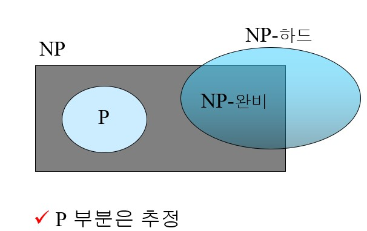   
지금까지 나온 내용 들의 포함관계는 이러하다.  

---

* 12日  

드디어 SLR Parsing Table을 완성하고 이제 운영체제를 공부하기 시작했다.  

# Virtual Memory 1

**Virtual Memory**  
프로그램에서 필요한 메모리를 논리적 주소 공간에서 물리적 주소 공간으로 접근을 한다. 예전에는 논리적 주소 공간과 물리적 주소 공간의 크기를 같게 해야 프로그램이 꺼지지 않고 실행이 되었다. 가상 메모리가 도입 되고나서는 가상 메모리 공간에 물리 메모리 공간에서 조금만 가지고 유지하며, 논리적 주소 공간에서 요구 할 때 가상 메모리 공간에 없다면 물리 메모리 공간에 접근해서 가져온다.

  
그림과 같이 되어있을 때 맨 오른쪽 원통을 `Storage`라고 한다. Storage에 들어가는 메모리들은  
1) 기존 프로그램 이미지에 있는 경우  
2) SWAP영역(변경한 데이터 혹은 동적 할당한 데이터)에 있는 경우  

또한 데이터 부분 Code Data Heap Stack들을 가상메모리로 유지중이다.  

**Demand Paging**  
프로세스가 해당 페이지를 접근 하는 순간에 Paging해서 제공하는 것이다.  

  
Valid-Invalid Bit를 두고 운용한다. 실제로 Frame을 할당한 경우 Valid, 안한 경우에는 Invalid로 저장해놓은다. 이 때 Invalid한 Frame에 접근한 경우 `Page Fault`가 일어나게 된다.  

  
위 사진과 같이 Invalid한 프레임에 접근하게 되면 Page Fault가 일어난다.  

**Page Fault**  
  
1) CPU에서 요청한 메모리에 접근할 때 MMU가 Page table에서 Valid, Invalid을 체크한다.  
2) Invalid일 때 Trap(SoftWare Interrupt)가 일어나게 된다. [대표적인 Software Interrput인 Page Fault] 이 때 System Call 처리한 것과 같이 User mode라면 Kernel mode로 변경하고 Page Fault Handler를 찾는다.  
3) Page Fault Handler가 Free Framelist에서 연산에 맞게 빈 공간이나 맞는 공간을 찾아서 해당 Page table에 넣어주고 Valid bit을 Valid로 바꿔 준다.  
4) Restart Instruction을 해서 오류가 안나게 실행해준다.  

만약, Frame이 부족할 때 Page Fault Handling이 실패한다. 이것이 **Out Of Memory**(OOM)이다.  

이러한 내용이 일반적으로 진행되었을 때의 얘기이다.

이제는 예외에 대해 얘기해보자.  
똑같이 `2.`까지 진행했을 때, Free Frame가 부족한 경우  
다른 Frame으로부터 Page을 가져오는 기법을 `Page Replacement`라고 한다. 이어서 Frame을 얻어 왔을 때 맞는 공간을 찾아야한다. 그 공간을 찾는 것을 두 가지로 나눌 수 있다.
1) Program image에서 가져온다.  
2) `Storage`(Swap)에서 찾아온다. 그것을 `Swap-in`이라고 한다. 
이 부분이 위 그림의 설명으로 생각하면 좋다. 다음에는 위의 과정인 `3.`에서 Valid bit부터 이어가면 된다.  

추가적으로 Page Replacement나 Storage Access가 일어날 때 성능 저하가 일어난다. Storage Access는 Virtual Memory가 설계 될 때 무조건 한번은 일어난다고 가정하고 설계된 것이다. 하지만 Page Table에서 기존의 Frame을 사용할려 할때 기존의 데이터를 Swap영역에 저장할 때 1번 접근하고, Instruction에서 Storage에 접근할 때 2번 접근하게 되어 성능저하가 일어난다. 결국 Storage 접근이 성능을 좌지우지하게 된다.  

*Performance of Demand Paging*  
이전에 알아보았던 EAT(Effective Access Time)을 적용해볼 것이다. 이때 Page Fault Rate을 p라고 했을 때 무조건 일어날 경우 p=1, 안 일어날 경우 p=0으로 성능 차이를 알아보자.  
- 무조건 안 일어난 경우 : EAT = (1-p) x Memory access
- 무조건 일어난 경우 : EAT = Memory access + p x (page fault overhead + swap page out + swap page in)  

식을 정리하고 예를 들어보자.  
Memory access time = 200ns  
Average page-fault service time = 8ms  
EAT = (1-p) x 200 + p (8ms)  = 200 + p x 7,999,800  
만약 p = 0.001, 0.1% 확률로 일어난다고 했을 때는 EAT = 8.2um이 나온다. p = 0과 비교해보면 약 40배나 느리다고 볼 수 있다.  
같은 식으로 성능 저하를 10%이하로 잡기 위해서는 400,000 메모리 접근마다 한번 page fault가 일어나야 성능 저하가 10% 이하일 수 있다.  

**Page Replacement**  
위에서 한 내용으로 Page Replacement는 대략적으로 이해가 되었다. 이제 Page Replacement의 알고리즘에 대해 공부했다.  

먼저, FIFO 알고리즘이다.  
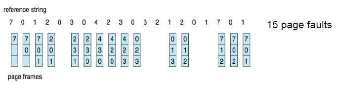  
FIFO는 15번 Page Fault가 일어났다.  
그림에서는 Frame을 3개만 할당했다. 직관적으로 Frame이 늘어나면 Page Fault가 줄어든다. 
하지만 잘못 관리하면 늘어나게 되는데 이 부분을
`Belady's Anomarly`라고 한다.  

  
가장 이상적인 알고리즘은 앞으로의 미래를 예측해서 가장 늦게 쓰일 프레임을 대체하는 것이다. 하지만 우리는 미래를 예측할 수 없어서 이상적인 알고리즘으로만 남았다. 이 때는 9번 Page Fault가 일어났다.  

  
현실적으로 접근해서 Least Recently Used 알고리즘으로 생각해보자. 
전에 배운 LRU을 이용하는 거와 같다.  
이 때는 12번 Page Fault가 일어났다. FIFO보다는 적지만 이상적인 알고리즘보다는 많이 일어났다.  

하지만 이러한 LRU도 구현하는데에 있어 문제가 있어 `LRU Approximation Algorithms`라는 것을 사용한다.  

**LRU Approximation Algorithms**은   
page에 Frame이 있으며, Valid-Invalid bit 옆에 `Reference bit`을 둬서 사용한다. 밑에서 이야기할 `Modify bit` 또한 옆에 같이 둔다.  
Reference bit은 초기에 0으로 두고 page가 reference될 때 bit을 1로 설정한다.  

이러한 알고리즘을 이용한 방법이 **Second-Chance Algorithm**다. 순환큐를 통해서 page들을 계속 순환하는데 reference bit가 1인 경우 0으로 바꿔주고 0인 경우 해당 page을 빼서 다른 페이지로 대체한다. 한 페이지가 계속 reference 된다면 bit가 0에서 1로 바뀌기 때문에 다음 사이클에서도 대체되지 않을 것이다.  

이 알고리즘에서 더 나아가면 **Enhanced Second-Chance Algorithm**이 있다. 이 알고리즘은 Second-Chance에서 Reference bit외에 Modify bit을 두는 것이다. modify bit은 dirty bit과 같으며, Swap 영역에서 Swap-in으로 page에 frame이 넘어왔을 때 이 값이 변경되었는가 확인하는 비트이다. 이 비트가 1이라면 page replacement 되기 전에 Swap-out으로 Swap 영역에 값을 업데이트 해주고 replacement 되어야한다.  
해당 알고리즘을 썼을 때 대체되는 우선 순위는  
(reference, modify)일 때
1) (0, 0) 
2) (0, 1)
3) (1, 0)
4) (1, 1)

이렇게 정리된다.  

오늘의 내용을 정리해보자면, `Page Falut` 일 때 frame이 없으면 `Page replacement`해야하는데 Page replacement Algorithm에 따라 Page Fault 발생할 확률이 다르고 심지어는 Belady's Anormaly가 일어날 만큼 큰 영향을 준다.  
가장 이상적인(Optimal) 알고리즘은 미래에 가장 늦게 선택되는 Page를 대체하는 것인데 미래는 예측하기 어려워 LRU 알고리즘을 사용한다.  
LRU방식은 과거를 보고 미래를 예측하는 방법인데 실제로 아주 빠른 시스템에서는 구현이 불가능해서 `LRU Approximation Algorithm`을 사용한다.  
reference bit을 사용하는 것이 `Second-Chance algorithm`이며, 거기서 reference와 modify비트를 사용하는게 `Enhanced Second-Chance` 알고리즘이다.

Demand paging을 제대로 사용할려면 Page fault가 적게 일어나야한다. 우리가 할 수 있는 일은  
1) 메모리 많이꽂는다.  
2) 효율적으로 replacement 알고리즘을 수행한다.  

두 가지를 달성해야 Demand Paging을 높은 성능으로 돌아갈 수 있다.

--- 

* 13日  

오늘은 운영체제 과제를 시작한 날이다. 운영체제 이번 과제는 CPU 스케쥴러를 새롭게 만들고 적용해보는 것이다. 거기에 부가적으로 LKM(Load Kernel Module)을 사용하여 커널 컴파일을 최소화 시켜서 구현하는 것을 설명해주시고 구현하게 되었다. LKM과 커널사이에서 모듈이 적재되었는지 확인하는 방법을 여러방면에서 공부하고 찾아보는데 빨리 답이 나오지 않았다.  
몇 시간 동안 고민한 결과 커널에 변수 하나를 두고 이번에 과제를 하면서 공부하게 된 EXPORT_SYMBOL로 LKM에서 extern 변수로 받게 되었다. LKM에서 변수를 조작해서 init과 exit할 때 변수를 바꿔서 모듈이 적재가 되었는지 확인 하도록 했다.  
외에도 Makefile을 통해서 리눅스 환경에서 컴파일 과정을 여러번 하지 않고 한번에 명령어를 통해 할 수 있는 것을 공부하며, 모듈을 컴파일 해내는 것도 가볍게 공부했다. 하지만 현재 커널을 수정하고 컴파일하는 과정에서 여러가지 오류가 일어나 디버깅하는데 시간이 꽤나 지체되고 있다.  
정리하면 커널을 매번 컴파일하며 소요되는 시간을 줄여주기 위해 LKM이라는 모듈을 도입해 모듈을 적재하거나 빼서 커널코드처럼 사용할 수 있는 방법과 평소에 코딩하면서 사용하지 않고 다른 코드를 리뷰할 때나 볼 수 있었던 extern 변수들이 어떻게 이용되고 다른 소스코드로 보내기 위해서 EXPORT_SYMBOL을 사용해야 한다는 것을 공부할 수 있었다. 그리고 Makefile을 통해서 리눅스 환경에서 여러가지 과정을 생략한 컴파일을 통해서 조금 더 간편하게 컴파일을 할 수 있다는 것을 공부했다.  

---

* 14日  

프로그래밍언어론 복습  

- 1강 Preliminaries  

**언어를 평가하는 요소**  
1) Readability (주관적일 수 있다)  
	- simplicity
	- orthogonality
	- data type
2) Writability (주관적일 수 있다)
	- simplicity
	- orthogonality
	- support for abstraction
3) Reliability (ex. type error) Writability와 반비례
	- type checking (C언어는 type unsafety)
	- exception handling (C언어 제공x, c++ java 제공)
	- aliasing ( ex) 포인터)
4) Cost  
	- 교육비용
	- 작성비용
	- 컴파일비용
	- 실행비용
	- 유지보수비용 등
5) Others
	- Portability
	- Generality

**언어 설계에 영향을 주는 2가지 정리**
- 하드웨어
- 당시대 사람들의 Needs  
	- 50-60년대 간단한 프로그램
	- 60년대 fortran
	- 70년대 프로세스지향, 데이터지향적 프로그래밍 (자료 추상화)
	- 80년대 중반 객체지향 프로그래밍 (자료 추상화 + 상속 + 다형성)  

**구현 방법**
- 컴파일
	- 프로그램을 기계어로 번역한다. 속도↑ 개발↓
- 인터프리터 방식
	- 인터프리터를 통해 번역한다. 속도↓ 개발↑
- 하이브리드 방식
	- 컴파일러와 인터프리터 타협 ex) Java  

**컴파일**  
고급언어 -> 저급언어  
속도↑ 개발↓ (Slow Translation, Fast execution)  
어휘분석은 토큰으로 나눠서 분석
구문분석은 토큰들을 파스트리로 변환해서 분석  

  
맨 윗칸이 Load Module로 exe와 같은 실행가능한 이미지들이다. 모듈이 메모리상에 프로그램을 순서대로 올려준다.  

컴파일 순서  
컴파일-링킹-로딩-실행  
c - obj - exe - procese 등록  

메모리 영역  
- code
- data
- heap
- stack  

폰 노이만의 병목현상(bottleneck)  
연결 속도보다 instruction이 빠르게 되면 일어난다. 컴퓨터의 속도 한계 주요원인이다.  
cpu와 메모리 사이에는 cache가 존재해서 극복한다.  

**인터프리터**  
기계어 번역x  
실행속도 느림 (컴파일보다 10~100배 느림)  
가끔 더 많은 공간 요구  
지금까지 고급언어로는 적게 사용됨  

과정
소스 + 입력 데이터 -> 인터프리터 -> 결과  
- 메모리多 속도↓  

**하이브리드**  
컴파일러와 인터프리터 사이  
고급언어 -> 중간언어 (해석이 쉬움)  
인터프리터보단 빠름  
초기 JAVA가 하이브리드  

추가적으로, Just-in-Time Implementation Sysmtems  
하이브리드와 같이 중간언어 사용  
처음 호출에는 하이브리드 중간언어 사용  
두번째 이후 호출에서는 컴파일 기계언어 사용  

요약 :  
- 프로그래밍 언어 평가요소 4가지
	- 가독성
	- 쓰기가능성
	- 신뢰성
	- 비용  
- 언어 설계 영향 요인
	- 하드웨어
	- 사람들의 니즈
- 프로그래밍 언어 해석 방법 3가지
	- 컴파일
	- 인터프리팅
	- 하이브리드  

---  

* 15日  

프로그램언어론  

- 3강 Describing Syntax and Semantics  

**구문과 의미**  
- 구문 (syntax) : form 모양
- 의미 (Semantics) : 표현의 의미  

**Syntax**
lexeme : 가장 하위의 구문 단위, 최소단위  
token : lexeme의 범주, 종류  


**BNF && CFG**  
CFG (Context - Free - Grammar)  
- 문맥자유언어 클래스 정의
- 자연어 문법 기술함  

BNF (Backus - Naur Form)  
- 문맥 자유 문법에 속함
- 구문 변수 = 논터미널
- lexeme or token = 터미널

left hand side, right hand side  
-> 기준으로 왼쪽, 오른쪽

시작 심볼은 문법의 논터미널  

**Rules**(->)  
RHS 한개 이상  
재귀적으로 기술 가능  
시작 심볼에서 시작 후 끝은 무조건 **터미널 심볼**로 끝나도록 **유도**(=>)되어야한다.  

문장은 Sentential form  
터미널심볼은 Sentence  

Leftmost derivation  
맨 왼쪽 논터미널심볼 가장먼저 유도(확장)

파스트리 : 계층적으로 유도를 표현함  

**Ambiguous**   
하나의 문장에서 두개 이상의 파스트리 생성  


Unambiguous   expression grammar  
파스트리에 연산자의 **우선순위**를 주어줌  

연산자의 Associativity  
연산자가 동일한 우선순위을 가져 Ambiguous가 생기는 경우 left associativity, right associativity로 나눠서 왼쪽부터 or 오른족부터  

**★ambiguous 해결★**
1) 우선순위 부여  
2) 우선순위 같은 경우 associativity 부여  

`<expr> -> <expr> + <expr> | const` (ambiguous) 
`<expr> -> <expr> + const | const` (unambiguous)  

*Extended BNF*  
BNF ≒ Extended BNF  
**표현력은 같음**  
Optional []  
Alternative ()  
Repetitions {}  

요약 :  
BNF와 CFG는 표현이 같다.  


- 4강  Lexical and Syntax Analysis

Regular grammar (정규 문법)은 Regular Expression (정규 표현)으로 표현 된다.  
정규표현은 **Finite-state-Machines** (유한상태기계, FSM)으로 이행된다.  
Context-free Grammar (문맥 자유문법)은 BNF와 표현할 수 있는 것이 같다.  
BNF는 push-down automata로 이행된다.

  
FSM은 C언어의 enum으로 구현가능  


- 5강 Names, Bindings, and Scopes  

명령형언어는 폰노이만 아키텍쳐를 추상한다.  
- 명령과 데이터는 메모리에 저장된다.  
- cpu에 의해서 필요한 연산이 실행된다.  

명령형의 언어 피연산자를 담당하는 memory cell이 variables(변수)다.  

**변수의 여러 속성**
- Name  
변수의 이름, 함수의 이름, 매개변수 이름, 구조체  
Identifier와 상호호환되게 사용  

	- Length  
		- 자유도 증가  
		- 컴파일타임 ↓  
		∵ Symbol table에 넣음
		- 메모리 ↑  
		∵ 런타임에 기록시 실행시간 ↓와 함께
	- Form  
		- underscore (`_`)을 대체해서 Camel notation 사용  
		ScoreValue instead of score_value  
		- PHP  
		`$` 로 변수 선언  
		e.g. $scoreValue  
		- Perl  
		Scalar $  
		Array @  
		Hash %  
		변수 선언 
	- Case sensitivity  
		- C기반 언어는 대소문자 구별한다. 이것은 가독성을 떨어트린다고 하는데 사람마다 다르다.  
	- Special words  
		- 가독성을 높일 수 있지만 Reserved word(예약어)가 지정되있는 경우 피해야한다.  
		- 예약어가 많으면 유저가 예약어를 피해서 변수를 써야하지만 부족하다면 불편하다.  
	
- Variables  
	변수는 memory cell을 매핑한것이다.  
	특성 : name, address, value, type, lifetime, scope  

	- Name  
		앞에서 정리한 것과 같다.  

	- Address  
		- C Pointer와 같이 변수와 연관된 메모리의 주소이다.  
		- 변수가 함수 속에서 다른 주소를 가질 수 있다. (10강에서 계속)
		- L-value(변수의 주소)와 같다.  
		- Alias : 같은 주소에 다른 이름 (C 포인터 C++ 참조자) 가독성 저하  


	- Type
		- 변수 값의 범위와 어떤 연산을 쓸지 결정한다.  

	- Value
		- *Abstract memory cell* : 물리적 cell 이나 변수와 연관된 cell  
		- l-value : address  
		- r-value : value  
		
	- **Binding**  
		권한과 속성 사이의 연관이다.  
		- 변수의 type과 value, operation과 symbol  
		binding time에 따라 static과 dynamic으로 나뉘어진다.  
		Language design time, implementation time, compile time은 static binding time  
		따라서, static binding은 
			1) 런타임 전
			2) 프로그램 실행 중 바뀌지 않으면  
		
		Load time과 Runtime, global은 dynamic binding time 은 dynamic binding time으로,  
		1) 실행중에 처음 발생하거나  
		2) 프로그램 실행 중에 바뀔 수 있으면
		dynamic binding이다.  

		Type Binding은 변수가 프로그램에 참조되기전에 자료형이 바운딩되어야한다. 만약 static binding인 경우 explicit 혹은 implicit 선언이 있어야한다.  

		Static Type Binding  
		- 명시적 선언  
			- 프로그래머가 직접 명시해서 선언하는 경우
		- 묵시적 선언  
			- 컴파일러가 자동으로 타입을 찾아내는 묵시적 선언
			- default convention  
			지정하지 않으면 자동으로 default에 들어감
				1) naming convention  
			Fotran에서 사용, 타이핑시에 잘못 치는 경우 잘못된 자료형이 바인딩되어 에러가 일어날 수 있다.   
				2) Using context  
				타입을 추론하는 방식 ex) var 타입 초기화 값을 보고 추정함 (컴파일 시간에 결정되므로 static)  
		
		Dynamic Type Binding  
		바인딩된 자료형 외의 다른 자료형으로 바뀌는 경우 (주소와 메모리셀이 바뀔 수 있음)

		장점 : 프로그래밍 유연성 ↑  
		type명시로 인한 재사용률 ↑  
		단점 : 신뢰성 ↓  
		변수들이 런타임에 새로운 자료형을 가질 수 있어서 메모리 ↑  
		타입체크를 해야하므로 속도 ↓

* 16日  

프로그램언어론 이어서  
- Lifetime  
	- 어떤 메모리 셀에 바운딩되냐에 따라 다르다.  
	- static (data)  
		- 실행 전 메모리 셀에 바운딩
		- 실행 이후에 값 바뀌지 않음.
		- 재귀x
	- dynamic (heap, stack) 
		- stack-dynamic (stack)  
			- 재귀 허용
			- 할당과 해지시의 오버헤드 존재
			- Subprogram이 history senstive하지 않다.
			- 비효율적인 참조(간접 주소)
		- explicit heap-dynamic(heap) 명시적 동적할당
			- 자료형은 컴파일 시간에 바운드 되지만 메모리에 적재는 런타임에 일어난다.  
			- new delete  
			- 동적으로 저장공간관리  
			- 복잡하거나 어렵다.
		- implicit head-dynamic(heap) 컴파일러가 할당 및 해제
			- 선언된 자료형과 다른 자료형으로 할당이 가능하다.
			- 높은 유연성
			- 런타임 오버헤드
			- 컴파일러가 오류 탐색기능 손실
			
- Scope  
	scope란 쓰이고 읽히는 범위  
	지역변수는 선언된 프로그램 유닛의 한정된다.

	- nonlocal 변수  
		- 전역변수
	- Scope rules  
		- nonlocal 변수에 대해서만 적용됨
	
	- Static Scope  
	사람이나 컴파일러가 실행 전에 소스만 보고 알 수 있으면 Static한 변수

		- **subprogram can be nested**
	subprogram 중첩 가능
	속도 ↓

		- subprogram cannot be nested  
	subprogram 중첩 불가능
	속도 ↑ (C기반언어)

	```
	func big() {
		func sub1() {
			var x = 7;
			sub2();
		}
		func sub2() {
			var y = x; // x nonlocal 변수 (static scope일 때는 big의 x)
		}
		var x = 3;
		sub1();
	}
	```
	big에 의해서 sub1에 `x`가 가려진 걸 `hidden` or `closer`변수라고 한다.

- Block
	```
	void sub() {
		int count;
		while(...) {
			int count;
			count++;
			...
		}
	}
	```
	C와 C++에서는 허용하나, JAVA와 C#은 허용하지 않는다. 속도면에서는 좋지 않다. 할당과 해지 반복을 한다.

	함수형 언어는 `let`키워드로 블록을 구성한다.  
	Scheme
	```
	(LET (
		(top (+ a b))
		(bottom (- c d))/ top bottom)
	)
	```
	ML
	```
	let
		val top = a + b
		val bottom = c -d
	in
		top / bottom
	end
	```
	추가적으로 함수언어는 매번 변수를 만들어서 사용한다.


	Blcok의 Scope는 선언부터 Block 끝까지  

- Global Scope
	블록 밖에서 전역변수로 정의되면 어디서든 사용할 수 있다.  
	C언어에서는 오직 한번만 정의해야한다.
	extern으로 다른 파일에서 특정한 변수를 받아와서 사용하는 것도 전역변수로 사용할 수 있다.

	PHP의 경우에 전역변수를 사용할 때는 global로 선언하거나 $GLOBALS로 사용해야한다.

	Python 또한, 전역변수와 지역변수가 이름이 같은 경우에는 명시적으로 global로 선언해주어야한다.
	
- Dynamic Scope  
	non-local 변수에 대해서는 실행시간에 콜체인을 따라가서 호출한 caller를 확인해야한다.

- **Scope 정리**  

```
func big() {
	func sub1() {
		var x = 7;
		sub2();
	}
	func sub2() {
		var y = x;
	}
	var x = 3;
	sub1();
}
```
Static Scoping인 경우엔 sub2의 x를 big의 x를 참조한다.  
Dynamic Scoping인 경우엔 sub2의 x를 sub1의 x를 참조한다.  

Dynamic Scoping
	- 장점 : 편리함
	- 단점 : 구현 힘듬, 정적인 타입체크가 불가능, 가독성 저하

Scope와 Lifetime은 관련이 있지만 다른 개념이다. 

- *referencing environment* : statement에서 보이는 모든 이름의 집합체  
	- static-scoped : 콜스택 전체
	- dynamic-scoped : 콜체인

*active* : subprogram이 콜 후 리턴 전  

- Named Constants  
상수들은 처음에 한번 값을 바운딩해주고 계속 사용된다.  
가독성과 변경하는데 용이하다는 장점이 있다.  
Ada, C++, JAVA는 동적으로 바운딩  
C#은 readonly(동적으로 바운딩), const(컴파일 시간에 바운딩) 두개 사용  
	- 초기화 :  
		static : 제한O  
		dynamic : 제한X

---

* 17日  

프로그램언어론  

- **6강 Data Types**  

1) **표현**
2) **연산**  

자료형은 2가지를 고려해야한다. 이 부분을 생각하면서 공부하자  

Data type : 데이터의 모음과 미리 정의된 연산들의 모음  

descriptor : 변수의 속성들의 모음  
  
모든 속성들은 정적이라서 컴파일 시간까지만 필요하다.(Symbol table에 유지) 따라서 런타임에는 value만 유지한다.  

object : 상속을 제외한 추상 데이터  

- Primitive data types  
가장 기본적인 data type  
비트마다 하드웨어에 기반해서 data type을 정함  

- Structured data types  
primitive data type들을 구조화 시킨 data type  

Numeric types
- integer  
음의 정수 표현  
	- Sign-magnitude notation (MSB가 부호비트)  
	산술문제가 존재 (0011 (3) + 1011 (-3) ≠ 0)  
	- Two's complement notation  
	보수 취하고 1을 더함  
	대부분 사용함
	- One's complement notation  
	0을 표현하는 방법이 2가지가 있음 (1111, 0000)  

- floating point  
표현방법  
	 - Fixed-point notation  
	 1.3  
	 0001 | 0011  
	 0.03 같은 숫자 표현 불가
	 - Floating-point notation  
	 0.13 x 10¹  
	 0111 | 0001  
	 이러한 원리로 작동한다.  
	 0.03 = 0.3 x 10^(-1)도 같이 표현할 수 있다.  

- complex  
	real + imaginary  

- decimal  
	C언어에서 제공 X  
	은행에서 많이 사용함 (COBOL)  
	BCD : 0,1로 코딩된 십진법을 사용함  
	4bit or 8bit 사용  
	ex) 123  
	4 bit : 0001 0010 0011  
	8 bit : 00000001 00000010 00000011  
	장점 : 정확성  
	단점 : 범위 한계, 메모리 낭비  

- boolean  
	true or false  
	byte 단위로 표현 (bit로 하면 연산시 복잡함)  
	장점 : 가독성  

- character  
	숫자 -> 문자 매핑
	ASCII 이용  
	영어 외의 언어 Unicode  

primitive data type  

==============================================  
structured data type  

- string
	- issue  
	primitive로 볼지, char형의 배열로 볼지  
	string의 길이를 정적으로 할지 동적으로 할지 (hi -> hello, hello -> hi)  

	- operation  
	assignment and copying: 주소를 공유 or 값만 복사  

	comparison 
	catenation  
	substring  
	pattern matching(Perl)  

	C, C++ Not primitive  
	Library of function  
	E.g) char str[] = "apples";  
	strcpy(dest, src)  만약 primitive라면 자동으로 사이즈가 늘어나서 복사된다.  

	Java primitive  
	Perl, JavaScript, Ruby, and PHP  
	pattern matching에 정규표현(regular expressions) 사용한다.  
	E.g `/[A-Za-z][A-Za-z\d]+/`  
	E.g `/\d+\.?\d*|\.\d+/`  
	`+` : 1개 이상 나옴  
	`*` : 0개 이상 나옴  
	`?` : optional  
	`\.` : 숫자 .  
	`|` : or  

	Length option  
	static or dynamic  
	- static 속도↑ 편의성↑
		COBOL, Java's String class  
		Compile-time descriptor가 필요하다.
	- Limited Dynamic Length  
		C and C-style C++  
		\0을 주는 것보다 길이를 크게 할당  
		run-time descriptor가 필요 할 수 있으나 static과 비슷해서 필요 없을 때가 많다.   
	- Dynamic (no maximum)   속도↓ 공간↓
		SNOBOL4, Perl, JavaScript, standard C++ library  
		run-time descriptor가 필요하다.  
		할당과 해제에 큰 구현문제가 있다.


- Enumeration type  
	C#의 enum  
	
	Design issues  
	enum 이름이 겹치는 경우 

	장점 : 가독성 증가, 신뢰성 증가(컴파일러 체크 가능, 연산 불가)

	Reliability vs Writeability  
	```
	1) Reliability
	days nextDay(days d) {
		int i = d;
		i++;
		if(i == 7) i = 0;
		return (days)i;
	}

	2) Writeability
	days nextDay(days d) {
		if (d == mon)
			return tue;
		else if(d == tue)
			return wed;
			...
	}
	```
	`1)`(정수로 변환이 가능한 경우)과 같이 코딩하면 유저가 실수 할 수 있다. 코드가 쉬워지며 가독성이 떨어진다.  
	`2)`(변환 불가)은 코딩이 길어지고 실수가 적어진다.  

- Array Types  
	**homogeneous aggregate(같은 종류의 집합체)** of data elements  

	C 계열, Java에서는 배열과 원소의 자료형은 같아야한다.  
	하지만, Javascript, Python, Ruby에서는 typeless reference라는 자료형을 넣게되면 다른 자료형의 포인터를 가질 수 있다.

	- indexing (subscripting)  
	인덱스를 넣으면 해당 원소를 매핑해준다.  
	Fortran과 Ada는 () 사용 (함수 사용과 혼동 가능)  
	나머지는 [] 사용  
	index와 element 자료형이 다를 수 있다.  
	do not specify range checking :  
	C, C++ Perl, and Fortan 속도↑  
	Perl은 array는 `@`을 붙여서 선언, `$`을 붙이고 인덱싱하여 접근  
	인덱싱값이 음수인 경우에는 오른쪽 끝에서 절댓값만큼 인덱싱하면 된다. 그리고 배열에 값이 없을 때 `undef`을 참조시키며 오류를 보고하지 않는다.  

	- Static array  
	장점 : 효율성  
	단점 : 메모리  
	- Fixed stack-dynamic array  
	단점 : 속도(할당 & 해지)
	- Fixed heap-dynamic array  
	장점 : 유연성  
	- Heap-dynamic array (subscript range가 dynamic하다)  
	장점 : 유연성  
	단점 : 속도(할당 & 해지)  
	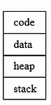  
	Fixed는 생성시에 사이즈가 고정된다. Heap-dynamic을 제외하고 나머지 3가지는 subscript range가 스토리지에 할당 이후 lifetime 내내 바운딩 되어있다.  

	- Array categories  
	JavaScript 배열은 연속적이지 않아도 된다. C언어를 예를 들면 배열이 연속적이여야 하나, JavaScript같은 경우에는 0~9, 50 총 배열의 길이는 11이나, 인덱싱이 자유롭다. 인덱스가 없는 곳을 참조할 경우 `undefined`가 반환된다.  
	Python, Ruby, Lua는 배열끼리 붙이거나 원소를 집어 넣을 때만 배열 크기가 증가한다.  

	- Array Initialization  
	C, C++, C#, Java는  
	```
	int list [] = {4, 5, 7, 83};
	```  
	배열의 길이를 컴파일러가 계산해준다.  
	C와 C++은 
	문자형 배열 즉 문자열도  
	```
	char name [] = "freddie";
	```  
	자동으로 크기를 8을 할당해준다. (null-character)  
	```
	char *name [] = {"Bob", "Jake", "Joe"};
	```  
	Java는 String을 기본 타입으로 인정하기 때문에
	```
	String* [] names = {"Bob", "Jake", "Joe"};
	```  
	로 해야한다.  

	- Operations  
	대부분 할당, 비교, 배열끼리 붙이기, slice을 제공하지만 C언어는 아무것도 제공하지 않는다.  

	- 다차원 배열의 모양  
		- Rectangular : row와 column의 수가 같다.(C#)  
		E.g `myArray[3,7]`  
		- Jagged : row와 column의 수가 다르다. (C, C++, C#, JAVA)  
		E.g `myArray[3][4]`  배열의 배열로 정의

	- Slice  
		새로운 자료형이 아닌 정의된 배열의 부분배열이다.  
		ex) Python  
		```
		vector = [2, 4, 6, 8, 10, 12, 14, 16]
		mat = [ [1,2,3], [4,5,6], [7,8,9] ]
		```
		vector[3:6]이라고 작성 인덱스 3부터 6번 이전까지 즉, [3,6)과 같은 개념이다. C++ string 라이브러리의 substr와 비슷하다.  
		mat[1] => [4,5,6]  
		mat[0][0:2] => [1,2]  
		vector[0:7:2] => [2,6,10,14]  
		이차원 배열인 경우는 해당 row을 반환하거나 row가 지정된 경우엔 column을 반환하면 된다.  
		마지막 slice는 인덱스 0부터 시작해서 인덱스 7까지 idx+=2 해서 반환한다.  

	- 배열들의 주소 찾기  
	1차원 배열인 경우  
	address(list[k]) = address (list[lower_bound]) + ((k-lower_bound) * element_size)  
	2차원 배열인 경우  
	Location (a[i,j]) = address of a [row_lb,col_lb] + (((i - row_lb) * n) + (j -col_lb)) * element_size  
		- Row major  
		Row 부터 채워감 (대부분의 언어)
		- Column major  
		Column부터 채워감 (FORTRAN)  

	- Associative Arrays (Dictional)  
	순서가 없는 집합, 인덱싱을 key-value로 되는 배열  

	ex) Perl  
	array `@`로 선언 `$`로 접근  
	Associative Array `%`로 선언 `$`로 접근  
	e.g) %hi_temps = ("Mon" => 77, "Tue" => 79, "Wed" => 65, ...);
	$hi_temps{"Wed"} = 83;
	delete $hi_temps{"Tue"};  

- Record Types  
	**heterogeneous aggregate(다른 종류의 집합체)**  
	C언어에서 Struct  
	배열에서는 인덱스를 숫자로했지만 레코드에서는 이름으로 접근한다.  

	레코드에서 dot(.)을 이용해서 접근한다.  

- Tuple Types  
	레코드와 비슷하나, 이름을 사용하지 않고 배열과 같이 순서대로 인덱싱한다.  

	함수가 여러 값을 반환할 때 사용하기 좋다.  

	ex) Python  
	myTuple = (3, 5.8, 'apple')  
	string과 같이 +으로 다른 튜플끼리 붙일 수 있다.  

	ML  
	var myTuple = (3, 5.8, 'apple');  

	#1(myTuple)로 첫번째 원소에 접근 할 수 있다. 그리고 새로운 튜플타입을 선언할 수 있다.  
	type intReal = int * real;

	F#  
	let tup = (3, 5, 7)  
	let a, b, c = tup  

	Tuple이 없는 C언어  
	```
	1)
	typedef struct _TwoValue {
		int intVal;
		float floatVal;
	} TWO_VALUE;
	
	TWO_VALUE f() {
		TWO_VALUE v;
		
		return v;
	}
	int main() {
		TWO_VALUE t;
		...
		t = f();
	}

	2)
	void f(int *ip, float *fp) {
		...

		*ip = 3;
		*fp = 1.2f;
	}
	int main() {
		int i;
		float f;

		f(&i,&f);
	}

	// Tuple을 지원하는 C언어

	tuple f() {
		...
		return (3, 1.2f);
	}
	int main() {
		tuple t;
		...
		t=f();
	}
	```
	Tuple을 지원하지 않는다면 상당히 번거로워지고 C언어에서는 여러 반환값을 포인터를 이용해서 처리하고 있다. 하지만 가독성이 안 좋아서 Tuple을 사용할 수 있다면 좋다.  


- List Types
	LISP와 Scheme  
	`,`가 없이 사용한다.  
	(A B C D) (A (B C) D)  
	함수를 호출하는 경우와 똑같기 때문에 	`(A B C D) 구분한다.  

	Operation
	Car List 첫번째 원소  
	Cdr List 첫번째 원소 제외한 원소들  
	Cons List끼리 통합한다.  
	
	ML  
	Cons을 `::`로 대체해서 사용한다.  
	3 :: [5, 7, 9] == Cons `3, (5, 7, 9)  
	CAR과 CDR이 hd와 tl로 대체  

	F# ≒ ML  

	Python  
	원소들의 타입이 달라도 된다.  
	myList = [3, 5.8, "grape"]  
	`x = myList[1]` x = 5.8  
	`del myList[1]` 가능하며 이후에는 인덱스가 하나씩 땅겨짐  

	**Comprehensions**  
	[x * x for x in range(6) if x % 3 == 0]  
	range(6) creates [0, 1, 2, 3, 4, 5, 6]  
	∴ 나오는 리스트는 [0, 9, 36] x = 0 3 6  
	
- Unions Types  
	여러개의 타입이 하나의 공간을 공유하는 형태  
	공간은 개체중에서 가장 큰 사이즈가 해당 Union의 공간이다.  
	메모리가 부족할 때는 많이 사용했으나, 지금은 많이 사용하지 않는다.  

	Discriminated  
	Type을 명시해서 사용하는 Union (Ada)  
	Free Union  
	Type checking을 하지않는 Union (C, C++, FORTRAN)  

	```
	Ada Union
	type Shape (Circle, Triangle, Rectangle);
	type Colors is (Red, Green, Blue);
	type Figure (Form: Shape) is record
		Filed: Boolean;
		Color: Colors;
		case Form is
			when Circle => Diameter: Float;
			when Triangle => Leftsid, Rightside: Integer;
			Angle: Float;
			when Rectangle => Side1, Side2: Integer;
		end case;
	end record;
	```
	  
	각각의 상황에 따라 메모리가 할당되는게 다르다.  

	Java나 C#에서는 union을 지원하지 않는다.  
	Free union은 안전하지 않지만 빠르다. (자료형검사 X)
	Ada의 Descriminated union은 안전하지만 속도가 느리다.  

- Pointer and Reference Types  
	Pointer랑 달리 Reference는 초기화가 필요하다.  
	
	- Pointer Operation  
	1) assignment(할당)
	2) dereference(역참조 : 값 읽어오기)  
	
	dereference는 implicit(묵시적), explicit(명시적) 가능함  

	```
	int a = 10;
	int *p;
	int &b = a;

	p = &a;
	a = 20;
	printf("%d",b); // 묵시적
	printf("%d",*p); // 명시적
	```
	
	- Problems  
	**Dangling pointers** (dangerous)  
	```
	char *p;
	p = (char *)malloc(100);
	...
	free(p);
	...
	*p = 'a'; // p is a dangling pointer
	```
	Lost heap-dynamic variable (memory leakage problem, dangling object, garbage)  
	```
	void f() {
		char *p =(char *)malloc(100)  
		...
		/p's content is lost!
	}
	```
	
	Ada  
	dangling pointer을 없애기 위해서 scope에 끝에서 자동으로 메모리를 해지한다. 하지만 메모리 누수는 일어날 수 있다.  

	C, C++  
	포인터 연산이 가능하다. *(p+i) == p[i]  
	void * 포인터는 다른 타입의 포인터도 받을 수 있다.  
	```
	int a = 10;
	void *p = &a;
	*p; // error;
	* (int*)p; // ok;
	```
	
	Reference Types  
	C++ Reference는 수정이 불가능하다.  
	Java의 Reference는 수정이 가능하다.  
	C#은 C++와 Java 두개 다 제공.  

	**Dangling Pointer Problem Solution**  
	1) Tombstone  
	  
	Tombstone : heap-dynamic variable  
	묘비 메모리 해지시 nil값으로 유지
	메모리↑ 시간↑
	2) Lock-and-keys  
	  
	Head-dynamic variable으로, Lock과 key가 같아야 접근이 가능하다.  
	메모리↑ 시간↑

- Heap Management  
	매우 복잡한 런타임 프로세스이다.  
	Single-size cells vs variable-size cells (고정 vs 가변)  
	single-size cell은 간단하지만 variable-size cell은 복잡해진다.

	garbage 정리 방법  
	1) **Reference counters** (eager approach)  
	counter을 garbage들을 갯수만큼 유지한다. 꾸준히 정리한다.    
	장점 : 지연이 없어 다른 방법들 보다 속도가 좋다.
	단점 : 공간 낭비, counter 늘리고 줄이는 시간 필요  
	2) Mark-sweep (lazy approach)  
	마킹이 안된 것들을 한번에 정리  
	  
	메모리가 부족할 시에 Garbage Collection이 일어나고 root로 부터 dfs로 marking을 한다. Mark Phase가 끝나면 marking이 안된 것들을 해지하는 Sweep Phase가 일어난다.  
	이 때, 프로그램 작동이 멈춘 다음 끝나고 작동이 재개한다.  
	단점 : 지연 존재  

- Type Checking  
Compatible Type  
`void f(float b) {}`  
`f(3);`  
`3 + 1.2`  
컴파일러에서 자동으로 변환 시켜주는 것을 `coercion`이라고 한다. 안되면 프로그래머가 직접 형변환을 해줘야한다.  
Type Checking이 강하면 type error가 없지만 프로그래머의 부담이 늘어난다.  
이 전부 static하다면 type checking도 static하다.  
같은 말로 피연산자들이 전부 dynamic하다면 type checking도 dynamic하다.  
**strongly typed**  
프로그래밍언어가 strongly typed하면 컴파일 이후엔 type error가 없다. 예로는 ML과 Ada이다.  
다른 언어를 살펴보면 C와 C++은 Strong Type이 아니다. 매개변수 type check도 안하거나 union은 type check을 안한다.  
Coercion이 강해질수록 strong typing이 약화되므로 서로 상충관계로 있다.  
Name Type Equivalence : 구조가 같아도 이름이 다르다면 할당이 안된다. 이름이 같아야지 할당이 가능하다.  
구현은 쉬우나, 제약이 많다.  
Structure Type Equivalence : 이름이 다르더라도 구조가 같으면 할당이 가능하다.  
유연하게 프로그래밍이 가능하나 구현이 어렵다.  
요점 : 이름이 같으나 필드가 다를 때 같은 구조인가?  
인덱스가 다르나 길이가 같은 배열이 같은 배열인가?  
같은 구조와 같은 이름이지만 단위가 다른 경우 같은 구조인가?  
구현이 애매하다는 이유다.  

---

* 18日  

프로그램언어론  

- 7장 Expressions and Assignment Statements  

들어가기 앞서, 명령형 언어는 assignment가 제일 중요하다. 하지만 이로인해 Side effect가 발생한다.  
**Side effect**란 함수가 자신이 선언된 범위 밖의 변수의 값을 변경시키는 것.  
ex)  
```
int gCount;
int square(int a) {
	gCount++;
	return a*a;
}
```
함수형 언어는 Side effect가 없다. 왜냐 **assignment**가 없기 때문이다.  

- Arithmetic Expression  

산술이 프로그래밍 언어 개발의 첫번째 동기라고 할 수 있다.  
연산자는 피연산자의 갯수로 분류할 수 있다.  
1) Unary : -a
2) Binary : a+b
3) Ternary : a>b?a:b  
	
위치에 따라 분류할 수도 있다.  
1) Prefix : 괄호 없이 산술이 가능하다.  
2) Infix : 대부분 프로그래밍언어에서는 사람이 코딩하므로 infix을 주로 사용한다.
3) Postfix : stack이용하면 편하다.  


- Arithmetic Operator Evalation Order  

1) 연산자 우선순위
2) associativity rule

전형적인 우선순위는 
괄호 -> unary operator -> 제곱 -> *,/ -> +,-이다.  
보통 왼쪽에서 오른쪽으로 진행되나 제곱은 오른쪽에서 왼쪽으로 진행하면 된다.  
우선순위를 잘 모르겠으면 괄호로 묶으면 된다.  

조건연산은 C나 C++의 경우에는 삼항연산을 이용한다.  

피연산자 순서  
변수나 상수는 순서가 크게 상관이 없다.  
괄호가 있거나 함수호출이 있는 경우에는 결과 값을 피연산자로 들어가야하기 때문에 먼저 결과 값을 얻어야한다.  

만약에, a*b에 side effect가 존재한다면 순서가 달라진다.  
Functional side effect는 함수 안에서 전역 변수나 매개변수의 값을 바꿀 때 side effect가 있다고 한다.  
a = 10; b = a + func(a);  
왼쪽을 먼저하면 변수 b에 20이 할당되지만, 오른쪽을 먼저하면 변수 b에 30이 할당된다. 
```
int a = 5;
itn fun1() {
	a = 17;
	return 3;
}
void main() {
	a = a + fun1();
}
```
 
C언어의 경우에는 정의되어 있지 않다. 따라서 fun1을 먼저 하면 a = 20이 되고 왼쪽을 먼저 시작하면 8이 된다. 따라서 C언어에서 구현할 때는 피해야한다.  

**Referential Transparency**의 특징이란 Side effect가 없어야한다.  
예를 들어 `result1 = (fun(a) + b) / (fun(a) - c);`  
`temp = fun(a);
result2 = (temp + b) / (temp -c);`  
이때, result1과 result2가 같다면 Referential Transparency를 가지고 있다고 할 수 있다.  
이러한 특징을 보면 Assignment가 없는 pure functional language는 항상 Referential Transparency를 갖는다.  
장점 : 프로그램을 이해하기 쉬워진다.  

Operator Overloading  
자료형 별로 연산을 다르게 정의해놓았다. 이 부분을 오버로딩했다고 할 수 있다. 프로그래머 입장에서는 익숙한 기호로 사용할 수 있다는 장점이 있다.  
하지만 C와 C++에서 `&, -, *`은 뜻이 애매해서 컴파일러가 오류를 검출하는데 있어서 문제가 생길 수 있다. 추가적으로 가독성에도 문제가 있을 수 있다.  
예를 들어서 x = &y인 경우 프로그래머의 실수로 x = x & y을 잘못 기입한 경우 오류를 탐지하지 못하는 문제가 생길 수 있다는 것이다.  
C++과 C#, F#에서 user-defined overloaded operator을 만들 수 있다.  
예를 들어 A * B + C * D(MatrixAdd(MatrixMult(A, B), MatrixMult(C, D))와 같이 배열 자료형끼리의 연산을 오버로딩하면 이러하게 편하게 코딩이 가능하며, 가독성이 증가한다.  
하지만 잠재적인 문제로 사용자가 센스없이 오버로딩하게 된다면 가독성도 떨어질 수 있다.  

- **Type Conversions**  
만약 컴파일러가 자동으로 해준다면 `Coercion`이라고 한다.  

Narrowing conversion  
원본의 값을 변환 시 잃어버리는 값이 있으면 Narrowing conversion이라고 한다. ex) 1.2 -> 1 (float -> int)  
Widening conversion  
원본이 값을 변환 시 그대로 다 갖고 더 크게 변환 해주는 것이다.  
따라서 안정적이며, Coercion을 허용한다.  
ex) 1 -> 1.0 (int -> float)  

Mixed Mode operation일 경우 coercion이 묵시적으로 일어나게 된다. coercion이 일어나게 되면 컴파일러가 *타입 오류*를 탐지 못하는 경우가 있을 수 있다.  

```
int a;
float b, c, d;
...
d = b * a; // (c를 써야하나 실수 한 경우)
```  
추가적으로 C언어나 Java에서 integer보다 작은 타입의 경우에는 integer로 coercion하고 연산을 한뒤 다시 값에 coercion해준다.  

C언어에서 프로그래머가 명시적으로 형변환하는 경우에는 변수 앞에 적어준다.  

예외처리가 필요한 표현이 있다.  
divison by zero  
overflow  

관계식  
`< > <= >= == != /= ~=`등 사용된다.  
Javascript와 PHP에서의 `==`와 `===`의 차이를 보자  
`==`은 coerced가 일어난 뒤 비교를 한다. 하지만 `===`은 coerced가 일어나지 않는다.  

Boolean  
C에서는 0이 거짓, 0이 아니면 참이다. 잘못된 표현중 하나는 `if(a<b<c)`이다. `a<b`을 먼저 실행한다음 1 혹은 0이랑 c를 비교한 값을 if 조건문에 넣게 된다.  
고치게되면 `if(a<b && b<c)`로 고쳐야한다.  

**Short Circuit Evaluation**  
전체를 evaluation을 하지 않고도 일부분을 evaluation을 해도 값을 얻을 수 있는 경우를 Short Circuit Evaluation이라고 한다.  
ex) (13 * a) * (b / 13 - 1)  
만약 a가 0이라면 (b / 13 - 1)하면 된다.  
지원하지 않는 경우 일어나는 문제  
```
index = 0;
while (index < length> && (LIST[index] != value))
	index++;
```
만약 길이가 length와 같아진 경우 false가 반환되나, 뒤에도 evaluation을 해야하므로 LIST[length]가 들어가게 되어 세그먼트 폴트가 일어날 수 있다.  
e.g (a > b) || (b++ / 3)  
여기서는 선조건인 (a>b)가 false여야 뒷조건을 실행하므로 b++가 무조건 일어나지는 않는다. 하지만 이렇게 side effect가 있도록 코딩하지 않도록 해야한다.  

Assignment  
general syntax  
`<target_var> <assign_operator> <expression>`  
assign_opeartor는 FOTRAN, BASIC, C기반 언어는 `=`을 사용한다. Ada같은 경우에는 `:=`을 사용한다.  

compound assignment operator  
`a = a + b` ==> `a += b`  

Unary assignment operator  
`sum = ++count` // count 연산 먼저  
`sum = count++` // 할당 먼저
`count++`  
`-count++`// count 연산 후 -붙인다.  

Perl의 조건 할당  
`($flag ? $total : $subtotal) = 0`  
이것은 밑에 코드와 같다.
```
if ($flag)
	$total = 0
else
	$subtotal = 0
```

Assignment as an Expreesion  
`whlie((ch = getchar()) != EOF)`
상수랑 assignment statement와 비교하는 경우이다.  
side effect가 일어날 수 있다. 그로 인해 가독성이 떨어질 수 있다.  
E.g `a = b + (c = d / b) -1`  
변수 c에 d/b 값을 할당 후 b + c - 1을 계산하여 변수 a에 할당한다.  

Multiple Assignments  
Perl, Ruby, Lua에서 Tuple을 사용하면 ($first, $second, $third) = (20, 30, 40);  

함수형 언어에서의 할당  
ML에서 `val fruit = apples + oranges;`  
을 사용하게되면 fruit에 apples + oranges의 값이 바인딩되어 수정이 불가능하다. 따라서 변수들의 재사용이 불가능하다. 매번 변수들을 선언해서 사용해야 하므로 Cache을 사용하지 못하게된다. 따라서 속도가 느릴 수 밖에 없다.  

- 8강 Statement-Level Control Structure  

Control Strucdture  
if문 else문  
Selection Statements  
2개의 조건 : if-else  
여러개의 조건 : switch  

C와 C++, 파이썬에서는 if 조건절에 boolean이 아닌 숫자도 가능하다.  

Nesting Selectors  
Java에서 if문 속 if가 존재할 때 else가 있다면 가장 가까운 if와 연결된다. 아니면 괄호로 묶어줘야한다.  

Funtional Language에서는 Selector의 결과가 무조건 값이다.  

**C언어에서는 switch** 조건절에는 무조건 정수가 들어와야한다.  
정수랑 실수를 비교해도 속도차이가 많이 난다.  
break절 전까지 다 실행이 가능하다.  

*C#과 비교*  
C언어에서는 조건절에서는 정수만 가능하지만, C#에서는 정수와 문자열을 허용한다. 그리고 C#에서는 여러 케이스가 계속 실행되는 것을 허용하지 않는다. 따라서 한 케이스마다 goto나 break가 나와야한다.  

Scheme에서의 Multiple Selector  
```
(COND
	(predicate1 expression)
	...
	(predicaten expression)
	[ (ELSE expression n+1)]
)
```
조건 predicate가 참일 경우 expression 실행  

반복문  
Counter-Controlled Loops (for문)  
initial, terminal, stepsize  

C와 C++의 for문의 차이는 조건절에 C에서는 다 정수이지만, C++에서는 bool타입도 들어갈 수 있다는 점과 초기화절에서 변수 정의 유무이다.  
Java와 C#랑 C++의 차이로는 Java와 C#은 무조건 bool타입이여야한다.  

Python의 for문에서는 else가 있을 수 있는데 이때의 else는 for문이 정상적으로 종료되야 실행된다. 또한, 범위를 잡을 수 있는데 전에 공부한 범위를 잡던 것 처럼 범위를 잡으면 된다. ex) range(5) = [0,1,2,3,4]  
range(2, 7) = [2,3,4,5,6] range(0, 8, 2) = [0,2,4,6]  

Funtional Language에서의 Loop  
명령형 언어에서는 counter 변수를 가지고 loop을 돌지만 함수형 언어에서는 재귀호출을 통해서 반복을 구현한다.  
```
명령형
int sum(int a) {
	int s = 0;
	for (int i=a; i>=1; i--)
		s += i;
	return s;
}
함수형 // 속도가 느림
int sum (int a) {
	if (a == 1) return 1;
	else a + sum(a-1);
}
```  

C와 C++은 while처럼 먼저 조건절을 보고 반복하거나 do_while처럼 실행 후 조건절을 보는 경우 둘 다 가능하다. 그리고 조건절에서는 산술이 가능하다.  
Java에 경우에는 조건절은 boolean형이여야 하며 반복문에서 goto가 불가능하다.  

반복자를 통한 반복  
흔히 아는 iterator을 가지고 반복을 하면 된다. C언어에서는 기본적으로 제공하지 않아서 유저가 직접 정의해서 사용해야한다.  
PHP에서는 iterator을 먼저 정의해서 사용하면 된다.  
키워드  
current : 현재 위치의 원소 반환  
next : 현재 위치에서 다음 위치로 이동  
reset : 첫번째 원소로 이동  
ex)  
```
@list = (1,3,5);  
reset $list;
print ("First number: " + cureent($list));
while ($current_value = next($list))
	print ("Next number: " + $cureent_value + "<br\n>");
```
Java 5.0에서는 for가 foreach와 같다. for (String myElement : myList) { }  
C#과 F#에서도 foreach를 사용하는데 유저가 원하는 `IEnumerator`인터페이스를 가지고 foreach을 원하는대로 사용할 수 있다.  
```
List<String> names = new list<String>();
names.Add("Bob");
names.Add("Carol");
names.Add("Ted");
foreach (String name in names)
	console.WriteLine ("Name: {0}", name);  
```

goto  
주요 개념은 가독성의 증가이다. Java에서는 허용하지 않고 C#에서는 가끔 사용된다.  

**Guarded Commands** (개념을 이해)  
Dijkstra가 디자인한 검증을 목적으로 한 프로그래밍이다. 일반적으로는 쓰이지 않는 개념이다.  
Guarded Commands로 쓰여진 코드들은 병렬적으로 실행이 가능하며, 순서가 중요하지 않다.  

Selection Guarded Command  
```
if <Boolean expr> -> <statement>
[] <Boolean expr> -> <statement>
...
[] <Boolean expr> -> <statement>
fi
```
모든 조건절을 동시에 확인해서 참인 것들 중에서 랜덤으로 실행이 된다. 하나 이상 참이 있어야한다. 다 거짓이라면 런타임 에러가 일어난다.  

Loop Guarded Command  
```
do <Boolean> -> <statement>
[] <Boolean> -> <statement>
...
[] <Boolean> -> <statement>
od
```
모든 조건절을 동시에 확인해서 참인 것들 중에서 랜덤으로 반복이 된다. 다 거짓이라면 loop에서 빠져나가게 된다.  

---  

* 19日  

프로그램언어론

- 9강 Subprograms  

1) **Procedure** (리턴 X)  
2) **Function** (리턴 O)  

두개를 합쳐 Subprogram이라고 한다. 정의와 호출은 C언어와 같이 생각하면 된다.  
active란 호출이 되었으나 아직 끝까지 가지 않은 상태이다.  
header란 이름이라고 생각하면 된다. body는 실행할 형태를 정의한 것이다.  

Parameter  

1) Formal 정의시 적는 매개변수  
2) Actual 호출시 넘어가는 매개변수  

Python에서는 같은 이름의 서로 다른 버전의 함수를 정의할 수 있다. def 함수가 실행전까지는 호출이 될 수 없어서 조건절로 나눠서 정의 후 다른 버젼의 함수를 호출 할 수 있다.  

**Actual / Formal Parameter 매핑방법**  
Positional (C언어)  
매개변수의 순서에 맞춰서 매핑을 하는 방법으로 안전하고 효과적이다고 볼 수 있다.  

Keyword  
`f(a=1, b=2);`  
이런식으로 사용하는 방법이다. 프로그래머가 함수가 정의된 부분을 다 알고 있어야한다. 순서가 바뀌어도 가능하다.  

Default Value  
C++ Python Ruby Ada PHP에서 Formal Parameter에 기본 값을 지정해줄 수 있다. 호출 시에 비어있으면 정의 해놓은 기본 값이 들어가고 매개변수를 넘긴다면 해당 값을 넣는다. C++에서는 Positional하게 매개변수를 매핑하기 때문에 매개변수에서 맨 오른쪽부터 기본 값을 줘야한다.  

**Variable numbers of parameters**  
인자의 갯수가 바뀔 수 있는 것을 가변인자라고 한다.  
예를들어 C언어에서의 printf을 살펴보면  
`int printf(const char *fmt, ...); printf("%d",2); printf("%d%d",5,7);`  
이 가변인자를 사용하려면 무조건 **Positional한 언어**여야만 가능하다. 위치를 사용해서 가변인자를 구현하기 때문이다.  
C#에서도 사용할 수 있다.  
```
public void DisplayList(params int[] list) {
	foreach (int next in list) {
		Console.WriteLine("Next value {0}", next);
	}
}
MyClass myObject = new MyClass;
int[] myList = new int[6] {2,4,6,8,10,12};
myObject.DisplayList(myList);
myObject.DisplayList(2, 4, 3 * x - 1, 17);
```
원래는 첫번째와 같이 actual parameter에는 int의 배열만 받을 수 있으나 params로 받게 되면 인자를 가변으로 다 받을 수 있다. 하지만 받는 인자들의 자료형은 꼭 동일해야한다. 이러한 함수 정의 방법으로 자유도가 증가한다.  

| Memory |
|:--------|  
| Code |
| Data |
| Heap |
| Stack |

위와 같이 메모리 구조를 가진다. 지역 변수는 stack-dynamic에 저장이 된다. 이러한 구조 때문에 재귀가 가능해진다. 그리고 밑에 쌓인 subprogram들의 공간을 공유해서 사용할 수 있다. 단점으로는 할당과 해지, 초기화 시간이 걸린다. 또한 스텍에서 해당 subprogram을 찾고 거기서 상대주소를 찾기 때문에 Indirect addressing라고 보면 된다. 그리고 이전에 있었던 일들을 기억하지 않는다. (history insensitive)  

* **Parameter Passing**  
Semantics Model
1) In mode
2) Out mode
3) Inout mode  

  
대부분은 명시해서 사용한다. int x out y inout z와 같이 명시한다. C언어에서는 In mode만 지원한다. 하지만 Pointer을 이용해서 극복한다.  

**구현**  
물리적으로 값을 옮기는 방법  
실질적 메모리에 적재된 값을 변경하는 방법  

1) Pass-by-Value (In mode)  
2) Pass-by-Result (Out mode)  
3) Pass-by-Value-Result (Inout mode)  
4) Pass-by-Reference (Inout mode)  
5) Pass-by-Name (Inout mode)  

Pass-by-Value  
actual parameter의 값을 formal parameter에 초기화시켜준다.  
단점으로는 Formal Parameter 공간이 추가적으로 필요하다. 또한, 값만 복사해오기 때문에 Indirect addressing으로 두번 접근해서 속도가 떨어진다.  

Pass-by-Result  
Formal Parameter가 지역변수처럼 사용된 다음 반환 될 때 Actual Parameter에 값이 반환된다. 이 방법 또한 추가적인 공간이 필요하다.  
잠재적 문제  
C#에서의 예  
```
void Fixer(out int x, out int y) {
	x = 17;
	y = 35;
}
...
f.Fixer(out a, out a);
```  
이 때 변수 a의 값은 무엇일까?  
컴파일러마다 어떤 값을 넣는지는 다르다.  
다른 예시도 보자.  
```
void Doit(out int x, int idx) {
	x = 17;
	idx = 42;
}
...
sub = 21;
f.Doit(out list[sub], sub);
```
list[sub]에 참조할때 sub값이 어떻게 될까?  
함수를 호출하고 처음에는 sub이 21이였으나 끝날 때는 42로 바뀌게 된다.  

Pass-by-Value-Result  
위의 두 방식을 합쳤다.  

Pass-by-Reference  
Call-by-Reference와 같은 말로, 주소값을 전달하는 방식이다. 장점으로는 전달하는 과정이 효율적이다. 왜냐 값의 입장에서 보면 정수가 아닌 구조체인 경우 구조체를 그대로 복사할 때 크기가 크지만, 주소값을 전달하기 때문에 메모리를 아낄 수 있다. 단점으로는 Formal parameter에 접근하는 속도가 느리며 원치않은 Side effect와 aliase가 일어날 수 있다.  
원치않은 Aliase가 일어나면 가독성과 신뢰성에 큰 영향을 준다.  

Pass-by-Name  
C의 MACRO정의 (#define)과 똑같다고 보면 된다.  
```
#define swap(t,a,b) {t = a; a = b; b = t;}
int temp = 0, value7 = 10, value9 = 20;
swap(temp,value7,value9);
```  
자유도가 증가하며 **Textual substitution**가 일어난다.  

  
매개변수 전달할 때 방법의 개념도이다.  
sub(w,x,y,z)을 호출했을 때 w는 value, x는 result, y는 value-result, z는 reference이다.  
헷갈릴 수 있으므로 가볍게 보면 좋을거 같다.  

C와 C++에서 다차원 배열을 Formal Parameter로 받아야하는 경우 `void f(int v[][10])`이런 식으로 뒤에 사이즈를 명시해야 stack에서 배열 크기만큼 할당할 수 있다.  
해결법으로 배열의 주소값과 차원별로 사이즈를 보내주는 방식으로 할 수 있다.  
```
void f(int **v, int xsize, int ysize) { }
```

Java와 C#인 경우에는 배열자체가 객체로 보기 때문에 객체를 그냥 적어주기만 하면 call-by-reference로 넘어가게 된다. length을 가지고 사이즈를 해결할 수 있다. 속도는 느리지만 프로그래머가 유연하게 코딩이 가능하다.  

매개변수 전달할 때 고려해야하는 점  
1) Efficiency
2) One-way or two-way data transfer  

One-way란 in 혹은 out mode만 가능하며 Two-way는 inout mode을 뜻한다. 1과 2는 서로 반비례하므로 잘 선택해야한다.  

매개변수로 함수의 이름을 넣는 함수 (high-order-function)  
ex) `void g(); int k(); f(g()); f(k())`  

참조 환경에 따라서 함수에서 어떤 변수를 참조하는게 달라진다. 그 방법에 대해 설명해보자.  
1) **Shallow binding** (dynamic-scoped languages)
2) **Deep binding**(static-scoped languages)
3) **Ad hoc binding** (그때 마다 다르며 자신을 call한 환경의 변수를 참조)  

ex)
```
function sub1() {
	var x;
	function sub2() {
		alert(x);
	};
	function sub3() {
		var x;
		x = 3;
		sub4(sub2);
	};
	function sub4(subx) {
		var x;
		x = 4;
		subx();
	};	
	x = 1;
	sub3();
}
``` 
Shallow binding : sub4'x  
Deep binding : sub1'x  
Ad hoc binding : sub3'x  

Indirect call  
C와 C++에서는 함수 포인터를 이용해서 구현한다.  
C#에서는 delegate을 사용한다.  
```
public delegate int Change(int x);
static int fun1 (int x) {}
Change chgfun1 = new Change(fun1);
chgfun1 += fun2;
chgfun1(12);
```
delegate에 동일한 타입의 함수포인터 여러 개를 담은 뒤 한번에 실행할 수 있다.  

overloaded subprogram  
이름이 같고 다른 subprogram이다. ad hoc polymorphism이라고도 한다.   
e.g `void f(); void f(int a); void (int a, int b)`  

Generic Subprogram  
Generic 혹은 Polymorphic subprogram 이라고 한다.  
C++에서는 template을 가지고 구현한다.  
```
template <class Type> Type max(Type first, Type second) {
	return first > second ? first : second;
}
```
Subprogram이 모든 타입을 받아서 사용되는게 아니라 자료형 별로 여러가지 버젼의 subprogram이 생성이 된다.  

User-defined overloaded Operator  
Python example  
```
def __add__ (self, second) :
	return Complex(self.real + second.real, self.imag + second.imag)
```
이렇게 정의해서 사용해도 좋지만 `x + y`로 표현한다면 가독성이 좋아진다.  

**Closure**  
subprogram과 referencing environment를 합친 것을 Closure이라고 한다.  
Closure을 데이터처럼 사용할려면 함수에서 Closure을 반환하면 사용할 수 있다.  
JavaScript에서의 Closure는  
```
function makeAdder(x) {
	return funtion(y) {return x + y;}
}
...
var add10 = makeAdder(10); // 함수
var add5 = makeAdder(5); // 함수
document.write("add 10 to 20: " + add10(20) + "<br />");
document.write("add 5 to 20: " + add5(20) + "<br />");
```
Closure는 anonymous function이라고 할 수 있는데 이게 곧 referencing environment이다.  
C#에서는 delegate을 이용해서 closure을 만든다.  
`Func<int, int> // <input, output>`
```
static Func<int, int> makeAdder(int x) {
	return delegate (int y) {return x + y;};
}
```
Func문법 빼고는 JavaScript와 같다고 보면 된다.  

**Coroutine**  
Caller와 Callee가 있을 때 subprogram은 호출 후 Callee가 끝나야 반환이 된다. 하지만 Coroutine에서는 Caller와 Callee가 서로 같은 프로그램을 완성한다. Coroutine Call 대신에 `resume`이라는 이름을 쓴다. 이러한 이름이 붙여진 이유가 재호출 시에 이전 호출에서 멈춘 시점부터 다시 시작하기 때문이다.  
Quasi-concurrent execution이라며 동시실행한다고 보기도 한다.  

Coroutine을 이용해서 가능한 실행 흐름
  
이런 식으로 A -> B -> A 이런식으로 흘러갈 수 있다.  


Loop가 있어도 똑같이 진행된다고 생각하면 된다.  

- 10강 Implementing Subprograms  

Call을 하게 되면 context switch에서 PCB에 저장해서 다시 복원하듯이 런타임 스택에 저장(push) 후 끝나면 다음 주소값으로 return(pop)하게 된다.  

Simple Subprogram이란 Local 변수가 없고, nested가 없는 Subprogram이다.  
Call Sematics  
1) 현재 실행상태를 스택에 저장
2) 매개변수 전달
3) 리턴값을 전달
4) 이동

Return Sematics
1) Out mode라면 현재의 값을 actual parameter로 복사
2) 리턴이 함수라면 함수값이 리턴
3) 스택에 저장된 실행상태 복원  
4) 이동

필요한 저장소  
상태 정보, 매개변수, 리턴주소, 리턴 값이나 함수, 임시변수 - Stack에 저장. 따라서 재귀 가능  

Actual code와 non-code(data) 두 파트로 나눠져있다. 여기서는 **activation record**(non-code)에 대해서만 주로 다룬다.  
Activation record instance call할때마다 stack에 쌓이게 된다.
| Simple subprogram |
|:--------|  
| Local variables |
| Parameters |
| Return address |
이런 식으로 stack이 쌓인다.  

| Memory | Simple subprogram |
|:--------:|:--------:|  
| Code | Code |
| Data | Data |
| Heap | Data |
| Stack | Data |

Typical Activation Record
| Typical Activation Record |
|:--------|  
| Local variables |
| Parameters |
| **Dynamic link** |
| Return address |
Stack을 사용하는데에 있어 이전의 Stack의 Top의 위치를 저장할 필요가 있어서 Dynamic link에 저장한다.  

Activation record 사이즈가 dynamic하다. 
Stack Pointer를 Environment Pointer라고도 한다.  
C의 예제
  

재귀 없이 ARI 그림(Activaiton record instance)  
지역변수 괄호로 표시  
main(p) calls fun1  
fun1(s,t) calls fun2  
fun2(y) calls fun3  
  
그림에서 Dynamic Link가 아닌 파란색 선으로 다시 표시했다.  

Dynamic Chain == Call Chain  
top을 기준으로 상대주소로 찾아 지역변수에 접근 할 수 있다. 지역변수의 상대위치는 컴파일 타임에 컴파일러에 의해 정해진다.  

재귀가 있을 때의 Activation record  
| Activation Record for factorial|
|:--------|
| Functional value |
| Parameters |
| **Dynamic link** |
| Return address |

재귀가 있을 때의 ARI 그림  
Call  
  

Return
  

그림으로 보고 이해 해야한다. 그림에서 또한 Dynamic Link가 호출자의 Top을 가르키도록 해야한다.  

C언어는 Nested subprogram이 지원하지 않아서 이전까지의 설명으로 충분하지만 다른 언어(FORTAN 95+, Ada, Python, JavaScript, Ruby, Lua)에서는 허용되므로 봐보자.  
변수의 이름이 같은 경우 먼저 맞는 ARI를 찾고 ARI에서의 Offset을 찾아야한다.  
Static-scope일 때는 이미 정해져있기 때문에 offset을 찾기 쉽다. 맞는 ARI를 찾기 위해서 Static-Scope에서 정한 방법은 Static link를 ARI에 가지고 부모 함수의 Top에 연결해준다. Static_depth가 the depth of nesting이다.  
Chain_offset or nesting_depth란 static_link을 몇번 따라갔는가이다. pair로 정의하면 (chain_offset, local_offset)으로 정의하면 된다.  

Ada의 예시
```
procedure Main_2 is
  X : Integer;
  procedure Bigsub is
    A, B, C : Integer;
    procedure Sub1 is
      A, D : Integer;
      begin -- of Sub1
      A := B + C;  <-----------------------1
    end;  -- of Sub1
    procedure Sub2(X : Integer) is
      B, E : Integer;
      procedure Sub3 is
        C, E : Integer;
        begin -- of Sub3
        Sub1;
        E := B + A:   <--------------------2
        end; -- of Sub3
      begin -- of Sub2
      Sub3;
      A := D + E;  <-----------------------3
      end; -- of Sub2 }
    begin -- of Bigsub
    Sub2(7);
    end; -- of Bigsub
  begin
  Bigsub;
end; of Main_2 }
```
Call sequence for Main_2  
Main_2 calls Bigsub  
Bigsub calls Sub2  
Sub2 calls Sub3  
Sub3 calls Sub1  
이러한 순서로 이뤄져 있다.  


그림과 같이 ARI가 쌓이게 된다.  

지금까지 했던 내용에서 추가해야할 내용은 **Static Link**의 경우 자기를 감싸는 함수(ancestor)의 ARI의 시작부분을 가르켜야한다.  

dynamic link는 전에 스택의 top pointer  
static link는 가장 가까운 static parent의 ARI의 시작부분이다.  

static parent을 찾는 두가지의 방법  
1) dynamic chain으로 전부 찾아보기
2) static depth을 이미 컴파일 타임에 알기 때문에 그 차이를 가지고 구한다.  

Static chain의 문제점  
non-local 변수에 대해 접근할려고 할 때 속도가 느려질 수 있다. 따라서 C언어에서는 non-local 변수는 글로벌 변수만 허용하며, nesting을 허용하지 않아서 속도를 저하시킬 요인을 없앴다.  

Block  
example C
```
void f() {
	{int temp;
	temp = list[upper];
	list[upper]
 = list[lower];
	list[lower] = temp;
	}	
}

```
stack에 block을 더 쌓게 된다. 가독성은 증가할 수 있으나 실행속도에서는 저하한다. (컴파일러가 똑똑하면 가려줘서 해결이 되기도 함)  

Dynamic Scoping을 지원하는 프로그래밍 언어일 때 static link는 필요없다.  
이 때 구현 방법 2가지
1) Deep Access : dynamic chain을 통해서 직접 검색함. 따라서 모든 ARI에 변수 이름을 저장할 공간을 가지고 있어야한다. 검색 시간도 오래걸린다 (worst : 전부 다 찾음)
2) Shallow Access : 변수 마다 스택을 만들어서 쓰이는 함수들을 하나씩 쌓아놓는다. 스택의 탑에 위치한 함수가 현재 쓰이는 위치이다.  
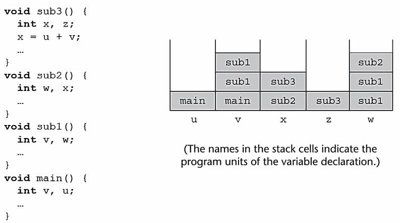  
Central Table이 이렇게 구현이된다.  

--- 

* 20日  

알고리즘

- 3강 점화식과 점근적 복잡도 분석  

점화식 : 어떤 함수를 자신보다 더 작은 변수에 대한 함수와의 관계로 표현한 것  

점근적 분석 방법  
반복대치 : 더 작은 문제에 대한 함수로 반복해서 대치해 나가는 해법  
추정 후 증명 : 견론을 추정하고 수학적 귀납법으로 이용하여 증명  
마스터 정리 : 형식에 맞는 점화식의 복잡도를 바로 알 수 있는 방법  

- 4강 정렬  

대부분 O(n²)과 O(nlogn) 사이의 시간 복잡도를 가진다.  

- 시간복잡도 Θ(n²)인 정렬  
	- 선택 정렬  
	```
	selectionSort(A[], n) {
		for last <- n downto 2 {
			A배열 중 가장 큰 수 찾는다.
			큰수 와 last와 swap
		}
	}
	```
	(n-1)+(n-2)+...+2+1 = Θ(n²) worst, average  

	- 버블 정렬  
	```
	bubbleSort(A[], n) {
		for last <- n downto 2
			for i <- 1 to last - 1
				if(A[i]>A[i+1]) then A[i], A[i+1] swap 
	}
	```
	(n-1)+(n-2)+...+2+1 = Θ(n²) worst, average

	- 삽입정렬  
	```
	insertionSort(A[], n) {
		for i <- 2 to n
			A[]배열의 적당한 자리에 A[i]을 삽입
	}
	```
	Worst : 1+2+...+(n-2)+(n-1) : Θ(n²)  
	Average : ½(1+2+...+(n-2)+(n-1)) : Θ(n²)  
	Best : Θ(n) (이미 정렬 된 경우)  

- 평균적으로 시간복잡도 Θ(nlogn)  
	- 병합정렬
	```
	mergeSort(A[],p,r) {
		if(p<r) then {
			q <- |(p+r)/2|;
			mergeSort(A,p,q);
			mergeSort(A,q+1,r);
			merge(A,p,q,r);
		}
	}
	merge(A[],p,q,r) {
		i = p; j = q+1; t= 1;
		while(i<=q && j <= r) {
			if(A[i]<=A[j]) then temp[t++] = A[i++];
			else temp[t++] = A[j++];
		}

		while(i<=q) temp[t++] = A[i++];
		while(i<=r) temp[t++] = A[j++];

		i = p; t = 1;
		while(i<=r) A[i++] = temp[t++];
	}
	```
	merge : O(n)
	mergeSort : O(logn)

	- 퀵정렬  
	```
	quickSort(A[],p,r) {
		if(p<r) then {
			q = partion(A,p,r);
			quickSort(A,p,q-1);
			quickSort(A,q+1,r);
		}
	}
	partition(A[],p,r) {
		x = A[r];
		i = p-1;
		for j <- p to r-1
			if(A[j]<=x) then swap(A[++i], A[i])
		swap(A[i+1], A[r])
		return i+1
	}
	```
	average : Θ(nlogn)
	worst : Θ(n²) (이미 정렬 된 경우)

	- 힙정렬
	```
	heapSort(A[], n) {
		buildHeap(A,n);
		for i <- downto 2 {
			swap(A[1], A[i]);
			heapify(A,1,i-1)
		}
	}
	buildHeap(A[],n) {
		for i <- n/2 downto 1
			heapify(A,i,n);
	}
	heapify(A[], k, n) {
		left = 2k; right 2k+1;
		if(right<=n) {
			if(A[left] < A[right])
				smaller = left;
			else
				smaller = right;

		}
		else if (left<=n) smaller = left;
		else return;
		if(A[smaller] < A[k]) {
			swap(A[k],A[smaller]);
			heapify(A, smaller, n);
		}
	}
	```
	worst : O(nlogn) buildHeap O(nlogn) heapify O(logn)

- Θ(n) 정렬
	하한선 Ω(nlogn)  
	특수한 성질 만족하면 Θ(n)정렬 가능

- 계수정렬(counting sort)  
```
countingSort(A,B,n) {
	for i = 1 to k
		C[i] = 0;
	for j = 1 to n
		C[A[j]]++;
	for i = 2 to k
		C[i] = C[i] + C[i-1];

	for j = n downto 1 {
		B[C[A[j]]] = A[j];
		C[A[j]]--;
	}
}
```


- 기수정렬(Radix Sort)
```
void radixSort(int n, int t) {
	queue<int> q[10];
	
	for (int i=1; i<=t; i++) {
		for (int j=1; j<=n; j++) {
			int d = digit(v[j], i);
			q[d].push(v[j]);
		}
		int p = 1;
		for (int j=0; j<=9; j++) {
			while(!q[j].empty()) {
				v[p++] = q[j].front();
				q[j].pop();
			}
		}
	}

	for (int i=1; i<=n; i++) {
		cout << v[i] << ' ';
	}
}
```
Θ(n)  

- **효율성 비교**  

|  Kind | Worst Case | Average Case |
|-----:|--------:|-------:|
| Selection Sort | n² | n² |
| Bubble Sort | n² | n² |
| Insertion Sort | n² | n² |
| Merge Sort | nlogn | nlogn |
| Quick Sort | n² | nlogn |
| Counting Sort | n | n |
| Radix Sort | n | n |
| Heap Sort | nlogn | nlogn |
Best Case인 경우 O(n)인 정렬 Insertion Sort, Counting Sort, Radix Sort  

- 6장 검색트리  

- 이진검색트리  
각 노드에 키 값은 하나씩 갖는다. 각 노드의 키 값은 모두 달라야 한다.  
최상위 레벨에 루트 노드가 있고, 각 노드는 최대 두개의 자식을 갖는다.  
임의의 노드의 키값은 자신의 왼쪽 부분 트리의 모든 키값보다 크고, 오른쪽 부분 트리의 키값보다 작다.  
탐색, 삽입, 삭제 시간복잡도 O(h)을 가진다.  
경사 이진트리의 경우에는 
검색의 시간복잡도는 O(n)이 된다.  
```
treeSearch(t, x) {
	if (t == NULL || key[t] == x) return t;
	if(x<key[t]) 
		return treeSearch(left[t],x);
	else
		return treeSearch(right[t],x);
}
```

삽입
```
treeInsert(t,x) {
	if(t==NULL) {
		key[r] = x;
		left[r] = NULL;
		right[r] = NULL;
		return r;
	}
	if (x<key(t)) {
		left[t] = treeInsert(left[t],x)
		return t;
	}
	else {
		right[t] = treeInsert(right[t],x);
		return t;
	}
		
}
```
삭제
1) r이 리프 노드인 경우
2) r의 자식 노드가 하나인 경우
3) r의 자식 노드가 두 개인 경우  

```
treeDelete(t, r, p) {
	if (r == t)
		root = deleteNode(t);
	else if(r == left[p])
		left[p] = deleteNode(r);
	else
		right[p] = deleteNode(r);
}

deleteNode(r) {
	if(left[r] == right[r] && right[r] == NULL) // 1)
		return NULL;

	else if(left[r] == NULL && right[r] != NULL) // 2-1)
		return right[r];
	else if(left[r] != NULL && right[r] == NULL) // 2-2)
		return left[r];
		
	else { // 3)
		whlie(left[s] != NULL) {
			parent = s;
			s = left[s];
		}
		key[r] = key[s];
		if (s == right[r])
			right[r] = right[s];
		else
			left[parent] = right[s];
		
		return r;
	}
}
```

- 레드블랙트리

1) 루트는 블랙이다
2) 모든 리프는 블랙이다
3) 노드가 레드이면 그 노드의 자식은 반드시 블랙이다
4) 루트 노드에서 임의의 리프 노드에 이르는 경로에서 만나는 블랙 노드의 수는 모두 같다  

C++의 STL map이 이러한 레드블랙트리로 구현되어 있다.  

치우쳐진 레드블랙트리라면 회전이 가능하다.  

삽입  
이진검색트리와의 삽입과 같지만 삽입 된 노드를 레드로 칠한다. 삽입된 노드의 색이 레드인 경우 문제가 생긴다.  
2가지 경우로 나누게되는데 부모노드의 형제노드가 레드거나 블랙일 경우로 나뉘게 된다.  

레드인 경우  
  

블랙이며, 삽입노드가 부모의 오른쪽 자식인 경우  
  
  

삭제  
삭제 노드의 자식이 없거나 1개만을 가진 노드로 제한  
삭제 노드가 블랙이라면 문제가 있다. 유일한 자식이 레드라면 문제가 없으나, 반대라면 문제가 있다.  

  
5가지 경우로 나뉘어진다.  

case 1)
  

case 2) 3)
  

case 4) 5)
  

- 8강 상호 배타적 집합의 처리  

disjoint sets  
연결리스트나 트리를 이용해서 표현 가능하다.  

연결리스트의 경우
| head link (a) | head link(a) | |
|:---:|:---:|:---:
| a |	b	| <-tail |
| link |	link	|
이런식으로 구현된다. head link에 대표 원소를 향해 연결이 되어있고 아래 link을 통해 다음 원소로 접근할 수 있다. 그리고 마지막 원소에 대해 tail포인터가 있어서 추가에 용이하게 사용될 수 있다.  
합집합시에는 집합의 크기가 작은 집합을 큰 집합에 붙이면서 집합의 원소들의 헤드링크를 큰 집합의 헤드링크로 바꿔주면 된다.  

수행시간  
m번의 Make-Set, Union, Find-set 중 n번이 Make-set이라면 시간복잡도 O(m + nlogn)이다. Make-set의 연산 횟수만큼 원소의 갯수가 정해지기 때문이다. Make-set O(1) & Find-set O(1) = O(m) Union은 집합의 갯수가 작아서 다른 집합에 계속 합집합 된다고 가정시에 계속 크기만큼 포인터의 갱신을 수행하기 때문에 최대 logn 만큼 실행한다.  

트리의 경우
트리의 루트가 집합의 대표 원소이며, 자식 노드가 부모 노드를 가리킨다. 또한 루트는 자신을 가리킨다.  
```
// p == 해당 노드의 parent
Make-set(node x) {
	p[x] = x;
}
Union(node x, node y) {
	p[Find-Set(y)] = Find-set(x);
}
Find-set(node x) {
	if x(x == p[x])
		return x;
	else
		Find-Set(p[x])
}
```
make-set은 트리의 루트로 정하며, Union은 두 집합을 합칠 때 랭크를 따져서 랭크가 작은 집합의 루트를 큰 집합의 루트로 연결한다. 하지만 같은 랭크 값을 가지는 경우에는 큰 집합의 랭크 값이 1 증가해야한다.  
```
Make-set(node x){
	p[x] = x;
	rank[x] = 0;
}
Union(node x, node y) {
	x_ = Find-Set(x);
	y_ = Find-Set(y);
	if(rank[x_] > rank[y_])
		p[y_] = x_;
	else {
		p[x_] = y_;
		if(rank[x_] == rank[y_])
			rank[y_]++;
	}
		
	
}
```
또한 경로압축을 할 수 있는데 이것은 Find-set 진행 중에 만나는 모든 노드들을 직접 루트를 가리키도록 포인터를 수정해준다.  
경로압축  
```
// p == 해당 노드의 parent
Find-Set(node x) {
	if(p[x] != x)
		p[x] = Find-Set(p[x]);
	return p[x];
}
```

트리를 이용한 배타적 집합에서 랭크를 이용한 union과 경로압축을 이용한 Find-Set을 동시에 사용하면, Make-Set, Union, Find-Set 중 n번이 Make-set일 때 시간복잡도는 O(mlog*n) `log*n` = min{k:logloglog...logn<=1} 사실상 선형시간임 따라서 O(m)정도 된다.

- 9장 동적 프로그래밍  

동적 프로그래밍의 적용 요건
- 최적 부분조건  
큰 문제의 최적 솔루션에 작은 문제의 최적 솔루션이 포함됨  
- 재귀호출시 중복  
재귀적 해법으로 풀면 같은 문제에 대한 재귀호출이 심하게 중복됨  

이 때 DP을 사용하면 해결된다.  

예시1 : 행렬 경로 문제  
```
for (int i=1; i<m; i++) {
	for (int j=0; j<=i; j++) {
		dp[0][i] += v[0][j];
	}
}
for (int i=1; i<n; i++) {
	for (int j=0; j<=i; j++) {
		dp[i][0] += v[j][0];
	}
}
for (int i=1; i<n; i++) {
	for (int j=1; j<m; j++) {
		matrixPath(i,j);
	}
}

matrixPath(int i, int j) {
	int a = dp[n-1][m] + v[n][m];
	int b = dp[n][m-1] + v[n][m];
	dp[n][m] = min(a,b);
}
```
시간복잡도 θ(n²)  


예시2 : 조약돌 놓기  
```
void pebble(int n) {
	for (int i=0; i<4; i++) {
		if(i==3) dp[i][0] = v[0][0] + v[2][0];
		else
			dp[i][0] = v[i][0];
	}
	for (int i=1; i<n; i++) {
		for (int j=0; j<4; j++) {
			if (j==0) dp[0][i] = max(dp[1][i-1], dp[2][i-1]) + v[j][i];
			else if (j==1) dp[1][i] = max(max(dp[0][i-1], dp[2][i-1]),dp[3][i-1]) + v[j][i];
			else if (j==2) dp[2][i] = max(dp[0][i-1], dp[1][i-1]) + v[j][i];
			else dp[3][i] = dp[1][i-1] + v[0][i] + v[2][i];
		}
	}
}
```
시간복잡도 θ(n)

예시3 : 행렬 곱셈 순서  
```
int MatrixMultiplication(int x, int y) {
	if (x==y) return 0;
	int& ref = dp[x][y];
	if (ref != -1) return ref;
	int temp = 987654321;
	for (int k=x; k<y; k++) {
		temp = min(temp, sol(x,k) + sol(k+1,y) + m[x].r * m[k].c * m[y].c);
	}
	return ref = temp;
}
```
시간복잡도 θ(n³)

예시4 : 최장 곹통 부분순서  
```
void lcs(int m, int n) {
	for (int i=0; i<m; i++) {
		dp[i][0] = 0;
	}
	for (int i=0; i<n; i++) {
		dp[0][i] = 0;
	}
	for (int i=1; i<m; i++) {
		for (int j=1; j<n; j++) {
			if(a[i] == b[j]) dp[i][j] = dp[i-1][j-1] + 1;
			else dp[i][j] = max(dp[i-1][j], dp[i][j-1]);
		}
	}
}
```
시간복잡도 θ(mn)

- 10강 그래프  

그래프 표현1 : 인접행렬  
NxN 행렬로 표현한다. 간선이 존재하면 행렬 원소를 가중치만큼 넣어준다. 방향이 존재한다면 [i][j] i->j라고 보면된다.  

그래프 표현2 : 인접리스트  
N개의 연결 리스트로 표현하며 i번째 리스트는 정점 i에 인접한 정점들을 리스트로 연결함.  
가중치가 있다면 리스트에 가중치를 별도로 보관한다.  

그래프 표현3 : 인접 배열  
N개의 연결 배열로 표현하며 i번째 배열은 정점 i에 인접한 정점들의 집합  
가중치가 있다면 리스트에 가중치를 별도로 보관한다.  
인접리스트와 비슷하나 처음에 리스트에 연결된 정점의 갯수와 배열의 연결링크를 단다. 배열들은 인접 정점의 숫자들의 집합이다.  
확장하자면 리스트의 연결된 정점의 갯수를 적는 것을 정점 목록의 끝자리를 적게 되면 인접배열을 하나의 배열로 구현하고 인덱싱을 편하게 할 수 있다.  

모든 정점 방문  

- 너비우선탐색  
큐를 통해서 구현. 말그대로 너비 탐색을 진행.  
시간복잡도 θ(|V|+|E|)
- 깊이우선탐색  
스택이나 재귀를 통해서 구현. 깊이로 들어가며, 백트래킹으로 확인.  
시간복잡도 θ(|V|+|E|)  

DFS와 BFS는 복습이 자주 되어서 생략.  

- 최소신장트리(MST)  
조건 : 무향 연결 그래프  
트리는 싸이클이 없는 연결 그래프이며 간선은 n-1개 갖는다.  

신장트리란 정점들과 간선들로만 구성된 트리이며, 최소신장트리는 간선의 합이 최소인 신장트리.  

- Prim 알고리즘  

그리디 알고리즘의 일종으로 최적해를 보장해준다.  
시작 정점을 집합 S에 포함시킨 상태로 시작한다. S에서 V-S를 연결하는 간선 중 최소길이를 찾아서 해당 정점을 S에 포함시킨다.
```
Prim(G, r) 
▷ G=(V, E): 주어진 그래프 
▷ r: 시작으로 삼을 정점 
{ 
         S ← Ф ;                      ▷ S : 정점 집합 
        for each u∈V 
                 du ← ∞ ; 
        dr ← 0 ; 
        while (S≠V){              ▷ n회 순환된다 
                 u ← extractMin(V-S, d) ;
                 S ← S ∪{u}; 
                for each v∈L(u) ▷ L(u) : u로부터 연결된 정점들의 집합 
                        if (v∈V-S and wuv< dv) then dv ←  wuv ;  
        } 
} 

extractMin(Q, d) 
{ 
        집합 Q에서 d값이 가장 작은 정점 u를 리턴한다 ;
} 
```
힙을 사용하기 때문이다. 힙의 시간복잡도 O(|V|),프림 알고리즘의 시간복잡도 O(|E|log|V|) 

- Kruskal 알고리즘 

시작하면 각각을 전부 집합으로 구성한다. 그 이후 간선을 정렬한다. 가장 작은 간선을 찾아 정점들의 집합을 하나로 합치고 간선을 신장트리에 추가한다. 이것을 반복한다. 고려해야할 점은 사이클이 생성되면 안된다. 따라서 간선을 연결할 때 같은 집합에 속해있는지 확인해야한다. 반복 끝에 신장트리의 갯수가 n-1개가 된다면 끝낸다.  
```
Kruskal (G, r)
{
	1. T ← Ф ; ▷ T : 신장트리 
	2. 단 하나의 정점만으로 이루어진 n 개의 집합을 초기화한다;
	3. 간선 집합 Q(=E)를 가중치가 작은 순으로 정렬한다;
	4. while (T의 간선수 < n-1) {
		Q에서 최소비용 간선 (u, v)를 제거한다;
		정점 u와 정점 v가 서로 다른 집합에 속하면 {		
			두 집합을 하나로 합친다;
			T ← T∪{(u, v)};
		}
	}
}
```
시간복잡도 O(ElogV)  

두 알고리즘의 안정성 정리  
프림은 집합 S안에 신장트리가 구성되어 있는데 V-S을 잇는 간선 중 가장 작은 가중치를 가진 간선을 집합 S에 추가하는 알고리즘이다.  
크루스칼 알고리즘은 현재 선택되지 않은 간선 중에 최소인 간선을 찾아 신장트리를 구성한다.  

모순으로 증명할 수 있다. 최소신장트리를 해당 알고리즘으로 만들 수 없다고 가정하고 진행 하였을 때 만들어진 신장트리와 해당 알고리즘으로 만들어진 신장트리를 비교하여서 증명할 수 있다.  

- 위상정렬  

싸이클이 없는 유향 그래프이며, 모든 정점을 일렬로 나열하는데 순서가 있다면 순서가 유지되어야한다.  
DFS로 끝까지가서 백트래킹으로 출력을 하면된다.

```
1)
topologicalSort1(G, v)
{ 
        for ← 1 to n { 
                진입간선이 없는 정점 u를 선택한다;      
                 A[i] ← u; 
                정점 u와, u의 진출간선을 모두 제거한다;  
        } 
        ▷ 이 시점에 배열 A[1…n]에는 정점들이 위상정렬되어 있다 
} 
2)
topologicalSort2(G) 
{ 
        for each v∈V
                  visited[v] ← NO; 
        for each v∈V   ▷ 정점의 순서는 무관 
                if (visited[v] = NO) then DFS-TS(v) ;                          
} 
DFS-TS(v)  
{ 
        visited[v] ← YES; 
        for each x∈L(v)   ▷ L(v): v의 인접 리스트 
                if (visited[x] = NO) then DFS-TS(x) ;  
        연결 리스트 R의 맨 앞에 정점 v를 삽입한다;   
} 

```
시간복잡도 θ(|V|+|E|)  

최단경로  
간선 가중치가 있는 유향 그래프  
두 정점 사이의 최단경로를 찾는데에 있어 간선 가중치의 합이 음인 사이클이 있다면 문제가 정의되지 않는다. 돌 때마다 비용이 줄어들기 때문이다.  

- dijkstra 알고리즘  

prim 알고리즘과 90% 유사하다고 볼 수 있다. 거기에 모든 간선의 가중치는 음수가 아니여야한다. 왜냐하면 현재 가장 작은 가중치을 찾아가는데 음수 가중치가 있다면 진행 중에 돌아가는게 비용이 덜 드는 것처럼 보일 수 있기 때문이다.  
```
Dijkstra(G, r) 
▷ G=(V, E): 주어진 그래프 
▷ r: 시작으로 삼을 정점 
{ 
         S ← Ф ;                      	▷ S : 정점 집합 
        for each u∈V 
                 d[u] ← ∞ ; 
        d[r] ← 0 ; 
        while (S≠V){              	▷ n회 순환된다 
                 u ← extractMin(V-S, d) ;
                 S ← S ∪{u}; 
                for each v∈L(u) 	▷ L(u) : u로부터 연결된 정점들의 집합 
                        if (v∈V-S and d[u] +w[u, v] < d[v] ) then {
			 d[v]  ←  d[u] + w[u, v];
			  prev[v]  ←  u;  
        } 
} 

extractMin(Q, d[]) 
{ 
        집합 Q에서 d값이 가장 작은 정점 u를 리턴한다 ;
} 
```
시간복잡도 O(|E|log|V|)

- Bellman-Ford 알고리즘  

음의 가중치를 허용하는 최소 간선 알고리즘이다. 음의 사이클을 존재 여부는 한번 더 돌렸을 때 값이 줄어든다면 음의 사이클이 존재하는 것이다. 두 개의 간선을 통해서 이동했을 때의 최소인 값으로 이완시킨다.  

```
BellmanFord(G, r)
{
	for each u∈V 
		 d[u]← ∞; 
	d[r] ← 0;
	for i ← 1 to |V|-1
		for each (u, v) ∈E
			if (d[u] + w[u, v] < d[v]v )  then {
				d[v] ← d[u] + w[u, v] ;
				prev[v] ← u;
			}
	▷ 음의 싸이클 존재 여부 확인
	for each (u, v) ∈E
		if (d[u] + w[u, v] < d[v]v )  output “해없음”;
}
```
시간복잡도 θ(|E||V|)
dp로 봤을 때 

- floyd 알고리즘  

```
k = 거쳐가는 노드 i = 출발 노드 j = 도착노드 
for (int k = 0; k< number; k++) {
	for (int i=0; i < number; i++) {
		for (int j=0; j < number; j++) {
			if(d[i][k] + d[k][j] < d[i][j]) {
				d[i][j] = d[i][k] + d[k][j];
			}
		}
	}
}
```
시간복잡도 θ(|V|³) 문제의 계산은 시간복잡도 θ(1)이다.  

- 사이클이 없는 유향 그래프  

DAG라고 하는데 이것의 최단경로는 선형시간에 구할 수 있다.  
```
DAG-ShortestPath(G, r) 
{ 
      for each u∈V                                        
		  du ← ∞; 
      dr  ← 0; 
      G의 정점들을 위상정렬한다;           
      for each u∈V (위상정렬 순서로)         
      	for each v∈L(u) ▷ L(u) : 정점 u로부터 연결된 정점들의 집합
			if (du + wu,v < dv ) then dv ← du + wu,v ;                    
} 
```
시간복잡도 O(|E| + |V|)

- 강연결요소 구하기  

DFS수행해서 종료된 순서를 구한다. 그 다음 종료된 순서가 가장 느린 정점에서 DFS을 다시 수행한다. 집합이 생기는데 이 집합에서 어떠한 정점을 잡더라도 경로를 통해서 한 정점에서 다른 정점으로 갈 수 있는 경로가 있다.  

```
stronglyConnectedComponent(G) 
{ 
       1. 그래프 G에 대해 DFS를 수행하여 각 정점 v의 완료시간 f [v] 를 계산한다. 
       2. G의  모든 간선들의 방향을 뒤집어 GR을 만든다. 
       3. DFS(GR)를 수행하되 1행에서 시작점을 택할 때  1.에서 구한 f[v]가 가장 큰 정점으로 잡는다. 
       4. 앞의 3에서 만들어진 분리된 트리들 각각을 강연결요소로 리턴한다.
} 
```
시간복잡도 O(|E| + |V|)  

증명 : 강연결요소에 있는 모든 두 정점은 같은 트리에 있어야한다.  

1) 분리된 트리 안에는 강연결요소의 모든 정점이 포함된다. 
2) 분리된 트리 내의 임의의 두 정점 사이에는 양방향 경로가 존재한다.  

두 조건이 서로 필요충분조건으로 쓰이면서 증명의 근거로 충분하다.  

- 13장 NP-완비  

* NP-완비  

[NP-완비](#NP-완비)

---

* 21日  

운영체제  

* 9강 CPU Synchronization 1

[CPU-Synchronization-1](./month/MAY#CPU-Synchronization-1)

* 10강 CPU Synchronization 2  

[CPU-Synchronization-2](./month/MAY#CPU-Synchronization-2)

* 11~12강 Main Memory

[Main-Memory](#Main-Memory)  

* 13강 Virtual Memory 1  

[Virtual-Memory-1](#Virtual-Memory-1)  

--- 

* 22日  

운영체제

오늘은 운영체제 이전 부분들을 다시 복습하고 가상 메모리를 이어서 공부했다.  

* 14강 Vurtual Memory 2  

Copy-on-Write  


두 개의 프로세스가 하나의 페이지를 공유할 때(같은 데이터를 공유할 때) 사용한다. Shared Memory와 다른 차이점은 OS가 프레임을 아끼기 위해서 사용한 것이다. 예를 들어서 C Library는 물리 메모리 상 하나인데 여러 프로세스가 Shared Memory하듯이 모두가 자기 테이블 안에 C Library를 참조해서 가져다가 사용한다. 항상 Read-Only일 때만 이렇게 사용할 수 있다.  
하지만 누가 수정을 해야하는 상황이 올 때 사용하는게 Copy-on-Write이다. 예를 들어서 Fork를 사용할 때 부모 프로세스와 자식 프로세스는 같은 데이터를 공유한다. Fork 당시에는 같은 데이터를 공유하므로 같은 물리 메모리를 링크하면서 프레임을 아끼다가, 자신 프로세스에서 해당 데이터 중 조금 수정한다면 아래의 그림과 같이 된다.  
  

따라서 목적은  
1) 페이지 프레임 아끼기 위함  
2) 카피를 안하기 위함 (메모리 접근을 최소화하기 위함 4B라고 가정시, 4B x 1024 x 2)  

Write 작업을 하지 않는다면, 페이지 프레임을 아끼며(용량), 카피를 안하면서 카피의 오버헤드를 안 줘서 성능을 높게 유지할 수 있다.  

Memory-Maapped Files
유저가 File을 사용하기 위해서는 OS의 File System을 거쳐서 하드웨어 (Storage)에 접근해서 사용하는 것이 일반적인 방법이다.  
Page fault나 Swapping할 때 Memory Management을 거쳐서 Stroage에 접근했다.  

Stroage 장치는 Magnetic tape으로 되어있어서 Sequential하게 접근하는게 일반적인 방법이다. 하지만 가끔은 Random하게 접근할 때가 있다. Random하게 접근한 경우 성능이 제대로 나오지 않는다. Memory Management을 거쳐서 Storage에 접근할 때는 Random하게 접근하는게 성능이 더 잘 나올 수 있었다.  

하지만 이러한 내용은 예전 이야기가 되어버렸다. 이제는 하드웨어의 발전으로 이러한 랜덤 액세스 때문에 Memory-Mapped을 사용한다는 것은 틀린 말이다.  

사용하는 이유는 Shared Memory을 위해서 라고 생각하면 된다.  

    

프로세스 A에서 고친 내용이 어느 순간이 disk file에 적용이 된다. 이때 오픈 대신에 mmap()으로 오픈하며, read, write가 아닌 값을 그냥 할당하거나 memset(), memcopy()로 메모리 값을 바꿀 수 있다.  
따라서 여러 프로세스들이 같은 파일에 대해서 공유해서 작업을 할때 Memory Mapped Files을 사용하면 **편리**하다. 원래는 동시에 접근하게되면 한 쪽은 읽기전용이 되지만 이 경우에는 공동작업이 편리하게 가능하다.

Allocating Kernel Memory  
커널 메모리는 물리적으로 Contiguous하게 될 필요가 있다. 그리고 다양한 크기의 구조체의 메모리를 필요로 한다.  
물리적으로 연속적으로 되어야 하는 이유는 I/O장치 때문이다. DMA (Direct Memory Access)가 OS 대신 I/O처리를 해준다. 이 때 DMA는 Virtual Memory을 모르고 Physical Memory로만 접근을 하기 때문에 연속적이여야 한다. 커널에서 물리 메모리에 크기만큼 연속적으로 복사해서 DMA에 넘겨준다. 이러한 작업을 줄이기 위해서 연속적으로 유지한다.  

Buddy System  
물리적으로 연속된 페이지들을 효율적으로 할당하기 위해서 사용하는 시스템이다. 연속적인 공간을 필요로 할 때 필요 공간보다 큰 제일 작은 2의 제곱수로 분할하게 되면 트리가 구성되는데 맨 왼쪽의 리프노드에서 할당해주고 남은 노드들을 연속적으로 유지한다. 
리눅스에서도 지금도 쓰이고 있다.  
  

Slab Allocation  
메모리 공간을 빠르게 이용하기 위해서 사용하는 기법이다. 메모리를 매번 할당해서 사용하지 않고 미리 여러 공간을 할당하여 사용하는 방법(Pooling)  
예시) PCB  

Slab Allocation은 Pooling을 이용한 방법  
    

Cache을 다 쓰기 전에 Cache의 크기를 조금씩 먼저 늘린다. 할당과 해지는 시간이 걸리기 때문에 빈번히 일어나는 소프트웨어의 경우 Kernel object을 먼저 할당 받아 놓고 사용하는게 overhead을 줄일 수 있는 방법이다.  

추가적으로, 소프트웨어 시간이 많이 걸리는 구간  
1) I/O
2) Memory Copy  
3) Dynamic Memory Allocation  

추가적인 Issue  
Program Structure  
극단적인 예지만 쉽게 이해할 수 있는 예시다.  
`int data [128][128]`이며, 각각의 row가 저장되는 한 페이지의 크기는 512B라고 가정 후 두 가지 프로그램이 있다고 한다.  
  

1) 
```
for (j = 0; j < 128; j++)
	for (i = 0; i < 128; i++)
		data[i][j] = 0;
```
128 x 128 = 16,384 page faults  
페이지의 크기가 512이기 때문에 가로로 접근하며, 127개 적재 후 128번 째 다시 0번 col 적재할려하면 page replacement가 일어나서 page fault가 반복된다.  
2)  
```
for (i = 0; i < 128; i++)
	for (j = 0; j < 128; j++)
		data[i][j] = 0;
```
128 page faults  

C Compiler가 Page을 수직으로 할당하기 떄문에 이차원 배열에 있어서 `2)`와 같이 접근하는게 훨씬 속도가 빠르다. 그러므로 C를 사용함에 있어서 `1)`과 사용할 때는 page fault가 일어나 속도가 느릴 수 있다.  

---  

* 23日 ~ 29日 기말고사 준비로 인한 복습  

23日 프로그래밍언어론  
24日 프로그래밍언어론, 알고리즘  
25日 알고리즘, 컴파일러  
26日 운영체제  

--- 

* 27日  

운영체제 과제 : 리눅스 CPU 스케쥴러를 분석하고 만들어보기  
리눅스 CPU 스케쥴러를 수정해보고 LKM을 이용하여 나만의 CPU 스케쥴러를 만들어서 사용도 해보았다. 이 내용에서 더하여 기존에 존재하는 FIFO, Round Robin, Weight Round Robin을 구현해야한다. 여기서 사용 되는 자료구조인 list에 대해 공부를 했다. 리눅스 커널에서는 list_head라는 구조체로 사용하고 있는데 여기에는 단지 double linked list라는 점을 가지는 변수 next와 prev밖에 없었다. 하지만 여러 자료구조에서 list_head을 사용하기 때문에 여러 방식으로 활용이 되는 다재다능한 자료구조였다.  
  
이러한 방식은 많이 본 double linked list라서 쉽게 이해했다.  
  
하지만 이렇게 object을 넣어서 사용하는 double linked list의 경우 처음 보는거라 이해할 시간이 필요 했다.  

list_head는 Linux/include/linux/list.h 경로에 위치해서 정의 되어있다. 여러가지 함수를 사용하여 활용할 수 있는데, 그때 주로 사용하는 함수들이 static inline int list_empty(const struct list_head *head), static inline void list_add(struct list_head *new, struct list_head *head), static inline void list_add_tail(struct list_head *new, struct list_head *head), static inline void list_del(struct list_head *entry), static inline void list_del_init
(struct list_head *entry) 이렇게 존재 한다.  
empty 확인 함수, list add 함수 두 가지와 list del 함수 두 가지를 크게 볼 수 있었다.  

list_head을 가지고 FIFO을 직접 구현하기 위해 선행과제였던 부분을 가지고 Pick_next_task 함수와 Euqueue, Dequeue 하는 함수들을 확인하고 구현할 생각이다.  

---  

- 28日  

운영체제 과제  
list_head을 가지고 구현하는 RT 스케쥴러 중 FIFO을 구현해보았다. enqueue와 dequeue, pick_next_task 함수만을 고쳐서 구현하여 프로세스가 끝나야 다른 프로세스가 수행되도록 구현했다.  

데이터통신  

이번 학기는 주로 인터넷 5계층 중 1계층과 2계층인 Physical 계층과 Data Link계층에 집중적으로 배운다.  

- 1장 Overview of Data Communcations and Networking  

**데이터의 방향과 흐름**  
- Simplex : 단방향  
- Half-duplex : 반이중 통신  
- Full-duplex : 전이중 통신  

네트워크 물리적구조  
연결 타입  
- Point-to-point  
  
- Multipoint  
  

**토폴리지 종류**  
- Mesh  
  
n(n-1)/2개의 물리적 채널을 갖는다.  
장점 : Traffic 문제가 없으며 한 링크가 망가져도 통신 가능  
단점 : Cost높음
- Star  
  
HUB에 연결되서 사용됨  
장점 : mesh에 비해 적은 비용, 상대적으로 안정적
- Bus  
  
메인 케이블(Backbone)에 연결하는 MultiPoint 연결방식  
장점 : 쉬운 설치  
단점 : 문제 발생 시 수정 어려움  
- Ring  
  
Point-to-Point방식 연결  

토폴리지 방식들의 특징, 주요한 점만 파악하자  

네트워크 카테고리  
개념 이해 필요
- LAN  캠퍼스, 사무실, 빌딩    
이더넷으로 대체함  
  
multiple-building-LAN의 추상화  
- MAN  도시  
- WAN  지역  

Protocol : 규칙의 집합  

De jure standards : 기관에서 정함  
De facto standards : 비중을 통해서 정함  

- 2장 Network Models  

각각의 Layer에서는 Low Layer에서 일어나는 일들에 관심이 없다.  

- 5-Layer Internet model  

|          |
|-----------|
| Application |
| Transport |
| Network |
| Data link |
| Physical |  
  

Peer-to-peer  
  
Physical Layer는 직접적으로 연결하며 데이터를 변환해서 사용한다.  

  
구체적인 통신의 표현  

Layer 기능  

Physical Layer : 이웃  node에게 Signal 전달  
(**bit을 signal로 변환**해서 전달)  
Bit-to-signal transformation  
Bit-rate control  
Bit-synchronization  
Multiplexing  
Switching  

Data link Layer : **Next-hop delivery** - **한 노드에서 다음 노드로 Frame을 전달**  
Ethernet기반으로 흐름제어, 오류제어, 접근제어 존재  
  
  
Packetizing  
Media access control  
Addressing  
Flow control  
Error control  


Network Layer : **end-to-end**(종단간 전송 Source to Destination) Ip -> Ip까지 전송함 따라서 global address 필요  
  

Transport Layer : **Process-to-process**이며, Port Addressing을 한다.  end-to-end에 있어서의 흐름제어와 오류제어를 한다.  
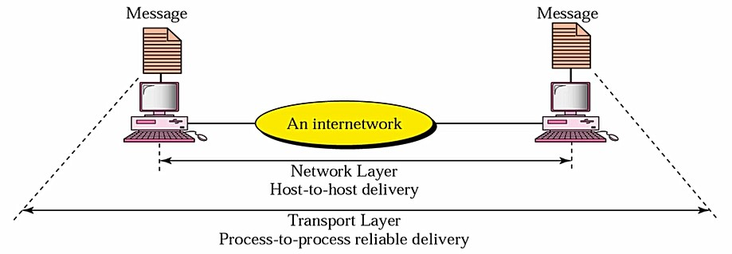  

Application Layer : 전자우편, 파일 전송, 원격, WWW같은 유저에게 서비스를 제공하기위한 Layer  

요약 :  
  

- 3강 Signals  

Analog Signal : 무한한 숫자의 값을 가짐  
주기적인 Signal을 사용  
주기와 주파수는 역의 관계  
사인파 그래프에서의 주기와 주파수 관계 알아보기  
하나의 사인파 그래프는 유용하지 않다. 하지만 진폭이나 위상, 주파수를 바꾸면 유용해진다. 즉, 복합신호로 사용할 수 있다. Fourie analysis에 의하면 임의의 신호는 여러 사인파를 조합하면 구할 수 있다. 또, 반대로 분할이 가능하다.  

Square wave : 여러 사인파(harmonic)를 합치게 되면 직사각형 신호와 비슷하게 나온다.  

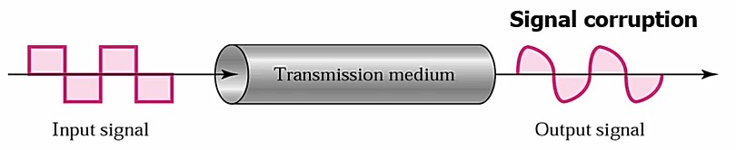  
**Bandwidth** : medium이 통과시킬 수 있는 주파수의 범위(signal의 절반이상을 통과 시키는 경우, highest - lowest)  
medium의 bandwidth와 signal의 bandwidth가 일치 할 수록 데이터의 손실이 줄어든다.  

Digital bandwidth (bps)  
- Maximum bit rate  

Annalog bandwidth (hz)  
- range of frequencies  

Digital Signal : 유한한 숫자의 값을 가짐  
비주기적인 Signal을 사용  
Bit interval : single bit을 보낼 때 시간  
Bit rate : 1초간 bit interval 몇 개 나오는 정도  
Wide-Bandwidth Medium을 사용해야함  

bandwidth에 한계가 있을 때 bps의 숫자와 최소 필요 bandwidth가 만족되면 디지털 데이터를 보낼 수 있다.  
**Nyquist Theorem** : 채널 오류 고려하지 않은 상태에서 이론적인 한계  
**Shannon Capacity** : 오류(노이즈)를 고려한 한계  

1개의 harmonic일 때의 bps와 필요한 BandWidth  
최소한의 **bandwidth B = n/2이다.(Shannon capacity)**  
여러개의 harmonic일 때의 bps와 필요한 Bandwidth  
**bandwidth B >= n/2 or n <= 2B(Nyquist theorem)**  

bit rate와 bandwidth는 서로 비례한다.  

Low-pass : 일정 주파수 밑으로 다 통과시킴 (디지털 전송)  
band-pass : 일정 주파수 범위만 통과 시킴 (아날로그 전송)  

디지털 전송  
low-pass channel이 필요하다. 선을 독점하거나 시간을 나눠서 독점하는 제한된 환경에서만 사용가능하다.  

아날로그 전송  
band-pass channel을 대부분 사용한다. low-pass channel은 제한적이며, low-pass channel을 band-pass channel로 나눠서 각각 사용할 수 있다.  

**Data rate limits**  
- the bandwidth available  
- the levels of signals we can use  
- the quality of the channel(the level of the noise)  
noise 없으면 Nyquist 있으면 Shannon channel 사용  

Nyquist bit rate  
노이즈가 없는 채널에서 bps을 구하면 2 x bandwidth x log₂L (L : number of signal levels)  

Shannon capacity bps  
노이즈가 있는 채널에서 bps을 구하면 bandwidth x log₂(1 + SNR) (SNR = signal-to-noise ratio : signal의 power/noise의 power)  

문제 중 B/W와 SNR이 주어졌을 때 bit rate와 signal level을 구하는 문제에 있어서 Shannon capacity로 bps을 구하고 Nyquist로 그 식으로 signal level을 구하되 오류를 고려해주기 위해 level을 1을 뺀다.  

**Transmission Impairment** (전송 장애 3가지)
Attenuation - 약화  
저항에 의한 열 에너지로 변해서 손실난 부분을 amplifier(증폭기)를 통해 복구 dB = 10log(P₂/P₁)을 통해서 양수면 증폭, 음수면 약화  
Decibel을 위의 식처럼 사용하는데 만약 Point-to-point에서 여러 point사이의 증픅과 약화를 알아 볼 수 있으며, dB계산이 쉽다.  

Distortion - 왜곡  
Composite signal(복합 시그널)에서 생길 수 있는 시그널의 모양이 변하는 것이다. 분해 후 Medium 통과 후 합성 하는 경우 왜곡 생김  

Noise  
온도, 유도, crosstalk (선 꼬기. 자기장 야기), 번개, 고압선 등에 의해서 생길 수 있다.

- 4강 Digital Transimission  

Line coding  
Binary data를 Digital signal로 변환하는 과정  
Signal level, data level  
  

Line coding schemes
1) Unipolar  
한극성을 이용하며 가장 간단하며 기초적이다. 하지만 요즘엔 사용하지 않는다.  
voltage는 하나로, 1 : a voltage level, 0 : zero voltage level  
두 가지 문제점이 존재한다. DC component가 있으며, 동기화가 부족하다.  

2) Polar  
양극성을 이용하며, 여전히 동기화 문제가 존재한다.  
Polar가 4가지 종류로 나뉘어진다. 
	1) NRZ (Nonreturn to Zero)  
	zero voltage을 갖지 않으며 양 혹은 음의 수를 갖는다.  
	- NRZ-L(Level)  
		0 : positive  
		1 : negative  
		동기화 문제가 여전히 존재  
	- NRZ-I(invert)  
		1 : voltage level을 역으로 바꿈  
		0 : voltage 변화 x  
		NRZ-L보다는 동기화가 발전했다.  
	  

	2) RZ (Return to Zero)  
	동기화 문제를 해결하기 위해 생긴 방법으로, 각 비트에 있어서 Signal change bit을 둔다. 3가지 value을 갖되 zero는 동기화를 위한 value이다.  
	1 : positive-to-zero  
	0 : negative-to-zero  
	효율적인 동기화가 가능하나, 시간이 낭비된다.  

	3) Manchester  
	0 : positive-to-negative  
	1 : negative-to-positive  
	RZ와 비슷하나, value 중 zero가 없음  
	  
	4) Differential Manchester  
	0 : additional transition  
	1 : no transition  
	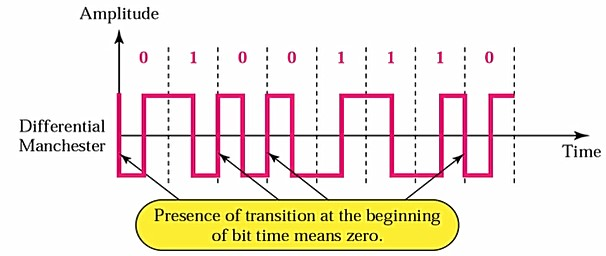  
	장점 : 1이 들어오면 한번 바뀐다.  

3) Bipolar  
3 voltage level 사용한다.  
0 : zero level  
1 : alternating positve and negative voltages  
AMI(alternate mark inversion)  
많이 사용하는 bipolar encoding 방식으로 0이 들어오면 zero level을 사용하지만 1이면 처음엔 positive으로 시작해서 1이 들어올 때 마다negative 반복해서 바뀐다.  
단점 : 0이 계속 들어오면 동기화에 문제가 생긴다.  

pulse : symbol을 전송하는데 필요한 시간  
pulse rate : 1초당 일어난 pulse  
Bit rate = pulse rate * log₂L (L : number of data levels)  

DC components  
적합하지 않은 이유가 두 가지가 있다. 장비를 통과할 때 오류가 있을 수 있다. 부가적인 에너지로 쓸모가 없다.  

Self-synchronization (동기화문제)  
receiver의 bit interval이 정확하지 않으면 문제가 생길 수 있다.
  
동기 시스템은 sender와 receiver clock을 맞추고, 비동기 시스템은 signal에 해당 정보가 필요하다.  

Block coding  
line coding이 동기화 문제가 있거나 (NRZ에서 0이나 1이 연속된 경우) bandwidth가 절반만 쓰인다.(RZ 계속 0으로 바뀌어 B/W 절반쓰임)  
이러한 문제를 해겷하기 위해 block으로 보낸다는 생각이다. 먼저 m bit 그룹들로 나눈다. 그 다음 m bit 그룹들을 n bit 그룹들로 또 나눈다. 이러한 방식들은 연속적인 1과 0을 없앤다. 그다음 line coding해서 전송한다.  
대표적인 방법 4B/5B으로, 4bit을 5bit으로 바꿔줘야하는데 16개 중 32개에 매핑해주며, 안 쓰인 16개는 버린다. 매핑해주는 방법은 연속된 1이나 0이 3개 이상인 경우는 사용하지 않는다.  
  
4B/5B 방법은 시작 부분에 0으로 시작하고 끝 부분이 0이 두개 이상 나오는 경우가 Worst case이다. 따라서 0이 3개 초과해서 나오지 않는다.  NRZ-I가 이 방법을 사용하며, Bandwidth가 20% 더 필요하다는 단점이 있다. Fast Ethernet이 이 방법을 사용한다.  
8B/10B느 방법은 4B/5B와 비슷하지만 오류가 더 적으므로 Gigabit Ethernet에서 쓰인다.  
8B/6T 방법은 앞에서의 방법과는 달리 bandwidth를 낭비하지 않지만 level을 더 쓴다. 8 bit 그룹을 6 symbol code로 바꾼다. signal level이 3개로 2^8 -> 3^6개로 늘어난다.

**Sampling**  
analog data를 digital data로 바꿔서 digital전송을 한다.  
PAM(Pulse Amplitude Modulation)  
analog signal을 sampling하여 digital전송함  
PCM(Pulse Code Modulation)  
PAM을 기반으로 하나, Quantization(양자화 - 노이즈가 강해짐)를 통해서 Binary data로 바꾼다. PAM -> Quantization -> binary encoding -> line coding  
Sign magnitude사용해서 Binar encoding 한다. Block coding 후 Line coding (NRZ-L)을 한다.  
  

Sampling rate : Nyquist theorem  
**반드시 origianl signal의 가장 높은 주파수 두배 이상이 되어야한다.**  

sample당 bit의 갯수는 Bit = ┌log₂N┐ N : level  

bit rate = sampling rate * number of bits per sample  

Parallel and serial 전송  
Serial 방식은 동기(sender, reciver같은 clock), 비동기(다른 clock) 방식으로 나뉜다.  
Parallel 전송은 속도가 빠르나 Cost(선 갯수)가 많이 들며, 거리가 짧다.(동시에 보내서 동시에 받으므로 동기화 문제 때문)  
Parallel과 serial은 서로 변환 가능  
Serial 전송은 먼저 conversion으로 데이터를 직렬화 시킨 후 전송하고 다시 conversion으로 데이터를 병렬화시킨다.  

비동기화 전송은 공통된 시간을 사용하지 않으며 Sender와 Receiver사이의 약속이 있다. Start bit(0)와 Stop bit(1)으로 구별한다. Parallel와 동기 전송보다는 느리지만 가격이 싸고 효율적이다. 예로 키보드 연결할 때 쓰인다.  
동기화 전송은 공통 시간을 맞춰야 한다. byte간의 gap이 없으므로 속도가 빠르다. 동기화의 타이밍을 맞추는 것이 가장 중요하다.  

- 5강 Analog Transmission  

Modulation of digital data  
Binary data -> band-pass  
low-pass analog signal -> analog signal  
Analog signal 특징 3가지  
진폭 주파수 위상  

bit rate  
1초에 전송되는 bits  
Baud rate  
1초당 Signal units, bit rate와 같거나 작다.  

Carrier signal  
아날로그 전송할 때 정보를 싣게 되는 기반이 되는 주파수 대역. Carrier signal을 진폭이나 주파수를 조절할지 고른다. 

**ASK(Amplitude Shift Keying)**  
Carrier signal의 amplitude을 올렸다가 내렸다 하므로, Noise에 약하다는 단점이 있다. Bandwidth = (1 + d) * N_baud (d : modulation preocess)  
**baud rate == bit rate**  
  
진폭을 기준으로 한다.  
  
bandwidth = N_baud  

**FSK (Frequency Shift Keying)**  
Carrier signal의 주파수를 바꾸므로 Noise의 문제가 없다. 좋은 주파수 대역이 정해져 있다.  
**baud rate == bit rate**  
  
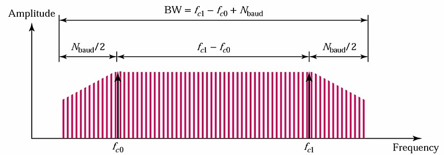
Bandwidth = f_c1 - f_c0 + N_baud  
Bandwidth가 많이 필요하다.  

**PSK (Phase Shift Keying)**  
Carrier signal의 위상을 바꾼다. 0 : zero 1 : inverse  
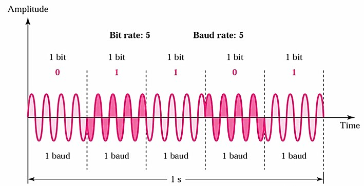  
PSK의 특징은 noise에 강하며, Bandwidth가 많이 필요하지 않아 ASK랑 같다.  
bit 수를 늘린 2-PSK는 ASK와 bit rate가 같지만 4-PSK, 8-PSK는 2bit, 3bit로 늘어난다.  
bandwidth = N_baud (ASK의 Bandwidth와 같다.)
4-PSK (Q-PSK)  
  
| Dibit | Phase |
|-------|-------|
| 00 | 0 |
| 01 | 90 |
| 10 | 180 |
| 11 | 270 |  

QAM (Quadraturer Amplitude modulation)  
ASK와 PSK을 조합해서 사용한다. Bandwidth가 ASK와 PSK와 같다. 하지만 ASK에서 Noise 문제가 발생할 수 있다.  
4-QAM, 8-QAM  
  
여러 방식이 가능하다. Bit rate는 Baud rate에 bit수를 곱해주면 된다.  
| Modulation | Units | Bits/Baud | Baud rate | Bit Rate |
|-------|-------|-------|-------|-------|
| ASK,FSK,2-PSK | Bit | 1 | N | N |
| 4-PSK,4-QAM | Dibit | 2 | N | 2N |
| 8-PSK, 8-QAM | Tribit | 3 | N | 3N |  

AM (Amplitude Modulation)  
Bandwidth = Bandwidth(minimum)의 2배  
주어진 Modulating singal을 Carrier frequency을 기준으로 Amplitude을 Modulation한다. 따라서 Noise에 약하다.  
AM baud는 붙어서 할당되어 가끔 서로 겹치기도 한다.  
FM (Frequency Modulation)  
Bandwidth = AM의 Bandwidth의 5배 = Bandwidth(minimum)의 10배  
AM와 같이 하되 Frequency을 Modulation하므로 Noise 문제가 생기지 않는다.  
FM baud는 간섭을 막을려고 서로 띄어 놓는다.  

--- 

* 29日  

데이터통신  

- 6강 Multiplexing  

**문제위주 보기**  
Multiplexer(MUX) : 여러개의 선을 한 선으로 모아주는 것  
Demultiplexer(DEMUX) : 한 선을 여러 개로 나눠주는 것  
FDM(analog)  
Carrier frequency을 기준으로 Analog multiplexing으로 signals을 compine한다.  
Guard band : 사이사이 띄어놓기  

WDM  
FDM과 동일하되 빛의 파장을 이용해서 장비가 다르다.  

TDM(Time Division multiplex, digital)  
전체 대역폭을 각각에게 할당을 해주나, 시간마다 할당되는 선이 다르다. Wide band을 한 커넥션에 연결한다. FDM과 비교하면 FDM은 주파수를 쪼개서 사용하므로 작은 주파수 대역으로 전송한다.  
Frame들의 크기는 다 동일하며, 전송 프레임들을 모은 것을 time slot(base time)이라 하며, 하나당 T sec가 필요하다고 한다.  
link의 data rate는 시간 n만큼 빨라지며, unit의 duration은 시간 n만큼 짧아진다.  
Interleaving은 개념적인 부분으로, 그림으로 이해를 한다. frame 간격을 벌려서 Sender와 Receiver가 동기화하여 돌아간다.  
  

동기화  
동기 : clock 사용  
비동기 : signal 사용  
MUX와 DEMUX사이의 동기화는 비동기 방식으로 한다. 1-bit framing bit을 1과 0을 계속 바꿔가며 한다. 그러므로 frame 사이즈가 1늘어나야한다.  

Inverse TDM  
TDM을 반대로 여러 개의 라인을 하나의 빠른 속도의 라인으로 모아주는 것이다.  

- 7강 Transmission Media  

Guided Media
Twisted-pair cable  
꼬아놓은 한 쌍의 케이블로, Noise가 생기면 같이 꼬인 케이블이 동시에 생기므로 서로의 difference가 일정하여 Noise 문제에 대해 좋아진다.  
UTP STP Metal shield의 차이로, 성능과 가격차이가 난다.  

Coaxial cable (동축케이블)  
Twisted-pair 보다 높은 주파수의 범위를 가진다. 케이블 TV에 이용  

Unguided Media  
주파수에 따라서 용도가 정해져있다.
Ground propagation  
지상을 통해서 반사시키며, 거리에 따라 세기가 다르다.  
저주파에 쓰인다.
Sky propagation  
대기중을 통해서 반사시킨다. 넓은 거리에 약한 세기로 보낸다.  
Ground보다 비교적 고주파에 쓰인다.  
Line-of-sight propagation  
시야에 보이는 쪽으로 직선으로 쏴서 초고주파에 사용한다. 안테나같이 사용한다.  

Radio waves  
3Khz to 1GHz band  
Omnidirectional(전체방향)에 sky propagation으로 먼 거리에 보낸다.(multicast) 저속으로 대역폭이 낮아 벽을 통과할 수 있다. 예를 들어 AM, FM 라디오, TV, 삐삐 등에서 쓴다.  

Microwaves
1 to 300Ghz  
Unidirectional(단방향)으로 지향성이므로 안테나를 사용한다. 먼 거리도 계속 연결하여 통신이 가능하다. 하지만 주파수가 높아 벽을 통과 할 수 없다. 사용 예시는 셀룰러 폰, 위성 네트워크, 무선 랜에서 사용한다.  

Infrared  
300Ghz to 400THz  
너무 높은 고주파로 침투를 못한다. 태양빛이 있다면 사용할 수 없어서 고속의 근거리 통신에 사용된다. 키보드, 마우스, PC, printer, 리모컨같은데에서 사용된다.  

- 8강 Circuit Switching and Telephone Network  

Circuit Switching  
  
서킷 생성 후 통신하는 방식으로 
N-by-M Switch(input N, output M)와 N-by-n folded Switch(input, output N) 입력과 출력의 차이를 두고 나뉘어진다. 이 때 두가지 기술이 있다. Space-division switch와 Time-division swtich가 있다.  

Space-division switch  
공간적으로 분리된 경로를 제공하는 방법이다. 아날로그와 디지털 네트워크에서 설계될 수 있다.  
Crossbar Switch  
Grid형식으로 만들어서 스위치 방식으로 원하는 목적지로 가게한다. 연결성은 가장 좋으나 효율이 떨어진다. 
Blocking이 제일 좋다.  
Multistage switch  
예제를 통해서 모양과 작동만 이해하자  
  
single stage라면 15x15개가 필요하나, 위의 그림처럼 만들게 된다면 줄일 수 있다. 그리고 잘 구성한다면 Crossbar Switch만큼의 Blocking에 근사할 수 있다.  

Time-division Switch  
Time-divsiion multiplexing(TDM)  
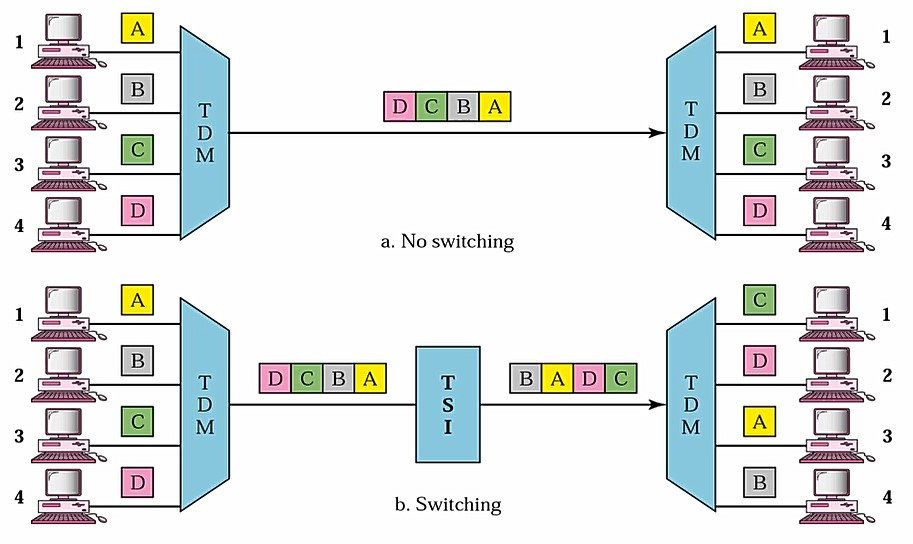  
TSI에서 1<->3, 2<->4으로 매칭해주며, RAM에서 저장 후 매칭하기 때문에 delay가 존재한다.  
TDM bus  
TDM과 TDM bus와는 구조차이만 있을 뿐 기능 차이는 별로 없다. 가운데 버스를 둬서 스위칭 개념으로 매칭한다.  

Space and time-divsion switch 조합  
Stage을 나눠서 조합할 수 있다. 두 개의 특징을 정리하면 Space-division은 지연이 없으며 비용이 많이 든다. Time-division은 지연이 있으나 비용이 덜 든다. 따라서 두 타입을 잘 조합하면 지연과 가격을 최소로 할 수 있다.  

- 9강 High-Speed Digital Access: DSL, Cable Modem, and SONET  

ADSL  
전화선을 이용하며 거리 축소하며 속도가 증가한다. 길이에 따라 속도가 다르며 음성영역과 데이터 영역을 분리해서 동시 사용 가능하다. Downlink는 빠르지만 Uplink는 느리게 구현되어있다. 유저의 입장에서는 전화선은 그대로지만 DSLAM을 달아서 사용해야한다. void 0번 idle 1~5번 data 6~255번  

SDSL 대칭적으로 uplink와 downlink에 제공  

Cable modem  
초기의 유선 TV망은 방송국에서 가정으로만 데이터를 보낼 수 있었다. (One-way Communication)  
이후에는 장비를 바꿔서 HFC(Hybrid fiber-coaxial network) network로 바뀌었다. 이 때 양방향으로 통신이 가능하다 (Two-way Communication) 이론적 downstream의 속도는 30Mbps이다. upstream은 12Mbps이다. 쉐어링하므로 느려질 수 있다.  

SONET  
Backbone망에서 사용되는 망으로 광케이블 망이다. Fiber to the home(FTTH)로 요즘에 광케이블을 집으로 가지고 오는 방식을 추진하고 있다.  
광섬유 케이블을 가지고 통신을 하며, TDM시스템으로 master clock을 가진 방식이다. 일정단위로 대역폭을 제공한다.  

- 10강 **Error Detection and Correction**  

Single-bit error  
serial 전송에서 자주 일어나며, parallel에서도 가끔 일어난다.  
Burst error  
2개 이상 bit 오류, 연속일 필요가 없다. Length of burst : 처음 깨진 부분부터 마지막에 깨진 부분까지 전부  

Redundancy  
Parity check  
홀짝체크하는 방법  
모든 싱글에러를 체크 할 수 있으며, 버스트에러에서는 홀수개의 비트가 바뀐 경우만 체크할 수 있다.  
2-D Partiy check  
2차원으로 row와 column의 홀짝을 맞춰서 bit을 만들어준다. 1차원의 Partiy check에서 못 찾는 버스트 에러같은 부분을 찾을 수 있으나, 정확히 같은 위치에 에러가 난다면 찾지 못한다.  

Cyclic redundancy check(CRC)  
가장 강력하며, 널리 사용된다. 이진법을 나누기를 하여 사용한다.  
Sender에서는 CRC generator가 있으며, Reciver에서는 CRC checker가 있다.  

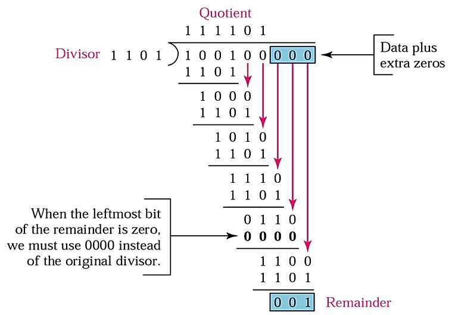  

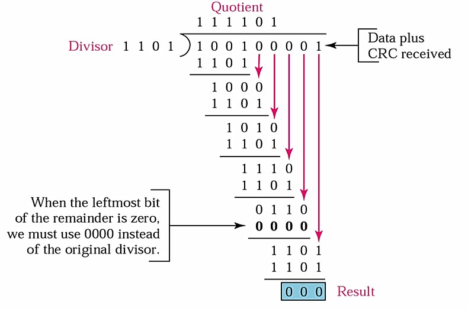  

Polynomials는 2가지 조건을 만족해야한다. 1. **x로 나누어지면 안된다.**(모든 버스트 에러를 체크할 수 있다.) 2. **x+1로는 나누어져야한다.**(홀수갯수의 버스트 에러를 체크할 수 있다.)  
이러한 조건을 만족할 때의 Performance는 모든 Burst Error에서 홀수개의 숫자가 바뀐 경우 다 찾아낸다. degree of polynomial보다 낮거나 같은 Burst Error들은 다 찾아낸다. 짝수의 Burst Error도 높은 확률로 찾아낸다.  

CheckSum  
CRC보다 속도가 빠르지만 검출 능력이 떨어진다. 하드웨어를 간단히 구현할 때 사용한다. n bit 단위로 쪼갠 다음 1의 보수로 합한다. 원본과 보수를 더했을 때 0이 나오면 정상, 아니면 오류가 난 것이다.  
Parity < Checksum < CRC  

Error Correction  
Forward error correction (FEC)  
해밍코드로 몇번째 bit가 깨졌는지 알아 낼 수 있다.  
  

- 11강 Data Link Control and Protocols  

Flow Control  
받는 사람의 buffer가 안 넘치게 함

Error Contorl  
오류시에 계속 재전송  

Stop-and-Wait ARQ  
Sender에서 Frame을 전송하고 Receiver는 받은 다음 ACK로 원하는 Frame을 요청하게 된다.Time-out을 둬서 답장이 안 오게 되면 재전송을 하며, 중복으로 받게되면 버리고 다시 ACK으로 요청하게 된다.  
Piggybacking  
Frame에 ACK bit을 둬서 overhead을 최소화 하는 방법이다. 

Go-Back-N ARQ  
n bit을 할당한 경우 Frame의 갯수는 0~2ⁿ-1  
sender **window size < 2ⁿ** 여야 성립된다. receiver window size는 1이여야 한다.  

Selective-Repeat ARQ  
ACK와 NAK을 둘 다 사용하며 Receiver의 Window size가 달라진다. 두 Window Size가 2ⁿ/2가 된다.  

- 12강 Point-to-Point Access: PPP  

학술적으로 이야기할 것이 없다.  

- 13강 Multiple Access  

Random access  
Node사이의 충돌을 허용하며, 충돌을 해결하기 위한 이슈가 있다.  
Multiple access (MA)  
ALOHA Protocol  
충돌이 일어나면 **backoff**한다.  
**Carrier-sense multiple access**(CSMA)  
캐리어를 확인해서 전송 중이라면 기다린다. Packet 전송 전에 확인 후 전송하는 방식으로 충돌이 일어나기도 한다. 그 이유는 동시에 전송하거나 확인 할 때 delay가 존재 할 수 있기 때문이다. Persistence strategy을 사용해서 최대한 충돌을 줄인다.  
Persistence strategies  
앞의 상태가 뒤에 영향을 받는 것이다. p-persistent하면 p의 확률로 전송한다.  
Nonpersistent  
앞과 뒤가 독립적이라서 영향을 받지 않는다. Idle인 경우 즉시 보내고 Busy인 경우 랜덤한 시간을 기다린다.
**CSMA/CD** (collision detection)  
충돌 시에 전송을 취소한다. 충돌이 일어나지 않는다면 성공적인 전달이며, 충돌이 일어난다면 전송을 취소하고 재전송 할 때 **exponential backoff**을 통해서 충돌을 줄인다.(0~2ⁿ-1 중 하나의 시간을 골라서 진행)  
실제로는 프로토콜로 관리하지만 충돌이 일어나지 않는다. (full-duplex스위칭 허브)  
CSMA/CA (collision avoidance)  
무선환경에서는 충돌을 발견 못하기 때문에 충돌을 회피할 방법을 찾는다. Persistence strategy을 사용한다. Idle line을 많이 넣어서 간격을 줘서 충돌을 피한다.  

Channelization  
공유 가능한 Bandwidth을 시간이나, 공간, 코드로 나누는 것이다.  
FDMA  
유저마다 주파수를 나눠져서 그 채널로 Multiple access 방법이다.  
TDMA  
채널은 한개로, time slot으로 나눈다.  
**CDMA**  
FDMA + TDMA로 한 채널에 동시에 전송이 가능하다. 주파수를 나누지 않고 대역폭을 자유롭게 사용할 수 있다.  
encoding rule :  
data bit 0 -> -1  
data bit 1 -> +1
silence -> 0  

CDMA Multiplexer  
  
  


* 14강 Local Area networks: Ethernet  

Bridged Ethernet  
이더넷을 공유해서 사용하면 충돌이 일어나지만 bridge을 둬서 collision을 나누게 되면 collision domain 끼리는 충돌이 일어나지 않는다.  

Switched Ethernet : N-porr bridge를 부르는 말  
Full-duplex Ethernet : 전송과 수신간의 Colilision이 일어나지 않는다.

- 15강 Wireless LANs  

IEEE 802.11  
2가지 mode  
ad hoc : 단말기 끼리 통신  
AP : Access Pointer을 통해서 통신  
ESS : AP와 AP두개이상  
BSS : AP한개  

CSMA/CA를 사용한다.  
CSMA/CD을 사용하지 않는 이유  
1) 데이터를 받고 보내고 동시에 일어날려면 cost가 더 든다.  
2) hidden terminal의 존재로 항상 충돌을 찾지 못한다.  
3) signal이 멀리 있으면 신호가 약해져서 끝이 충돌하는 것을 찾기 어려워진다.  

Hidden terminal problem  
장애물이 존재하는 경우 다른 signal을 찾지 못해서 충돌이 일어나는지 모르는 상황이 Hidden terminal이라고 한다.  

CSMA/CA의 핵심  
RTS CTS 컨트롤 패킷을 만들어서 RTS에 시간 정보를 담아서 보낸다. 받은 다른 노드들이 그 시간 동안 데이터를 보내지 않는다.(Network Allocation Vector) 따라서 충돌이 회피된다.  
  

Bluetooth  
무선 LAN으로 고안되었으며, ad hoc network으로 구성되어있다. 2가지 타입으로 나눠진다.  
Piconets  
Master와 Slave관계로 사용된다. 최대 8개 ex) Pc와 주변기기들  
Scatternet  
Piconets을 연결한 방법. 연결된 한가지가 gateway 역할로 master이자 다른 Piconet의 Slave 역할을 할 수 있다.  

- 16강 Connecting LANs, Backbone Networks, and Virtual LANs  

장비와 장비를 연결할 때 사용하는 장비  
Physical : Repeater or hub  
Data link : Bridge or two-layer switch  
Network : Router or three-layer switch  

Repeater : 물리계층에서 신호 연장, 복원 역할하는 장비  

Hub : dummy hub, switching hub  
dummy hub : multi-port repeater 물리계층에서 사용됨  
switching hub : 모양은 같으나, 내부구조가 완전 다름. Data link계층 장비이다.(Bridge)  
  
bridge : Data link 계층 장비로, repeater와는 달리 패킷을 읽어보고 정함  
Transparent bridges  
각 station이 bridge가 있는지 몰라도 됨  
3가지 조건  
1. 다른 station으로 forward됨  
2. 자동으로 forwarding table이 만들어져야한다.  
3. Loop가 형성되면 안된다.  

Spanning tree를 만든다. 이것은 물리적으로 존재하는 loop를 없앨 수 있다.

Virtual LANs  
다른 LAN에 존재해도 가상 LAN을 구성하여 Broadcast시에 해당 V-LAN에만 보낼 수 있다.  

- 17장 Cellular Telephone And Satellite Networks  

Frequency Reuse Principle  
Reuse factor of n  
주파수를 n개로 나눔  
n이 클수록 사용 가능한 주파수의 대역이 줄어들며, 주파수 n개로 나누어서 사용할 수 있다.  

Satellite Network  
GPS = 위성 3개로 찍어서 3개의 원의 접점 구함  

---
