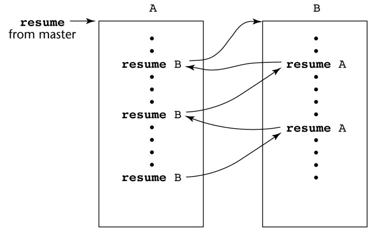

# 📙 Today I Learned  
## 규칙  
* 기억에 남는 내용 기록  
* 1일 2개의 알고리즘 문제 해결  
* markdown으로 작성  
  
---  
[5월](./month/MAY)  
---  
  
## 6월  
* 1日  

컴파일러 LR Parser 구현 중 Follow와 First을 과제의 조건에 맞춰서 변경해보았다. 추가적으로 공백, tap공백, 구분자(||), 생성규칙의 ==> 까지 토큰으로 잘 나눴다.
```
input grammar
E==>E+T
E==>T
T==>T*F||F
F==>(E)
F==>id

file.open("input.txt");
if(file.is_open()) {
	while(!file.eof()) {
   		string str, temp;
   		getline(file,str);
		bool flag = false;
		for (int i=0; i<str.length(); i++) {
			if(str[i] == ' ' || str[i] == '\t' || str[i] == '\v') { // tab exception
				str = str.substr(0,i) + str.substr(i+1);
			}
		}
		for (int i=4; i<str.length(); i++) {
			if(str[i] == 'i' && str[i+1] == 'd') { // id -> i
				str = str.substr(0,i+1) + str.substr(i+2);
			}
			
			else if(str[i] == '|') { // || separator
				temp = str[0];
				temp += "==>" + str.substr(i+2);
				
				str = str.substr(0,i);
				production[cnt++] = str;
				production[cnt++] = temp;
				flag = true;
				break;
			}
		}
		if(!flag) {
			production[cnt++] = str;
		}
	}
}
file.close();
```
탭이나 공백문자가 들어오면 그 부분을 무시하고 다 붙여서 토큰으로 나누었고 구분자가 들어왔을 때는 두 개의 생성규칙처럼 저장했다. ex) T==>T*F||F   --> T==>T*F  와 T==>F로 두 개의 생성 규칙으로 저장하였다.  
그리고 다음 과정으로 넘어가기 위해 SLR Parsing을 공부하는데 생각보다 긴 시간이 걸린다. 다음에는 LR(0) 아이템을 구해서 파싱 테이블을 짜보도록 해야겠다.  

---

* 2日  

알고리즘에서 쓰이는 문자열 검색에 대해 공부했다. [참조](https://otrodevym.tistory.com/entry/%EC%95%8C%EA%B3%A0%EB%A6%AC%EC%A6%98%EB%AC%B8%EC%9E%90%EC%97%B4-%EA%B2%80%EC%83%89%EA%B3%A0%EC%A7%80%EC%8B%9D%ED%95%9C-%EA%B2%80%EC%83%89-%EB%9D%BC%EB%B9%88%EC%B9%B4%ED%94%84-KMP-%EB%B3%B4%EC%9D%B4%EC%96%B4%EB%AC%B4%EC%96%B4)  
1) Native Matching 알고리즘  
2) **Rabin-Karp** 알고리즘  
3) **KMP** 알고리즘  
4) **Boyer-Moore** 알고리즘  

먼저 `Native Matching 알고리즘`은 찾고자하는 문자열과 주어진 문자열을 하나하나 비교하면서 처음부터 끝까지 확인하는 방식이다. 최악의 경우 시간복잡도 O((n-m)m)이 걸린다. 하나하나 일일이 검사하므로 작은 문자열이라면 시도할만 하다. 하지만 대부분이 큰 문자열이 주어지므로 최대한 피하자.  

두번째론 `라빈-카프` 알고리즘이 있다. 이 알고리즘은 해시를 이용하여 해시끼리 비교하는 알고리즘이다. 먼저 찾으려는 문자열의 해시값을 구하고 주어진 문자열에서 찾으려는 문자열의 크기만큼 잡고 해시값을 구해서 비교해가며 찾으면 된다. 하지만 문자열이 매우 커질 수록 충돌이 일어날 가능성이 커진다고 한다. (약 1억자리 이상)  
그리고 반복되며 찾을 때마다 아래처럼 이용하면 된다. 시간복잡도는 평균적으로 O(n+m)이다.  
  

세번째론 `KMP` 알고리즘이 있다. 이 알고리즘은 접두사와 접미사에 대해 알아야한다. 예를 들어서 ABCAB란 문장이 있다하자.  
접두사는 A, AB, ABC, ABCB, ABCBA  
접미사는 B, BA, BAC, BACB, BACBA 이다.  
즉, 앞에서 자르기 시작한 것과 뒤에서 자르기 시작한 것의 차이이다.  
이제 pi라는 배열을 만들어 줄건데 pi란 배열은 접두사와 접미사가 같은 경우를 조건으로 두고 그 단어를 pi라는 배열에 넣는 것이다. 왜냐 불필요한 부분을 넘기고 그 전에 찾을 문자열이 포함되었는지 확인 해야하기 때문이다. 만약, 무작정 인덱스 크기를 잡고 넘기게 되면 그 넘어간 인덱스 중에 찾아야할 문자열의 일부가 있을 수 있기 때문이다. 시간복잡도는 O(n+m)이다.  
```
KMP(A[ ], P[ ]) 
{ 
	preprocessing(P); 
	i  ← 1;  ▷ 본문 문자열 포인터 
	j  ← 1;  ▷ 패턴 문자열 포인터 
	▷ n: 배열 A[ ]의 길이, m: 배열 P[ ]의 길이 
	while (i ≤ n) {                                 
		if (j = 0 or A[i] = P[j]) 
			then { i++;  j++; }           
			else  j ← π [j];
		if (j = m+1) then { 
               	A[i-m]에서 매치되었음을 알림; 
                	j ← π [j];                     
		}  
	} 
} 

preprocessing(P) 
{ 
	i  ← 1;  ▷ 본문 문자열 포인터 
	k  ← 1;  ▷ 패턴 문자열 포인터 
	while (j ≤ m) {                                 
		if (k = 0 or A[j] = P[k]) 
			then { j++;  k++; π [j] ← k; }           
			else  k ← π [k];
		if (j = m+1) then { 
               	A[i-m]에서 매치되었음을 알림; 
                	j ← π [j];                     
		}  
	} 
}
```

마지막으로, `보이어-무어` 알고리즘인데, 이 알고리즘은 이해하기 어렵다. [참조pdf](http://www.cs.jhu.edu/~langmea/resources/lecture_notes/boyer_moore.pdf) 이 곳을 통해 그림으로 이해를 돕고자 한다.
  [보이어-무어 계산](https://personal.utdallas.edu/~besp/demo/John2010/boyer-moore.htm)   
KMP 알고리즘과 비슷한 개념을 가지고 있다. 최대한 많이 건너뛰면서 비교를 하는 것이다. 하지만 다른 알고리즘과 다른 부분은 오른쪽에서 왼쪽으로 문자열을 비교한다. 물론 이동은 왼쪽에서 오른쪽으로 한다. 이 알고리즘이 대부분의 프로그램의 문자열 검색 방법으로 사용되고 있다.  
오른쪽 끝의 문자가 일치 하지 않고 주어진 문자에 찾아야하는 문자가 존재하지 않으면 패턴 길이만큼 이동한다.  
불일치가 발생하면 최대의 효율을 내는 두가지 방법 중 고른다.  
1) 나쁜 문자 이동 (Bad Character Shift)  
2) 착한 접미부 이동 (Good Suffix Shift)  
	- 나쁜 문자 이동은 (나쁜 문자란, 본문 문자 중 패턴과 일치 하지 않은 문자)
		* 패턴의 오른쪽부터 비교해서 불일치 지점 찾기.  
		* 본문의 불일치 지점 문자와 일치하는 패턴의 가장 오른쪽 지점만큼 이동 시킨다.  
	- 착한 접미부 이동은 (착한 접미부란, 본문 문자 중 패턴의 접미부와 일치하는 문자)  
		* 첫번째 경우엔 착한 접미부와 동일한 문자가 왼쪽 문자열중 존재
		* 두번째 경우엔 패턴에 착한 접미부가 없지만 접두부가 이리하는 경우 KMP와 비슷  
  
테이블도 만들어봐야 하나 이해가 상당히 부족하므로, 많은 포스팅을 참고하고 여러 강의자료로 공부가 더 필요하다는 것을 느꼈다.  

---

* 3日  

SLR Parsing Table을 만들기 위한 공부를 계속 이어갔다. 그 중 LR(0) 아이템을 만드는 부분에서 큰 오류가 발생했다. 
I0부터 만들었을 때 정확히 만들어지긴 하나, 그 이상까지 루프가 돌아 오류가 나거나 틀린 답을 뱉어나는 오류이다. 해결하기 위해 하루종일 붙잡았으나, 아직도 해결하지 못했다.  
```
for(int i=0;i<state_count;i++) {
    	characters[20] = {};
        for(int z=0;z<I[i].prod_count;z++) {
            if(!in_array(characters,mark_symbol(I[i].prod[z]))) // mark symbol이 없으면 넣어주기 
        		characters[strlen(characters)] = mark_symbol(I[i].prod[z]);
		}


        for(int j=0;j<strlen(characters);j++){
            goto_state(&I[i],&I[state_count],characters[j]); // characters가 I[i]의 mark symbol이라면 I[i]의 dot을 한칸 옮기고 I[state_count]에 저장 
            closure(&init,&I[state_count]);	//closure 계산 
            int flag=0;
            for(int k=0;k<state_count-1;k++){
                if(same_state(&I[k],&I[state_count])){ // 같은 state를 갖나 
                    cleanup_prods(&I[state_count]); // I[state_count] 초기화 
					flag = 1;
                    cout<<"I"<<i<<" on reading the symbol "<<characters[j]<<" goes to I"<<k<<".\n";
                    goto_table[i][k]=characters[j]; // goto_table에 등록 
                    break;
                }
            }
            if(!flag){ // 같은 state을 갖지 않은 경우 
                //cout<<"I"<<i<<" on reading the symbol "<<characters[j]<<" goes to I"<<state_count<<":\n";
                goto_table[i][state_count]=characters[j]; // goto 테이블 마지막에 추가 
                print_prods(&I[state_count]); // print 
                state_count++;
            }
        }
    }
```
흐름을 파악하고 계속 수정해나갔으나, 무엇이 문제인지 찾았으면 좋겠다. 😩😩  

---

* 4日  

OS 수업 중 Main Memory에 대해 공부를 하였다.  
메모리에 프로세스를 할당할 때, 메모리를 관리하는 내용이라고 볼 수 있다.  
  
처음에는 메모리에 연속되게 할당을 하였으나, 여러가지 이슈가 생기면서 새로운 방법을 찾아갔다.  
Memory Management에 두 가지 Focus에 맞춰서 볼 예정이다.  
1) Utilization : 물리 메모리를 얼마나 아껴쓰는지  
	- `Fragmentation`  
		+ *External Fragmentation* : 필요한 메모리만큼 비어있는 메모리가 존재하나, 연속적이지 않은 경우  
		+ *Internal Fragmentation* : 필요한 메모리보다 더 많은 메모리를 할당하고 남은 부분을 사용하지 않은 경우  
2) Performance : 메모리 접근 속도가 얼마나 빠른지  
	- Address translation (logical to physical), swapping  
		+ `Swapping` : Memory -> Disk, Disk -> Memory로 적합한 순서로 재배열하는 기법이다.  
  


메모리 관리 기법 또한, 두 가지로 나눠서 볼 수 있다.  
1) Segmentation  
2) Paging  

*Segment*란 우리가 프로그래밍을 할 때 사용되는 여러가지 논리적 단위로, 예를 들어 `main program` `procedure` `function` `method` 등을 말할 수 있다. 교수님께서는 의미있는 조각이라고 말하셔서 꽤 직관적으로 이해가 되었다.  
Segmentation은 논리적주소로 이루어진 2개의 tuple로 구성되어 있다고 할 수 있는데 그 모양은 이렇다.  
`<segment-number,offset>` segment-number에는 adress space 즉 주소공간을 의미하고 offset은 논리적 주소로 보았을 때 위치를 말한다.  
또, Segment table을 갖는데 `base`와 `limit`을 갖게 된다 base는 물리메모리상에서 시작하는 주소고 limit은 segment의 길이라고 생각하면 된다. 예를 들어 [segment-number][2] 이러한 Segment table이 있다면 [0][0] -> limit, [0][1] -> base를 뜻한다.  
  
구체적인 Segmentation의 모양을 그림으로 나타낸 것이다.  
또 하나의 특징은 Segmentation은 프로그래머가 직접 정하므로 OS의 컨트롤 밖에 위치한다. 그래서 이러한 부분을 다 고려해서 코딩을 하는 프로그래머는 거의 없다고 하셨다.  

Focus를 맞췄던 Utilization과 Performance에 대해 이야기해보자.  
먼저 Utilization은 이전에 Contiguous보다는 좋아졌다. 왜냐 segment단위로 나누게 되어 external Fragmentation이 좋아졌기 때문이다. 하지만 Performance의 측면에서는 낮아졌다. Address translation의 측면에서는 Segmentation 하드웨어를 보면 메모리 주소에 두번 접근하기 때문이다. 이러한 Trade-off을 갖는데 어떻게 보면 Swapping에 입장에서 보면 이미 할당된 메모리를 segment단위로 나눠서 자리를 재배열해 다른 메모리가 할당하도록 자리를 내주게 되면 훨씬 속도가 빠른 경우도 있지만 그것은 특정한 경우에만 가능하다.  

그 다음으론 *Paging*이다. Paging은 모든 메모리 공간을 page 단위로 쪼갠다고 생각하면 된다. 바로 Utilization과 Performance에 대한 결과를 보고 그 이유에 대해 알아보자.  
page단위로 쪼개기 때문에 external Fragmentation은 아예 일어나지 않고 internal Fragmentation 또한 최소화 할 수 있다. 따라서 Utilization은 향상한다. 하지만 Segmentation과 같이 Performance에서는 Address translation은 떨어지고 Swapping은 좀 더 좋아 질 수 있다.  
  
Paging의 논리적인 모델을 살펴보면 이러하다. 논리 메모리에서 page table을 거쳐 물리메모리로 매칭되는 방식이다.  
  
Paging의 하드웨어를 그림으로 보여주고 있다. 이 그림과 같이 PTBR(Page-table base register)에 Page table이 존재해서 CPU가 Memory에 두 번 접근한다. 먼저 page table에 접근 후 물리 메모리에 접근을 한다. 그리고 Segment에는 limit이 존재했으나, Page에는 limit이 존재하지 않는다.  
또 Free Frames에 대해 적어보면 이 List는 OS가 가지고 운영하며, 밑에 사진과 같다.  
  
할당 해제시에는 `Free-Frame list` 아무데나 넣어준다. 왜냐하면 물리 메모리는 어느 곳에 어떻게 접근해도 성능과 특성이 같기 때문이다.  
Swapping에 대해 잠깐 얘기하면 `Page-in`, `Page-out`에 대해 얘기하면  
	+ Page in : Disk로 내려갔던 Page 하나를 물리 메모리 공간에 할당한다.  
	+ Page out : 물리 메모리 공간 확보를 위해 Page Frame하나를 Disk에 Swap한다.  
Page 하나의 사이즈는 4KB이며,  32bit OS에서 한 프로세스의 Page table의 크기는 4MB이다. Page Table을 그림으로 보았을 때 저렇게 생겼었지만 제대로 확인하게 되면 아래와 같다.  
  

오늘은 절반만 공부했으나 다음에 전부 공부해볼 생각이다.  

---

* 6日  

하루를 쉬고 다시 공부를 시작하였다. 오늘은 저번에 공부했던 OS시간에서의 Memory에 대해 더 공부하였다.  
주로 공부한 부분은 `TLB`와 `Hierarchical Page Tables`이다. 어려운 개념이면서도 중요하니 다시 기록을 해볼려고 한다.  
두 개념 다 `Paging`기법에서 문제점을 해결하기 위해 사용한다. 먼저 TLb는 Address Translation으로 인한 속도 저하 문제 즉, Performance 측면에서 해결하기 위해 사용되고, Hierarchical Page Tables는 Utilization 측면에서 Page table의 크기가 너무 커지는 문제를 해결하기 위해 사용된다.  
먼저 TLB에 대해 알아보면, Translation Look-aside Buffers의 약자로 Cache의 일종으로 생각하면 이해하기 좋다. Paging에서의 Frame number와 Page number을 쌍으로 저장하여 Cache와 같은 역할을 하는 버퍼이다. Parallel Search을 하게 되어 도잇에 Page number, Frame number 쌍에 동시에 다 접근해서 원하는 Page Number을 통해 Frame Number을 접근하는데 이때, 어떤 number에 접근해도 O(1)으로 시간복잡도가 일정하다. 예전에 공부했던 Context Switch에서의 Overhead중 하나인 TLB Flush가 여기서 일어나게 되는데 프로세스 A의 Page, Frame number 쌍을 저장해놨다가 프로세스 B로 Context Switch한 경우 버퍼를 다 비우고 다시 채우게 된다. Cache 개념으로 처음에 채워지는 쌍들은 모두 Miss이기 때문에 Overhead가 따르게 된다.  이 부분을 생각해서 `Tagged TLB`개념이 나오는데 이 개념은 PID와 비슷한 ASID를 TLB에 둬서 각각의 숫자쌍이 어떤 프로세스의 것인지 표기하는 것이다. 이때는 TLB Flush을 하지 않아서 A -> B -> A로 Context Switch 되었을 때 버퍼에 A의 것이 하나라도 남아있다면 Hit을 해서 속도를 올리겠다는 개념이다. 하지만 버퍼에 공간을 하나 추가한다는 것은 돈이 많이 들어 사용하지 않는다고 하였다.  
이러한 문제를 배우고 다른 특징을 또 배웠는데 그것은 Locality 즉 지역성이다. for loop에 의해서 계속 메모리를 참조하게 되면 근처 지역에서 벗어나지 않고 비슷한 공간을 계속 참조하는 특성을 가지고 있다. 따라서 Hit확률이 거의 90%라고 할 수 있다고 한다. 이러한 특징때문에 TLB는 아직도 사용하고 있으므로 중요하다고 한다. 다음으론 그림으로 설명을 도운다.  
  
이러한 추상도를 그릴 수 있다. TLB는 MMU에 붙어있는 장치인데, 위 그림에서 TLB Hit되어 물리메모리의 접근하는 부분이 MMU의 역할이라고 볼 수 있다. 따라서 Hit가 이뤄질 경우 MMU안에서 다 해결이 된다는 말로 속도가 빠르다. 그리고 위에서 말한 것과 같이 TLB에 동시에 접근하는 것을 볼 수 있다. 중요한 것은 TLB miss와 TLB에 동시에 접근해서 TLB에 있으면 miss 부분을 버리고 TLB에 없으면 바로 miss부분에 진입해서 물리메모리에 접근한다는 것이 중요하다고 강조하셨다.  
Effective Access Time(EAT) = TLB access time + Hit case + Miss case (α = hit ratio, t = Access time for TLB, m = Access time for memory)  
= t + α * m + 2 * m * (1-α)  이때의 2는 Page table과 Memory에 접근하는 시간이다.  
contiguous했을 때 100ns로 접근한다고 했을 때 Paging에서 Hit ratio가 매우 높다면 메모리 접근을 아무리 많이해도 Overhead가 크게 차이가 나지 않아서 Paging을 비로서 사용할 수 있다. 메모리 접근을 많이 해도 상관없다는게 포인트로, 다음에 설명할 Hierarchical Page Tables와 연관이 깊다.  
여러가지 Page table의 구조가 있는데 Page 각각의 사이즈가 4KB로 Entry을 다 고려하면 4MB의 공간을 잡아 먹게 된다. 이 용량을 줄이기 위해  
- Hierarchical Paging  
- Hashed Page Tables  
- Inverted Page Tables  

이렇게 세 가지가 있으나 Hierarchical Paging을 제외하고는 단점이 존재해서 중심으로 다룰 것은 Hierarchical Paging이다.  
개념은 Page Table들을 Paging해서 차지하는 공간을 드라마틱하게 줄인다는 것이다. 바로 수업에서 이해한 그림을 보게되면  
  
과정들을 다 생략하고 이해한 그림이다. Logical Address Space에서 0x0000 0000 중 0x0000 0|000으로 나뉘어서 앞의 5개는 Page number, 뒤에 3개는 Offset을 의미한다. 0x0000 0000은 Page Table의 0번의 0으로 indexing하여 접근하게 된다. Level 1의 Page table은 4KB을 차지하고 Frame number로 5000, 5001, 5002을 가지고 있다. 이 Frame number는 물리 주소공간에서 마지막에 연속적이지 않은 Page Table을 구성할 때 사용된다. 그리고 또 4 KB이므로 level 2로 연결 될 때 인덱싱해온 주소에 맞춰서 1024을 곱해서 찾아간다. Level 2에서는 마찬가지로 주어진 Number로 물리 주소공간에 연결을 한다.  
이렇게 다 연결하고 보면 이전에는 4MB를 차지한 반면에 지금은 고작 3 + 3 + 1 page로 7page로 완성을 하였다. 드라마틱하게 공간이 줄어든 것을 볼 수 있었다.  

공부한 부분 중 핵심을 꼽은 것은 다 정리했으나, 이제 자잘한 부분은 넘어갔으니 짚고 넘어가보자.  
Page table에 Valid bit을 둬서 Frame number가 값이 어떤 것이 들어있을 때 이 값의 유효성을 체크해준다. v와 i로 valid와 invalid를 체크해주며 valid할 때만 접근을 허용한다.  

Share Pages은 프로세스끼리 같은 물리 주소공간에 접근할 수 있게 같은 frame, page number 쌍을 갖게 하는 것이다. 이 때 프로세스 별로 접근권한을 둬서 권한 밖의 행동을 하게 되면 MMU가 제지하고 종료시키도록 할 수 있다.  

아까 그냥 넘긴 Hashed와 Inverted Page Table에 대해 짧게 말해보면 Hashed는 똑같이 Hashing 기법을 통해서 접근하게 만드는 것이다. 단점으로는 원하는 테이블을 찾기 위해서 값을 계속 연결되어 찾아가야한다는 점이 있다. 이걸 개선하기 위해 page을 더 두게 되면 위에서 한 Hierarchical Paging와 같게된다. Inverted은 말 그대로 Page number -> Frame number얻어 오던 Paging에서 반대로 Frame number -> Page number을 얻게 하는 방식이다. 이 방식은 pid을 두고 찾을 수 있으나, 선형탐색을 통해서 인덱싱을 해야하므로 Overhead가 분명하게 존재한다. 따라서 이러한 방법들은 잘 사용되지 않는다.  


OS외에 공부한 부분은 PL강의에서 들은 Closure와 Coroutines이다.  
`Closure`은 Subprogram과 referencing environment 둘 다 부르는 말로 쓰인다고 하였다. 와닿지 않은 말이지만 예제를 통해서 보여주셨다. JavaScript에서의 Closure는 
```
function makeAdder(x) {
	return function (y) { return x + y ;}
}
...
var add10 = makeAdder(10);
var add5 = makeAdder(5);
document.write("add 10 to 20: " + add10(20) + "<br />");
document.write("add 5 to 20: " + add5(20) + "<br />");
```
을 통해서 `function (y) { return x + y ;}`이 Closure인 지 알게 되었다.  

`Coroutine`은 그림으로 보면 확실히 이해가 되었다. quasi-concurrent execution으로 quasi 동시 실행 이라고 하는데 자세히는 모르겠다. 이 Coroutine을 Call하는 것은 `resume`이라고 부른다.  
  

PL수업은 지금까지 배워온 프로그램밍 언어들을 왜 그렇게 써왔는가에 대해 배우는 것 같고 모르는 언어들의 특성들을 배우는 것을 재밌게 듣고 있다. 다른 수업들에 비해 부담감이 적어서 그런거 일지 모르겠지만 내용 정리와 이해가 잘 되고 있어서 좋다.  

---

* 7日  

오늘은 주말이라, 문제로 풀어보는 알고리즘 (파란색) 책을 읽어보고 공부를 하였다. 다른 전공 공부로 힘들었던 몇 주간을 쉬어주기 위해 천천히 읽어보았다. 초반엔 아는 내용이 나와서 제대로 숙지되었는가 생각하며 읽어가는 도중 기억에 남기고 싶은 내용들을 적어볼려고 한다.  

**수분할**은 자연수 n을 순서에 상관 없이 하나 이상의 자연수의 합으로 나타내는 방법이다. 그 중 일반적인 방법으로는 n/m 수분할이다. 이 방법은 n을 m이하의 자연수로만 나타내는 방법이다. 예를 들어  5/2 수분할은  
```
1+1+1+1+1  
2+1+1+1  
2+2+1  
```
이렇게 된다. 이러한 n/m 수분할은 재귀적으로 생각할 수 있는데, 재귀적으로 생각하게 된다면 5/2 수분할에서 `1+` 와 `2+`로 시작하는 부분 두 가지로 나눌 수 있다.  
```
1) 1로 시작   
1+1+1+1+1

2) 2로 시작
2+1+1+1  
2+2+1  
```
`1+` 뒤에 나오는 `1+1+1+1`은 4/1 수분할과 같고, `2+`뒤에 나오는 `1+1+1, 2+1`은 3/2 수분할의 두가지 이다. 따라서 이끌어낼 수 있는 점화식은 아래와 같다.  
```
partition(0,m) = 1
if n>0 then, partition(n,m) = ∑(i=1 ~ m) partition(n-i,i)
```
이러한 내용을 토대로 C언어로 함수를 작성하면,  

```
int partition(int n, int m) {
	int cnt = 0, i;
	if (n < m) m=n;
	if (n == 0) return 1;
	for (i=1; i<=m; i++)
		cnt += partition(n-i, i);
	return cnt;
}
```
이러한 함수가 만들어진다. 하지만 중복계산이 계속 생겨서 효율적이지 못한 코드가 된다. 이 함수를 메모이제이션을 이용해서 바꾸어보자.  

```
#define MAX 200
int memo[MAX][MAX];
int partition(int n, int m) {
	int cnt = 0, i;
	if (n < m) m=n;
	if (memo[n][m] > 0) return memo[n][m];
	if (n == 0) return memo[n][m] = 1;
	for (i=1; i<=m; i++)
		cnt += partition(n-i, i);
	return memo[n][m] = cnt;
}
```
memo 배열에서 값이 0이라면 값이 계산된 적이 없기에 함수를 실행하고 그외의 다른 값이라면 도중에 해당 memo값을 반환해준다. 이러한 호출 구조는 그대로이며, 조금만 추가하면 중복 계산을 없앨 수 있다.  

수분할에 덧셈의 순서를 구분하게 되는 코드도 가볍게 보았다.  
```
int partition2(int n) {
	int cnt = 0, i;
	for (i=1; i<n; i++)
		cnt += partition2(n-i);
	return cnt + 1;
}
```

책을 통해서 짧게 읽고 이해한 부분을 정리해보았다. 문제는 BOJ을 통해서 풀어볼려고 한다.  

---  

* 8日  

오늘은 컴파일러 과제를 집중적으로 했다. 전부 하진 못하더라도 SLR Table까지는 구현할려고 한다. 그 와중에 컴파일러와 상관은 없지만, c언어와 c++언어의 차이를 느꼈다. 같은 c로 짠 코드이지만 확장자가 c인 경우와 cpp인 경우가 메모리 참조가 다른다는 것을 알게 되었다.  
.c일 때는 오류 없이 잘 진행되는 코드도 .cpp로 고치자마자 오류가 생겼다. 그 오류들은 메모리 참조부분에서 많이 일어났는데, 대부분 런타임 때 결정되는 변수들을 가지고 배열을 정적할당하지 말라는 경고와 오류들이었다.  
```
1)
int first[n_nt][n_t];
memset(first, 0, n_nt*n_t*sizeof(int));
```
```
2)
int **first = new int*[n_nt];
for (int i=0; i<n_nt; i++) {
	first[i] = new int[n_t];
	memset(first, 0, n_t*sizeof(int));
}
```
나는 당연하게 `1)`이 아닌 `2)`처럼 동적할당을 해줘야 런타임에 결정되는 크기를 제대로 할당해줄 수 있다고 생각하여 `2)`와 같이 짰는데 도중에 프로그램이 멈추고 종료되는 현상이 일어나서 `1)`코드로 임시로 해놨었다. 그 이후 컴파일하니 컴파일러의 경고와 함께 원하는 답은 출력이 되었다.  

이제 SLR table을 다 만들고 어서 운영체제로 넘어가야겠다.

---