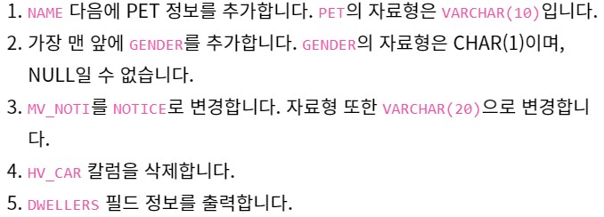

# 📙 Today I Learned  
## 규칙  
* 기억에 남는 내용 기록  
* markdown으로 작성  
  
---  

| [5월](./month/MAY) | [6월](./month/JUNE) |
|----|-----|

---  

* 1日  

Database : 정보를 데이터로 저장하고 컴퓨터를 사용해서 효율적으로 접근하도록 가공한 것  
Database Management System(DBMS) : 데이터베이스를 관리하는 시스템  
DBMS의 필요성  
- 다수에게 데이터 공유  
- 대량의 데이터 다루기  
- 읽기/쓰기의 자동화  
- 불의의 사고 대처  

DBMS의 종류  
- 계층형 데이터베이스  
	계층구조(트리구조)  
- 관계형 데이터베이스  
	열과 행으로 이뤄진 2차원 표 형식 데이터 관리  
	SQL(Structured Query Language) 사용하여 데이터 처리  
	대표적인 RDBMS Oracle, SQL Server, DB2, PostgreSQL, MYSQL  
- 객체지향 데이터베이스  
	객체지향 언어와 비슷하게 객체 단위로 데이터 관리  
- XML 데이터베이스  
	XML(eXtensible Markup Language)형식을 사용하여 데이터를 대량으로 빠르게 처리  
- 키-밸류형 데이터스토어  
	해시와 비슷한 구조로, 웹 서비스에서 초고속으로 검색할 때 사용  

RDBMS 시스템 구성은 클라이언트-서버형으로 이루어져있다. 클라이언트에서 SQL문을 작성하여 서버(RDBMS)에 전달하면 데이터베이스에서 꺼내 요구한 데이터를 클라이언트에 넘겨주는 식으로 작동한다. 한 대의 컴퓨터에서 RDBMS와 클라이언트를 동시에 동작시켜도 되고, 서로 다른 컴퓨터에서 동작시켜도 된다. 복수의 클라이언트에서 하나의 RDBMS로 연결하여 데이터를 반환 받을 수 있다.  

테이블 구조는 열과 행으로 이루어진 2차원 표 형식으로 클라이언트가 SQL문을 작성하여 서버에 요청하면 데이터베이스에서 해당 테이블에 있는 데이터를 추출하여 클라이언트에게 보내준다. 이 때 하나의 데이터베이스에 여러 테이블을 둘 수 있다. 그리고 반환된 데이터는 **항상 2차원 표 형태**로 나타나게 된다.  
테이블의 열은 Column으로, 데이터 항목을 나타내고 테이블의 행은 Record로, 데이터 한 건을 뜻한다. RDBMS에서는 **반드시 행 단위로 데이터를 읽고 쓴다.** RDBMS에선 행과 열이 교차하는 칸에 대한 용어가 없어서 공부하는 책에서는 임의로 Cell이라고 명명하고 공부를 할려고 한다. 하나의 Cell에는 무조건 하나의 데이터만 넣을 수 있다.  

Data Definition Language (DDL)  
데이터를 저장하는 데이터베이스 및 테이블을 생성, 삭제를 위한 것으로 각각의 명령어는 CREATE, DROP, ALTER이다.  

Data Manipulation Language (DML)  
테이블의 행을 검색하거나 변경하기 위한 명령어로, SELECT, INSERT, DELETE가 있다.  

Data Cotrol Language (DCL)  
데이터베이스에서 처리한 변경 내용을 확정하거나 취소하기 위한 명령어다. 또 사용자에게 처리 권한을 부여한다.  
- COMMIT : DB 변경 내용을 확정한다.  
- ROLLBACK : DB 변경 내용을 취소한다.  
- GRANT : 사용자에게 처리 권한을 부여한다.  
- REVOKE : 사용자 처리 권한을 제거한다.  

SQL문 마지막에 명시적으로 세미콜론을 붙여야한다. 또한, 대소문자 구별이 없으므로 키워드, 테이블명을 대소문자 구별없이 사용해도 똑같이 인식한다. 단, **테이블에 등록된 데이터에 있어서는 대소문자가 구별이되므로 유의**해야한다. 책에서 임의로 규칙을 정해서 SQL문을 기술하자면 키워드는 대문자, 테이블명은 첫 문자만 대문자, 그 외는 전부 소문자로 약속하고 공부한다.  

상수란 SQL문 안에 직접 기술하는 문자열, 날짜, 숫자 등을 상수라고 한다. 문자열의 경우는 `''` 작은따옴표를 이용한다. 날짜에도 작은따옴표를 이용하지만 기술하는데에 여러 형식이 있으나 `'년-월-일'`을 사용하도록 하자. 숫자에 있어서는 그냥 숫자만 기술하면 된다. 단어를 구별하는 구분자는 공백이나 줄바꿈문자로 구별한다.  

데이터베이스 테이블을 작성해보자.
```
CREATE DATABASE <shop>
CREATE TABLE Goods
(good_id	CHAR(4)			NOT NULL,
goods_name	VARCHAR(100)	NOT NULL,
goods_classify VARCHAR(32)	NOT NULL,
sell_price	INTEGER	,
buy_price	INTEGER ,
register_date	DATE,
PRIMARY KEY (goods_id));
```
테이블을 작성할 때는 한글을 사용하지 못하지만 테이블 안에 들어가는 데이터의 경우에는 한글을 사용할 수 있다. 테이블은 영문자나 숫자, 언더바만 가능하다. 또한 처음 시작은 영문자로 시작해야한다. 마지막으로 테이블의 이름이 중복이 되면 안된다.  

데이터형에 대해 말해보면 오늘 공부한 내용으론 가장 기본적인 형들만 보았다. 먼저, INTEGER형은 말 그대로 정수형이다. CHAR형의 경우 문자열형으로 고정 문자열을 넣으므로 처음에 최대 길이를 괄호로 지정하게 되는데 문자열을 넣을 때 최대 길이보다 작다면 남은 공간을 전부 공백으로 채우게 된다. 이 때 문자열의 경우 대소문자를 구별하여 인식하게 된다. 그 다음 VARCHAR형을 보면 CHAR형과는 다르게 가변 문자열 형식으로 공백으로 채우지 않는다. DATE형은 날짜를 저장하는 데이터형이다. 년월일을 저장하지만 Oracle에서는 시분초까지 포함한다.  

마지막으로 제약 설정이라는 것이 있다. 데이터형을 넣을 때 오른쪽에 있는 것이 제약으로 위에서는 NOT NULL을 사용했다. 이 제약의 경우는 반드시 데이터가 존재해야 한다는 것을 의미한다. 또 **주 키 제약**이라는 것은 주 키를 통해 해당 상품의 데이터를 추출할 수 있다. 만약 주 키에 중복된 값이 있다면 추출할 수 없다.  

테이블 삭제와 변경에 대해 알아보자. 변경의 경우는 DROP을 사용하면 된다.  
```
DROP TABLE Goods;
```
삭제 후 복구는 불가능하므로 유의해서 사용하자.  
테이블에 열이 부족하면 다시 만들지 않고 수정해서 사용하는 방법이 있다. 바로 ALTER TABLE 문으로, 이런 식으DELETE FROM	TABLE
[WHERE 검색조건];로 사용한다.  
```
ALTER TABLE Goods ADD COLUMN goods_name_eng VARCHAR(100);
```
ALTER TABLE 테이블명 ADD COLUMN 열 정의. 오라클이나 SQL서버에서는 COLUMN을 빼고 정의한다. 또한 오라클에서 복수 개의 열을 한번에 추가하는 경우엔 `{}`을 사용하여 묶는다.  
ADD뿐 아니라, DROP의 경우도 ADD을 대체해서 사용하면 똑같이 사용할 수 있다.  
```
ALTER TABLE Goods DROP COLUMN goods_name_eng;
```

테이블에 데이터를 등록하는 방법  
```
BEGIN TRANSACTION - SQL Server와 PostgreSQL  
START TRANSACTION - MySQL  
사용하지 않음 - Oracle, DB2 
// 행추가를 위한 조건
INSERT INTO Goods VALUES ('0001', '티셔츠', '의류', 1000, 500, '2009-09-20');
...
INSERT INTO Goods VALUES ('0008', '볼펜', '사무용품', 100, NULL, '2009-11-11);

COMMIT;
```

테이블을 수정하는 방법  
```
ALTER TABLE Gods RENAME TO Goods; // Oracle, PostgreSQL
RENAME TABLE Gods TO Goods; // DB2
sq_rename 'Gods', 'Goods'; // SQL Server
RENAME TABLE Gods to Goods; // MySQL
```

아주 조금 사용해본 데이터베이스가 MySQL이므로 책으로 공부하지만 MySQL을 기준으로 공부할 것 같다.  

---

- 2日  

데이터베이스 SELECT문  
테이블에서 데이터를 꺼낼 때 SELECT를 사용한다. 테이블 속 데이터 중 원하는 것을 선택한다고 생각하면 된다. 그리고 이것을 쿼리, 질의라고 부른다. 가장 기본적이며 많이 사용되는 구문이다.  

```
SELECT <열명>, ...
	FROM <테이블명>;
```
여기서 SELECT와 FROM을 Clause라고 부른다. 이 Clause는 SQL문을 구성하는 요소로 여러 키워드로 시작하는 문장이다.  

SELECT로 원하는 열의 이름을 지정하고 FROM으로 데이터를 꺼낼 테이블의 이름을 지정한다. 예시로 어제 짠 테이블의 열을 출력해보자.  
```
SELECT goods_id, goods_name, buy_price
	FROM Goods;
```
이렇게 실행하게 되면 goods_id, good_name, bur_price의 데이터들을 보여준다.  
여기서 지정하지 않고 모든 열을 출력하려면,
```
SELECT *
	FROM Goods;
```
같이 사용하면 된다. 이 때 `*`란 모든 열을 의미한다.  

추가적으로 SQL문에서 개행을 어디서나 해도 상관이 없으나, 연속개행으로 인한 빈 줄이 끼게된다면 실행이 안되므로 주의해야한다.  

이어서 `AS`키워드를 이용해서 별명을 지을 수 있다. 바로 이런 방식이다.  
```
SELECT goods_id AS id,
       goods_name AS name,
	   buy_price AS price
	FROM Goods;
```
여기서 영어가 아닌 한글로 대체할 수 있는데 이 때는 `""` 큰 따옴표를 이용해야 한다.  

별명 뿐아니라 상수를 출력하게 SELECT문을 짤 수 있다. 
```
SELECT '상품' AS munja, 38 AS num, '2009-02-24' AS nalja, goods_id, goods_name
	FROM Goods;
```

중복을 제거하는 키워드도 존재한다. 바로 `DISTNCT`라는 키워드다.  
```
SELECT DISTNCT goods_classify
	FROM Goods;
```
이 때 중복을 제거할 때 NULL을 포함한다. 이 키워드는 항상 열 앞에 쓰여야한다. 열이 쓰이다 도중에 포함될 수 없다.  

WHERE문은 조건문이라고 생각하면 된다. SELECT와 FROM으로 어떤 테이블에서 어떤 열을 구할지 정한다는거라면 WHERE은 행을 구할 수 있다.  
```
SELECT goods_name, goods_classify
	FROM Goods
	WHERE goods_classify = '의류';
```
goods_classify라는 열의 값이 의류인지 비교해서 해당하는 행을 선택해준다. 여기서 SELECT와 FROM문으로 열을 먼저 구하는게 아니라 WHERE문으로 행을 선택한 다음 SELECT와 FROM문에서 열을 구한다. 따라서 이러한 Clause들은 순서를 지켜야한다. 순서가 안 지켜진다면 에러가 발생할 수 있다.  

프로그래밍 언어들과 같이 주석처리를 할 수 있다. 주석을 작성하기 위한 방법으로는 `--`로 `//`와 같이 한 줄만 주석처리하는 방법과 복수 행 주석은 여타 다른 프로그래밍 언어와 같이 `/* */`사이에 기술하는 방법이다.  

연산자에 대해 알아보자.  
먼저 산술 연산자는 사칙연산 모두 사용할 수 있다.  예시로,  
```
SELECT goods_name, sell_price, sell_price * 2 AS "sell_price_x2"
	FROM Goods;
```
이런 경우 goods_name sell_price sell_price_x2 순서대로 출력하게 되는데, 이 때 sell_price_x2의 경우 데이터가 같은 행 sell_price의 2배가 출력되게 된다. 추가적으로 NULL이 들어간 사칙연산의 경우 모두 NULL이 된다.  

비교 연산자의 경우 `=` `<>`을 사용해서 만든다. 대소관계와 같은 경우, 그리고 같지않다를 만든다.  
```
SELECT goods_name, goods_classify
	FROM Goods
	WHERE sell_price = 500;
```
Goods 테이블에서 goods_name, goods_classify 열 중 sell_price가 500인 행을 선택하는 구문이다. 프로그래밍 언어와 다른 점은 `<>`이 같지 않다라는 것이다. 대부분 `!=`을 사용하는데 이것은 표준SQL에서 인정하지 않기 때문에 안정성을 위해서 `<>`을 사용한다.  
날짜형에서도 또한 사용할 수 있는데, 크다 작다 개념이 이전 이후로 생각하면 된다. 그리고 `<=`와 `>=`은 꼭 부등호 다음 등호가 나오는 순서대로 기술해야한다. 그리고 산술연산자와 비교연산자를 같이 사용하여 WHERE문을 기술할 수 있다.  
문자열의 대소관계는 항상 사전식으로 비교한다. 따라서 첫 문자의 사전식 대소관계 같은 경우에는 그 다음 문자를 비교하면서 정렬하게 된다. 그리고 비교연산자에 NULL은 사용될 수 없다. NULL을 뽑기위해 `<>`을 사용하거나 `= NULL`을 사용하면 NULL인 행을 구할 수 없다. 따로 키워드를 사용해하는데 그것은 `IS NULL`과 `IS NOT NULL`이다. WHERE문에 연산자 사용하듯이 사용하면 NULL이나 NOT NULL을 구할 수 있다.  

논리 연산자에 대해 알아보자. 앞서서 사용했던 `<>`도 부정의 의미를 가지고 있지만 더 넓은 범위로 생각할 수 있는 연산자가 있다. 바로 `NOT`이다. 또 `AND`와 `OR`을 사용해서 WHERE 조건을 원하는 조건으로 매칭할 수 있다. 여기서 `OR`연산자 보다 `AND`연산자가 우선순위가 높으므로 괄호를 이용해서 명확히 표시해야 원하는 조건을 제대로 제시할 수 있게 된다.  
```
SELECT goods_name, goods_classify, register_date
	FROM Goods
	WHERE goods_classify = '사무용품'
	AND ( register_date = '2009-09-11'
			OR register_date = '2009-09-20');
```
논리 연산자에서 진릿값을 생각하면 진리표를 그리고 참과 거짓을 가려내 명확하게 나오는 값일 것이다. 하지만 SQL에서는 불명(UNKNOWN)이라는 값이 존재한다. 이렇게 3가지 논리 연산을 3치 논리라고하며, 흔히 아는 프로그래밍 언어에서 사용하는 것을 2치 논리라고 한다. 3치 논리를 표로 정리해보면  

| P | Q | P AND Q | 
|---|---|---------|
| 참 | 참 | 참 |
| 참 | 거짓 | 거짓 |
| 참 | 불명 | 불명 |
| 거짓 | 참 | 참 |
| 거짓 | 거짓 | 거짓 |
| 거짓 | 불명 | 거짓 |
| 불명 | 참 | 불명 |
| 불명 | 거짓 | 거짓 |
| 불명 | 불명 | 불명 |  

| P | Q | P OR Q |
|---|---|---------|
| 참 | 참 | 참 |
| 참 | 거짓 | 참 |
| 참 | 불명 | 참 |
| 거짓 | 참 | 참 |
| 거짓 | 거짓 | 거짓 |
| 거짓 | 불명 | 불명 |
| 불명 | 참 | 참 |
| 불명 | 거짓 | 불명 |
| 불명 | 불명 | 불명 |  

이렇게 정리해볼 수 있다.  

--- 

* 3日  

데이터베이스 집약함수 (집합함수)  

- COUNT : 테이블 레코드 수를 계산한다.  
- SUM : 숫자열 데이터의 합계를 구한다.  
- AVG : 숫자열 데이터의 평균을 구한다.  
- MAX : 임의 열이 가진 데이터의 최댓값을 구한다.  
- MIN : 임의 열이 가진 데이터의 최솟값을 구한다.  

```
SELECT COUNT(*)
	FROM Goods;
```
이전에 썼던 것처럼 `*`은 모든 경우의 수를 뜻한다. 따라서 모든 행의 수를 반환해주게 되는데, NULL을 포함한 숫자이다. 이 때 `*`을 대신하여 열의 이름을 입력하게 되면 NULL을 제외하고 행의 수를 계산하여 반환해준다. `*`은 COUNT에서만 사용할 수 있는 인자이다.  

```
SELECT SUM(sell_price)
	FROM Goods;
```
해당 열의 합계를 전부 보여준다. 여러 열을 적게되면 여러 열의 합을 모두 합한 뒤 보여준다.  

```
SELECT AVG(sell_price)
	FROM Goods;
```

원래는 평균을 구하는데에 있어서 행의 계수는 절대적으로 중요하다. 하지만 여기에서는 일단 NULL을 제외해서 계산한다. 나중에 NULL 레코드를 포함한 평균 계산을 배워보도록 하자.  

MAX와 MIN은 말 그대로 최댓값, 최솟값을 반환해준다. 다른 함수들은 모든 데이터형에 쓰이진 못한다. 이 MAX와 MIN은 순서가 있는 모든 데이터형에 쓰일 수 있다.

```
SELECT MAX(sell_price), MIN(buy_price)
	FROM Goods;
```

집약함수에서도 키워드 DISTINCT을 사용할 수 있다. 이것은 중복을 제하는 키워드로 괄호를 쓰고 사용하면 된다.  
```
SELECT COUNT(DISTINCT goods_classify)
	FROM Goods;
```

테이블을 그룹으로 나눌 수도 있다. 원래는 집약함수를 통해서 뽑은 결과는 전체를 한 그룹을 봐서 나온 결과 1행 뿐이었지만, 그룹을 직접 나누게 되면 각 그룹에 대해서 결과 값이 나오게 된다.  
```
SELECT goods_classify, COUNT(*)
	FROM Goods
	GROUP BY goods_classify;
```
이렇게 사용하게 되면 상품의 분류 중에 종류가 몇 개인지 COUNT을 세서 결과 값을 보여주게 된다. 이 때 지정되는 열을 **집약 키** 혹은 **그룹화 열**이라고 한다. 이 때 집약 키에 NULL이 포함된 경우에도 NULL이 추가되어 공란으로 유지되게 되는데 이때 이 행을 `불명`이라고 생각하면 된다.  
현재까지 배운 작성 순서는 `SELECT -> FROM -> WHERE -> GROUP BY`로 이 순서는 바뀌면 안된다. 하지만 실행 순서에 경우에는 작성 순서와 달리, `FROM -> WHERE -> GROUP BY -> SELECT` 이런 식으로 이루어진다.  

집약 함수와 GROUP BY을 사용할 때 자주하는 실수로는  
1) SELECT구에 필요없는 열을 사용한다.  
```
SELECT goods_name, buy_price, COUNT(*)
	FROM Goods
	GROUP BY buy_price;
```
이 때 goods_name은 GROUP BY구에 없기 때문에 오류가 나지만, MySQL에 경우에는 인정해주고 있다. 이때 가장 적합한 하나를 찾아서 반환해주게 된다.  

2) GROUP BY 구에 SELECT구에서 정한 별명을 쓴다.  
이 부분은 실행 순서를 생각하면 좋다. 별명이 주어지기 전에 먼저 실행이 되기 때문에 일어나는 실수이다.  

3) GROUP BY 구는 결과의 순서를 정렬할까?  
순서는 무작위로, 전혀 연관없는 순서로 이어지는 정렬을 배워야지 가능하다.  

4) WHERE 구에 집약 함수를 사용한다.  
익숙하지 않을 때 많이 하는 실수로 예를 보자  
```
SELECT goods_classify, COUNT(*)
	FROM Goods
	WHERE COUNT(*) = 2
	GROUP BY goods_classify;
```
집약 함수의 경우 SELECT구와 HAVING구에서만 가능하다는 것을 생각하자.  

HAVING구란 WHERE구 처럼 조건을 준다. 하지만 차이점이라면 WHERE의 경우 레코드를 선택하기 위한 조건이라면 HAVING구는 그룹에 대해 조건을 줘서 그룹을 선택하는 방법이다.  
```
SELECT 열
	FROM 테이블
	GROUP BY 열
	HAVING 그룹의 조건(COUNT(*) = 2;)
```
으로 사용한다. 이때 실행 순서는 `SELECT -> FROM -> WHERE -> GROUP BY -> HAVING`으로 맨 마지막에 사용하게 된다.  
사용할 수 있는 요소를 살펴보면 상수, 집약 함수, 집약 키가 있다.  
어떻게 보면 같은 결과를 내기 위해서 WHERE구와 HAVING구를 사용할 수 있는데 이때는 WHERE구의 속도가 훨씬 빠르다. 그 이유로는 집약함수가 사용될 때 정렬이 일어나는데 WHERE의 경우 조건에 맞지 않은 행들을 다 걸러내고 해당 열에 인덱스를 작성하기 때문에 정렬의 양이 줄어들어 속도가 빠르다. 그에 반해 HAVING구는 그룹화를 먼저 다 하고 그 다음 전체에 대해 정렬이 이뤄지기 때문에 속도가 상대적으로 느리다고 할 수 있다.  

ORDER BY구를 살펴보려고 하는데, 이 구는 지금까지 봤던 여러가지 조건을 달거나 원하는 것을 고르는 것이 아닌 결과의 영향을 주는 구이다. SELECT을 비롯하여 여러가지 배운 것을 통해 뽑은 결과는 항상 무작위로 지금 나온 순서는 우연의 결과이다. 따라서 이 정렬 방법을 정하는 구가 바로 ORDER BY구이다.  
```
SELECT 열
	FROM 테이블
	ORDER BY 재정렬_기준_열 키워드
```
아무것도 쓰지 않은 경우에는 오름차순으로 된다. 여기서 키워드를 통해서 오름차순과 내림차순을 결정할 수 있다. DESC 키워드를 통해서 내림차순으로 정렬가능하며 또한, ASC을 통해서 오름차순으로 정렬할 수 있다. 이 구를 사용했을 때 순서는 `SELECT -> FROM -> WHERE -> GROUP BY -> HAVING -> ORDER BY` 이 순서를 기억해야한다. 실행 순서는 `FROM -> WHERE -> GROUP BY -> HAVING -> SELECT -> ORDER BY` 순서로 아까 GROUP BY에서 사용하지 못한 SELECT에서 정한 별명을 ORDER BY에서는 사용할 수 있다. 또한 SELECT에 포함되지 않은 열도 테이블에 속해 있다면 사용할 수 있으며, 집약 함수도 사용할 수 있다. 열 번호를 사용하여 SQL문을 짤 수 있지만 이 방법은 표준 SQL 규격에서 사라질 수 있는 방법이며, 가독성이 떨어지므로 사용을 하면 안된다.  
추가적으로 재정렬 기준 열에 두개 이상의 열을 기입하게 된다면, 왼쪽 키부터 사용하여 정렬을 하되 키의 값이 같은 경우 두번째 키를 비교하여 정렬하게 된다. 또한 NULL이 들어가있는 경우에는 제일 앞 혹은 제일 뒤에 모아서 표시된다. 이 부분은 정해져있지 않으며 DBMS마다 지정 가능할 수 있다.  

---

- 4日  

오늘은 SQL을 공부한 것으로 구름IDE에서 직접 실습하면서 공부를 해보았다. 확실히 글로만 보고 공부하던 것과 달리 처음엔 어색해서 어려웠다. 여기서 기술되어 있는 내용을 보고 공부하고 실습하는 RDBMS는 MariaDB이다. 따라서 조금은 문법이 달랐지만 아직 공부한 거라곤 별로 없기에 차이를 크게 못 느꼈다.  
  
```
ALTER TABLE DWELLERS ADD PET VARCHAR(10) AFTER NAME;
ALTER TABLE DWELLERS ADD GENDER CHAR(1) NOT NULL FIRST;
ALTER TABLE DWELLERS CHANGE MV_NOTI NOTICE VARCHAR(20);
ALTER TABLE DWELLERS DROP HV_CAR;
DESC DWELLERS;
```
문제를 제대로 읽지 않아 GENDER의 옵션을 보지 못해서 오래걸렸다. 

1) TEMP 데이터베이스를 만든 뒤 삭제하는 과정을 SHOW 명령어로 확인합니다. SHOW는 두 번 사용하지만 TEMP는 한 번만 나와야 합니다.  
```DELETE FROM	TABLE
[WHERE 검색조건];
CREATE TABLE TEMP(
ID		INT(10)		NOT NULL,
NAME	VARCHAR(20)	NOT NULL
);
SHOW TABLES;
DROP TABLE TEMP;
SHOW TABLES;
```
이어서 TRUNCATE에 대해서 공부를 이어갔다. 실습예제에서 TABLE EMP의 레코드만 지우라는 에제가 있어서 `TRUNCATE TABLE EMP;`와 같이 사용하였지만 계속 오답이 나온다. 테이블을 출력을 했으나 출력이 나오지 않는 것을 보아 확실히 삭제된 것을 알 수 있었으나 오답으로 나왔다.
추가적으로 DEFALUT 키워드를 봤다. 테이블을 생성할 때 사용하면 C언어에서 사용한 DELETE FROM	TABLE
[WHERE 검색조건];DEFAULT 매개변수와 같이 값을 지정하지 않은 경우 해당하는 값이 들어가는 옵션이다.  
```
CREATE TABLE STUDENTS(
NO		INT(10)			NOT NULL,
NAME	VARCHAR(20)	NOT NULL,
ENT		DATE		NOT NULL,
GRADE	INT(1)		NOT NULL,
CLUB	INT(1)		NOT NULL DEFAULT 'X'
)
```
이런식으로 사용하면 된다. 책에선 공부했으나 구름에서 보는 SQL강의는 아직 키와 제약 조건에 들어가지 않았으므로 프로그래머스에서 SQL문제를 더 풀도록 한다.  

--- 

- 5日  

주로 프로그래머스에서 SQL문제를 풀어보았다. 어제 SELECT문제를 전부 풀어보며 느껴본 점으론 생각보다 익숙하지 않다는 점이였다. SQL을 공부한지 4일이 지났지만 아직 공부할 것들은 많이 남아있으며 어렵다는 것이였다. 코딩테스트에서도 자주 출제한다니 공부를 해서 나쁠 건 없다고 생각이 들었다.  

MySQL에서 그냥 사용하는 SELECT문에 경우는 눈에 익었다. 이제 MAX MIN SUM AVG을 공부해야한다. 따라서 여러 문제들을 풀어보았는데 그 중 최솟값, 최댓값, 중복제거, 카운트하기이다.  

```
SELECT MAX(DATETIME) AS '시간'
FROM ANIMAL_INS
```
동물 보호소에 가장 늦게 들어온 동물을 찾는 쿼리이다.

```
SELECT MIN(DATETIME) AS '시간'
FROM ANIMAL_INS
```
마찬 가지로 동물 보호소에 가장 먼저 들어온 동물을 찾는 쿼리이다.  

```
SELECT COUNT(ANIMAL_ID) AS COUNT
FROM ANIMAL_INS
```
동물의 각각 ID(기본키)를 세서 동물 테이블의 카운트를 세보는 쿼리이다.

```
SELECT COUNT(DISTINCT NAME) AS count
FROM ANIMAL_INS
WHERE NOT NAME IS NULL
```
마지막으로는 NULL과 중복되는 이름을 제외하고 동물의 이름 수를 구하는 쿼리이다. 실행시에 count라는 컬럼에 이름 갯수가 나와야해서 COUNT에 DISTINCT 키워드를 통해 중복을 제거하며 WHERE문에서 NAME이 NULL이 아닌 경우만 SELECT하게 짜보았다.  

문제를 풀어본 다음에는 구름에서 '한 눈에 끝내는 SQL'강의로 책으로 본 부분을 복솝을 진행하였다. 항상 집필한 사람마다 공부 순서가 다르기 때문에 여러 책, 강의를 보면 도움이 된다. 그 다음 카테고리 문제에선 꽤나 막혀서 복습이 필요하다는 것을 느껴 복습을 계속 하였다.  

---

- 6日  

SQL 문제 풀면서 새로운 것을 많이 알게 되었다. 먼저, IFNULL(A,B)는 A가 NULL이라면 B로 대체하고 A가 NOT NULL이라면 A를 그대로 사용한다. DATETIME형에서 많은 시간들이 있지만 시간들을 7~21 HOUR로 나눠서 SELECT하는 문제가 있었다. DATTIME에서 HOUR(DATETIME)을 사용하게 되면 DATETIME에서 시간만 뽑아서 SELECT할 수 있게 된다.  

기본키는 NOT NULL이며, 기본 키는 다른 값들과 다르게 한 컬럼으로 구분이 되는 값이다. 그리고 외래키란 다른 테이블의 기본키를 참조하는 속성이다. 따라서 테이블 사이에 물리적인 연결이 생성된다. 외래키를 언제 사용하는지 살펴보자.  
| EMP_ID | EMP_NAME | EMP_REGDATE |
|-------|--------|---------|
| 1001 | 홍길동 | 2019-03-17 |
| 1002 | 김구름 | 2019-05-22 |
| 1003 | 나미녀 | 2020-01-01 |

| ORD_ID | EMP_ID | ORD_NAME | ORD_DATE |
|--------|-------|--------|---------|
| 2000 | 1001 | 커피 | 2019-08-11 |
| 2001 | 1002 | 오렌지쥬스 | | 2002 2019-08-12 |
| 2002 | 1001 | 유자차 | 2019-08-12 |
| 2003 | 1003 | 커피 | 2019-08-14 |  

여기서 EMP_ORDER 테이블의 EMP_ID 필드가 EMP 테이블의 EMP_ID를 참조하고 있다. 이 때 사번 1001인 사원을 EMP 테이블에서 삭제하게되면 EMP_ORDER 테이블의 1001번 사원이 주문 명세는 그대로 남게 된다. 따라서 모순이 발생하게 된다. 이것을 **참조 무결성 위반**이라고 한다. **참조 무DELETE FROM	TABLE
[WHERE 검색조건];결성**이란 기본키와 외래키의 관계가 항상 유지되는 것이다. 외래키 무결성이라고도 한다. 외래키를 설정하기 위해서는  
```
ALTER TABLE <테이블 명> ADD CONSTRAINT <제약 조건 명> FOREIGN KEY (칼럼 명) REFERENCES <부모 테이블> (부모 테이블의 기본키 필드명);
```

위의 예시와 엮게되면  
```
ALTER TABLE EMP_ORDER ADD CONSTRAINT FK_ORDER_EMP_ID FOREIGN KEY(EMP_ID) REFERENCES EMP(EMP_ID);
```
이렇게 사용하게 되면 EMP_ORDER 테이블의 EMP_ID 필드는 EMP 테이블의 EMP_ID 필드를 참조하게 된다.  

```
SELECT * FROM INFORMATION_SCHEMA.TABLE_CONSTRAINTS WHERE TABLE_NAME='EMP_ORDER';
```
이와 같은 쿼리를 통해서 외래키와 기본키를 확인 할 수 있다.  

ON 키워드  
외래키가 참조하는 테이블의 데이터를 갱신하거나 삭제할 때 참조 무결성을 유지하기 어렵다. 따라서 MySQL에서 ON 키워드를 통해 여러 가지 제약 조건을 부여하여 참조 무결성을 유지하게 한다. ON UPDATE/ON DELETE로 DELETE FROM	TABLE
[WHERE 검색조건];사용하는데 이때 제약 조건은 NO ACTION, RESTRICT, CASCADE, SET NULL이 있다.  
```
ALTER TABLE <테이블 명> ADD CONSTRAINT <제약 조건 명> FOREIGN KEY (칼럼 명) REFERENCES <부모 테이블> (부모 테이블의 기본키 필드명)
ON UPDATE SET <UPDATE 제약 조건>
ON DELETE SET <DELETE 제약 조건>;
```
만약에 ON 키워드 설정이 생략되었다면 ON UPDATE/DELETE SET NO ACTION이 기본 설정된다. 이 옵션은 외래키가 참조하는 테이블에서 레코드의 기본키 값을 수정하거나 레코드를 삭제하는 행위를 방지해준다. MySQL에서는 RESTRICT와 NO ACTION은 같은 의미이다.  
ON UPDATE SET NULL이 실행될 경우에는 외래키가 참조하는 기본DELETE FROM	TABLE
[WHERE 검색조건];키 값이 변경되었을 때 해당 외래키 값이 NULL로 변경된다.  
ON DELETE SET NULL이 실행될 경우에는 외래키가 참조하는 기본키 값이 삭제되었을 때 해당 외래키 값이 NULL로 변경된다. 이 때는 해당 외래키가 NULL을 허용해야지 실행이 된다. NOT NULL인 경우에는 오류가 발생한다.  DELETE FROM	TABLE
[WHERE 검색조건];

---

- 7日  

SQL문제를 푸는데 있어서 공부한 점을 적어보려고 한다. 먼저 `CASE WHEN`문이다. C계열의 IF ELSE와 같이 사용하면 된다.  
```
CASE 컬럼 WHEN 조건식1 THEN 결과1
			WHEN 조건식2 THEN 결과2
			...
			ELSE 결과
	END
```
이런식으로 사용하면 된다. 이 때 결과에 NULL이 들어가면 안되고 이걸 SELECT 뒤 컬럼에 넣고 END에 AS를 통한 별칭을 지어주게 되면 결과식에서 하나의 컬럼이 된다.  

다음 식은 문자열을 처리하는데에 있어서 WHERE구에서 특정 문자열을 포함하는 문자열을 구하고자 할때 사용하는 방법이다.  
```
WHERE 컬럼 LIKE '%N%'
```
%이 붙게되면 그 부분은 아무거나 들어와도 된다는 의미로 통한다. 따라서 앞에 %을 붙이게되면 끝나는 단어만 맞으면 된다. 그리고 뒤에 %을 붙이게되면 시작단어만 맞으면 된다. 앞뒤로 %을 붙이게되면 그 단어가 포함된 모든 단어를 다 구할 수 있다.  

DATEDIF(DATETIME1, DATETIME2)은 1과 2의 차이를 반환하며 원하는 포맷으로 출력을 할려면 DATE_FORMAT()을 사용하면 된다. `2020-07-07'으로 만들고 싶다면  
```
DATE_FORMAT(NOW(), '%Y-%m-%d')
```

그리고 마지막으로 책이 아닌 문제를 풀며 JOIN을 공부했다. JOIN에 경우 밴다이어그램으로 그린 집합을 생각하면 좋다. 밴다이어그램에서 교집합과 합집합, 차집합을 쿼리로 짜놨다고 생각이 된다. SQL의 꽃이라고 불리는 JOIN을 쿼리로 봐보자.  

```
SELECT
테이블별칭.조회할칼럼
FROM 기준테이블 별칭
INNER JOIN 조인테이블 별칭
ON 기준테이블별칭.기준키 = 조인테이블별칭.기준키
```
INNER JOIN은 교집합으로 생각하면 된다.  

JOIN이후 ON은 WHERE구와 같은 기능을 한다.  

이어서 RIGHT와 LEFT  

```
SELECT
테이블별칭.조회할칼럼
FROM 기준테이블 별칭
RIGHT OUTER JOIN 조인테이블 별칭 ON 기준테이블별칭.기준키 = 조인테이블별칭.기준키
```
OUTER는 생략가능하다. RIGHT JOIN의 경우에는 오른테이블의 값 + 교집합 값이라고 보면 된다.  

```
SELECT
테이블별칭.조회할칼럼
FROM 기준테이블 별칭
RIGHT OUTER JOIN 조인테이블 별칭 ON 기준테이블별칭.기준키 = 조인테이블별칭.기준키
```
LEFT 또한 RIGHT와 같이 기존테이블의 값 + 교집합의 값이라고 보면 된다.  

```
SELECT
테이블별칭.조회할칼럼
FROM 기준테이블 별칭
FULL OUTER JOIN 조인테이블 별칭 ON 기준테이블별칭.기준키 = 조인테이블별칭.기준키
```
FULL JOIN은 합집합이라고 생각하면 된다. 두 테이블 전부의 데이터를 검색할 수 있다.  

CROSS와 SELF는 책으로 공부하면서 이어서 해볼 생각이다.

----

- 8日  

오라클에서 두 테이블을 아무 조건 없이 연결하게 되면 카티전 프로덕트 연산이 된다.  
```
SELECT *
FROM Customer, Orders;
```
이러한 연산을 하였을 때 튜플의 개수를 서로 곱한 갯수만큼 나오게 된다. 여기서 다른 JOIN문을 사용하지 않고 WHERE구를 사용하여 JOIN문과 같게 사용할 수 있다. 문제를 풀어보면서 많이 해보았으므로 JOIN에 대해 더 공부해본다. 오라클에서는 `+`기호로 외부 조인을 수행할 수 있다. 예를 들어  
```
SELECT Customer.name, saleprice
FROM	Customer LEFT OUTER JOIN Orders
	ON	Customer.custid=Orders.custid;
```
이러한 문장을
```
SELECT Customer.name, saleprice
FROM	Customer, Orders
WHERE	Customer.custid=Orders.custid(+)
```
이러하게 표현할 수 있다. 이때 `+`의 위치로 LEFT, RIGHT OUTER을 구별할 수 있다.  

### 부속질의(SUB QUERY)  
만약 테이블 내부의 튜플들을 모두 알고 있다면 최댓값이나 최솟값을 구하는데 어려움이 없을 것이다. 하지만 테이블만 주어져있을 때 구하고자하면 하나의 쿼리문으로는 힘들 수 있다. 이때 SELECT문의 WHERE 절에 또 다른 테이블의 결과를 이용하기 위해 다시 SELECT문을 괄호로 묶는 것을 SUBQUERY라고 한다. 중첩 질의(NESTED QUERY)라고도 불리는데, 실행 순서는 괄호가 우선순위가 높듯 항상 WHERE절의 부속질의를 먼저 처리 후 전체질의를 처리하는 순서이다. 또한 중첩해서 부속질의를 연결 할 수 있다. 예시로 대한미디어에서 출판한 도서를 구매한 고객의 이름을 보이시오. 라는 질의가 있을 시  
```
SELECT name
FROM Customer
WHERE custid IN (SELECT custid
				 FROM	Orders
				 WHERE	bookid IN (SELECT	bookid
				 				   FROM		Book
								   WHERE	publisher = '대한미디어'));
```
이런식으로 중첩을 해서 부속질의를 이어가도 된다. 부속질의 간에는 상하 관계가 존재한다. 하위 부속질의를 실행하고 그 결과로 상위 부속질의를 실행한다. 상관 부속질의는 상위 부속질의의 튜플을 이용하여 하위 부속질의를 계산한다. 따라서 어떤 부속질의든 상위 부속질의와 하위 부속질의는 독립적이지 않고 서로 관련을 맺고 있다.  
부속질의를 하는 위치에 따라서 명칭이 달라지는데
| 명칭 | 위치 | 동의어 | 설명 |
|---|---|---|---|
| 스칼라 부속질의 | SELECT 절 | SCALAR SUBQUERY | SELECT절에서 사용되며 단일 값을 반환 |
| 인라인 뷰 | FROM 절 | INLINE VIEW, TABLE SUBQUERY | FROM절에서 사용되며 결과를 뷰 형태로 반환 |
| 중첩질의 | WHERE 절 | NESTED SUBQUERY, PREDICATE SUBQUERY | WHERE 절에 술어와 같이 사용되며 결과를 한정 시키기 위해 사용, 상관 혹은 비상관 형태 |

ALL, SOME(ANY) 연산자는 비교 연산자와 함께 사용된다. ALL은 모든, SOME(ANY)은 최소한 하나인 어떠한 이라는 의미가 있다. 예를 들어 금액 > SOME (SELET 단가 FROM 상품)이라고 하면 상품 테이블에 있는 어떠한 단가보다 큰 경우 참이 되어 해당 행의 데이터를 출력한다. ALL의 경우 부속질의의 결과 집합 전체를 대상으로 하므로 최댓값과 같다고 볼 수 있다. 그에 반해 SOME은 부속질의 결과 집합 중 어떠한 값을 의미하므로 최솟값과 같다고 볼 수 있다.

SQL에서의 집합 연산은 합집합, 교집합, 차집합을 각각 `UNION`, `INTERSECT`, `MINUS(EXCEPT)`을 사용하여 구할 수 있다. 쿼리와 쿼리 사이에 사용하여 그 결과를 얻을 수 있다.  

또, `EXISTS`는 상관 부속질의문 형식으로, 부속질의문의 어떤 행이 조건에 만족하면 참이다. 반면 `NOT EXISTS`는 모든 행이 조건에 만족하지 않을 때만 참이다.  
```
SELECT	name, address
FROM 	Customer cs
WHERE	EXISTS (SELECT *
				FROM	Orders od
				WHERE	cs.custid=od.custid);
```
상관 부속질의문 형식이기 때문에 SELECT문 처리는 내포되어있다. cs의 첫행을 부속질의문의 cs 값으로 입력하여 고객번호를 비교하고 cs의 그 다음 행을 비교하는 식으로 모든 행에 대하여 반복된다.  

- 데이터 조작어에 대해 복습을 해볼려고 한다.  

삽입  
INSERT문  
```
INSER INTO TABLE[(속성)]
		VALUES (값);
```

수정  
UPDATE문  
```
UPDATE	TABLE
SET		속성이름=값
[WHERE	<검색조건>];
```

삭제  
DELETE문
```
DELETE FROM	TABLE
[WHERE 검색조건];
```

### SQL 내장 함수  
SQL의 함수는 DBMS가 제공하는 내장 함수와 사용자가 직접 만드는 사용자 정의 함수로 나뉘어진다. 내장 함수가 생각보다 많아 사용하면서 익혀야할거 같다. 주로 사용하는 함수들을 정리한다.  

숫자 함수
- ABS : 숫자의 절대값 계산
- CEIL : 천장함수
- FLOOR : 바닥함수
- ROUND(숫자,M) : 반올림함수, M은 반올림 기준 자릿수  
- LOG(N,숫자) : 자연로그 값 반환  
- POWER(숫자,N) : N제곱 계산
- SQRT : 제곱근 계산 (양수)  
- SIGN : 부호 계산 (-1,0,1)  

문자 함수  
- CHR : ASCII -> CHAR  
- CONCAT(S1,S2) : 문자열 연결
- INITCAP : 문자열의 첫 문자 대문자로 변환
- LOWER : 소문자 변환
- LPAD(S,N,C) : 대상 문자열의 왼쪽부터 지정한 자리 수까지 지정한 문자로 채움
- LTRIM(S1,S2) : 대상 문자열의 왼쪽부터 지정한 문자들을 제거
- REPLACE(S1,S2,S3) : 대상 문자열의 지정한 문자를 원하는 문자로 변경  
- RPAD(S,N,C) : 대상 문자열의 오른쪽부터 지정한 자리 수까지 지정한 문자로 채움
- RTRIM(S1,S2) : 대상 문자열의 오른쪽부터 지정한 문자들을 제거
- SUBSTR(S,N,K) : SUBSTRING 반환 INDEX N부터 K길이만큼  
- TRIM(C FROM S) : 대상 문자열의 양쪽에서 지정된 문자를 삭제(문자열만 넣으면 공백제거)
- UPPER : 대문자 변환
- ASCII : 아스키값 반환
- INSTR(S1,S2,N,K) : 문자열 중 N번째 문자부터 찾고자하는 문자열 S2가 K 번째 나타나는 문자열 위치 반환
- LENGTH : 글자수 반환

날짜 시간 함수  
- TO_DATE(CHAR, DATETIME) : CHAR -> DATE
- TO_CHAR(DATE, DATETIME) : DATE -> 문자열(VARCHAR2)
- ADD_MONTHS(DATE, 숫자) : DATE형의 날짜에서 숫자만큼 더함  
- LAST_DAY(DATE) : DATE형에서 해당 달의 마지막 날 반환
- SYSDATE : DBMS상 오늘 날짜 반환

DATETIME의 주요인자
- d : 요일순서(월=1)
- day : 요일(월요일~일요일)
- dy : 요일의 약자(월~일)
- dd : 1달 중 날짜 (1~31)
- ddd : 1년 중 날짜 (1~366)
- hh,hh12 : 12시간 (1~12)
- hh24 : 24시간 (0~23)
- mi : 분 (0~59)
- mm : 월 순서 (01~12)
- mon : 월 이름 약어 (Jan ~ Dec)
- month : 월 이름 (January ~ December)
- ss : 초(0~59)
- yyyy : 4자리 연도
- yyy,yy,y : 4자리 연도의 마지막 3,2,1자리

NVL 함수는 NULL값을 다른 값으로 대치하여 연산하거나 다른 값으로 출력하는 함수이다.  
```
SELECT name "이름", NVL(phone, "전화번호없음) AS "전화번호"
FROM Customer;
```

ROWNUM에 경우는 오라클 내장 함수는 아니지만 자주 사용되는 문법이다. 오라클 내부적으로 생성되는 가상 컬럼으로 SQL 조회 결과의 순번을 나타낸다. 따라서 자료 일부분을 확인하여 처리할 때 유용하다.  
```
SELECT	ROWNUM "순번", custid, name, phone
FROM	Customer
WHERE	ROWNUM <= 2;
```
하지만 ORDER BY와 같이 쓰게되면 ORDER BY의 경우는 맨 마지막에 정렬하므로 SQL 조회 결과의 순번이 엉킬 수 있으므로 FROM절에서 부속 질의를 통해 ORDER BY로 정렬을 해야한다.  

### 뷰
뷰란 하나 이상의 테이블을 합하여 만든 가상의 테이블이다. SELECT문을 통해서 얻은 최종결과들을 가상의 테이블로 정의하여 실제 테이블처럼 사용할 수 있도록 만든 데이터베이스 개체이다.  

뷰의 장점
- 편리성 : 미리 정의된 뷰를 일반 테이블처럼 사용할 수 있기 때문에 편리하다. 또 사용자가 필요한 정보만 요구에 맞게 가공하여 뷰로 만들어 쓸 수 있다.
- 재사용성 : 자주 사용되는 질의를 뷰로 미리 정의해 놓을 수 있다.
- 보안성 : 각 사용자별로 필요한 데이터만 선별하여 보여줄 수 있다.

이런 장점이 있으며 테이블처럼 사용할 수 있으나, SELECT문을 제외한 물리적인 테이블 갱신을 수행하는데에는 제약이 있다. DML 작업은 경우에 따라 수행되지 않는다. 실제 테이블에서 작업이 이루어진다.  

뷰의 생성
```
CREATE VIEW 뷰이름 [(열이름 [,...n])]
AS SELECT 문
```
열 이름과 SELECT문에서 추출하는 속성은 일대일로 대응되며 SELECT문은 뷰를 정의하는 역할을 한다. 따라서 SELECT문을 사용하듯이 사용하되, 먼저 CREATE VIEW 뷰 AS 이후 SELECT문을 사용하게되면 뷰가 생성되며 일반 테이블처럼 사용할 수 있다는 것이다. 이때 뷰는 실제 데이터가 저장되는 것이아니라 DBMS에 뷰의 정의가 저장된다.  

뷰의 수정  

```
CREATE OR REPLACE VIEW 뷰이름 [(열이름 [,..n])]
AS SELECT 문
```

뷰의 삭제  

```
DROP VIEW 뷰이름 [ ,...n];
```

추가적으로 시스템 뷰란 모든 DBMS에서는 데이터베이스 개체나 시스템의 통계 정보 등을 사용자가 직접 확인할 수 있는 뷰를 제공하는데, 이것을 시스템 뷰라고 한다. 시스템 뷰는 데이터 딕셔너리 뷰, 시스템 카탈로그라고도 하며, DBMS 관련 정보를 테이블 형태로 만들어 실시간으로 제공한다. 사용자들은 시스템 뷰를 참조하여 데이터베이스 튜닝이나 기타 문제들을 해결할 수 있다.  
SELECT문을 통해서 조회할 수 있으며 오라클은  
```
SELECT * FROM User_Objects;
```

### 오라클 인덱스
오라클의 인덱스는 B-tree를 변형하여 사용하되 명칭은 B-tree로 부른다. 리프 노드 블록에 연속된 키 값의 레코드에 대한 rowid(row identity, 레코드 식별자)를 저장한다. 실제 데이터는 rowid를 통해 데이터의 저장 위치를 찾아가게 된다. 리프 노드에서 리프 노드 하나당 데이터 하나에 대응하는 rowid를 저장한다. 이 rowid는 `<Block 번호-Block내의 Row가 위치한 순번>`형태로 구성되어 있어 실제 테이블의 자료가 무작위로 배치되어 있어도 쉽게 찾을 수 있다. 하지만 이런 인덱스를 통한 검색은 특정 키 값을 찾는 검색에 대하여 성능을 보장할 수 있으나, 범위 검색에 있어서는 데이터가 저장된 블록 값들의 저장 순서가 일정하지 않아서 원하는 만큼의 빠른 검색 효과를 보장할 수 없다.  

종류  
- B-Tree 인덱스
- IOT(Index Organized Table) : B*Tree 구조로 키 값 정렬되면서 인덱스 리프노드에 실제 데이터가 같이 저장  
- Bitmap Index : 비트-맵을 이용하여 하나의 엔트리가 여러 행을 가르치게 생성
- Fuction-Base Index : 행과 열에 대한 함수의 결과를 저장한 인덱스  

인덱스 생성에 있어서 고려사항
- 인덱스는 WHERE 절에 자주 사용되는 속성이어야 한다.
- 인덱스는 조인에 자주 사용되는 속성이어야 한다.
- 단일 테이블에 인덱스가 많으면 속도가 느려질 수 있다. (테이블당 4~5개 권장)
- 속성이 가공되는 경우 사용하지 않는다.
- 속성의 선택도가 낮을 때 유리하다. (속성의 모든 값이 다른 경우)  

인덱스 생성  
```
CREATE [REVERSE] [UNIQUE] INDEX [인덱스이름]
ON 테이블이름 (컬럼 [ASC|DESC] [{, 컬럼 [ASC|DESC]} ...]) [;]
```
질의 Book 테이블의 bookname 열을 대상으로 인덱스 ix_Book을 생성하시오.
```
CREATE INDEX ix_Book
ON Book (bookname);
```

인덱스의 재구성과 삭제  
재구성은 ALTER INDEX 명령을 통해 수행이 된다. B*Tree 인덱스는 데이터가 수정되거나 삭제, 삽입이 잦으면 단편화(Fragmentation)이 일어나 검색 성능 저하가 일어난다.  
```
ALTER [REVERSE] [UNIQUE] INDEX 인덱스 이름
[ON {ONLY} 테이블이름 (컬럼이름 [{, 컬럼이름 } ...])] REBUILD[;]
```
질의 ix_Book를 재생성하시오  
```
ALTER INDEX ix_Book REBUILD;
```  

인덱스의 삭제는 DROP INDEX 명령을 통해 수행된다.
```
DROP INDEX 인덱스이름[;]
```

---

- 9日  

데이터베이스 프로그래밍  

SQL 단독으로 프로그래밍하는 것은 절차가 필요한 복잡한 로직을 구현하기 어렵고, GUI응용을 구현할 수 없어서 일반 사용자가 사용하기에는 한계가 존재한다. 따라서 응용프로그램에 SQL과 호스트언어(프로그래밍언어)를 같이 사용하여 각 언어의 장점을 살린 프로그래밍을 하는 것이 좋다.  

이러한 방법은 호스트 언어, DBMS의 종류, 운영체제 등에 따라 다양하다. 모바일 환경에서는 SQLite같은 경량 DBMS도 사용된다. 대표적인 4가지 방법을 보자  

1) SQL 전용 언어를 사용하는 방법
SQL 자체의 기능을 확장하여 변수, 제어, 입출력 등의 기능을 추가한 새로운 언어를 사용하는 방법이다. 오라클에서는 PL/SQL, SQL Server에서는 T-SQL이라는 언어를 사용한다. SQL 전용 언어는 데이터베이스를 다루는 능력이 뛰어나고 다루는 방법이 쉽지만 GUI를 구축하지 못하여 독립적으로 사용하지 않고 프로시저나 함수 등으로 구현하여 다른 프로그램에서 호출해 사용한다.  

2) 일반 프로그래밍 언어에 SQSL을 삽입하여 사용하는 방법  
자바, C, C++ 등 일반 프로그래밍 언어에 SQL을 삽입하여 사용하는 방법이다. 삽입된 SQL문은 DBMS의 컴파일러가 처리한다. 이 방법은 응용프로그램에서 데이터를 관리, 검색할 수 있으며, SQL 단독으로 사용할 때보다 복잡한 로직의 구현이 용이하다.  

3) 웹 프로그래밍 언어에 SQL을 삽입하여 사용하는 방법  
JSP, ASP, PHP 등 웹 스크립트 언어에 SQL을 삽입하여 사용하는 방법이다. 이 방법은 웹 프로그래밍 언어로 작성된 프로그램에서 데이터를 관리, 검색할 수 있다. SQL 문의 결과는 웹 브라우저에서 확인하며, 아파치같은 웹 서버가 데이터베이스 연동을 지원한다.  

4) 4GL(4th Generation Language)  
데이터베이스 관리 기능과 비주얼 프로그램이 기능을 갖춘 'GUI 기반 소프트웨어 개발 도구'를 사용하여 프로그래밍하는 방법이다. 개발 도구로는 Delphi, Power Builder, Visual Basic 등이 있다.   

PL/SQL은 Procedural Language/Structured Query Language로 데이터베이스 응용 프로그램을 작성하는 데 사용하는 오라클의 SQL 전용 언어이다. SQL 전용 언어는 SQL 문에 변수, 제어, 입출력 등의 프로그래밍 기능을 추가하여 SQL만으로 처리하기 어려운 문제를 해결한다.  

프로시저  
PL/SQL은 프로그램 로직을 `프로시저`로 구현하여 객체 형태로 사용한다. 프로시저는 일반 프로그래밍 언어에서 사용하는 함수와 비슷한 개념으로, 작업 순서가 정해진 독립된 프로그램의 수행 단위를 말한다. 프로시저는 정의된 다음 오라클에 저장되므로 `저장 프로시저`라고도 한다. 오라클에서 함수는 반드시 return 문을 사용하여 결과를 반환하지만 프로시저는 결과를 반환 안할 수도 있으며 정해진 기능만 수행한다.  

삽입 작업하는 프로시저  
Book 테이블에 데이터를 삽입하는 프로시저를 작성해보자. 프로시저로 작성하면 저장해두었다 호출해서 사용할 수 있으며 수정이 편리하다.
```
CREATE OR REPLACE PROCEDURE InsertBook(
	myBookID IN NUMBER,
	myBookName In VARCHAR2,
	myPublisher IN VARCHAR2,
	myPrice IN NUMBER)
	AS
	BEGIN
		INSERT INTO Book(bookid, bookname, publisher, price)
			VALUES(myBookID, myBookName, myPublisher, myPrice);
	END;
)
/* 프로시저 InsertBook을 테스트하는 부분 */
EXEC InsertBook(13, '스포츠과학', '마당과학서적', 25000);
SELECT * FROM BOOK;
```

자바스크립트 공부가 필요해서 잠시 미루고 이어서 할려한다.  

---

- 10日  

## 모던 자바스크립트  
[참고자료](https://yamoo9.github.io/next-javascript/)  

### 블록 영역
변수를 저장하기 위한 `var`외에 `let`과 `const`가 추가 되었다. `var`와 다르게 `let`은 선언 이전에 접근 할 수 없다. (`var`의 경우 선언, 초기화 과정이 동시에 이루어짐.)  

`let`은 블록 유효 범위를 갖는 지역 변수를 선언하며, `const`선언은 읽기 전용 참조를 생성한다. 이것은 담긴 값의 불변이 아니라, 변수 식별자가 다른 데이터로 재 할당이 불가능 하다는 뜻이다.  

### 문자  
Template Literal을 사용하면 명시적인 문자열 이스케이프를 사용하지 않아도 특수문자를 포함한 문자열을 구축 할 수 있다. 예를 들어 \`\`이러한 백틱을 이용하면 특수문자를 쉽게 사용할 수 있으며 문자열을 접합 시킬 때도 `+`연산이 아닌 `${표현식}`을 통해서 가독성을 높일 수 있다. 또한, 템플릿 코드 작성에 있어 ES6는 개행이 보존되어 더 깔끔하게 코드 작성이 가능하다.  

### 함수
- `Arrow Function`  

화살표 함수 식은 `function` 표현에 비해 구문이 짧고 자신의 `this`, `arguments`, `super` 또는 `new.target`을 바인딩 하지 않아서 항상 `익명함수`이다. 이 함수 표현은 메소드 함수가 아닌 곳에 적합하고, 생성자로는 적합하지 않다. 따라서 `this`의 컨텍스트를 보존해야할 경우 화살표 함수를 사용해야한다.  

```
function Person(name) {
  this.name = name;
}

Person.prototype.prefixName = function (arr) {
  return arr.map(character => {
    // this 컨텍스트는 Person 객체입니다.
    return this.name + character;
  });
};
```
익명 함수를 사용하듯이 간단한 값을 리턴하는 함수나 함수 표현식이 필요할 때 사용하면 간결해진다.  
```
const arr = [1,2,3,4,5];
const squares = arr.map(function (x) return { return x * x});
-->
const squares = arr.map(x => { return x * x});  
or
const squares = arr.map(x => x * x);
```
따라서 ES6+ 일때 가능하면 사용하는게 간결하며 가독성을 증가시킬 수 있다.  

- Default Parameter  

기본 매개 변수를 자바스크립트에서 처리하는 방법은 C++에서 처리했던 방법과 같이 ES6부턴 바뀌었다.  
```
function add(x=0, y=0) {
	return x + y;
}
```

- Rest Parameter  

나머지 매개 변수에 대해서  
```
function logArguments(...args) {
	args.forEach(arg => console.log(arg))
}
```

배열 구조 분해 할당을 통해서 이름이 있는 매개변수을 손쉽게 구현할 수 있다. 하지만 함수의 인자를 전달하지 않으면 `null`이 전달되어 오류가 발생하기 때문에 기본 매개 변수를 설정하면 해결할 수 있다.
```
function initializeCanvas({ height=720, width=480, lineStroke='#122122'}) {
  console.log(`height = ${height}`);
  console.log(`width = ${width}`);
  console.log(`lineStroke = ${lineStroke}`);
}

initializeCanvas({
  lineStroke: '#786e51'
});
```

- Spread Operator 
 
전개 연산자를 사용할 수 있는데 이 연산자는 `...`을 통해서 매개변수로 배열을 보내거나, 배열을 합치거나, 객체 리터럴을 합칠 수 있다. 하지만 중첩된 데이터를 포함한 객체를 복사할 때는 전개 연산자가 아닌 JSON 객체의 `stringify`나 `parse`을 사용 해야한다. 만약 중첩된 데이터를 포함한 객체를 복사할 때 전개 연산자를 사용하게 되면 값 복사가 아닌 값 참조가 일어나서 심각한 오류를 발생 시킬 수 있다.  

## 객체  
### Shorthand Properties  
객체는 `new Object()`, `Object.create()` 또는 리터럴 표기법으로 초기화 할 수 있다. 자바스크립트에서는 속기형 속성 작성법을 통해서 객체의 속성 정의를 편리하게 `[]`와 `{}`을 통해 배열과 객체 속성을 정의할 수 있다. 여기에 추가적으로 객체의 속성과 값의 이름이 동일한 경우에는 다음과 같이 작성하면 간결하다.  
```
const favorites = { animations, movies, music};
```  

### Object Enhancements

간추린 메소드 표기법과 계산된 속성 이름 동적 설정을 통해 향상된 객체 표기법을 사용한다. 먼저 간추린 메소드 표기법은 아래와 같다.  
```
let name  = 'SM7',
    maker = 'Samsung',
    boost = 'powerUp';

const car = {
  // 간추린 메서드 표기법
  go() {},
  stop() {},
  boost() {}
};

console.dir(car);
// Object
//  ↳ go: ƒ go()
//  ↳ stop: ƒ stop()
//  ↳ boost: ƒ boost()
//  ↳ __proto__: Object
```  
이런 식으로 메소드들을 function을 명시하지 않고 표기할 수 있다. 계산된 속성 이름 동적 설정은 변수나 자바스크립트 식에 의해 계산된 속성 이름을 동적으로 설정할 수 있다.
```
let name  = 'SM7',
    maker = 'Samsung',
    boost = 'powerUp',
    dynamicMethod = 'Satisfactory';

const car = {
  go() {},
  ['stop']() {},
  [boost]() {}, // 변수를 받아 계산된 속성 이름 적용 가능
  [`${dynamicMethod.replace(/s/ig, 'S')}`]() {} // JavaScript 식을 계산하여 동적으로 속성 이름 적용 가능
};

console.dir(car);
// Object
//  ↳ go: ƒ go()
//  ↳ powerUp: ƒ [boost]()
//  ↳ stop: ƒ ['stop']()
//  ↳ SatiSfactory: ƒ [`${dynamicMethod.replace(/s/ig, 'S')}`]()
//  ↳ __proto__: Object
```

또 `getter/setter`을 사용할 수 있어서 `get`과 `set`을 사용하여 접근할 수 있다. 자바스크립트에서는 비공개(private) 접근 제어자를 제공하지 않아서 관습적으로 `_`을 이름 앞에 붙여 사용하지만 접근은 가능하다. 비공개 접근 제어자 대신에 외부와 단절된 블록 영역과 `Symbol`을 사용한 고유 식별자로 접근 불가능한 속성을 사용할 수 있다.
```
{

  // 심볼(Symbol) 등록
  // - 고유하고 수정 불가능한 데이터 타입이며
  // 주로 객체 속성(object property)들의 식별자로 사용된다.
  let _wheel = Symbol('wheel');

  global.car = {
    // 등록된 심볼을 계산된 속성으로 사용
    [_wheel]: 4,
    get wheel() {
      return this[_wheel]; // 심볼 반환
    },
    set wheel(new_wheel) {
      if ( typeof new_wheel !== 'number' ) {
        throw new Error('전달 인자 유형은 숫자여야 합니다.');
      }
      // 계산된 값을 심볼에 할당
      this[_wheel] = new_wheel > 4 ? new_wheel : 4;
    }
  };

}
```

- Destructuring Assignment

구조 분해 할당은 위에서 한번 언급했으므로 가볍게 적어본다. ES5에서는 객체 선언 후 객체 속성 하나하나를 직접 할당하는 표현식을 짰어야했으나, ES6+부터는 객체를 구조 분해하여 각 변수에 속성이나 멤버들을 직접 바로 할당할 수 있다.  

### 심볼
Symbol 데이터 타입은 고유한 기본 값으로 수정이 불가능하며 클래스나 객체 내부에서만 접근할 수 있는 비공개 키로 사용된다.  
```
{
  // 블록 스코프 내에서만 접근 가능한 심볼
  const _privateKey = Symbol();

  // 글로벌에 공개된 클래스
  window.FileReader = class {
    constructor() {
      this[_privateKey]();
    }
    [_privateKey]() {
      console.log('비공개 멤버로 클래스 FileReader 만 접근하여 사용 가능');
    }
  }
}

const fileReader = new FileReader(); // '비공개 멤버로 클래스 FileReader 만 접근하여 사용 가능'

fileReader[_privateKey](); // Uncaught ReferenceError: _privateKey is not defined
```

- Symbol()  

`Symbol()` 또는 `Symbol([description])`이 실행되어 반환되는 모든 심볼 값은 고유하여 심볼 값이 객체 속성에 대한 식별자로 사용될 수 있다. 그리고 new Symbol()이 제공되지 않는다.  

---

- 11日  

### 배열  
Array Additions  
배열 객체에 추가된 클래스나, 스태틱, 인스턴스 메소드  
`Array.from()`  
유사 배열을 배열화할 수 있다.  
```
// DOM 객체 수집(Collection) = NodeList
// lis 변수에 참조된 값은 length 속성을 가진 유사 배열 객체
var lis = document.querySelectorAll('ul.demo li');

// Array.from() 네이티브 Array 메서드를 사용하여 lis 유사 배열을 배열로 변경
Array.from(lis).forEach(li => console.log(li)); // <li> 순환
```
전개 연산자를 사용하여 유사 배열 객체를 배열화 할 수 있다.  
```
const lisHTML = [...lis].map(li => li.innerHTML);
```

Array.of()  
Array 객체를 생성할 때 new 키워드를 사용하여 만들며, 숫자를 배열의 인자로 전달하는 경우 애매모호한 문법으로 배열의 크기가 선언된다. 이러한 문제를 마주치지 않기 위해 배열 리터럴을 선언하며 할당을 해주었다. Array.of()구문을 사용하면 첫번째 인자가 숫자라도 애매모호한 문법을 해결할 수 있다.  

Array.prototype.keys()  
for문과 foreach문을 넘어서 `for .. of`문을 통해서 데이터를 순환 처리할 수 있다. 여기에서 데이터 값이 아닌 인덱스 키를 출력하고자하면 객체의 `.key()`메소드를 사용하게 되면 인덱스 키를 추출할 수 있다. 마찬가지로 `.value()`로 데이터를 추출하며, 둘 다 필요한 경우에는 `.entry()`를 사용하면 된다. 추가적으로 `find()`와 `findIndex()`을 통해서 원하는 값과 인덱스를 찾을 수 있다.

배열 객체를 사용할 때 쓰면 유용한 메소드는 `Array.isArray()`와 `Array.foreach`(for문과 for..of문도 가능), `Array.map()`, `Array.filter()`, `Array.sort()`  
map의 경우에는 새로운 배열로 반환한다 점을 기억해야한다.  

### 클래스
C++와 같이 클래스를 선언하고 사용할 수 있으나 생성자의 경우 직접 명시해서 사용해줘야한다.  
```
class Person {
  constructor(name, age, gender) {
    this.name   = name;
    this.age    = age;
    this.gender = gender;
  }
  incrementAge() {
    this.age += 1;
  }
}
```  
그리고 상속도 존재하는데 상속은 `extend` 키워드로 상속을 하면 된다.  

### 모듈  
`import` `export`를 사용하여 외부 모듈이나 다른 스크립트로 보내고 받아서 사용할 수 있다.  
간단하게 `export` 키워드를 가지고 내보내기가 쉽게 가능하다. 또한 객체를 이용한 리스트 내보내기도 가능하다.  
```
function sumTwo(a,b) {
	return a + b;
}
function sumThree(a,b,c) {
	return a + b + c;
}
let api = {
	sumTwo,
	sumThree
};
export default api;
```
모듈을 내보낼 때 이렇게 사용하며 항상 `export default` 메소드는 모듈 코드의 마지막에 위치해야 한다.  
`import`또한 키워드를 통해서 쉽게 받아올 수 있다. 하지만 전체를 불러오면 그 파일의 모든 코드가 실행되므로 파이썬과 유사하게 지정 불러오기를 사용할 수 있다. 다음과 같이 사용한다.  
```
import { sumTwo, sumThree} from 'math/addition';
or
import {
	sumTwo as addTwoNumbers,
	sumThree as sumThreeNumbers
} from 'math/addition';
```

디폴트 모듈에 경우에는 다음과 같다.
```
import api from 'math/addition';
or
import { default as api} from 'math/addition';
```
추가적으로 react에 경우는 이렇게 사용한다.
```
import React from 'react';
const { Component, PropTypes } = React;
or
impor React, { Component, PropTypes } from 'react';
```

import되는 값은 참조되서 사용하는게 아니라 바인딩되서 사용하므로 값이 모듈 외부에서 바뀔 일은 없다.  

### 비동기 프로그래밍  
- Promise  

`Promise`는 비동기 조작의 최종 완료 또는 실패를 나타내는 객체이다. 또한 `Fetch API`를 이용하여 요청, 응답과 같은 HTTP의 파이프라인 요소를 조작하는 것이 가능하다.  

```
func1(function (value1) {
  func2(value1, function (value2) {
    func3(value2, function (value3) {
      func4(value3, function (value4) {
        func5(value4, function (value5) {
          // ...
        });
      });
    });
  });
});
```
--->
```
func1(value1)
  .then(func2)
  .then(func3)
  .then(func4)
  .then(func5, value5 => {
    // ...
  });
```

프로미스를 사용하는 예제
```
const promise = new Promise((resolve, reject) => {
  if ( true ) {
    resolve();
  } else {
    reject();
  }
});

promise
  .then(() => {
    // ...
  })
  .catch(error => {
    console.error(error.message);
  })
```
Promise의 추가적인 메소드를 살펴보면 먼저 `.all()`을 사용하게 되면 비동기 처리가 요구되는 API배열에서 Promise를 병렬 처리 할 수 있다. `.race()`을 사용하면 여러 Promise중 가장 먼저 도착된 것을 실행한다.  

- Async/Await  

Async 함수는 function 키워드 앞에 Async를 붙이면 된다. 이 함수는 암묵적으로 Promise를 반환하므로 `.then()` 또는 `.catch()` 메솓르르 사용해 실행이나 거절을 처리할 수 있다.  

- Await  

Await 키워드는 데이터가 응답 반환 될때까지 실행흐름을 중단 시킨다.  
```
const getData = () => {
  let timeout = Math.floor(Math.random() * 2000);
  return new Promise(resolve => {
    window.setTimeout(() => resolve(['지연', '된', '데이', '터', '전송']), timeout);
  });
};

async function asyncFn() {
  const data = await getData(); // 데이터 응답까지 대기
  console.log(data); // 응답 받은 후 데이터 출력
}
```
getdata가 돌아올 때까지 실행 흐름을 멈춰놓고 돌아오면 진행된다.  
`await`키워드는 Async 함수 내부에서만 사용이 가능하다.  

Async/Await 코드르 사용하면 Promise 코드를 조금 더 간결하게 표현할 수 있다.  

```
Promise 코드
const api = 'https://jsonplaceholder.typicode.com';

function asyncCallDatas() {
  let todo, photo;
  Promise.all([
    fetch(`${api}/todos/9`)
      .then(response => response.json())
      .then(data => todo = data),
    fetch(`${api}/photos/7`)
      .then(response => response.json())
      .then(data => photo = data)
  ])
  .then(results => console.log(todo, photo));
}

asyncCallDatas();
```
Async/Await 코드
```
const api = 'https://jsonplaceholder.typicode.com';

async function asyncCallDatas() {
  let todo = await (await fetch(`${api}/todos/9`)).json();
  let photo = await (await fetch(`${api}/photos/7`)).json();
  console.log(todo, photo);
}

asyncCallDatas();

해당 코드를 Promise.all()와 구조 분해 할당으로 더 간결하게 처리할 수 있다.
async function asyncCallDatas() {
  let [ todo, photo ] = await Promise.all([
    (await fetch(`${api}/todos/9`)).json(),
    (await fetch(`${api}/photos/7`)).json()
  ]);
  console.log(todo, photo);
}
```  

---

- 12日  

### 이터레이션  
- for.. of  

for ..of 문은 반복 가능한 객체(Array, Map, Set, String, TypedArray, arguments 객체 등을 포함)에서 반복하고 각 개별 속성 값에 대해 실행되는 문이 있는 사용자 정의 반복 후크를 호출하는 루프를 생성한다.  

배열 순환
```
const iterable = [9, 19, 109];

for (let item of iterable) {
  console.log(item);
  // 9
  // 19
  // 109
}

for (let [index, item] of iterable.entries()) {
  console.log(index, item);
  // 0, 9
  // 1. 19
  // 2. 109
}
```

문자 순환
```
const iterable = 'yamoo9';

for (let char of iterable) {
  console.log(char);
  // 'y'
  // 'a'
  // 'm'
  // 'o'
  // 'o'
  // '9'
}
```

Set 순환
```
const iterable = new Set([9, 19, 109, 19, 9]);

for (let number of iterable) {
  console.log(number);
  // 9
  // 19
  // 109
}
```

Map 순환
```
const iterable = new Map([['name', 'yamoo9'], ['job', '강사']]);

for (let info of iterable) {
  console.log(info);
  // ['name', 'yamoo9']
  // ['job', '강사']
}

for (let [key, value] of iterable) {
  console.log(`key => ${key}`);
  console.log(`value => ${value}`);
  // key => name
  // value => yamoo9
  // key => job
  // value => 강사
}
```

NodeList 순환
```
const buttons = document.querySelectorAll('button');

for (let button of [...buttons]) {
  button.classList.add('button');
}
```

Generator 순환
```
function* fibonacci() {
  let [prev, curr] = [1, 1];
  while (true) {
    [prev, curr] = [curr, prev + curr];
    yield curr;
  }
}

for (let n of fibonacci()) {
  console.log(n);
  if (n >= 1000) { break; }
}
```  

`for..in문`과 `for..of문`의 차이점  
for..in문은 객체의 열거 가능한(enumerable) 모든 속성을 순환한다.  
for...of문은 컬렉션 전용이며, [Symbol.iterator] 속성이 있는 모든 컬렉션을 순환한다.  

```
// Object, Array 프로토타입 확장
Object.prototype.addCustom = function () {};
Array.prototype.createCustom = function () {};

// 배열 객체를 정의하고, 임의의 속성을 추가
let iterable = ['스트레칭', '다이어트'];
iterable.interval = '항상';

// for..in문 순환
for (let key in iterable) {
  let value = iterable[key];
  console.log(value);
  // '스트레칭'
  // '다이어트'
  // '항상'
  // function () {}
  // function () {}
}

for (let value of iterable) {
  console.log(value);
  // '스트레칭'
  // '다이어트'
}
```  

- Iterable 프로토콜  

조건 : [Symbol.iterator] 메서드를 소유해야 한다.  
Iterator 프로토콜에 준하는 객체를 반환해야 한다.  

```
const star4 = {
  [Symbol.iterator]() {
    let _star = Symbol('_star');
    return {
      [_star]: '',
      next() {
        if ( this[_star].length < 4 ) {
          this[_star] += '*';
          return {
            value: this[_star],
            done: false
          };
        } else {
          return { done: true };
        }
      }
    }
  }
};

/* -----------------------------------
// 검토
------------------------------------ */

star4[Symbol.iterator]();
// 출력: {next: ƒ, Symbol(_star): ""}

[...star4];
// 출력: ["*", "**", "***", "****"]

for (let star of star4) {
  console.log(star);
}
// 출력:
// *
// **
// ***
// ****
```

- Iterator 프로토콜  

조건 : 인자를 받지 않는 next() 메서드를 소유해야 한다.  
next() 메서드의 반환 값은 객체로 value, done 속성을 소유해야 한다.  
done은 반복이 종료될 경우 true, 종료되지 않을 경우 false 여야 한다.  
value는 JavaScript의 모든 데이터 타입 설정이 가능하다.  

```
function iteratorMaker(array) {
  let index = 0;
  return {
    next() {
      if (index < array.length) {
        return { done: false, value: array[index++] };
      } else {
        return { done: true };
      }
    }
  }
}

/* -----------------------------------
// 검토
------------------------------------ */

const protocols = iteratorMaker(['iteration', 'iterable', 'iterator']);
// 출력: {next: ƒ}

protocols.next(); // {done: false, value: 'iteration'}
protocols.next(); // {done: false, value: 'iterable'}
protocols.next(); // {done: false, value: 'iterator'}
protocols.next(); // {done: true, value: undefined}
```

- Iteration Object  

객체를 순환 처리하는 경우 `for..in문`외에도 `for..of`문을 사용할 수 있다.  

Object.keys() : 객체의 속성을 배열 객체로 반환
```
const picture_keys = Object.keys(picture);
// 출력: ['large', 'medium', 'thumbnail']

for (let key of picture_keys) {
  console.log(key);
}
```

Object.values() : 객체의 값을 Iterable 프로토콜에 준하는 객체로 반환
```
const picture_values = Object.values(picture);
// 출력: ['https://...', 'https://...', 'https://...']

for (let value of picture_values) {
  console.log(value);
}
```

Object.entires() : 객체의 속성, 값을 쌍으로 하는 배열을 묶은 배열을 반환  
```
const picture_entries = Object.entries(picture);
// 출력:  
// [
//   ['large', 'https://...' ],
//   ['medium', 'https://...'],
//   ['thumbnail', 'https://...']
// ]

for (let [key, value] of picture_entries) {
  console.log(key, value);
}
```

추가적으로 배열 객체 메소드를 사용하여 순환하는 것도 가능하다.  
```
// 속성 순환
Object.keys(picture).forEach(key => console.log(key));

// 값 순환
Object.values(picture).forEach(value => console.log(value));

// 속성, 값 순환
Object.entries(picture).forEach(entry => {
  const [key, value] = entry;
  console.log(key, value);
});
```

### 제너레이터  
Generator 객체는 제너레이터 함수 `function* () {}`로부터 반환된 값이며, 이터레이션 프로토콜을 준수한다.  

피보나치
```
function* fibonacci(n=1) {
  let [ current, next ] = [1, 1];
  while(n--) {
    yield current;
    [ current, next ] = [ next, current + next ];
  }
}

let fibo10 = fibonacci(10);

[...fibo10]; // [1, 1, 2, 3, 5, 8, 13, 21, 34, 55]
```

간단한 ID 생성
```
function* idMaker(id=10000, prefix="id") {
  while(true) {
    yield `${prefix}-${Math.floor(Math.random() * id)}`;
  }
}

const ids = idMaker();

ids.next().value; // "id-743"
ids.next().value; // "id-985"
ids.next().value; // "id-5198"
```

고유키 생성
```
function* uniqueIdMaker(count=5, limit=10) {
  const keys = 'abcdefghijklmnopqrstuvwxyz!@#1234567890'.split('');
  function _uid(count){
    let randomKey = '';
    while(count--) {
      randomKey += keys[Math.floor(Math.random() * keys.length)];
    }
    return randomKey;
  }
  while(limit--) {
    yield _uid(count);
  }
}

const uid = uniqueIdMaker(10, 3);

console.log([...uid]); // ["1rk#8p57ji", "#qwhk6wuwx", "wg5fc06i0e"]
```

### 컬렉션
- set  

C++ STL의 set과 동일하게 사용할 수 있다. 배열과 같이 사용하되, 중복을 허용하지 않으며 메소드로는 `.size`, `.add()`, `.has()`, `.delete()`, `.clear()`가 있따. 또, Set 객체를 순환하는 메소드는 `forEach()`, `.entries()`, `.values()`, `.keys()`
이 있다. 위에서 이미 살펴본 메소드들 이므로, 예제는 생략한다.  

합집합, 교집합, 차집합, 부분집합을 처리할 수 있는데 정의 방법을 살펴보자.
```
class y9Set extends Set {

  // 합집합
  union(x){ return new Set([...this, ...x]) }

  // 교집합
  intersect(x){return new Set([...this].filter(y => x.has(y)))}

  // 차집합
  diff(x){return new Set([...this].filter(y => !x.has(y)))}

  // 상위 집합 유무 확인
  isSuperset(x){
    for (let y of x) {
      if (!this.has(y)) { return false; }
    }
    return true;
  }
```

- map  

map 또한 C++ STL의 map과 동일하며 key/value를 가지는 자료구조이다. 메소드는 `get`, `set`, `has` 등을 제공한다. 키 값을 문자열만 사용하지 않아도 되며, 어떤 타입을 전달해도 문자열로 형변환 하지 않는다. 마지막으로 `.entires()`을 사용하면 쉽게 순환 시킬 수 있다.  

- WeakSet  

WeakSet은 Set과 유사하다. set과 달리 객체만 수집할 수 있으며, 약한 참조가 이루어져 메모리 누수를 예방할 수 있다.  
특징으로는 size 속성을 가지지 않으며, 객체 타입만 `.add()`하거나 `.delete()`할 수 있다. 또한 `forEach`문과 `for..in`문으로 순환 할 수 없다. 마지막으로는 약한 참조로 메모리 누수 관리에 효과적이다.  

Set과 WeakSet의 차이
```
// 데이터(객체)
let arr = [1, 3, 5, 7],
    obj = {key: 'value'};

// Set 객체 생성
let set = new Set();

// WeakSet 객체 생성
let wset = new WeakSet();

// 아이템 추가
set.add(arr).add(obj);
wset.add(arr).add(obj);

// 아이템 사이즈
console.log(set.size);  // 2
console.log(wset.size); // undefined

// 객체가 아닌 데이터 추가
set.add(true);
wset.add(true); // 오류 발생: Invalid value used in weak set

// 아이템 소유 여부 확인
set.has(obj);  // true
wset.has(obj); // true

// 아이템 제거
set.delete(arr);  // true
wset.delete(arr); // true

// 세트 순환
set.forEach(item => console.log(item));  // 참조된 데이터에 접근 및 사용 가능
wset.forEach(item => console.log(item)); // 오류 발생: wset.forEach is not a function

// 메모리 참조
let set  = new Set();
let wset = new WeakSet();

(() => {

  let o1 = {a: 1}; // 메모리
  let o2 = {a: 2}; // 가비지 컬렉터에 의해 메모리 삭제

  set.add(o1);
  wset.add(o2);

});
```

추천 사용법은  
```
// WeakSet 객체 생성
let ownClass = new WeakSet();

// 클래스 OffCanvasMenu 정의
class OffCanvasMenu {

  constructor() {
    // 클래스 자신을 ownClass에 추가
    ownClass.add(this);
    // ...
  }

  toggle() {
    // OffCanvasMenu 객체가 아닌,
    // 다른 객체가 toggle() 메서드를 사용하려 할 경우 오류 출력
    if ( !ownClass.has(this) ) {
      throw new TypeError('toggle() 메서드는 OffCanvasMenu 객체만 사용 가능합니다!');
    }
  }
}
```

- WeakMap  

WeakMap은 WeakSet과 동일하게 Map과 달리 객체만 수집하며, 약한 참조로 메모리 누수를 예방한다.  

```
let _age = new WeakMap();

class Person {
  constructor(age) {
    _age.set(this, age);
  }
  incrementAge() {
    let age = _age.get(this) + 1;
    _age.set(this, age);
    if (age > 50) {
      console.log('반 백년을 살았구나!~');
    }
  }
}
```
이런식으로 사용하는데 비공개 데이터를 저장하기 위해서 사용하게 되면 `Reflect.ownKeys()`을 통해서도 멤버 이름이 드러나지 않는다는 점이 특징이다. 따라서 DOM요소 자체를 훼손시키지 않고 DOM 요소에 연관 데이터를 저장하게 되면 가비지 컬렉션에 의해 제거된 DOM 객체에 약한 참조된 WeakMap이 자동으로 제거되어 메모리 관리가 수월해진다. 예시는 다음과 같다.  
```
let map = new WeakMap();

let someEl = document.querySelector('#some');

// 요소에 대한 약한 참조(weak reference)를 저장
map.set(el, '참조');

// 요소의 값에 접근
let value = map.get(el); // '참조'

// DOM 요소 제거 시, 자동으로 map 참조 제거
el.parentNode.removeChild(el);
el = null;

value = map.get(el); // undefined
```

---

- 13日  

SQL문제를 [HackerRank](https://www.hackerrank.com/domains/sql)에서 몇 개 풀어보았다. 대부분 기본적인 SELECT문으로 쉽게 해결할 수 있었다. 그 중 헷갈린 문제를 가져와봤다.  

```
Weather Observation Station 4
SELECT COUNT(CITY) - COUNT(DISTINCT CITY)
FROM STATION;
```
많이 풀어보았으면 바로 풀었을텐데 이상하게 고전한 문제이다. 이 문제는 주어진 데이터베이스에서 CITY 컬럼의 갯수와 중복된 CITY 컬럽의 갯수를 제외한 CITY 컬럼의 갯수 차이를 구하는 문제였다. 일단 문제가 영어라서 익숙치 않았으며, 프로그래머스에서 풀었던 문제와 달리 테이블을 출력하기보단, 특정 값을 출력하게 하는 문제가 많아서 당황스러웠다. WHERE 절을 통해서 풀려고 하니 생각보다 오래 걸렸으나, 혹시나해서 SELECT 절에 COUNT끼리 뺄셈을 하니 문제가 풀렸다.  

```
Weather Observation Station 5
SELECT CITY, LENGTH(CITY)
FROM STATION
ORDER BY 2 , 1
LIMIT 1;

SELECT CITY, LENGTH(CITY)
FROM STATION
ORDER BY 2 DESC, 1 DESC
LIMIT 1;
```
이 문제도 생각보다 오래걸렸다. CITY 컬럼의 적힌 도시의 이름들의 길이 중 가장 작은것을 출력하고 그 다음 가장 긴 것을 출력하는 문제였다. 그리고 가장 길거나 짧은 것에 겹치는 도시가 있다면 알파벳순으로 출력해야 한다. 이 문제를 한 쿼리에 다 넣어서 작성할려고 하는게 가장 큰 패인이였다. 문제를 다시 천천히 읽어본 결과 쿼리를 따로 작성해도 된다고 하여 쿼리를 나누었다. 그 이후 계속 MAX와 MIN을 사용하여 SELECT에 접근하는 생각을 가진 채 작성하니 계속 오류나 원치않은 답이 나왔다. 그 예로 공백을 포함하지 않아서 MAX의 값이 10이 나오곤 하였다. 이후 생각한 결과 ORDER BY 절에서 우선순위를 둬 먼저 LENGTH을 기준으로 정렬한 뒤 CITY의 알파벳순으로 정렬하도록 숫자를 통해 컬럼을 지정했다. 처음에는 컬럼명을 그대로 사용했으나, 뜻대로 되지 않아서 숫자를 통해 컬럼을 지정했다.  

```
Weather Observation Station 6
SELECT DISTINCT CITY
FROM STATION
WHERE CITY LIKE ('a%') or CITY LIKE ('e%') or CITY LIKE ('i%') or CITY LIKE ('o%') or CITY LIKE ('u%')
```
이 문제는 CITY 컬럼에서 도시의 이름이 모음으로 시작하며 겹치지 않아야하는 단순한 문제였다. 만약 LIKE 구를 기억하지 못했다면 상당히 오래걸렸을 문제이다. 조건을 전부 나열하여 문제를 해결하였는데 이러한 쿼리말고 좀 더 효율적인 쿼리가 있는 지 찾아봐야겠다.  

프로그래머스 문제보다 양이 많고 난이도가 생각보다 있으며, 영어로 문제가 제시되어 나에겐 상당히 까다로웠다. 아직 여러 문제가 남아 있으므로 꾸준히 풀어서 업데이트 하도록 해야겠다.  

---

- 14日  

HackerRank SQL Basic Select을 다 풀어보았다.  

```
Higher Than 75 Marks
SELECT NAME
FROM STUDENTS
WHERE Marks > 75
ORDER BY SUBSTR(NAME, -3), ID 
```
MySQL에서는 substr에서 `-`인 음수로 사용하게 되면 문자열에 대하여 끝에서부터 숫자만큼 뜯어가게된다. 따라서 STUDENTS 테이블에서 NAME Column 중 Marks값은 75보다 큰 것을 먼저 NAME에서 뒤 3개의 문자로 정렬하고 만약 같다면 2순위로 ID로 정렬하라는 쿼리를 짰다.  

이후에는 Advanced Select를 조금 풀어보았는데 난이도가 확 달라졌다.  
```
Type of Triangle
SELECT CASE 
WHEN A = B AND B = C THEN 'Equilateral'
WHEN A + B <= C OR B + C <= A OR A + C <= B THEN 'Not A Triangle'
WHEN A = B OR B = C OR A = C THEN 'Isosceles'
ELSE 'Scalene'
END
FROM TRIANGLES
```
삼각형을 판별하는 문제로 각 변의 길이가 컬럼으로 주어지면 나눠서 각각 케이스마다 출력하는 쿼리를 짰다. 이때 CASE WHEN THEN END문을 통해서 ifelse문과 같이 짜서 생각보다 쉽게 짤 수 있었다.  

```
Occupations
SET @r1=0, @r2=0, @r3=0, @r4=0;
SELECT MIN(DOCTOR), MIN(PROFESSOR), MIN(SINGER), MIN(ACTOR)
FROM (SELECT 
			CASE WHEN OCCUPATION = 'Doctor' THEN (@r1:=@r1+1)
                 WHEN OCCUPATION = 'Professor' THEN (@r2:=@r2+1)
                 WHEN OCCUPATION = 'Singer' THEN (@r3:=@r3+1)
                 WHEN OCCUPATION = 'Actor' THEN (@r4:=@r4+1)
                 END AS RowNumber,
            CASE WHEN OCCUPATION = 'Doctor' THEN NAME END AS Doctor,
            CASE WHEN OCCUPATION = 'Professor' THEN NAME END AS Professor,
            CASE WHEN OCCUPATION = 'Singer' THEN NAME END AS Singer,
            CASE WHEN OCCUPATION = 'Actor' THEN NAME END AS Actor
	 FROM OCCUPATIONS
	 ORDER BY NAME) TEMP
GROUP BY RowNumber;
```
오늘 푼 문제 중 가장 어려웠으며, 가장 긴 시간 동안 풀이를 했다. 주어진 결과 값은 테이블로 이루어져있으며 각각의 컬럼이 Doctor, Professor, Singer, Actor로 구성되어 있어서 이름 순서대로 정렬되어 각각 컬럼에 들어간 순서대로 위에서부터 채워져간다. 또한 사람이 부족한 경우에는 NULL로 표시한다. 처음에 컬럼이 주어진 테이블에서 찾는게 아니라 테이블 속 컬럼의 값들을 컬럼으로 빼야하는 쿼리를 생각하기 매우 어려웠다. SELECT절에 CASE WHEN THEN 문을 여러개 사용하여 뽑으며, GROUP BY 절을 넣어 생각해보았지만 여러 시도에도 풀리지 않았다. 서브쿼리르 짤려고 했으나 너무 막막하여 시도하지 않은 채로 다른 경우만 생각했던 것이 가장 큰 패인인 것 같다. 결국에는 잘 정리해둔 [블로그](https://towardsdatascience.com/sql-hackerrank-solutions-516666f9eb8c)를 통해서 다른 사람의 풀이를 확인했는데, 생각지도 못한 변수 설정에 놀랐다. 컬럼을 못 정하면 만드면 되는 것이였는데 공부를 더 해야하는 부분을 깨달았다.  

---

- 15日  

SQL Advanced Select를 풀어보았다.
```
Binary Tree Nodes
SELECT N, (CASE WHEN P IS NULL THEN 'Root'
                WHEN N NOT IN (SELECT DISTINCT P
                              FROM BST
                              WHERE P IS NOT NULL) THEN 'Leaf'
            ELSE 'Inner'
           END)
FROM BST
ORDER BY N;
```
이진검색트리 테이블에 N 컬럼에 해당 노드 번호가 있고 P 컬러멩 노드 번호에 해당하는 Parent가 있다. 따라서 Parent가 없는 노드는 Root, Parent에 하나도 번호가 없는 노드는 Leaf, 그 외 나머지를 Inner 노드라고 생각하고 풀었다. 하지만 생각과는 다르게 `SELECT 이후 N, (SELECT 절)`을 생각하고 짜서 계속 꼬였었다. 긴 시간 동안 괄호 속에 SELECT 절을 넣어야 된다고 생각했지만 결국에는 값 하나만 CASE WHEN문으로 뽑으면 되므로 SELECT를 고집할 필요가 없었다. 따라서 CASE WHEN 에서 P컬럼이 NULL인 경우 ROOT로 잡아주고 P에서 NULL이 아닌 부분에 N이 안 들어가는 부분 즉 P 컬럼에 N의 값이 없는 경우 LEAF로 해준다. 이후 나머지들은 INNER로 명명한 뒤 정렬을 해주었다. 생각보다 오래걸린 문제였고 서브쿼리를 짜는게 관건인 문제였으나 아직도 서브쿼리를 잘 짜지 못하는 거 같다. 공부가 더 필요한 부분이다.  

JSP에서 Ajax와 Jquery로 짜여진 코드를 필요한 부분만 뜯어서 공부 중이다. DB와 연동하여 쿼리문을 어떻게 쓰고 해당 데이터를 받아오는지 공부하고 있다.

---

- 16日  

JSP에서 데이터 전송하는 방법과 데이터베이스와 통신할 때 방법을 공부했다. 먼저 Ajax를 사용하는 방법인데 이것은 통신 방법이다.  
[참고블로그](https://rimkongs.tistory.com/4)를 통해서 본 방법은 여러가지였다. 순수 자바스크립트를 이용하는 방법과, Jquery을 이용하여 구현하는 방법, GET 혹은 POST로 보내는 방법, JSON으로 보내는 방법이 있다.  
주로 공부하며 리뷰한 코드는 Jquery속 Ajax을 이용하여 Ajax을 구현한 방법이다.  
```
$(function(){
		
		$("#sendButton").click(function() {
			
			var params = "subject=" + $("#subject").val() + 
				"&content=" + $("#content").val(); //쿼리임 데이터만 넘길 것!
				
			$.ajax({
				type:"POST",				//전송방식
				url:"test2_ok.jsp",	//주소
				data:params,			//전송데이터
				dataType:"xml", // 받을 때 데이터 타입
				success:function(args){ // 이 xml 형태의 데이터를 args로 받음 (바깥으로부터 들어옴)
															// xml 형태니깐 parsing 작업을 해서 받아야함
					$(args).find("status").each(function(){	//status 해당 태그 검색. eaxh는 반복문
						
						alert($(this).text()); // this의 text 형태로 출력해라 
						
					});
				
					var str = "";
					$(args).find("record").each(function(){	// each : 반복문 => record를 다 찾아내라
						
						var id = $(this).attr("id"); // attribute 넣어라
						var subject = $(this).find("subject").text();
						var content = $(this).find("content").text();
						
						str += "id=" + id +
							", subject=" + subject +
							", content=" + content + "<br/>";
					});
					
					// 반복문으로 만들어낸 데이터를 html로 바꿔서 str을 출력해라
					$("#resultDiv").html(str); 
					// javascript 방식에서 out.innerHTML = data; 이거랑 같은 코딩
				
				
				},
				
				beforeSend:showRequest,
				// 보내기 전에!  showRequest가서 검사 (showRequest는 사용자정의)
				//beforeSend는 true값을 받아야만, 위 ajax부분을 통해 서버로 데이터를 보냄
				error:function(e){
					// 에러가 나면 e: 에러메서지가 여기 들어와 있을것임	
					alert(e.responseText); // error msg는 String이기 때문에 responseText
					//xml을 받을때는 e.responseXml
				}
			});
		});
	});
```
위와 같이 사용하는데 보낼 데이터와 타입과 전송 방식, 주소를 지정해준 다음 보내고 나서 성공했을 때와 실패했을 때 나눠서 코딩을 해준다.  

데이터베이스와 연결할때는 RowSet을 사용한다. [참고자료](https://technet.tmaxsoft.com/upload/download/online/tibero/pver-20160406-000002/tibero_jdbc/ch07.html)  
Row Set이란 문자 그대로 로우 데이터의 집합을 포함하는 객체이다. javax.sql.RowSet 인터페이스 메소드를 통해 접근할 수 있다. 그 중 Cached Row Set을 사용하는데 모든 열을 캐시에 저장해, 데이터베이스와의 연결을 유지하지 않도록 구현된 Row Set이다. Row Set에서 열 데이터 탐색하는 방법은 아래와 같다.
```
rowset.beforeFirst();
while (rowset.next()) {
    System.out.println(rowset.getString(1));
}

rowset.afterLast();
while (rowset.previous()) {
    System.out.println(rowset.getString(1));
}
```
`.next` 혹은 `.previous()`을 통해서 움직이며, 여러 열 중 고르게 되면 `get(자료형)(순서)`을 통해서 열 데이터에 접근 할 수 있다. 따라서 `getString(1)` 다음 `getInt(2)`이런 식으로 접근하여 데이터를 뽑아서 사용한다. 그러므로 먼저 StringBuffer로 SQL을 짠 다음, String 형태로 만들고 마지막으로 CachedRowSet 변수에 넣어주면 된다. 이때, `javax.sql.rowset.RowSetProvider.newFactory().createCachedRowSet();` 이러한 함수를 통해서 열을 뽑을 수 있는 CachedRowSet으로 만들어준 다음 열 마다 뽑아서 사용하면 된다.  

---

- 17日 

HackerRank SQL 문제
```
New Companies
SELECT C.company_code, C.founder,
(SELECT COUNT(DISTINCT lead_manager_code) FROM Lead_Manager WHERE company_code=C.company_code),
(SELECT COUNT(DISTINCT senior_manager_code) FROM Senior_Manager WHERE company_code=C.company_code),
(SELECT COUNT(DISTINCT manager_code) FROM Manager WHERE company_code=C.company_code),
(SELECT COUNT(DISTINCT employee_code) FROM Employee WHERE company_code=C.company_code)
FROM Company C
ORDER BY company_code;
```
외래키가 아니지만 같은 컬럼을 다른 테이블에서 유지하며, 주어진 테이블에서 회사코드에 맞는 lead_manager, senior_manager, manager, employee의 숫자를 세기 위하여 중복되지 않게 카운트를 셌다. 가장 헷갈렸던 부분은 첫 SELECT 절에서 Company를 명시를 해야하나 가장 고민이였지만 둘 다 상관없었다. 그 외에는 직관적으로 쿼리문을 짤 수 있다.

ALPS 여름방학 스터디 이번주 주제인 큐를 풀면서 여러 가지 신선한 점과 기억하면 좋은 것들을 기록해본다.
```
BOJ 1655. 가운데를 말해요
for (int i=0; i<n; i++) {
		cin >> m;
		if(max_q.size() == min_q.size())
			min_q.push(m);
		else
			max_q.push(m);
			
		
		if(!max_q.empty() && !min_q.empty())
			while(max_q.top() > min_q.top()) {
				int max = max_q.top();
				int min = min_q.top();
				max_q.pop();
				min_q.pop();
				max_q.push(min);
				min_q.push(max);
			}
		if(i%2 ==0)
			cout << min_q.top() << '\n';
		else
			cout << max_q.top() << '\n';
	}
```
값이 들어오면 홀수번째 일때는 값 들어온 것들을 정렬했을 때 가운데 것을 출력하고 짝수번째 일때는 정렬했을 때 가운데 두개 중 작은 것을 출력하면 되는 문제이다. 이 문제를 보고 가장 당황스러웠던 점이 어떤 자료구조를 사용할 지 감이 안 잡힌 것이였다. 자료구조도 감이 안 잡힌 상태에서 벡터를 이용했으나 대부분이 시간초과가 나왔다. 이후 우선순위큐를 사용하기 위해 최대힙으로 생각해보았는데 문제가 갈피가 안 잡혀 친구가 준 힌트를 통해서 풀어보았다. 최소힙과 최대힙을 동시에 유지하면서 최대힙에는 작은 값들을 최소힙에는 큰 값들을 넣어 각자의 탑을 살펴보았을 때 그 값들은 중앙 값이 된다는 것이 힌트였다. 이 점을 고안하여 while문을 통해 max힙과 min힙의 탑이 max힙이 더 크다면 바로 바꿔주는 동작을 계속하며 처음에 min힙에 값을 넣어주기 때문에 홀수 번째는 항상 min힙이 한개가 더 많다 그러므로 중간 값은 min힙의 탑을 취하고 짝수 번재는 설명과 같이 max힙의 탑을 잡아서 해결하였다.  

```
BOJ 2075. N번째 큰 수
for (int i=0; i<n*n; i++) {
		cin >> num;
		
		if(q.size() < n) q.push(-num);
		else {
			if(-q.top() < num) {
				q.pop();
				q.push(-num);
			}
		}
	}
	cout << -q.top();
```
n*n 배열에 값들을 넣되, 밑 원소는 위 원소보다 항상 크다는 성질이 있다. 따라서 해당 배열에서 n번째 큰 원소를 찾기 위해 우선순위 큐 즉 최대힙을 이용하되, 작은 원소는 버리면서 큰 것들을 구하기 위해 negative연산을 이용하여 구했다.

마지막으로는 JSP관련해서 공부한 점을 적어볼려고 한다. 어제에 이어서 Ajax와 Rowset을 공부한 것치고는 그 바탕이 되는 부분들을 확실하게 안다고 자신할 수 없기 떄문에 다시 공부를 해보았다. Ajax의 경우에는 어제 썼던 형식대로 쓰는데 확인하는 방법에 대해 배웠다. 실습을 진행하면서 코드 분석 중에 통신하는 것을 확인하는 방법에 대해 배울 수 있었다. 크롬 환경에서 개발자도구 -> network 탭에서 post통신이 일어난 경우 넘어간 인자들과 통신이 일어난 jsp들을 보여줘서 조금 더 코드 분석이 수월해졌다.  

추가적으로 Java에서는 정규표현식을 Pattern 클래스와 Matcher 클래스를 이용해서 사용한다. 정규 표현식에 대상 문자열을 검증하는 기능은 java.util.rege.Pattern 클래스의 matches()메소드를 활용하여 검증할 수 있다. matches() 메서드의 첫번째 매개값은 정규표현식이고 두번째 매개값은 검증 대상 문자열이다. 검증 후 대상문자열이 정규표현식과 일치하면 true, 그렇지 않다면 false값을 리턴한다.  

Matcher 클래스는 대상 문자열의 패턴을 해석하고 주어진 패턴과 일치하는지 판별할 때 주로 사용된다. Matcher 클래스의 입력값으로는 CharSequence라는 새로운 인터페이스가 사용되는데 이를 통해 다양한 형태의 입력 데이터로부터 문자 단위의 매칭 기능을 지원 받을 수 있다. Matcher객체는 Pattern객체의 matcher() 메소드를 호출하여 받아올 수 있다. 
```
String pattern = "^[0-9]*$"; //숫자만
String val = "123456789"; //대상문자열

boolean regex = Pattern.matches(pattern, val);
Matcher matcher = pattern.matcher(val);
```

---

- 18日  

## SQLD 데이터 모델링의 이해  

데이터 모델링의 특징
- 추상화
- 단순화
- 명확성  

데이터 모델링 단계  
- 개념적 모델링 : 추상화 수준이 가장 높으며, 업무 측면에서 모델링
- 논리적 모델링 : 정규화를 통해서 재사용성을 높임
- 물리적 모델링 : 성능, 보안, 가용성 등을 고려하여 데이터베이스 구축

데이터 모델링 관점
- 데이터
- 프로세스
- 데이터와 프로세스  

데이터 모델링을 위한 ERD  
1) 엔터티를 도출하고 그린다.
2) 엔터티를 배치한다.
3) 엔터티 간의 관계를 설정한다.
4) 관계명을 서술한다.
5) 관계 참여도를 표현한다.
6) 관계의 필수 여부를 표현한다.  


데이터 모델링을 위한 ERD  고려사항
- 중요한 엔터티를 왼쪽 상단 배치
- ERD는 이해가 쉬워야하며, 너무 복잡하지 않게 해야함  

데이터 모델링 고려사항
- 데이터 모델의 독립성  
- 고객 요구사항의 표현  
- 데이터 품질 확보  

### **3층 스키마**  
- 외부 스키마 : 응용 프로그램이 접근하는 데이터베이스
- 개념 스키마 : 통합 데이터베이스 구조, 전체 데이터베이스 내의 규칙과 구조 표현
- 내부 스키마 : 개발자 관점으로, 데이터베이스의 물리적 저장 구조

| 독립성 | 설명 |
|:-----:|---|
| 논리적 독립성 | 개념 스키마가 변경되더라도 외부 스키마 영향X |
| 물리적 독립성 | 내부 스키마가 변경되더라도 개념 스키마 영향X |

### **엔터티**
엔터티 : 업무에서 관리해야 하는 데이터 집합, 저장되고 관리되어야 하는 데이터  

엔터티의 특징
- 식별자 : 유일한 식별자
- 인스턴스 집합 : 2개 이상의 인스턴스
- 속성 : 반드시 속성가져야 함
- 관계 : 다른 엔터티와 최소한 한 개 이상 관계
- 업무 : 업무에서 관리되어야 하는 집합  

엔터티의 종류  
- 유형과 무형에 따른 종류
  - 유형 엔터티 : 물리적 형태 O
  - 개념 엔터티 : 물리적 형태 X
  - 사건 엔터티 : 비즈니스 프로세스 실행하면서 생성
- 발생 시점에 따른 종류
  - 기본 엔터티 : 키 엔터티, 독립적 생성
  - 중심 엔터티 : 기본 엔터티와 행위 엔터티 중간
  - 행위 엔터티 : 2개 이상의 엔터티로부터 발생

### 속성
속성의 특징
- 하나의 값만 가짐
- 업무에서 관리되는 정보
- 주식별자에게 함수적으로 종속. 즉, 기본키가 변경되면 속성의 값도 변경

속성의 종류
- 분해 여부에 따른 종류
  - 단일 속성 : 하나의 의미
  - 복합 속성 : 여러 개의 의미
  - 다중값 속성 : 속성에 여러 개의 값 가짐, 엔터티로 분해됨
- 특성에 따른 종류
  - 기본 속성 : 본래의 속성
  - 설계 속성 : 데이터 모델링 과정에서 발생되며 유일한 값 부여
  - 파생 속성 : 다른 속성에 의해서 만들어짐

### 관계
관계의 종류
- 존재 관계 : 엔터티 간의 상태
- 행위 관계 : 엔터티 간의 어떤 행위

관계 차수 : 두 개의 엔터티 간에 관계에 참여하는 수  
관계 차수의 종류
- 1대1 관계 : 완전 1대1(엔터티와의 관계가 하나이며, 반드시 존재), 선택적 1대1(엔터티와의 관계가 하나이거나 존재X)
- 1대N 관계 : 엔터티에 행이 하나 있을 때 다른 엔터티의 값이 여러 개
- M대N 관계 : 두 개의 엔터티가 서로 여러 개의 관계, RDBMS에서는 M대N 관계이 Join은 카테시안 곱이므로 1대N, N대1로 해소  
- 필수적 관계와 선택적 관계

식별 관계와 비식별 관계
- 식별 관계
  - 독립적으로 존재하는 강한 개체
  - 다른 엔터티와 관계에서 기본키 공유
  - 강한 개체는 식별 관계로 표현
  - 기본 키 값이 변경되면 식별관계의 엔터티의 값도 변경
  - 공유 받은 엔터티는 약한 개체(외래키)
  - 식별 관계는 실선
- 비식별 관계
  - 강한 개체의 기본키를 다른 엔터티에서 일반 칼럼으로 관계를 가짐
  - 비식별 관계는 점선

### 엔터티 식별자
- 식별자의 종류
  - 대표성 여부에 따른 종류
    - 주식별자
      - 최소성
      - 대표성
      - 유일성
      - 불변성
    - 보조 식별자 : 대표성 X
      - 유일성
      - 최소성
  - 생성 여부에 따른 종류
    - 내부 식별자 : 엔터티 내부에서 스스로 생성됨
    - 외부 식별자 : 다른 엔터티와의 관계로 인해 만들어짐
  - 속성의 수에 따른 종류
    - 단일 식별자 : 하나의 속성
    - 복합 식별자 : 두 개 이상의 속성
  - 대체 여부에 따른 종류
    - 본질 식별자 : 비즈니스 프로세스에서 만들어짐
    - 인조 식별자 : 인위적으로 만들어짐

- 키의 종류
  - 기본키 : 후보키 중 엔터티 대표
  - 후보키 : 유일성과 최소성 만족
  - 슈퍼키 : 유일성 만족, 최소성 만족 X
  - 대체키 : 여러 개의 후보키 중에서 기본키를 선정하고 남은 키
  - 외래키 : 하나 혹은 다수의 다른 테이블의 기본 키 필드를 가리키는 것으로 **참조 무결성** 확인에 사용됨, 허용된 데이터 값만 DB에 저장을 위해서 사용

## 데이터 모델과 성능
### 정규화
- 데이터의 일관성
- 최소한의 데이터 중복
- 최대한의 데이터 유연성

| 정규화 절차 | 설명 |
|----------|-------|
| 제1정규화 | 속성의 원자성 확보, **기본키 설정** |
| 제2정규화 | 기본키가 2개 이상의 속성이면, **부분 함수 종속성**을 분해 |
| 제3정규화 | 기본키를 제외한 칼럼 간에 종속성 제거, **이행 함수 종속성**을 제거 |
| BCNF | 기본키를 제외하고 후보키가 있는 경우 후보키가 기본키를 종속시키면 분해 |
정규화는 제5정규화까지 있으나 실질적으로는 제3정규화까지만 실행된다.  

정규화의 문제점
- 데이터 양이 증가하면 비교 건수 증가
- Join이 부하 유발 -> 성능 저하

### 반정규화
- 데이터베이스의 성능 향상을 위하여, 데이터 중복 허용함 조인 줄이는 성능 향상 방법
- SELECT 속도 향상, 데이터 모델의 유연성 하락(중복 허용)

반정규화 필요한 경우
- 정규화로 인한 수행 속도 느린 경우
- 다량의 범위 자주 처리해야 하는 경우
- 특정 범위의 데이터 자주 처리하는 경우
- 요약/집계 정보가 자주 요구되는 경우

반정규화 절차
- 대상 조사 및 검토 : 데이터 처리 범위, 통계성 등을 확인하여 반정규화 대상 조사
- 다른 방법 검토 : 클러스터링, 뷰, 인덱스 튜닝, 응용 프로그램, 파티션을 검토
- 반정규화 수행 : 테이블, 속성, 관계, 등을 반정규화

반정규화 기법
- 계산된 컬럼 추가 : 값 등을 계산하고 결과를 특정 칼럼에 추가
- 테이블 수직분할 : 하나의 테이블을 두개 이상의 테이블로 분할, 즉 칼럼 분할
- 테이블 수평분할 : 하나의 테이블에 있는 값을 기준으로 테이블 분할
- 테이블 병합 : 1대1의 관계의 테이블을 하나의 테이블로 병합하여 성능 향상, 1대N 관계의 테이블도 마찬가지나, 많은 양의 데이터 중복 발생, 슈퍼 타입과 서브 타입 관계가 발생시 통합하여 성능 향상

슈퍼 타입 및 서브 타입 변환 방법
- OneToOne Type : 슈퍼 타입과 서브 타입을 개별 테이블로 도출
- Plus Type : 슈퍼 타입과 서브 타입 테이블로 도출
- Single Type : 슈퍼 타입과 서브 타입을 하나의 테이블로 도출

### 분산 데이터베이스
중앙 집중형 데이터베이스 : 한 대의 물리적 시스템에 DBMS 설치 후 여러 명이 사용  
분산 데이터베이스 : 물리 적으로 떨어진 데이터베이스에 네트워크로 연결하여 분산된 작업 처리  

분산 데이터베이스의 투명성 종류
- 분할 투명성
- 위치 투명성
- 지역 사상 투명성
- 중복 투명성
- 장애 투명성
- 병행 투명성

분산 데이터베이스 설계 방식
- 상향식 설계 방식 : 지역 스키마 작성 후 전역 스키마 작성
- 하향식 설계 방식 : 전역 스키마 작성 후 지역 스키마 작성

분산 데이터베이스의 장단점  
장점
- 데이터베이스 **신뢰성과 기용성**이 높다
- 분산 데이터베이스가 병렬 처리를 수행하기 때문에 **빠른 응답** 가능
- 분산 데이터베이스를 추가하여 시스템 **용량 확장**이 쉽다

단점  
- 데이터베이스가 여러 네트워크를 통해서 분리되어 있기 때문에 **관리와 통제가 어렵다**
- 보안관리가 어렵다
- 데이터 **무결성 관리가 어렵다**
- 데이터베이스 **설계가 복잡하다**

---

- 19日  

## SQL 기본
### 관계형 데이터베이스
- 릴레이션에 데이터 저장, 관리
- 릴레이션을 사용해서 집합 연산과 관계 연산 가능

집합 연산
- 합집합(Union)
- 차집합(Difference)
- 교집합(Intersection)
- 곱집합(Cartesian product)

관계 연산
- 선택 연산(Selection)
- 투영 연산(Projection)
- 결합 연산(Join)
- 나누기 연산(Division)

테이블의 구조
- 기본키 : 하나의 테이블에서 유일성, 최소성 Not Null 만족하며 테이블을 대표
- 행 : 하나의 테이블에 저장되는 값, 튜플
- 칼럼 : 어떤 데이터를 저장하기 위한 필드, 속성
- 외래키 : 다른 테이블의 기본키를 참조(조인)하는 칼럼, Join을 하기 위해 사용

### SQL의 종류
- DDL(Data Definition Language) : 관계형 데이터베이스의 구조 정의 언어 (Create, Alter, Drop, Rename)
- DML(Date Manipulation Language) : 테이블에서 데이터를 입력, 수정 조회 (Insert, Update, Delete, Select)
- DCL(Data Control Language) : 데이터베이스 사용자에게 권한을 부여하거나 회수 (Grant, Revoke, Trumcate)
- TCL(Transaction Control Language) : 트랜젝션을 제어하는 명령어 (Commit, Rollback, Savepoint)

트랜잭션의 특성  
- 원자성 : 데이터베이스 연산의 전부가 실행되거나 전혀 실행되야함 (트랜잭션의 처리가 끝나지 않은 경우 실행되지 않은 상태와 동일해야함)
- 일관성 : 트랜잭션 실행 결과로 데이터베이스의 상태가 모순되지 않아야 함
- 고립성 : 트랜잭션 실행 중 생성하는 연산의 중간결과는 다른 트랜잭션이 접근할 수 없음
- 영속성 : 트랜잭션이 실행을 완료하면 그 결과는 영구적 보장

SQL문의 실행 순서  
1) 파싱 : SQL문의 문법 확인 후 구문 분석
2) 실행 : 옵티마이저가 수립한 실행 계획에 따라 SQL 실행
3) 인출 : 데이터 읽어서 전송

### DDL
- Create Table : 테이블 생성, 기본키, 외래키, 제약사항 등 설정
- Alter Table : 테이블 변경, 칼럼 추가 변경 삭제, 기본키나 외래키 설정
- Drop Table : 해당 테이블 삭제 (구조와 저장된 데이터 삭제)

**테이블 생성**  
```
Create Table EMP
(
  empno number(10) primary key,
  ename varchar2(20),
  sal   number(6)
)
```
칼럼 이름과 데이터 타입을 입력한다. 칼럼 이름은 영문, 한글, 숫자 모두 가능하다.  
varchar은 가변 길이 문자열, char은 고정 길이 문자열이다.  

제약조건 사용  
기본키, 외래키, 기본값, not null 등 테이블 생성시에 지정 가능하다.  
`constraint`을 사용하여 기본키와 기본키의 이름을 지정하며, 외래키 지정 가능
```
constraint depttk foreign key (deptno)
    references dept(deptno)
```
`default`을 이용하여 기본 값을 지정  
`sysdate`로 오늘 날짜 시분초를 지정  
`CASCADE`옵션을 외래 키 설정 후 지정할 수 있다. 예로 ON DELETE CASCADE를 통해서 기본키가 사라지면 외래키도 사라지게 하여 **참조 무결성**을 지킬 수 있다.  

**테이블 변경**
- 테이블명 변경  
`ALTER TABLE ~ RENAME TO`문 사용  
- 칼럼 추가  
`ALTER TABLE ~ ADD`문 사용
- 칼럼 변경  
`ALTER TABLE ~ MODIFY`문 사용  
- 칼럼 삭제  
`ALTER TABLE ~ DROP COLUMN`문 사용
- 칼럼명 변경  
`ALTER TABLE ~ RENAME COLUMN ~ TO`문 사용

**테이블 삭제**  
`DROP TABLE`을 통해서 다 삭제 할 수 있으며, `CASCADE CONSTRAINT`옵션을 사용할 수 있다. 해당 참조된 제약사항까지 모두 삭제하는 옵션이다.  

**뷰(VIEW) 생성과 삭제**  
뷰란 테이블로부터 유도된 가상의 테이블로 실제 데이터는 가지고 있지 않지만 테이블을 참조해서 원하는 칼럼만을 조회할 수 있게한다. 따라서 SQL문 형태로 저장되어 실행 시에 참조 된다.  

뷰의 특징
- 참조한 테이블 변경 시 뷰도 변경
- 뷰에 대한 입력, 수정, 삭제에 제약
- 특정 칼럼만 조회시켜 보안성 향상
- 뷰 변경이 불가하여 재생성 해야함
- ALTER문 사용 불가

뷰의 장점
- 보안 기능
- 데이터 관리 간단
- SELECT문 간단
- 한 테이블에 여러 뷰 가능

뷰의 단점
- 독자적인 인덱스 불가
- 삽입, 수정, 삭제 연산 제약
- 데이터 구조 변경 불가

### DML
**INSERT**
1) INSERT문 사용
```
INSERT INTO table (column1, column2, ...) VALUES (expression1, expression2, ...);
```
테이블명, 칼럼명, 데이터 순으로 입력  

2) SELECT문 사용

```
INSERT INTO DEPT_TEST
  SELECT * FROM DEPT;
```

3) Nologging 사용

데이터베이스에 데이터 입력받을 때 check point 이벤트가 발생하면 로그파일의 데이터를 데이터 파일에 저장한다. 이 때 기록을 최소화 시켜서 입력 시 성능을 향상하는 방법이 Nologging옵션이다. 이 옵션은 Buffer Cache 메모리 영역을 생략하고 기록한다.  

**UPDATE**  
값을 수정하기 위해서 사용
```
UPDATE EMP
  SET ENAME = '조조'
WHERE EMPNO = 100;
```
조건문을 입력하지 않으면 모든 데이터가 수정되므로 유의!  

**DELETE**  
값을 삭제하기 위해서 사용
```
DELETE FROM EMP
WHERE EMPNO = 100;
```
조건문을 입력하지 않으면 모든 데이터가 삭제되며, 데이터가 삭제되어도 테이블의 용량이 초기화되지 않는다.  

TRUNCATE  
`DELETE`와 다르게 삭제시에 테이블의 용량이 초기화된다.
```
TRUNCATE TABLE 테이블명;
```

**SELECT**  
특정 칼럼을 조회한다.
```
SELECT *
FROM EMP
WHERE 사원번호 = 1000;
```

문법
- SELECT * : 모든 칼럼 출력
- FROM EMP : FROM절에서 테이블 명 기입
- WHERE 사원번호 = 1000 : 조건문 지정

ORDER BY
- SELECT 문에서 정렬 가능
- 오름차순 내림차순 가능 ASC, DESC
- 정렬시점은 모든 실행이 끝난 뒤 데이터 출력 바로 직전
- 데이터베이스 메모리 사용. 따라서 정렬로 인한 성능 저하 발생가능  

**INDEX를 사용한 정렬 회피**
정렬은 데이터베이스에 부하를 주므로 인덱스를 사용하여 `ORDER BY`를 피할 수 있다.  
기본 키를 기준으로 오름차순으로 정렬된다.  
또한 INDEX 힌트를 줄 수 있다.
```
SELECT /*+ INDEX_DESC(A) */
FROM EMP A;
```
기본 키를 기준으로 먼저 인덱스가 생성이 되고 그 인덱스에서 테이블로 매핑되는 방식인데 이때, 인덱스를 오름차순이나 내림차순으로 정렬할 수 있다.  

DISTINCT와 ALIAS  
1) DISTINCT  
중복데이터 제거
2) ALIAS  
`AS`키워드를 통해서 별칭을 지정해줄 수 있다.  

---

- 20日  

### WHERE문  
비교 연산자
- `=`
- `<`
- `<=`
- `>`
- `>=`

부정 연산자
- `!=`
- `^=`
- `<>`
- `NOT 칼럼 =`
- `NOT 칼럼 >`

논리 연산자
- `AND`
- `OR`
- `NOT`

SQL 연산자
- `LIKE '%비교 문자열%'` (%, _)
- `BETWEEN A AND B`
- `IN (list)`
- `IS NULL`
- `NOT BETWEEN A AND B`
- `NOT IN 'list;`
- `IS NOT NULL`

NULL의 특징
- 모르는 값
- 값의 부재
- NULL과 숫자, 날짜 연산 = NULL
- NULL과 값 비교 = 알 수 없음

NULL 값 조회  
IS NULL, IS NOT NULL 사용  

NULL 관련 함수
- NVL 함수 : NULL이면 다른 값으로 바꾼다. `NVL(MGR,0)`
- NVL2 함수 : NVL 함수와 DECODE 함수를 하나로 만듬. `NVL2(MGR,1,0)`
- NULLIF 함수 : 두 개의 값이 같으면 NULL, 아니면 첫 번째 값 반환. `NULLIF(EXP1, EXP2)`
- COALESCE : NULL이 아닌 최초의 값 반환. `COALESCE(EXP1, EXP2, EXP3, ...)`  

### GROUP BY  
테이블에서 소규모 행을 그룹화하여 합계, 평균, 최댓값, 최솟값 등 계산하는 집계함수 사용 가능하다.  

HAVING문  
WHERE절과 비슷하나, HAVING문은 GROUP BY의 조건절이다. WHERE절을 사용하게 되면 GROUP BY대상에서 제외되는 데이터가 생길 수 있다.  

집계 함수  
- COUNT()
- SUM()
- AVG()
- MAX(), MIN()
- STDEEV()
- VARIAN()

### SELECT문 실행 순서
1) FROM
2) WHERE
3) GROUP BY
4) HAVING
5) SELECT
6) ORDER BY

### 형변환
명시적 형변환 함수
- TO_NUMBER(문자열) : 문자열 -> 숫자
- TO_CHAR(숫자 혹은 날짜, [FORMAT]) : 숫자 혹은 날짜 -> FORMAT 문자
- TO_DATE(문자열, FORMAT) : 문자열 -> FORMAT의 날짜형  

### 내장형 함수(BUILT-IN FUNCTION)
DUAL TABLE : Oracle 데이터베이스에 의해서 자동으로 생성되는 임시 테이블로, 내장형 함수를 실행할 때 사용 가능하다.  

내장 함수 종류
- ASCII
- CHAR
- SUBSTR
- CONCAT
- LOWER
- UPPER
- LENGTH OR LEN
- LTRIM
- RTRIM
- TRIM
- SYSDATE
- EXTRACT('YEAR'|'MONTH'|'DAT' FROM DUAL)
- ABS
- SIGN
- MOD
- CEIL/CEILING
- FLOOR
- ROUND
- TRUNC

### DECODE, CASE
DECODE  
IF문과 같이 조건이 참이면 A, 거짓이면 B  
```
DECODE (EMPNO, 1000, 'TRUE', 'FALSE')
```

CASE  
IFELSE문과 같이 조건을 나열하여 해당하면 실행하며, 다 거짓인 경우 ELSE문 실행  
```
CASE [EXPRESSION]
  WHEN CONDITION_1 THEN RESULT_1
  WHEN CONDITION_2 THEN RESULT_2
   ...
  WHEN CONDITHION_N THEN RESULT_N
  ELSE RESULT
END
```

### ROWNUM, ROWID
ROWNUM  
Oracle 데이터베이스의 SELECT문 결과에 논리적 일련번호 부여한다. 따라서 조회되는 행 수를 제한할 때 많이 사용된다. 페이지 단위 출력을 하기 위해선 인라인 뷰(FROM절 서브쿼리)를 사용한다.  

LIMIT과 같이 사용할 수 있다.
```
SELECT *
FROM ( SELECT ROWNUM list, ENAME
    FROM EMP)
WHERE list <= 5;
```

페이지 단위 출력의 인라인 뷰는 아래와 같다.
```
SELECT *
FROM (SELECT ROWNUM list, ENAME
    FROM EMP)
WHERE list BETWEEN 5 AND 10;
```

ROWID  
Oracle 데이터베이스 내에서 데이터를 구분할 수 있는 유일한 값이다. ROWID를 통해서 데이터가 어떤 데이터 파일, 어느 블록에 저장되어 있는지 알 수 있다.  
```
SELECT ROWID, EMPNO
FROM EMP
```

ROWID 구조
- 오브젝트 번호 : 1~6, 오브젝트 별로 유일한 값으로 속한 오브젝트 값
- 상대 파일 번호 : 7~9, 데이블스페이스에 속한 데이터 파일에 대한 상대 파일번호
- 블록 번호 : 10~15, 데이터 파일 내부에 블록 데이터 위치번호
- 데이터 번호 : 16~18, 데이터 블록에 데이터가 저장된 순서

### WITH
서브쿼리를 사용해서 임시 테이블이나 뷰처럼 사용할 수 있는 구문으로, 서브쿼리 블록에 별칭을 지정한다. 옵티마이저는 SQL을 인라인 뷰나 임시 테이블로 판단한다.  
```
WITH viewData AS
  (SELECT * FROM EMP
    UNION ALL
  SELECT * FROM EMP)
SELECT * FROM viewData WHERE EMPNO=1000;
```

### DCL(Data Control Language)
GRANT  
데이터베이스 사용자에게 권한(연결, 입력, 수정, 삭제, 조회)을 부여
```
GRANT privileges ON object TO user;
// privileges 권한 대입, object 테이블명, user DB사용자 지정
```
Privileges(권한)
- SELECT : 조회
- INSERT : 삽입
- UPDATE : 수정
- DELETE : 삭제
- REFERENCES : 참조하는 제약조건
- ALTER : 수정
- INDEX : 인덱스 생성
- ALL : 모든 권한

```
GRANT SELECT, INSERT, UPDATE, DELETE
  ON EMP
  TO LIMBEST;
```

WITH GRANT OPTION
- 특정 사용자에게 권한을 부여할 수 있는 권한 부여
- 권한 A -> B, B -> C 부여한 후 권한 취소하면 모든 권한이 회수

WITH ADMIN OPTION
- 테이블에 대한 모든 권한 부여
- 권한 A -> B, B -> C 부여한 후 권한 취소하면 B 사용자 권한만 취소

```
GRANT SELECT, INSERT, UPDATE, DELETE
  ON EMP
  TO LIMBEST WITH GRANT OPTION;
```

REVOKE
권한 회수
```
REVOKE privileges ON object FROM user;
```

### TCL(Transaction Control Language)
COMMIT
- INSERT, UPDATE, DELETE문으로 변경된 데이터를 데이터베이스에 반영
- COMMIT하면 덮어씌워 이전 데이터 소실
- 다른 모든 데이터베이스 사용자는 변경된 데이터 볼 수 있다.
- COMMIT 완료되면 데이터베이스 변경으로 인한 LOCK 해제
- COMMIT이 완료되면 다른 모든 데이터베이스 사용자는 변경된 데이터 조작 가능
- COMMIT을 실행하면 하나의 트랜잭션 과정 종료

AUTO COMMIT  
SQL *PLUS 정상 종료시 AUTO COMMIT  
DDL 및 DCL 사용시 AUTO COMMIT  
SQL *PLUS에서 `set autocommit on;` 실행시 AUTO COMMIT  

ROLLBACK  
- 실행시 변경 사항 모두 취소 후 트랜잭션 종료
- INSERT, UPDATE, DELETE문 작업 취소. 단, 이전 COMMIT한 곳까지 복구
- ROLLBACK 실행시 LCOK 해제되어 다른 사용자 데이터베이스 조작 가능

SAVEPOINT
- 트랜잭션을 작게 분할하여 관리. 지정된 위치 이후의 트랜잭션만 ROLLBACK 가능
- `SAVEPOINT <SAVEPOINT명>`
- 데이터 변경 취소 `ROLLBACK TO <SAVEPOINT명>`
- ROLLBACK 실행시 SAVEPOINT와 관계없이 데이터의 모든 변경사항을 저장하지 않는다.

---
  
- 21日  

## SQL 활용
### 조인(Join)
EQUI(등가) 조인(교집합)  
- 조인은 여러 개의 릴레이션을 사용해서 새로운 릴레이션을 만드는 과정
- 가장 기본은 교집합
- 두 개의 테이블 간에 일치하는 것을 조인

INNER JOIN  
- EQUI조인과 같으며, 표준SQL이다.
- ON문을 이용해서 조인 조건을 서술한다.  

HASH JOIN  
- 선행 테이블을 결정 후 선행 테이블에서 주어진 조건(WHERE구)에 해당하는 행 선택
- 행 선택 후 조인 키를 기준으로 해시 함수를 사용해서 해시 테이블을 메인 메모리에 생성하고 후행 테이블에서 주어진 조건에 만족하는 행 찾기
- 후행 테이블의 조인 키를 사용해서 해시 함수를 적용하여 해당 버킷 검색

INTERSECT 연산
- 두 개의 테이블에서 교집합 조회

NON-EQUI(비등가) 조인  
정확하게 일치하지 않는 것을 조인 (`=`을 제외한 `>` `<` `<=` `>=`)  

OUTER JOIN  
- 두 개의 테이블 간에 교집합을 조회하고 한쪽 테이블에만 있는 데이터도 포함시켜서 조회
- 왼쪽 테이블에만 있는 행 포함시 `LEFT OUTER JOIN`
- 오른쪽 테이블에만 있는 행 포함시 `RIGHT OUTER JOIN`
- 두 테이블 전부 포함시 `FULL OUTER JOIN`
- ORACLE 데이터베이스에서는 `(+)` 기호 사용

CROSS JOIN  
- 조인 조건구 없이 2개의 테이블을 하나로 조인
- 조인구가 없기 때문에 카테시안 곱 발생(A x B)  

UNION을 사용한 합집합 구현  
UNION
- 두 개의 테이블을 하나로 만드는 연산
- 두 개의 테이블의 칼럼 수, 칼럼의 데이터 형식 모두가 일치 해야한다.  
- 중복 데이터 제거하며, 정렬과정 발생

UNION ALL  
- 두 개의 테이블을 하나로 합치되, 중복과 정렬 유발X

차집합을 만드는 MINUS  
- MINUS 연산은 두 개의 테이블에서 차집합 조회  
- MS-SQL에서는 EXCEPT

### 계층형 조회(CONNECT BY)
ORACLE 데이터베이스에서 지원하며, 계층형으로 데이터 조회  
```
CREATE TABLE EMP(
  EMPNO NUMBER(10) PRIMARY KEY,
  ENAME VARCHAR2(20),
  DEPTNO NUMBER(10),
  MGR NUMBER(10),
  JOB VARCHAR2(20),
  SAL NUMBER(10)
)

INSERT INTO EMP VALUES(1000, 'TEST1', 20, NULL, 'CLERK', 800);
INSERT INTO EMP VALUES(1001, 'TEST2', 30, 1000, 'SALESMAN', 1600);
INSERT INTO EMP VALUES(1002, 'TEST3', 30, 1000, 'SALESMAN', 1250);
INSERT INTO EMP VALUES(1003, 'TEST4', 20, 1000, 'MANAGER', 2975);
INSERT INTO EMP VALUES(1004, 'TEST5', 30, 1000, 'SALESMAN', 1250);
INSERT INTO EMP VALUES(1005, 'TEST6', 30, 1001, 'MANAGER', 2850);
INSERT INTO EMP VALUES(1006, 'TEST7', 10, 1001, 'MANAGER', 2450);
INSERT INTO EMP VALUES(1007, 'TEST8', 20, 1006, 'ANALYST', 3000)
INSERT INTO EMP VALUES(1008, 30, 1006, 'PRESIDENT', 5000);
INSERT INTO EMP VALUES(1009, 'TEST10', 30, 1002, 'SALESMAN', 1500);
INSERT INTO EMP VALUES(1010, 'TEST11', 20, 1002, 'CLERK', 1100);
INSERT INTO EMP VALUES(1011, 'TEST12', 30, 1001, 'CLERK', 950);
INSERT INTO EMP VALUES(1012, 'TEST13', 20, 1000, 'ANALYST', 3000);
INSERT INTO EMP VALUES(1013, 'TEST14', 10, 1000, 'CLERK', 1300);

COMMIT
```
- CONNECT BY는 트리 형태의 구조로 질의 수행
- START WITH구는 시작 조건을 의미, CONNECT BY PRIOR는 조인 조건
- ROOT로부터 하위 노드의 질의 실행
- 계층형 조회에서 MAX(LEVEL)사용시 최대 계층 수
```
SELECT MAX(LEVEL)
FROM LIMBEST.EMP
START WITH MGR IS NULL
CONNECT BY PRIOR EMPNO = MGR;
```

LPAD 함수를 이용해 계층형 조회 결과를 명확히 볼 수 있다.
```
SELECT LEVEL, LPAD(' ', 4 * (LEVEL -1) ) || EMPNO, MGR, CONNECT_BY_ISLEAF
FROM EMP
START WITH MGR IS NULL
CONNECT BY PRIOR EMPNO = MGR;
```

CONNECT BY 키워드
- LEVEL : 검색 항목의 깊이
- CONNECT_BY_ROOT : 계층구조에서 가장 최상위 값
- CONNECT_BY_ISLEAF : 계층구조에서 가장 최하위 값
- SYS_CONNECT_BY_PATH : 계층구조의 전체 전개 경로
- NOCYCLE : 순환구조가 발생지점까지만 전개
- CONNECT_BY_ISCYCLE : 순환구조 발생 지점 표시

### 서브쿼리
- SELECT문에 SELECT문 사용시 스칼라 서브쿼리
- FROM문에 SELECT문 사용시 인라인 뷰
- WHERE구에 SELECT문 사용시 서브쿼리

서브쿼리 종류
- 단일 행 서브쿼리 : 반환하는 행 수 하나 (`=` `<` `<=` `>` `>=` `<>` 사용)
- 다중행 서브쿼리 : 반환하는 행 수 여러 개 (`IN` `ANY` `ALL` `EXIST` 사용)

다중 행 서브쿼리
- IN : MAIN QUERY의 비교조건이 SUBQUERY의 결과 중 하나만 동일하면 된다.(OR조건)
- ALL : MAIN QUERY와 SUB QUERY의 결과가 모두 동일하면 참, `< ALL` : 최솟값 반환, `> ALL` : 최댓값 반환
- ANY : MAIN QUERY의 비교조건이 SUB QUERY의 결과 중 하나 이상 동일하면 참, `< ANY` : 하나라도 크게 되면 참, `> ANY` : 하나라도 작게 되면 참
- EXIST : MAIN QUERY와 SUB QUERY의 결과가 하나라도 존재하면 참

스칼라 서브쿼리  
반드시 한 행과 한 컬럼만 반환하는 서브쿼리로, 여러 행 반환 시 오류가 발생한다.  

연관 SUBQUERY  
연관 서브쿼리는 서브쿼리 내에서 메인 쿼리 내의 칼럼을 사용하는 것을 의미

---

- 22日  

### 그룹 함수
**ROLLUP**
- GROUP BY의 컬럼에 대해 **SUBTOTAL**을 만듬
- GROUP BY구에 칼럼이 두 개 이상 오면 **순서에 따라 결과가 달라짐**
```
SELECT DECODE(DEPTNO, NULL, '전체합계', DEPTNO), SUM(SAL)
FROM EMP
GROUP BY ROLLUP(DEPTNO);
```
DEPTNO에 대해서 GROUP BY로 급여 합계를 계산하고 부서별 전체합계를 추가해서 계산한다.  
ROLLUP은 DEPTNO에 대해서 기존 GROUP BY와는 다르게 부서별 전체합계를 계산한다.  

**GROUPING 함수**  
- ROLLUP, CUBE, GROUPING SETS에 생성되는 **합계값을 구분**하기 위해 만들어짐
- 예로 소계, 합계 등이 계산되면 GROUPING 함수는 1을 반환하고 아니면 0을 반환해서 합계값 식별
```
SELECT DEPTNO, GROUPING(DEPTNO), JOB, GROUPING(JOB), SUM(SAL)
FROM EMP
GROUP BY ROLLUP(DEPTNO)
```

**GROUPING SETS 함수**
- GROUP BY에 나오는 칼럼의 순서와 관계없이 **다양한 소계** 만듬
- GROUP BY에 나오는 칼럼의 순서와 관계없이 **개별적**으로 모두 처리
```
SELECT DEPTNO, JOB, SUM(SAL)
FROM EMP
GROUP BY GROUPING SETS(DEPTNO, JOB);
```
GROUPING SETS함수로 DEPTNO와 JOB을 실행한 결과 DEPTNO 합계와 JOB 합계가 개별적으로 조회되었다. 즉, 서로 관계가 없다.  

**CUBE 함수**  
- CUBE 함수에 제시한 칼럼 가능한 모든 집계 계산
- 다차원 집계를 제공하여 다양하게 데이터 분석
- **조합할 수 있는 경우의 수 모두 조합** (부서와 직업을 CUBE로 사용하면 부서별 합계, 직업별 합계, 부서별 직업별 합계, 전체합계 조회)

```
SELECT DEPTNO, JOB, SUM(SAL)
FROM EMP
GROUP BY GROUPING SETS (DEPTNO, JOB);
```

### 윈도우 함수
윈도우 함수는 행과 행 간의 관계를 정의하기 위해서 제공되는 함수로, 순위, 합계, 평균, 행 위치 등을 조작할 수 있다.  
```
SELECT WINDOW_FUNCTION(ARGUMENTS)
        OVER (PARTITION BY 칼럼
                ORDER BY WINDOWING절)
FROM 테이블명;
```

**윈도우 함수 구조**  
- ARGUMENTS(인수) : 윈도우 함수에 따라서 0~N개 설정
- PARTITION BY : 전체 집합을 기준에 의해 소그룹으로 나눔
- ORDER BY : 어떤 항목에 대해서 정렬
- WINDOWING : 행 기준의 범위, ROWS는 물리적 결과의 행 수, RANGE는 논리적인 값에 의한 범위

**WINDOWING**
- ROWS : 부분집합인 윈도우 크기를 물리적 단위로 행의 집합을 지정
- RANGE : 논리적인 주소에 의해 행 집합을 지정
- BETWEEN~AND : 윈도우의 시작과 끝의 위치 지정
- UNBOUNDED PRECEDING : 윈도우의 시작 위치가 첫 번째 행
- UNBOUNDED FOLLOWING : 윈도우 마지막 위치가 마지막 행 
- CURRENT ROW : 윈도우 시작 위치가 현재 행

```
SELECT EMPNO, ENAME, SAL,
        SUM(SAL) OVER(ORDER BY SAL,
                  ROWS BETWEEN UNBOUNDED PRECEDING
                  AND UNBOUNDED FOLLOWING) TOTSAL
FROM EMP;
```
SAL의 전체합계를 조회하는 쿼리문  
BETWEEN 사이의 값으로 현재행, 처음, 마지막 행을 조건을 줄 수 있다.  

**순위 함수(RANK Function)**  
- 윈도우 함수는 특정 항목과 파티션에 대해서 순위를 계산하는 함수를 제공하나, 순위 함수는 RANK, DENSE_RANK, ROW_NUMBER 함수를 가지고 있다.

순위 관련 윈도우 함수  
- RANK : 특정항목 및 파티션에 대해서 순위 계산, 동일한 순위는 동일한 값 부여
- DENSE_RANK : 동일한 순위를 하나의 건수로 계산
- ROW_NUMBER : 동일한 순위에 대해서 고유의 순위를 부여
```
SELECT ENAME, SAL,
      RANK() OVER (ORDER BY SAL DESC) ALL RANK,
      RANK() OVER (PARTITION BY JOB ORDER BY SAL DESC) JOB RANK
FROM EMP;
```
급여 순위를 계산하되, 동일한 순위는 동일하게 조회한다. 직업별로 파티션을 만들고 JOB별 순위를 조회한다.  

**집계 함수(RANK Function)**
- SUM : 파티션별 합계
- AVG : 파티션별 평균
- COUNT : 파티션별 행 수
- MAX, MIN : 파티션 별 최댓값, 최솟값  

**행 순서 관련 함수**
- FIRST_VALUE : 파티션에 가장 처음에 나오는 값, MIN함수와 같은 결과
- LAST_VALUE : 파티션에 가장 나중에 나오는 값, MAX함수와 같은 결과
- LAG : 이전 행을 가져옴
- LEAD : 윈도우의 특정 위치의 행 가져옴. 기본값은 1  
```
SELECT DEPTNO, ENAME, SAL, 
  FIRST_VALUE(ENAME) OVER (PARTITION BY DEPTNO
    ORDER BY SAL DESC ROWS UNBOUNDED PRECEDING) AS DEPT_A FROM EMP;
```

---

- 23日  

**비율 관련 함수**  
- CUME_DIST : 파티션 전체 건수에서 현재 행보다 작거나 같은 건수에 대한 누적 백분율 조회, 누적 분포상에 위치를 0~1 사이의 값을 가진다.
- PERCENT_RANK : 파티션에서 제일 먼저 나온 것을 0으로 제일 늦게 나온 것을 1로 하여 값이 아닌 행의 순서별 백분율 조회
- NTILE : 파티션별로 전체 건수를 ARGUMENT 값으로 N등분한 결과 조회
- RATIO_TO_REPORT : 파티션 내에 전체 SUM(칼럼)에 대한 행 별 칼럼값의 백분율을 소수점까지 조회

### 테이블 파티션
**Partition 기능**  
- 파티션은 대용량의 테이블을 여러 개의 데이터 파일에 분리해서 저장
- 테이블의 데이터가 물리적으로 분리된 데이터 파일에 저장되면 입력, 수정, 삭제, 조회 성능이 향상
- 파티션은 각각 파티션 별로 독립적 관리, 파티션 별로 백업하고 복구가 가능하면 파티션 전용 인덱스 생성도 가능
- 파티션은 Oracle 데이터베이스의 논리적 관리 단위인 테이블 스페이스 간에 이동이 가능
- 데이터 조회시 데이터의 범위를 줄여서 성능 향상

Range Partition  
- 테이블의 칼럼 중에서 값의 범위를 기준으로 여러 개의 파티션으로 데이터를 나누어 저장
- 행을 분리 시 범위를 지정해서 파티션을 나눌 수 있다.

**List Partition**
- 특정 값을 기준으로 분할하는 방법

**Hash Partition**
- 데이터베이스 관리 시스템이 내부적으로 해시 함수를 사용해서 데이터 분할
- 결과적으로 데이터베이스 관리 시스템이 알아서 분할하고 관리

이외에도 Composite Partition이 있는데 이것은, 여러 개의 파티션 기법을 조합해서 사용하는 것이다.  

**파티션 인덱스**
- Global Index : 여러 개의 파티션에서 하나의 인덱스 사용
- Local Index : 해당 파티션 별로 각자의 인덱스 사용
- Prefixed Index : 파티션 키와 인덱스 키가 동일
- Non Prefixed Index : 파티션 키와 인덱스 키가 다르다.

Oracle 데이터베이스는 Global Non-Prefixed 지원하지 않는다.  

---

DB 공부 이후 오늘은 대부분 PS공부를 하였다.  

[박스 채우기](https://www.acmicpc.net/problem/1493) [과제](https://www.acmicpc.net/problem/13904)  
두 가지가 시간이 가장 오래걸렸고 이해하기도 어려웟다. 먼저 박스 채우기를 살펴보자.
```
	long long check = 0, ans = 0, temp = 0;
	for (int i=0; i<v.size(); i++) {  // 가장큰 값부터 8배로 늘려서 min값 구하기 
		check <<= 3; // 면이 3면이므로 2*2*2 = 8배 
		temp = min(v[i].second, ((l >> v[i].first) * (w >> v[i].first) * (h >> v[i].first) - check));
		check += temp;
		ans += temp;
	}
	if(l*w*h == check)
		cout << ans;
```
check라는 변수는 계속 8배를 하고 뺌으로써 해당 v[i]의 first 만큼 비트 쉬프트를 하고 원래 v[i]의 세컨드 값을 비교할 수 있게 했다. 이 부분이 가장 이해가 안되었다. 박스 채우기를 풀면서 계속 갈피가 안 잡히고 분할정복으로 생각해도 방향을 못 잡아서 찾은 블로그 포스팅에서 얻은 지식이다. 분할정복으로 잘라서 생각하는게 아닌 더 크게 해서 푸는 방법이였다.  

그 다음 과제 문제는 우선순위큐를 생각했으나 넣는 것을 착각하여 오래걸린 문제다. 먼저 소스는 이렇다.  
```
	for (int i=0; i<n; i++)
	{
		if (pq.size() < v[i].first)
			pq.push(v[i].second);
		else {
			if (pq.top() < v[i].second)
			{
				pq.pop();
				pq.push(v[i].second);
			}
		}
	}

	while (!pq.empty()){
		answer += pq.top();
		pq.pop();
	}
```
우선순위큐의 사이즈보다 벡터의 날짜가 작거나 같게되면 가장 작은것을 빼고 해당 시간을 큐에 넣어준다. 이것을 반복해주고 해당 n만큼의 시간이 지나고 나서 우선순위 큐에 들어있는 모든 값을 더해서 출력해준다.

---

- 24日  

백트래킹을 이용한 순열 문제를 복습차원에서 해보았다.  
N과 M (8,9,12) 세 가지 문제로 백 트래킹을 이용해서 순열 구현했다.  
```
N과 M (8)
void sol(int len) {
	if(vec.size() == m) {
		for (int i=0; i<vec.size(); i++) {
			cout << vec[i] << ' ';
		}
		cout << '\n';
		return;
	}
	
	for (int i=len; i<v.size(); i++) {
		vec.push_back(v[i]);
		sol(i);
		vec.pop_back();
	}
}

int main() {
	ios::sync_with_stdio(false);
	cin.tie(NULL);
	cin >> n >> m;
	for (int i=0; i<n; i++) {
		int temp;
		cin >> temp;
		v.push_back(temp);
	}
	sort(v.begin(),v.end());
	
	sol(0);
}
```
먼저 sort을 통한 오름차순으로 정렬을 한 뒤 해당 dfs하는 함수에 넣어주었다. 그리고나서는 기저 조건이 m과 벡터 사이즈가 같아진 경우로 잡아놓고 그 때 출력하도록 하였다. 다른 문제와 다른 점은 for문에서 초기화를 넘겨온 len이라는 매개변수로 해서 정렬된 인덱스보다 낮은 숫자는 나오지 않게 하였다.  

```
N과 M(9)
void sol(int len) {
	if(vec.size() == m) {
		s.insert(vec);
		return;
	}
	
	for (int i=0; i<v.size(); i++) {
		if(!visited[i]) {
			visited[i] = true;
			vec.push_back(v[i]);
			sol(i+1);
			vec.pop_back();
			visited[i] = false;
		}
	}
}

int main() {
	ios::sync_with_stdio(false);
	cin.tie(NULL);
	cin >> n >> m;
	for (int i=0; i<n; i++) {
		int temp;
		cin >> temp;
		v.push_back(temp);
	}
	
	sort(v.begin(),v.end());
	sol(0);
	
	set<vector<int>>::iterator it;
	for (it =s.begin(); it!=s.end(); it++) {
		for (int i=0; i<it->size(); i++) {
			cout << it->at(i) << ' ';
		}
		cout << '\n';
	}
}
```
N과 M(8)과는 달리 for문의 초기화가 0으로 시작하지만 중복된 숫자를 제거하기 위해 stl::set을 사용하였다. set에 vector<int>을 넣어서 같은 벡터가 들어온 경우 자동을 지워지게 했으며, 내부적으로 set은 오름차순 정렬이기 때문에 iterator을 통한 반복자로 호출하여도 원하는 값이 나올 수 있었다.  

```
N과 M (12)
void sol(int len) {
	if(vec.size() == m) {
		s.insert(vec);
		return;
	}
	
	for (int i=len; i<v.size(); i++) {
		vec.push_back(v[i]);
		sol(i);
		vec.pop_back();
	}
}

int main() {
	ios::sync_with_stdio(false);
	cin.tie(NULL);
	cin >> n >> m;
	for (int i=0; i<n; i++) {
		int temp;
		cin >> temp;
		v.push_back(temp);
	}
	
	
	sort(v.begin(),v.end());
	sol(0);
	
	set<vector<int>>::iterator it;
	for (it =s.begin(); it!=s.end(); it++) {
		for (int i=0; i<it->size(); i++) {
			cout << it->at(i) << ' ';
		}
		cout << '\n';
	}
}
```
N과 M (12)는 8과 9을 섞어서 한다고 생각하면 된다. bool visited 배열과 sort, 그리고 set 자료구조를 이용하여 중복을 제거하며, 처음부터 나올 수 있게 만들었다.  

오늘은 이렇게 BOJ 사이트에서 PS을 복습을 하는 시간을 가졌다. 외에도 자료구조 트리에 관련해서 순회, 부모 찾기, 후위순회를 전위순회로 바꾸는 문제를 복습하는 차원에서 풀어보았다.

---